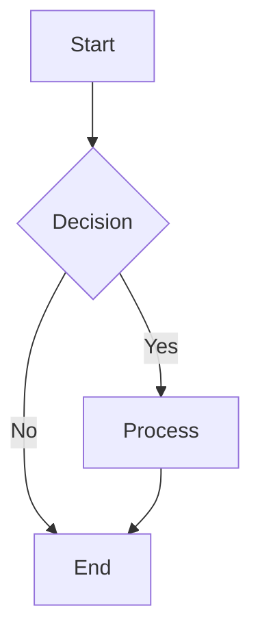
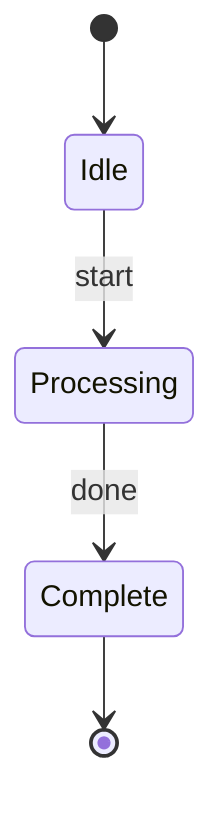
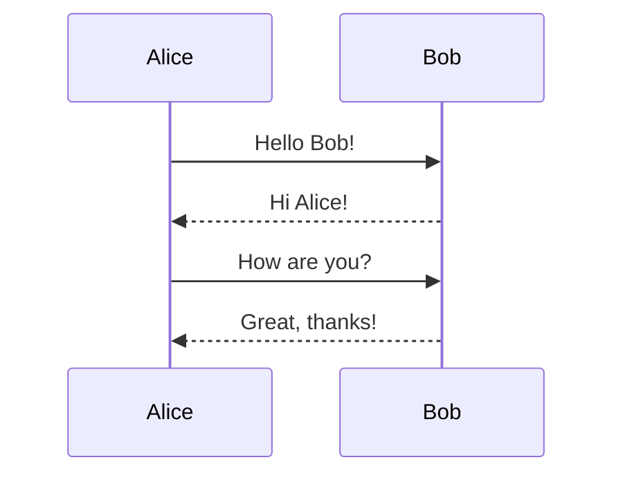
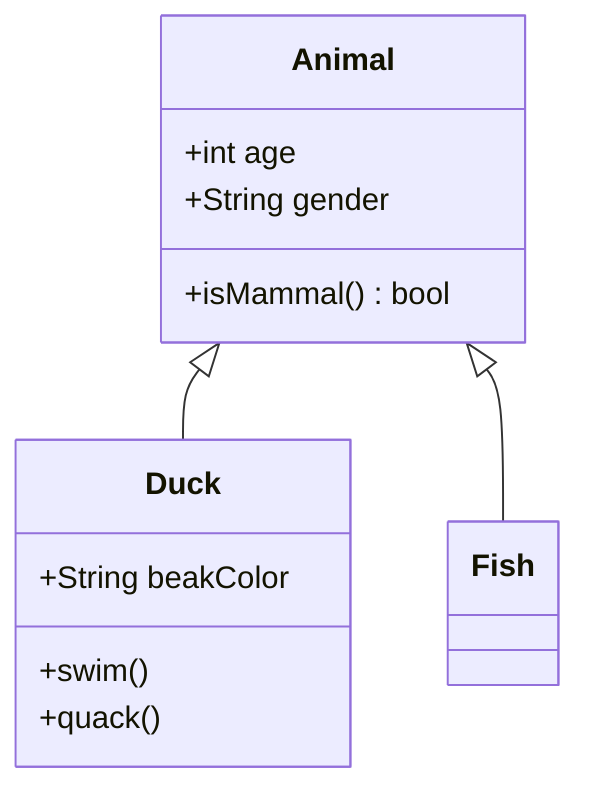
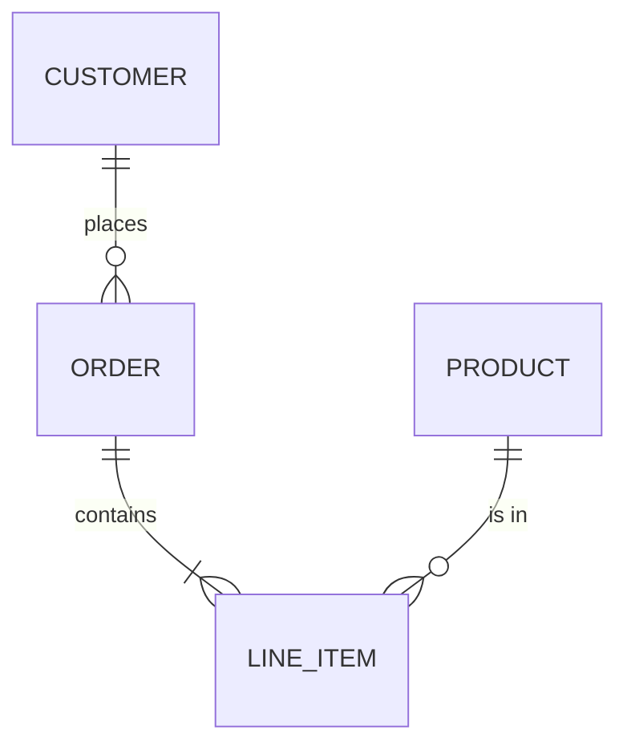
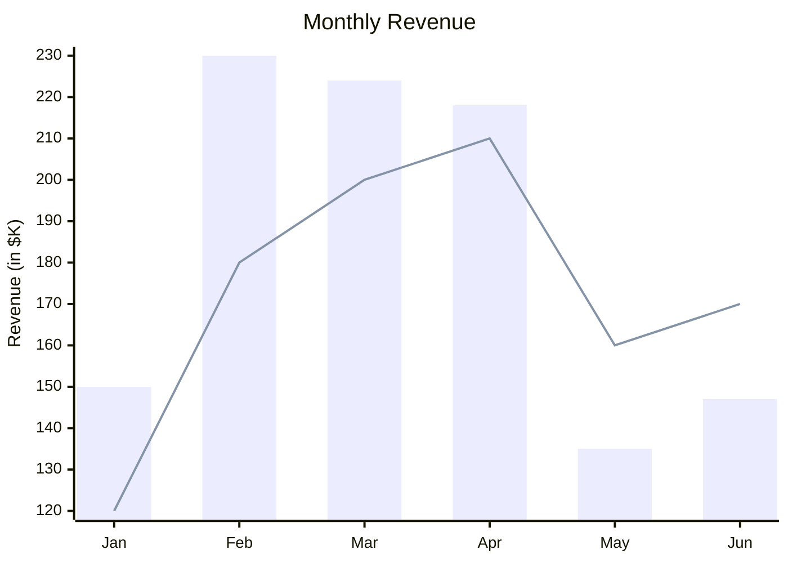
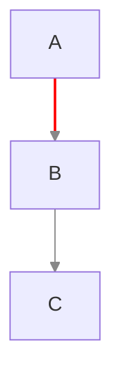

# Beautiful Mermaid Guide

Integration guide for [beautiful-mermaid](https://github.com/lukilabs/beautiful-mermaid) - a library for rendering professional-looking Mermaid diagrams with beautiful themes.

## Overview

beautiful-mermaid is an ultra-fast, fully themeable Mermaid renderer with zero DOM dependencies. Built for the AI era, it produces professional-quality diagrams for learning summaries and technical documentation.

### Key Features

- **6 diagram types**: Flowcharts, State, Sequence, Class, ER, and XY Charts
- **Dual output**: SVG for rich UIs, ASCII/Unicode for terminals
- **Synchronous rendering**: No async, no flash - works with React useMemo()
- **15 built-in themes**: Curated themes ready to use
- **Full Shiki compatibility**: Use any VS Code theme directly
- **Live theme switching**: CSS custom properties, no re-render needed
- **Mono mode**: Beautiful diagrams from just 2 colors
- **Zero DOM dependencies**: Pure TypeScript, works everywhere

## Installation

```bash
npm install beautiful-mermaid
# or
bun add beautiful-mermaid
# or
pnpm add beautiful-mermaid
```

## Quick Start

### SVG Rendering

```typescript
import { renderMermaidSVG } from 'beautiful-mermaid'

const svg = renderMermaidSVG(`
graph TD
    A[Start] --> B{Decision}
    B -->|Yes| C[Action]
    B -->|No| D[End]
`)
```

Rendering is fully synchronous. For async use `renderMermaidSVGAsync()`.

### ASCII Rendering

```typescript
import { renderMermaidASCII } from 'beautiful-mermaid'

const ascii = renderMermaidASCII(`graph LR; A --> B --> C`)
```

Output:
```
┌───┐     ┌───┐     ┌───┐
│   │     │   │     │   │
│ A │────►│ B │────►│ C │
│   │     │   │     │   │
└───┘     └───┘     └───┘
```

## Theming System

### Mono Mode (Two-Color Foundation)

Every diagram needs just two colors: background (`bg`) and foreground (`fg`). The system automatically derives all other colors using `color-mix()`:

```typescript
const svg = renderMermaidSVG(diagram, {
    bg: '#1a1b26',  // Background
    fg: '#a9b1d6',  // Foreground
})
```

Automatic derivations:

| Element | Derivation |
|---------|------------|
| Text | --fg at 100% |
| Secondary text | --fg at 60% into --bg |
| Edge labels | --fg at 40% into --bg |
| Faint text | --fg at 25% into --bg |
| Connectors | --fg at 50% into --bg |
| Arrow heads | --fg at 85% into --bg |
| Node fill | --fg at 3% into --bg |
| Group header | --fg at 5% into --bg |
| Inner strokes | --fg at 12% into --bg |
| Node stroke | --fg at 20% into --bg |

### Enriched Mode

For richer themes, provide optional enrichment colors:

```typescript
const svg = renderMermaidSVG(diagram, {
    bg: '#1a1b26',
    fg: '#a9b1d6',
    line: '#3d59a1',    // Edge/connector color
    accent: '#7aa2f7',  // Arrow heads, highlights
    muted: '#565f89',   // Secondary text, labels
    surface: '#292e42', // Node fill tint
    border: '#3d59a1',  // Node stroke
})
```

### CSS Custom Properties for Live Switching

All colors are CSS custom properties on the SVG element, enabling instant theme switching:

```typescript
const svg = renderMermaidSVG(diagram, {
    bg: 'var(--background)',
    fg: 'var(--foreground)',
    accent: 'var(--accent)',
    transparent: true,
})
```

## Built-in Themes

15 curated themes available via `THEMES` export:

| Theme | Type | Background | Accent |
|-------|------|------------|--------|
| zinc-light | Light | #FFFFFF | Derived |
| zinc-dark | Dark | #18181B | Derived |
| tokyo-night | Dark | #1a1b26 | #7aa2f7 |
| tokyo-night-storm | Dark | #24283b | #7aa2f7 |
| tokyo-night-light | Light | #d5d6db | #34548a |
| catppuccin-mocha | Dark | #1e1e2e | #cba6f7 |
| catppuccin-latte | Light | #eff1f5 | #8839ef |
| nord | Dark | #2e3440 | #88c0d0 |
| nord-light | Light | #eceff4 | #5e81ac |
| dracula | Dark | #282a36 | #bd93f9 |
| github-light | Light | #ffffff | #0969da |
| github-dark | Dark | #0d1117 | #4493f8 |
| solarized-light | Light | #fdf6e3 | #268bd2 |
| solarized-dark | Dark | #002b36 | #268bd2 |
| one-dark | Dark | #282c34 | #c678dd |

Usage:

```typescript
import { renderMermaidSVG, THEMES } from 'beautiful-mermaid'

const svg = renderMermaidSVG(diagram, THEMES['tokyo-night'])
```

## Supported Diagram Types

### Flowcharts



Directions: TD (top-down), LR (left-right), BT (bottom-top), RL (right-left)

### State Diagrams



### Sequence Diagrams



### Class Diagrams



### ER Diagrams



### XY Charts



## Inline Edge Styling

Use `linkStyle` to override edge colors and stroke widths:



| Syntax | Effect |
|--------|--------|
| `linkStyle 0 stroke:#f00` | Style single edge by index (0-based) |
| `linkStyle 0,2 stroke:#f00` | Style multiple edges |
| `linkStyle default stroke:#888` | Default style for all edges |

## Custom Themes

Creating a theme is simple - minimum requires just `bg` and `fg`:

```typescript
const myTheme = {
    bg: '#0f0f0f',
    fg: '#e0e0e0',
}

const svg = renderMermaidSVG(diagram, myTheme)
```

Rich theme with enrichments:

```typescript
const myRichTheme = {
    bg: '#0f0f0f',
    fg: '#e0e0e0',
    accent: '#ff6b6b',
    muted: '#666666',
}
```

## Shiki Integration

Use any VS Code theme via Shiki:

```typescript
import { getSingletonHighlighter } from 'shiki'
import { renderMermaidSVG, fromShikiTheme } from 'beautiful-mermaid'

const highlighter = await getSingletonHighlighter({
    themes: ['vitesse-dark', 'rose-pine']
})

const colors = fromShikiTheme(highlighter.getTheme('vitesse-dark'))
const svg = renderMermaidSVG(diagram, colors)
```

Color mappings:

| Editor Color | Diagram Role |
|--------------|--------------|
| editor.background | bg |
| editor.foreground | fg |
| editorLineNumber.foreground | line |
| focusBorder / keyword token | accent |
| comment token | muted |
| editor.selectionBackground | surface |
| editorWidget.border | border |

## Best Practices for Learning Summaries

### 1. Choose Theme Based on Context

- **Technical documentation**: `tokyo-night`, `nord`, `dracula`
- **Light backgrounds**: `github-light`, `zinc-light`, `catppuccin-latte`
- **Presentation slides**: Match your slide theme

### 2. Consistent Theming

Use the same theme throughout a document for visual consistency:

```typescript
// Define once, reuse
const DOC_THEME = THEMES['tokyo-night']

const svg1 = renderMermaidSVG(diagram1, DOC_THEME)
const svg2 = renderMermaidSVG(diagram2, DOC_THEME)
```

### 3. CSS Variables for Dynamic Documents

For documents that may switch between light/dark modes:

```typescript
const svg = renderMermaidSVG(diagram, {
    bg: 'var(--diagram-bg)',
    fg: 'var(--diagram-fg)',
    accent: 'var(--diagram-accent)',
    transparent: true,
})
```

### 4. Mono Mode for Simplicity

When in doubt, use Mono Mode with just two colors - it produces clean, professional diagrams automatically.

### 5. ASCII for Terminal/CLI Context

Use ASCII output when diagrams need to be viewable in terminal environments or plain text contexts.

## React Integration Example

```tsx
import { renderMermaidSVG } from 'beautiful-mermaid'

function MermaidDiagram({ code, theme }: { code: string; theme: any }) {
    const { svg, error } = React.useMemo(() => {
        try {
            return {
                svg: renderMermaidSVG(code, theme),
                error: null,
            }
        } catch (err) {
            return { svg: null, error: err }
        }
    }, [code, theme])

    if (error) return <pre>{error.message}</pre>
    return <div dangerouslySetInnerHTML={{ __html: svg! }} />
}
```

## CLI Usage

Use the `render-mermaid.js` script in this skill's scripts folder:

```bash
# Render to SVG with theme
node scripts/render-mermaid.js -i diagram.mmd -o output.svg -t tokyo-night

# Render to ASCII
node scripts/render-mermaid.js -i diagram.mmd --ascii

# Custom theme (JSON)
node scripts/render-mermaid.js -i diagram.mmd -o output.svg -c '{"bg":"#1a1b26","fg":"#a9b1d6"}'
```

## References

- [beautiful-mermaid GitHub](https://github.com/lukilabs/beautiful-mermaid)
- [Mermaid Live Editor](https://mermaid.live/)
- See also: `mermaid-style.md` in this folder for base Mermaid syntax guidelines
