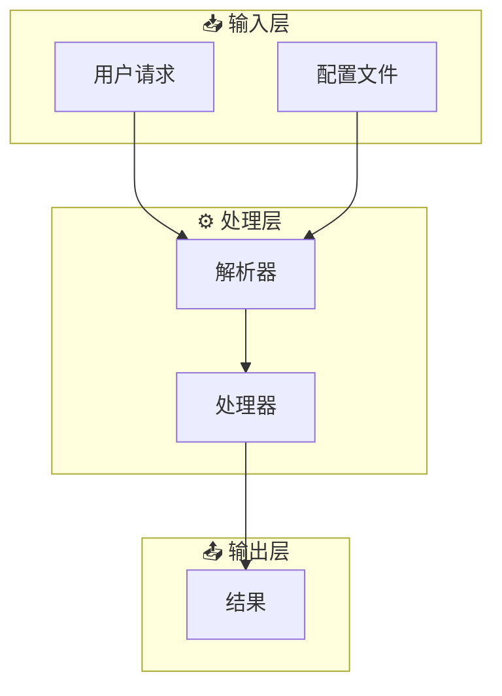
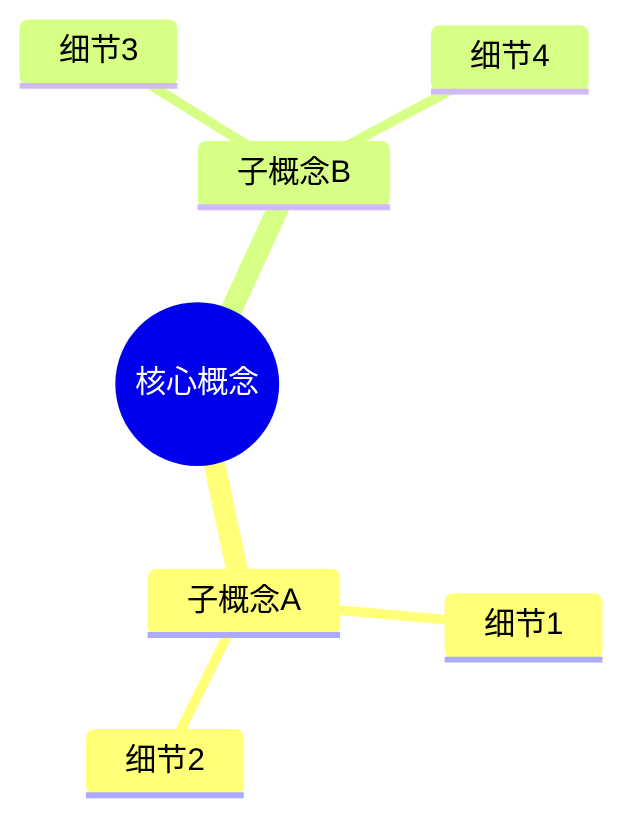
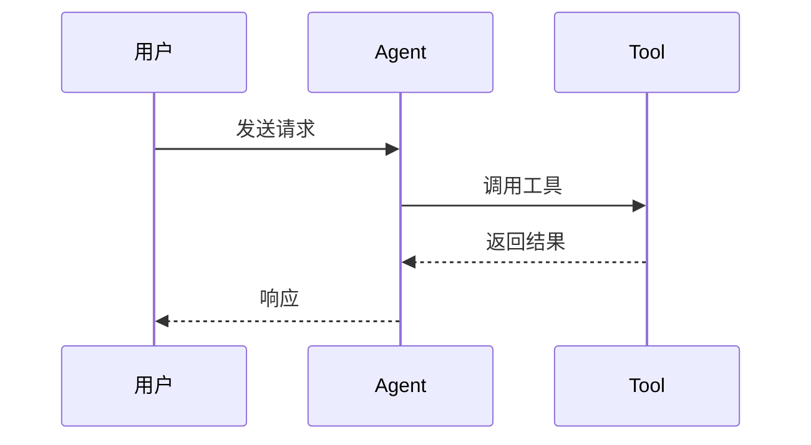

# Mermaid Diagram Style Guide

提炼自多篇技术深度分析文章，总结中若画图可统一采用以下规范。

## 基础规范

- **类型选择**：优先用 `flowchart TB`（自上而下）或 `flowchart LR`（左右）；复杂分组用 `subgraph`，支持嵌套子图和子图连接。`graph TB/LR` 适合简单场景。`sequenceDiagram` 适合交互时序，`mindmap` 适合层级概念。
- **节点文本**：节点内换行用 `<br/>`（如 `A["UI 层<br/>页面/组件"]`）；次要说明用 `<i>` 标签（如 `A["主标题<br/><i>补充说明</i>"]`）；emoji 前缀辅助视觉扫描（如 `["🔍 混合检索"]`）。
- **连线标签**：用 `-->|标签|` 标注语义（如 `-->|写入|`、`-->|按需|`）。
- **起止节点**：圆角矩形 `(["🟢 开始"])` / `(["🔴 结束"])` 用于流程的首尾。
- **读图结论**：图下方用 1～3 条要点或表格点明关键信息，便于扫读。

## 布局技巧

- **子图内部横排**：在 `subgraph` 内用 `direction LR` 让节点水平展开，减少纵向占用。
- **嵌套子图分组**：将复杂流程拆为多个 Phase/阶段子图（如 `subgraph init["🚀 Phase 1 · 初始化"]`），子图标题附加 emoji + 阶段号。
- **实线/虚线区分方向**：`-->`（实线）表示主数据流方向，`-.->`（虚线）表示回注/反馈路径。视觉上一眼区分"往下写"和"往上读"。
- **减少连线交叉**：对齐上下层节点顺序（如沉淀层 `A B C` 与复用层 `X Y Z` 一一对应），使层间连线尽量平行。用子图连接替代逐节点连接来减少总连线数。

## 配色方案

### 方案 A — 现代简约（适合架构设计/技术文档，推荐默认使用）

```
classDef core fill:#E3F2FD,stroke:#1565C0,stroke-width:2px,color:#0D47A1,rx:10,ry:10
classDef process fill:#E8F5E9,stroke:#2E7D32,stroke-width:2px,color:#1B5E20,rx:10,ry:10
classDef data fill:#FFF3E0,stroke:#E65100,stroke-width:2px,color:#BF360C,rx:10,ry:10
classDef external fill:#F3E5F5,stroke:#6A1B9A,stroke-width:2px,color:#4A148C,rx:10,ry:10
classDef highlight fill:#FFEBEE,stroke:#C62828,stroke-width:3px,color:#B71C1C,rx:10,ry:10
classDef success fill:#E8F5E9,stroke:#1B5E20,stroke-width:2px,color:#1B5E20,rx:10,ry:10
classDef neutral fill:#ECEFF1,stroke:#546E7A,stroke-width:2px,color:#37474F,rx:10,ry:10
```

### 方案 B — 渐变玻璃态（适合现代产品/用户文档）

```
classDef glassA fill:#E8EAF6,stroke:#3F51B5,stroke-width:2px,color:#1A237E,rx:15,ry:15
classDef glassB fill:#E0F7FA,stroke:#006064,stroke-width:2px,color:#006064,rx:15,ry:15
classDef glassC fill:#FCE4EC,stroke:#AD1457,stroke-width:2px,color:#880E4F,rx:15,ry:15
classDef glassD fill:#F3E5F5,stroke:#6A1B9A,stroke-width:2px,color:#4A148C,rx:15,ry:15
classDef accent fill:#FFF8E1,stroke:#F57F17,stroke-width:3px,color:#F57F17,rx:15,ry:15
```

### 方案 C — 深色主题（适合演示/高对比场景）

```
classDef darkCore fill:#1E3A5F,stroke:#64B5F6,stroke-width:2px,color:#E3F2FD,rx:8,ry:8
classDef darkProcess fill:#1B4332,stroke:#4CAF50,stroke-width:2px,color:#E8F5E9,rx:8,ry:8
classDef darkData fill:#4A1A2C,stroke:#F48FB1,stroke-width:2px,color:#FCE4EC,rx:8,ry:8
classDef darkExternal fill:#2D1B4E,stroke:#CE93D8,stroke-width:2px,color:#F3E5F5,rx:8,ry:8
classDef darkHighlight fill:#5D1A1A,stroke:#EF5350,stroke-width:3px,color:#FFEBEE,rx:8,ry:8
```

## 节点美化技巧

1. **圆角矩形**：所有节点添加 `rx:10,ry:10` 参数实现圆角
2. **阴影效果**：使用较深的 stroke 颜色营造立体感
3. **层次分明**：核心节点用 `stroke-width:3px`，普通节点用 `stroke-width:2px`
4. **语义配色**：
   - 蓝色系 → 核心/主要组件
   - 绿色系 → 流程/成功/正向
   - 橙/黄色系 → 数据/存储/警告
   - 紫色系 → 外部/抽象/接口
   - 红色系 → 强调/错误/重要

## 图表类型最佳实践

### 流程图（flowchart）



### 思维导图（mindmap）



### 时序图（sequenceDiagram）



## 批量着色示例

```
classDef core fill:#E3F2FD,stroke:#1565C0,stroke-width:2px,color:#0D47A1,rx:10,ry:10
classDef process fill:#E8F5E9,stroke:#2E7D32,stroke-width:2px,color:#1B5E20,rx:10,ry:10
class NodeA,NodeB,NodeC core
class NodeX,NodeY process
```
