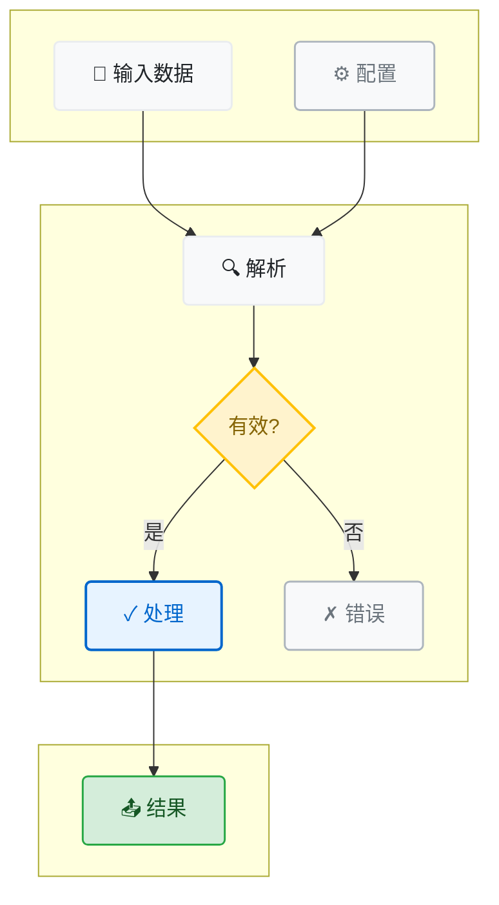
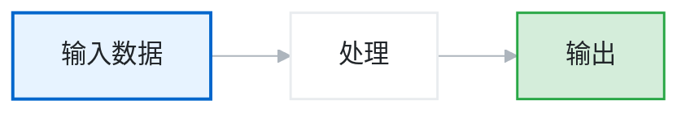
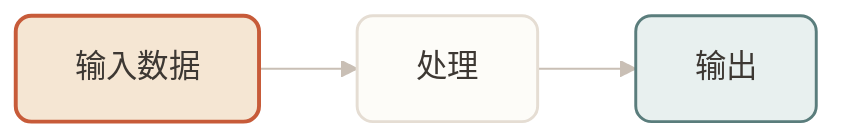

# 图表视觉样式指南

为学习文章提供优雅、一致的图表样式。

## 核心原则

1. **目的优先** - 图表能说清楚才用，文字能说清的不用
2. **简洁为上** - 一个图表只讲一个点
3. **视觉层次** - 主次元素清晰区分
4. **风格一致** - 全篇使用统一的设计语言

---

## 何时使用（和不用）图表

**需要图表：**
- 复杂的流程或时序，文字难以说清
- 多实体之间有明确关系
- 数据结构或层级结构
- 决策树或状态机

**不需要图表：**
- 简单因果关系（"A 导致 B"）
- 基本概念定义（"X 是 Y"）
- 已有对比表格
- 步骤清晰的一维流程（用编号列表即可）

**快速判断：** 如果你需要写"如下图所示"才能解释清楚，那图表本身可能还不够清晰。

---

## 三种视觉风格

### 风格 A：极简技术（默认）

干净、专业、代码聚焦。

**理念：** 让内容说话，视觉元素退居幕后。

**特点：**
- 单色系 + 蓝色点缀
- 大量留白
- 细线精确
- 高对比度可读性

**Color Palette:**
```
Background:    #FFFFFF (white)
Surface:       #F8F9FA (near-white)
Border:        #E9ECEF (light gray)
Text Primary:  #212529 (near-black)
Text Secondary:#6C757D (medium gray)
Accent:        #0066CC (professional blue)
Highlight:     #E7F3FF (light blue tint)
Success:       #28A745 (subtle green)
Warning:       #FFC107 (amber)
```

### 风格 B：温暖编辑

精致、人文、杂志品质。

**理念：** 阅读应该像与知识渊博的朋友对话。

**特点：**
- 暖色调 + 赭色点缀
- 柔和阴影和层次
- 圆润有机的形状
- 平易近人

**Color Palette:**
```
Background:    #FDFCF8 (warm white)
Surface:       #F5F1EB (cream)
Border:        #E5DDD3 (warm gray)
Text Primary:  #3D3833 (warm black)
Text Secondary:#8B8178 (taupe)
Accent:        #C75B39 (terracotta)
Highlight:     #F5E6D3 (peach tint)
Secondary:     #5A7D7C (sage green)
```

### 风格 C：深度聚焦

大胆、高对比度，适合复杂技术内容。

**理念：** 当内容密度高时，视觉设计必须提供清晰度和焦点。

**特点：**
- 深海军蓝背景 + 浅色文字
- 深色背景上鲜艳的强调色
- 通过色彩强度清晰视觉层次
- 现代开发者工具美学

**Color Palette:**
```
Background:    #0D1117 (GitHub dark)
Surface:       #161B22 (elevated dark)
Border:        #30363D (subtle border)
Text Primary:  #E6EDF3 (off-white)
Text Secondary:#8B949E (muted gray)
Accent:        #58A6FF (bright blue)
Highlight:     #1F6FEB (vivid blue)
Success:       #3FB950 (vibrant green)
Warning:       #D29922 (golden)
```

---

## Mermaid 图表

### 各风格的类定义

#### 风格 A：极简技术

```mermaid
%%{init: {'theme': 'base', 'themeVariables': { 
  'primaryColor': '#F8F9FA',
  'primaryTextColor': '#212529',
  'primaryBorderColor': '#E9ECEF',
  'lineColor': '#ADB5BD',
  'secondaryColor': '#FFFFFF',
  'tertiaryColor': '#F8F9FA'
}}}%%

classDef default fill:#FFFFFF,stroke:#E9ECEF,stroke-width:1.5px,color:#212529,rx:4,ry:4
classDef primary fill:#E7F3FF,stroke:#0066CC,stroke-width:2px,color:#0066CC,rx:4,ry:4
classDef secondary fill:#F8F9FA,stroke:#ADB5BD,stroke-width:1.5px,color:#495057,rx:4,ry:4
classDef success fill:#D4EDDA,stroke:#28A745,stroke-width:1.5px,color:#155724,rx:4,ry:4
classDef highlight fill:#FFF3CD,stroke:#FFC107,stroke-width:2px,color:#856404,rx:4,ry:4
```

#### 风格 B：温暖编辑

```mermaid
%%{init: {'theme': 'base', 'themeVariables': { 
  'primaryColor': '#F5F1EB',
  'primaryTextColor': '#3D3833',
  'primaryBorderColor': '#E5DDD3',
  'lineColor': '#C9BFB5',
  'secondaryColor': '#FDFCF8',
  'tertiaryColor': '#F5F1EB'
}}}%%

classDef default fill:#FDFCF8,stroke:#E5DDD3,stroke-width:1.5px,color:#3D3833,rx:8,ry:8
classDef primary fill:#F5E6D3,stroke:#C75B39,stroke-width:2px,color:#C75B39,rx:8,ry:8
classDef secondary fill:#F5F1EB,stroke:#C9BFB5,stroke-width:1.5px,color:#6B6560,rx:8,ry:8
classDef accent fill:#E8F0EF,stroke:#5A7D7C,stroke-width:1.5px,color:#3D5857,rx:8,ry:8
classDef highlight fill:#F9E5D8,stroke:#C75B39,stroke-width:2.5px,color:#A84A2D,rx:8,ry:8
```

#### 风格 C：深度聚焦

```mermaid
%%{init: {'theme': 'base', 'themeVariables': { 
  'primaryColor': '#161B22',
  'primaryTextColor': '#E6EDF3',
  'primaryBorderColor': '#30363D',
  'lineColor': '#484F58',
  'secondaryColor': '#0D1117',
  'tertiaryColor': '#161B22'
}}}%%

classDef default fill:#161B22,stroke:#30363D,stroke-width:1.5px,color:#E6EDF3,rx:4,ry:4
classDef primary fill:#1F6FEB20,stroke:#58A6FF,stroke-width:2px,color:#58A6FF,rx:4,ry:4
classDef secondary fill:#21262D,stroke:#484F58,stroke-width:1.5px,color:#8B949E,rx:4,ry:4
classDef success fill:#23863630,stroke:#3FB950,stroke-width:1.5px,color:#3FB950,rx:4,ry:4
classDef highlight fill:#D2992230,stroke:#D29922,stroke-width:2px,color:#D29922,rx:4,ry:4
```

### 流程图最佳实践



---

## 视觉风格预览

各风格的实际渲染效果。

### 风格 A：极简技术预览



**特点：** 白底、蓝色强调、清晰边框、简洁专业

---

### 风格 B：温暖编辑预览



**特点：** 暖色调、圆角边框、手绘感、亲切温和

---

### 风格 C：深度聚焦预览

```mermaid
%%{init: {'theme': 'base', 'themeVariables': { 
  'primaryColor': '#161B22',
  'primaryTextColor': '#E6EDF3',
  'primaryBorderColor': '#30363D',
  'lineColor': '#484F58',
  'secondaryColor': '#0D1117',
  'tertiaryColor': '#161B22'
}}}%%

flowchart LR
    A["输入数据"] --> B["处理"]
    B --> C["输出"]
    
    style A fill:#1F6FEB20,stroke:#58A6FF,stroke-width:2px
    style B fill:#161B22,stroke:#30363D,stroke-width:1.5px
    style C fill:#23863630,stroke:#3FB950,stroke-width:1.5px
```



**特点：** 深色背景、明亮强调色、开发者工具美学

---

## SVG 图表

用于 Mermaid 无法表达的复杂自定义可视化。

### SVG 模板结构

```svg
<svg viewBox="0 0 800 400" xmlns="http://www.w3.org/2000/svg">
  <defs>
    <!-- 柔和阴影滤镜 -->
    <filter id="softShadow" x="-20%" y="-20%" width="140%" height="140%">
      <feDropShadow dx="0" dy="2" stdDeviation="3" flood-opacity="0.1"/>
    </filter>
    
    <!-- 风格 B 的渐变 -->
    <linearGradient id="warmGradient" x1="0%" y1="0%" x2="100%" y2="100%">
      <stop offset="0%" style="stop-color:#F5E6D3;stop-opacity:1" />
      <stop offset="100%" style="stop-color:#F5F1EB;stop-opacity:1" />
    </linearGradient>
  </defs>
  
  <!-- 背景 -->
  <rect width="800" height="400" fill="#FDFCF8"/>
  
  <!-- 示例：架构图 -->
  <g transform="translate(50, 50)">
    <!-- 带阴影的盒子 -->
    <rect x="0" y="0" width="200" height="100" 
          fill="#FDFCF8" stroke="#E5DDD3" stroke-width="1.5" 
          rx="8" filter="url(#softShadow)"/>
    <text x="100" y="55" text-anchor="middle" 
          font-family="system-ui, -apple-system, sans-serif"
          font-size="14" fill="#3D3833" font-weight="500">组件</text>
  </g>
</svg>
```

### 风格 A SVG 调色板

```css
/* 极简技术 SVG 样式 */
.box { fill: #FFFFFF; stroke: #E9ECEF; stroke-width: 1.5; }
.box-primary { fill: #E7F3FF; stroke: #0066CC; stroke-width: 2; }
.text { fill: #212529; font-family: system-ui, -apple-system, sans-serif; font-size: 14px; }
.text-secondary { fill: #6C757D; }
.line { stroke: #ADB5BD; stroke-width: 1.5; fill: none; }
.line-primary { stroke: #0066CC; stroke-width: 2; }
.accent { fill: #0066CC; }
```

### 风格 B SVG 调色板

```css
/* 温暖编辑 SVG 样式 */
.box { fill: #FDFCF8; stroke: #E5DDD3; stroke-width: 1.5; filter: drop-shadow(0 2px 4px rgba(0,0,0,0.04)); }
.box-primary { fill: url(#warmGradient); stroke: #C75B39; stroke-width: 2; }
.text { fill: #3D3833; font-family: Georgia, serif; font-size: 14px; }
.text-secondary { fill: #8B8178; }
.line { stroke: #C9BFB5; stroke-width: 1.5; fill: none; }
.line-primary { stroke: #C75B39; stroke-width: 2; }
.accent { fill: #C75B39; }
```

### 风格 C SVG 调色板

```css
/* 深度聚焦 SVG 样式 */
.box { fill: #161B22; stroke: #30363D; stroke-width: 1.5; }
.box-primary { fill: #1F6FEB20; stroke: #58A6FF; stroke-width: 2; }
.text { fill: #E6EDF3; font-family: 'SF Mono', Monaco, monospace; font-size: 13px; }
.text-secondary { fill: #8B949E; }
.line { stroke: #484F58; stroke-width: 1.5; fill: none; }
.line-primary { stroke: #58A6FF; stroke-width: 2; }
.accent { fill: #58A6FF; }
```

---

## ASCII 图表

用于简单的行内图表，视觉保真度不如即时性重要。

### 风格指南

- 使用制表符绘制线条
- 仔细对齐元素
- 宽度控制在 60 字符以内（移动端）
- 保持一致的间距

### 示例

#### 简单层级（风格 A - 简洁）

```
┌─────────────┐
│   根节点    │
└──────┬──────┘
       │
   ┌───┴───┐
   │       │
┌──┴──┐ ┌──┴──┐
│左子 │ │右子 │
└─────┘ └─────┘
```

#### 流程图（风格 B - 温暖）

```
输入 ──→ 处理 ──→ 输出
   │         │          │
   └─────────┴──────────┘
         反馈
```

#### 数据结构（风格 C - 技术）

```
┌─────┐    ┌─────┐    ┌─────┐
│  A  │───→│  B  │───→│  C  │
│next │    │next │    │next │
└─────┘    └─────┘    └─────┘
```

### ASCII 字符参考

```
制表符：
┌ ┐ └ ┘ ─ │ ┬ ┴ ┼ ├ ┤ ┬

箭头：
→ ← ↑ ↓ ↔ ↕ ⇐ ⇒ ⇑ ⇓

特殊：
● ○ ■ □ ▲ △ ◆ ◇
```

---

## 选择合适的格式

| 使用场景 | 推荐格式 | 原因 |
|----------|---------|------|
| 算法流程 | Mermaid | 易于编辑，渲染广泛 |
| 系统架构 | SVG | 复杂布局，精确控制 |
| 数据结构 | ASCII | 快速、行内、代码友好 |
| 状态机 | Mermaid stateDiagram | 原生支持，语义清晰 |
| 数据库模型 | Mermaid erDiagram | 标准表示，关系明确 |
| 自定义可视化 | SVG | 无限灵活 |
| 简单层级 | ASCII | 最快创建和阅读 | |

---

## 质量检查清单

完成图表前检查：

- [ ] **图表真的必要吗？**（如果不必要就删除）
- [ ] 是否只传达了一个清晰的观点？
- [ ] 颜色是否用于有意义的目的（而非装饰）？
- [ ] 在正常阅读距离下文字是否可读？
- [ ] 是否一致地遵循了选定风格？
- [ ] 不看周围文字能理解吗？
- [ ] 是否无障碍（足够对比度，不依赖颜色）？

---

**记住：**
- 好的图表让读者说"哦，我懂了"——而不是"哦，真漂亮"
- 有时候最好的图表就是没有图表
