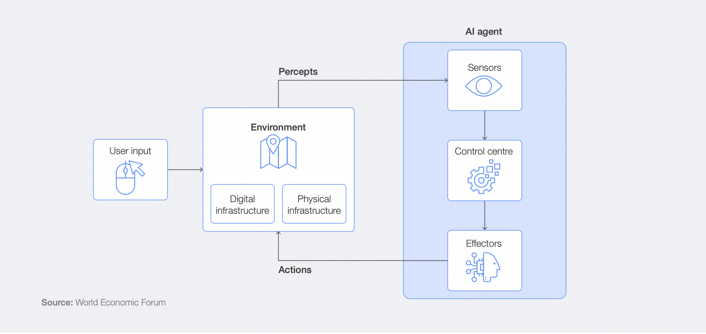
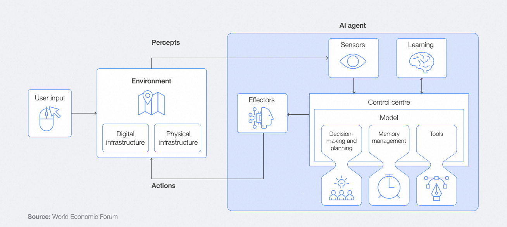
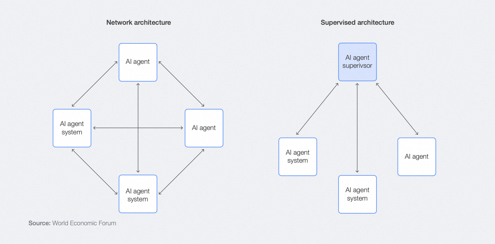
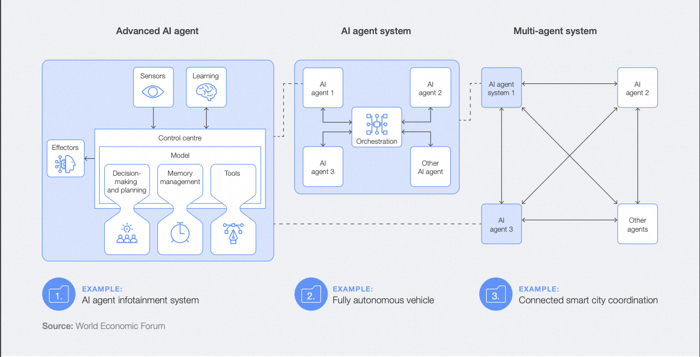

# 什么是 LLM

LLM（Large Language Model，大语言模型）是一种基于深度学习的人工智能模型，它通过海量的文本数据训练，能够理解和生成人类语言。简单来说，它就像一个"超级文本处理器"，可以：

- 理解和回答问题
- 生成各类文本内容
- 进行语言翻译
- 协助编程
- 分析和总结文本

大语言模型的发展经历了几个重要阶段：
1. 2017年：Transformer架构的提出，为大语言模型奠定了基础
2. 2018年：BERT的诞生，开创了预训练模型新纪元
3. 2019年：GPT-2展示了强大的文本生成能力
4. 2020年：GPT-3突破性地达到1750亿参数量
5. 2022年：ChatGPT掀起AI革命，展现类人对话能力
6. 2023年：GPT-4等多模态模型出现，能力进一步提升

# LLM 基本原理

## 1. 核心技术：Transformer架构

Transformer架构是大语言模型的核心基础，它采用了"注意力机制"这一创新性的设计。让我们通过一个简单的例子来理解它的工作原理：

假设我们要理解"我喜欢吃苹果"这句话：

1. **分词处理**：
   首先将句子分解为词元：["我", "喜欢", "吃", "苹果"]

2. **注意力机制工作过程**：
   - 当模型处理"喜欢"这个词时，会自动关注到主语"我"
   - 处理"吃"时，会关注到"喜欢"和"我"
   - 处理"苹果"时，会特别关注到"吃"这个动作

这种机制让模型能够：
- 理解词语之间的关系
- 捕捉长距离依赖
- 并行处理所有输入

主要组件包括：

1. **多头注意力层**
   - 类比为多个"视角"同时观察文本
   - 每个"头"可以关注不同的语言特征
   - 比如一个关注语法，一个关注语义

2. **前馈神经网络**
   - 对注意力机制的输出进行进一步处理
   - 增强模型的特征提取能力
   - 引入非线性变换

3. **残差连接和层归一化**
   - 帮助模型训练更稳定
   - 防止信息在深层网络中丢失
   - 加速训练过程

## 2. 训练过程

LLM的训练是一个复杂的过程，分为三个主要阶段：

### 2.1 预训练阶段
这是最基础的阶段，就像让模型"读书"：
- **数据收集**：
  - 互联网文本
  - 电子书籍
  - 科学论文
  - 代码库等

- **训练目标**：
  - 预测下一个词
  - 掩码词预测
  - 理解上下文关系

- **训练规模**：
  - 数据量通常在数百TB到PB级别
  - 训练时间可能持续数月
  - 需要数千张GPU并行计算

### 2.2 监督微调阶段
这个阶段像是"补习"，让模型学会更好地完成特定任务：

- **数据准备**：
  - 人工编写高质量问答对
  - 特定任务的标注数据
  - 专业领域的知识数据

- **训练方式**：
  - 使用较小的学习率
  - 保持原有知识的同时学习新技能
  - 通常只需要几千到几万条数据

### 2.3 强化学习阶段
这是"实践"阶段，通过人类反馈来提升模型表现：

- **RLHF（基于人类反馈的强化学习）**：
  - 收集人类对模型回答的评分
  - 建立奖励模型
  - 优化模型输出质量

- **优化目标**：
  - 提高回答的准确性
  - 增强对话的自然度
  - 改善安全性和道德性


# LLM 的优势与不足

## 优势

1. **强大的语言理解能力**
   - 理解复杂的语言表达：
     能够理解隐喻、反讽等修辞手法
   - 上下文理解能力：
     可以在长对话中保持连贯性
   - 多语言处理：
     支持100多种语言之间的互译

2. **广泛的知识储备**
   - 领域知识：
     从文学艺术到科技工程，覆盖众多领域
   - 知识推理：
     能够结合多个知识点得出合理结论
   - 跨领域关联：
     可以建立不同领域之间的联系

3. **灵活的应用场景**
   - 文本生成：
     可以写作文章、诗歌、代码等
   - 对话交互：
     自然的对话能力，理解上下文
   - 辅助决策：
     提供分析建议和解决方案

## 不足

1. **知识时效性**
   - 训练数据截止日期：
     知识库通常有时间限制，如GPT-4的知识截止到2023年
   - 更新困难：
     无法实时学习新知识
   - 实时性差：
     对最新事件和数据无法及时响应

2. **事实准确性**
   - 幻觉问题：
     可能生成看似合理但实际错误的内容
   - 推理不透明：
     难以验证结论的推理过程
   - 置信度：
     无法准确评估自身回答的可信度

3. **计算资源消耗**
   - 硬件要求：
     需要强大的GPU/TPU支持
   - 运行成本：
     API调用费用可能较高
   - 能耗问题：
     训练和运行都需要大量电力

# LLM 应用技术基础理论

在实际应用中，我们通常通过以下方法来增强和扩展LLM的能力：

## 提示词工程（Prompt Engineering）

提示词工程是一门将复杂任务转化为清晰指令的艺术。它就像是与AI对话的"说明书"，告诉AI具体要做什么。

### 基本原则

1. **明确和具体的指令**
   示例：
   ```
   差的提示词：写一篇文章
   好的提示词：写一篇800字的科普文章，主题是人工智能对教育的影响，
   需要包含具体案例和数据支持，并在结尾提供未来展望
   ```

2. **结构化的输入格式**
   示例：
   ```
   角色：你是一位资深教育专家
   背景：当前AI教育应用快速发展
   任务：分析AI在教育领域的应用
   输出格式：
   1. 现状分析（200字）
   2. 案例分享（300字）
   3. 挑战分析（200字）
   4. 未来展望（100字）
   ```

3. **示例驱动的提示**
   通过提供具体例子来说明要求：
   ```
   问题：将以下句子翻译成英文
   示例1：
   输入：天气真好
   输出：The weather is really nice
   
   示例2：
   输入：我喜欢编程
   输出：I like programming
   
   现在翻译：这本书很有趣
   ```

### 常用技巧

1. **Few-shot Learning（少样本学习）**
   - 提供2-3个具体例子
   - 让模型理解任务模式
   - 提高输出准确性

2. **Chain-of-Thought（思维链）**
   示例：
   ```
   问题：解决45+17×3的数学题
   思维过程：
   1. 先看乘法：17×3=51
   2. 再做加法：45+51=96
   所以答案是96
   ```

3. **Role Playing（角色扮演）**
   - 给AI设定特定角色
   - 提供背景信息
   - 明确任务目标

## 微调（Fine-tuning）

微调是让通用模型适应特定任务的过程，就像让一个通才变成专才。

### 应用场景

1. **特定领域适应**
   例如：医疗领域
   - 训练数据：医学文献、病例报告
   - 目标：提高医学术语理解和诊断建议能力
   - 效果：能够准确理解专业术语，提供更专业的建议

2. **任务特定优化**
   例如：客服场景
   - 训练数据：历史客服对话记录
   - 目标：提升回答准确性和客户满意度
   - 效果：更符合企业话术风格，解决方案更精准

### 常见方法

1. **全参数微调**
   - 调整模型所有参数
   - 需要大量计算资源
   - 效果最好但成本高

2. **LoRA（低秩适应）**
   - 只训练部分关键参数
   - 资源消耗小
   - 效果接近全参数微调

3. **P-tuning**
   - 添加可训练的提示词
   - 保持原模型不变
   - 适合特定任务优化

## RAG（检索增强生成）

RAG技术就像给AI配备了"智能笔记本"，可以随时查阅最新资料。

### 工作流程

1. **查询处理**
   - 分析用户问题
   - 提取关键信息
   - 生成检索查询

2. **知识检索**
   - 搜索相关文档
   - 筛选最相关段落
   - 排序重要信息

3. **回答生成**
   - 结合检索内容
   - 生成准确回答
   - 提供信息来源

### 检索方法

1. **向量检索**
   工作原理：
   ```
   文本 -> 向量化 -> 相似度计算 -> 召回相关文档
   ```
   
   优化技巧：
   - 使用高质量的文本嵌入模型
   - 建立高效的索引结构
   - 优化相似度计算方法

2. **混合检索**
   组合多种方法：
   - 关键词匹配：快速定位相关文档
   - 语义检索：理解查询意图
   - 知识图谱：利用结构化知识

## AI Agent

### 定义与核心组件
AI Agent 是一个能够自主感知和作用于环境以实现目标的系统。

如图所示，一个完整的 Agent 由以下核心组件构成：

1. **用户输入（User Input）**
   - 外部输入源：来自人类或其他智能体
   - 交互方式：
     * 基于聊天的文本输入
     * 语音命令
     * 预设的数据指令

2. **环境（Environment）**
   - 定义：Agent 运作的边界范围
   - 类型：
     * 物理基础设施：如自动驾驶汽车的道路环境
     * 数字基础设施：如编程 Agent 的企业内网环境
   - 作用：提供 Agent 感知和作用的空间

3. **传感器（Sensors）**
   - 功能：感知和收集环境信息的机制
   - 形式：
     * 物理传感器：摄像头、麦克风等
     * 数字传感器：数据库查询、Web 服务接口等
   - 作用：为 Agent 提供环境感知能力

4. **控制中心（Control Centre）**
   - 核心功能：
     * 信息处理：分析和理解输入数据
     * 决策制定：评估不同选项
     * 行动规划：选择最佳执行方案

5. **感知（Percepts）**
   - 定义：Agent 从环境中接收的数据输入
   - 来源：
     * 各类传感器数据
     * 其他数据源信息
   - 特点：构成 Agent 对环境的理解基础

6. **效应器（Effectors）**
   - 功能：执行 Agent 决策的工具
   - 应用场景：
     * 物理环境：机械臂、轮子等执行装置
     * 数字环境：软件命令、数据操作等
   - 作用：实现 Agent 对环境的改变

7. **行动（Actions）**
   - 定义：效应器执行的具体操作
   - 表现形式：
     * 物理行动：移动物体、改变环境状态
     * 数字行动：更新数据库、生成内容等
   - 结果：直接影响和改变环境

这些组件形成一个完整的感知-决策-行动循环：
```
用户输入 -> 传感器感知环境 -> 控制中心处理信息 -> 决策规划 -> 
效应器执行行动 -> 改变环境 -> 新的感知循环
```

#### 高级 AI Agent

xin yi d高级 AI Agent 是基于大型语言模型（LLM）或大型多模态模型（LMM）构建的新一代智能体系统，相比普通 AI Agent，具有显著的能力提升和特性差异。

#### 核心差异

| 特性 | 普通 AI Agent | 高级 AI Agent |
|------|--------------|---------------|
| **模型基础** | 基于规则或简单模型 | 基于 LLM/LMM 等复杂模型 |
| **功能范围** | 单一任务导向 | 多任务、跨域处理 |
| **自主程度** | 需要人类干预 | 高度自主决策 |
| **学习能力** | 有限或无 | 持续学习和优化 |
| **系统架构** | 简单、固定 | 复杂、可扩展 |
| **交互方式** | 简单输入输出 | 多模态自然交互 |
| **应用场景** | 特定领域任务 | 跨领域复杂任务 |

#### 先进特性

1. **复杂认知能力**
   - 多步推理：
     * 分解复杂问题
     * 链式思维推导
     * 动态调整策略
   - 知识整合：
     * 跨领域知识关联
     * 上下文理解
     * 概念迁移应用

2. **增强自主性**
   - 决策制定：
     * 独立分析情况
     * 权衡多个方案
     * 自主选择行动
   - 目标管理：
     * 理解抽象目标
     * 分解任务步骤
     * 动态调整计划

3. **高级学习能力**
   - 持续学习：
     * 从经验中学习
     * 适应新环境
     * 优化决策模型
   - 迁移学习：
     * 跨域知识应用
     * 快速任务适应
     * 能力泛化

4. **系统集成能力**
   - 工具使用：
     * 调用外部 API
     * 操作系统功能
     * 集成专业软件
   - 资源管理：
     * 优化资源分配
     * 并行任务处理
     * 性能监控

这种高级 AI Agent 的出现，标志着 AI 技术从简单的工具向真正的智能助手转变，能够在复杂环境中自主决策并持续学习优化，但同时也带来了更多需要关注的技术和伦理挑战。

### Agent 类型与演进

AI Agent 的发展经历了从确定性到非确定性的演进过程。

#### 确定性与非确定性智能体

1. **确定性智能体（Deterministic AI Agents）**
   - **规则基础**：
     * 基于固定规则和逻辑运作
     * 相同输入总是产生相同输出
     * 使用预定义的条件-动作规则
   
   - **行为特征**：
     * 决策过程透明且一致
     * 结果可预测和可解释
     * 适合处理明确定义的任务
   
   - **适应性限制**：
     * 无法从新数据中学习
     * 不能适应环境变化
     * 只能按预定义路径执行

2. **非确定性智能体（Non-deterministic AI Agents）**
   - **数据驱动**：
     * 基于统计模式做出决策
     * 输出结果具有概率性
     * 能够处理不确定性
   
   - **灵活适应**：
     * 能够从数据中学习
     * 可以适应新情况
     * 处理不确定性的能力强
   
   - **复杂决策**：
     * 考虑概率和随机性
     * 支持非确定性元素
     * 能够做出更细微的决策

#### Agent 类型分类
根据其复杂性和功能，AI Agent 可以分为以下几种类型：

| Agent类型 | 定义 | 特点 | 示例 |
|---------|------|------|------|
| **简单反射Agent** | 基于当前感知的环境信息做出反应，不考虑历史数据或未来后果。 | 遵循条件-动作规则（if-then规则），行为简单且可预测。 | - 垃圾邮件过滤器<br>- 简单聊天机器人<br>- 自动邮件回复系统 |
| **基于模型的反射Agent** | 不仅基于当前感知的环境信息，还利用内部模型（存储的历史数据）来做出决策。 | 能够跟踪环境中不可见的部分，比简单反射Agent更灵活，但仍受限于条件-动作规则。 | - 智能恒温器<br>- 智能扫地机器人<br>- 智能灌溉系统 |
| **基于目标的Agent** | 不仅考虑当前状态，还考虑未来可能的场景，以实现特定目标。 | 能够进行目标导向的规划，适用于复杂决策任务。 | - 高级国际象棋AI<br>- 物流路线优化系统<br>- 智能客服系统 |
| **基于效用的Agent** | 不仅追求目标，还通过效用函数评估不同状态的优劣，以做出最优决策。 | 能够处理多目标或冲突目标的情况，适用于复杂环境中的高级决策。 | - 自动驾驶系统<br>- 投资组合管理系统<br>- 医疗诊断助手 |
| **高级AI Agent** | 基于大型语言模型（LLM）或大型多模态模型（LMM），具备记忆、规划、工具集成等高级功能。 | 能够进行多步推理和复杂决策，具备记忆管理功能，可以访问和使用多种工具。 | - 车载智能助手<br>- 多Agent系统中的协作Agent |
| **多Agent系统** | 由多个独立的AI Agent组成，能够协作、竞争或协商以完成复杂任务。 | Agent之间可以通信和共享数据，适用于需要多领域协作的复杂任务。 | - 自动驾驶车辆的多Agent系统<br>- 智能城市交通管理系统 |

### Agent 系统

Agent 系统 是由多个 Agent 组成的结构化系统，这些 Agent 可以是同质的（例如，全部是基于目标的 Agent）或异质的（例如，包含基于规则的 Agent 和基于效用的 Agent）。Agent 系统的设计目的是通过多个 Agent 的协作、竞争或协商，完成复杂的任务或实现系统级的目标。


### 多智能体系统（Multi-Agent Systems，MAS）

多智能体系统代表了 AI Agent 技术的未来发展方向，通过多个智能体的协作来处理复杂任务。


1. **系统定义**
   - 由多个独立智能体组成
   - 每个智能体具有专门的能力
   - 通过协作完成复杂任务
   - 能够适应动态环境变化

2. **架构类型**
   - **网络架构**
     * 特点：所有智能体对等通信
     * 优势：去中心化、高度灵活
     * 应用：分布式问题解决
   
   - **监督架构**
     * 特点：有监督智能体协调其他智能体
     * 优势：便于管理、目标一致
     * 应用：需要统一决策的场景

3. **应用示例：智能城市交通管理**
   ```
   系统架构：
   - 交通信号智能体：控制路口信号
   - 车辆智能体：提供位置和状态信息
   - 停车服务智能体：管理停车资源
   - 应急服务智能体：处理突发事件
   
   协作场景：
   当发生交通事故时：
   1. 车辆智能体报告事故信息
   2. 交通信号智能体调整信号配时
   3. 应急服务智能体派遣救援
   4. 停车服务智能体提供临时区域
   ```

4. **系统优势**
   - 分布式处理：提高系统效率
   - 故障容错：提升系统可靠性
   - 动态扩展：支持系统演进
   - 专业化分工：优化任务处理

5. **发展趋势**
   - 协作能力增强：智能体间更好的协调
   - 自适应性提升：更灵活的环境适应
   - 规模化扩展：支持更多智能体接入
   - 标准化协议：促进智能体互操作


### Agent, Agent system and multi-agent system



## MCP


https://guangzhengli.com/blog/zh/model-context-protocol/

https://zhuanlan.zhihu.com/p/27327515233

### 为什么是 MCP


### 什么是 MCP


### MCP 工作原理
