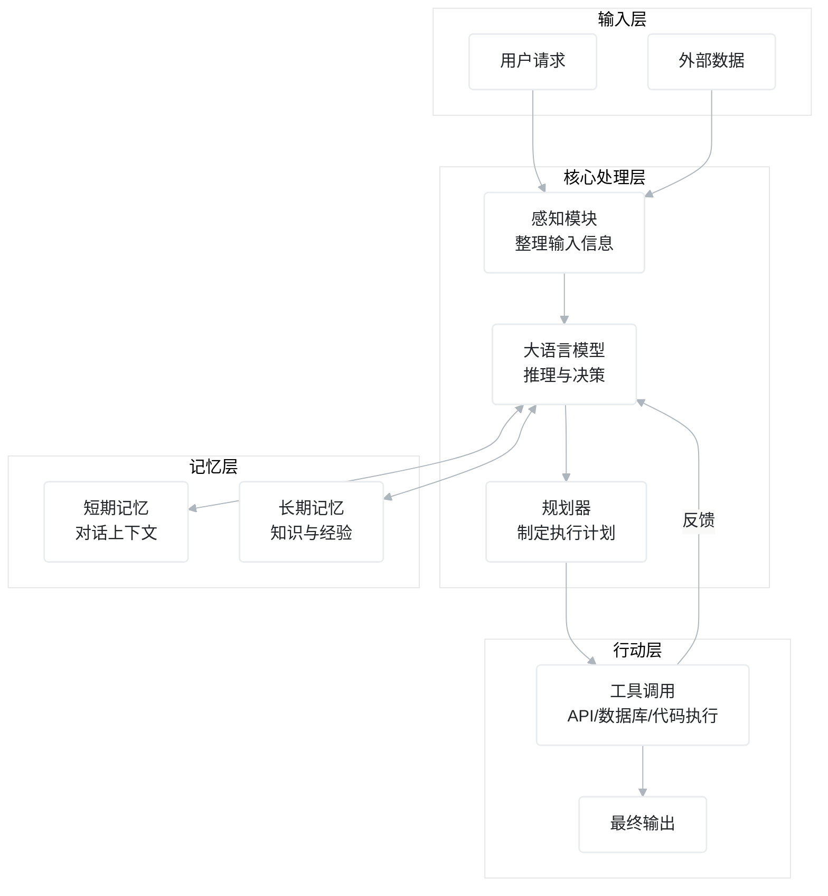
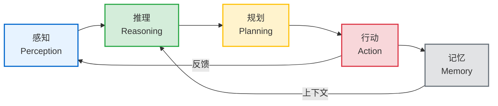
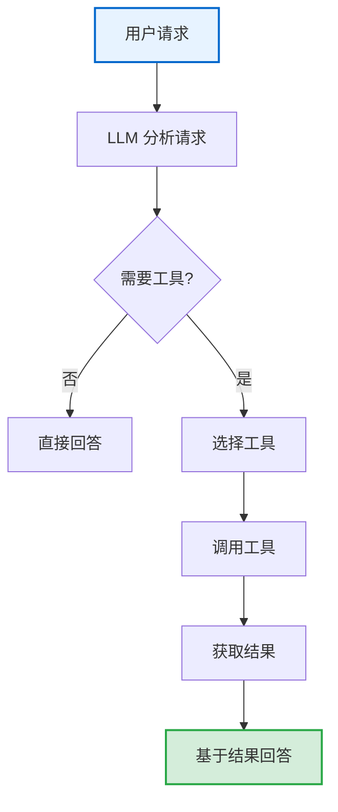
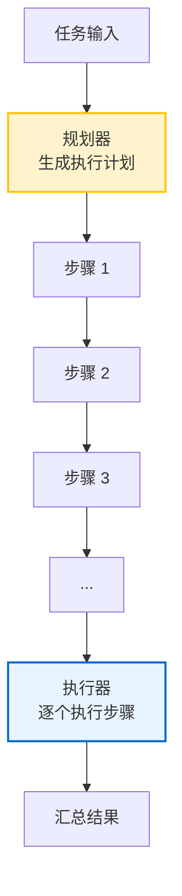
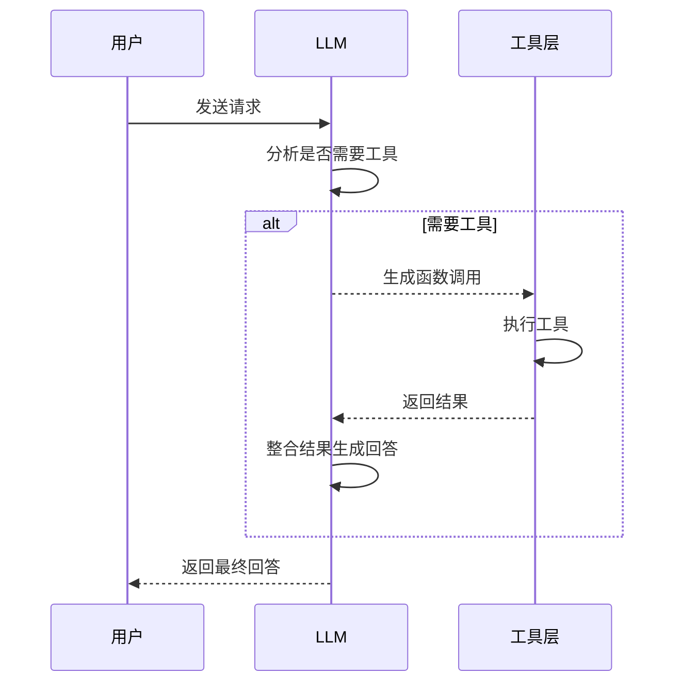
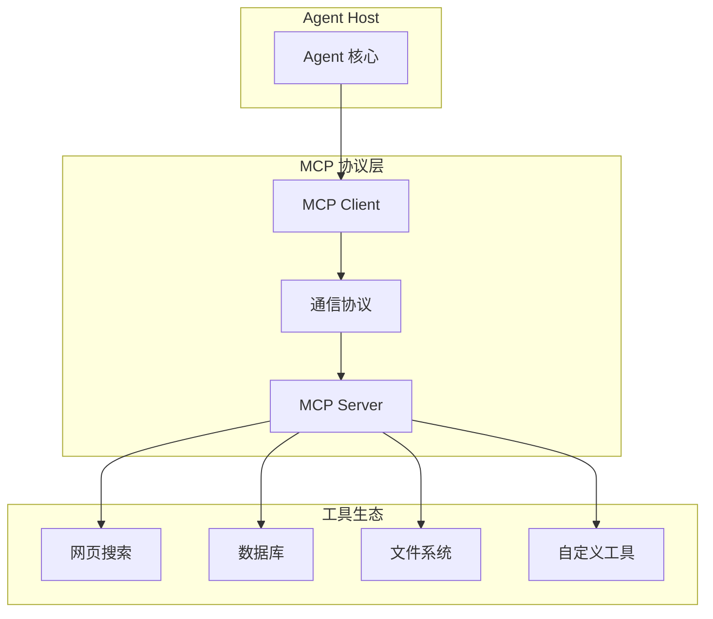
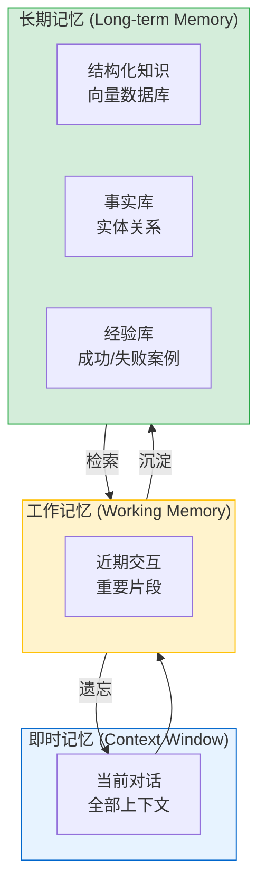
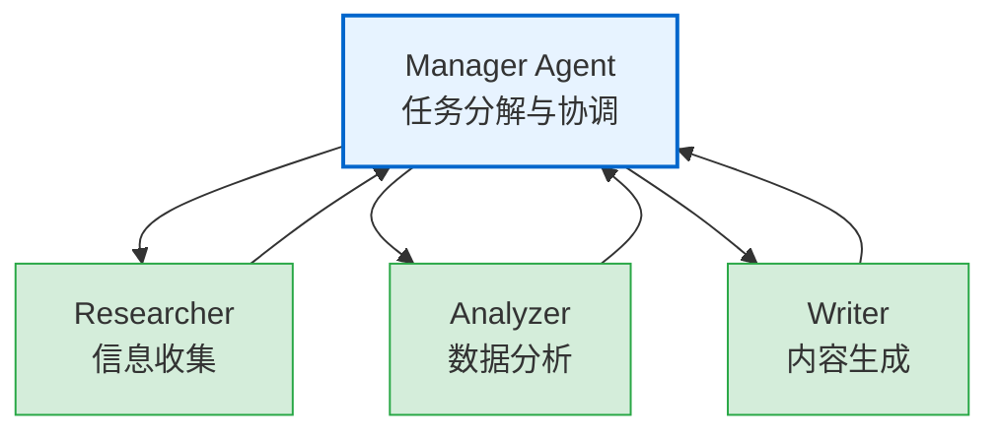
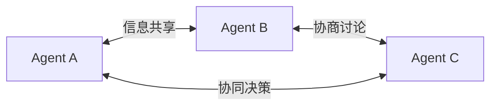
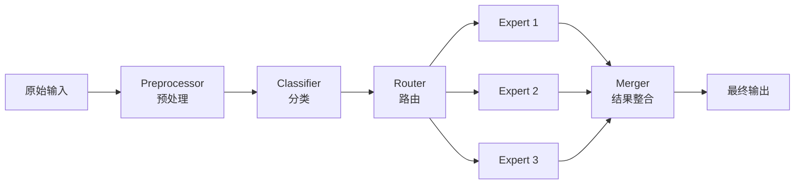

# AI Agent 全面认知指南

> 让 AI 从"能说会道"变成"能想会做"——这才是 Agent 的本质。

## 30 秒心智模型

**核心问题：LLM 很聪明，但无法真正做事**

大语言模型能生成漂亮的文字，但碰到"帮我订一张下周去北京的机票"这类任务就傻眼了。它不知道今天几号、不知道你的偏好、不知道航班信息、无法操作订票系统。

**Agent 的解决方案：给 LLM 装上"手脚"和"记忆"**

Agent 本质上是一个"增强版的 LLM"：用 LLM 做大脑（推理决策），配上工具作为手脚（执行动作），加上记忆系统作为经验库，形成一个完整的"感知→推理→规划→行动→记忆"闭环。

**关键变化：**

1. **从被动应答到主动执行**：不是等用户问了再答，而是自己规划步骤并执行
2. **从静态知识到动态交互**：能调用外部工具获取实时信息
3. **从无状态到有记忆**：能记住对话历史和学到的经验
4. **从单步到多步**：复杂任务自动拆解为多个子步骤

---

## 目录

- [AI Agent 全面认知指南](#ai-agent-全面认知指南)
  - [30 秒心智模型](#30-秒心智模型)
  - [目录](#目录)
  - [Agent 是什么](#agent-是什么)
    - [重新定义智能体](#重新定义智能体)
    - [Agent 的四大核心能力](#agent-的四大核心能力)
  - [Agent 架构全景图](#agent-架构全景图)
    - [核心组件](#核心组件)
    - [信息流动闭环](#信息流动闭环)
  - [Agent 设计模式：从简单到复杂](#agent-设计模式从简单到复杂)
    - [基础模式](#基础模式)
      - [CoT：让模型一步步思考](#cot让模型一步步思考)
      - [Tool-Use：给模型装上手脚](#tool-use给模型装上手脚)
      - [ReAct：思考与行动的交织](#react思考与行动的交织)
    - [进阶模式](#进阶模式)
      - [Plan-and-Execute：先规划后执行](#plan-and-execute先规划后执行)
      - [Tree-of-Thoughts：探索多条推理路径](#tree-of-thoughts探索多条推理路径)
      - [Reflexion：自我反思与纠错](#reflexion自我反思与纠错)
  - [工具调用：Agent 与外界交互的桥梁](#工具调用agent-与外界交互的桥梁)
    - [Function Calling 的工作原理](#function-calling-的工作原理)
    - [MCP 协议：标准化工具生态](#mcp-协议标准化工具生态)
    - [工具设计最佳实践](#工具设计最佳实践)
  - [记忆系统：Agent 的经验库](#记忆系统agent-的经验库)
    - [记忆的三层架构](#记忆的三层架构)
    - [RAG 与 Agent Memory 的区别](#rag-与-agent-memory-的区别)
  - [多 Agent 系统：协作的力量](#多-agent-系统协作的力量)
    - [为什么需要多 Agent](#为什么需要多-agent)
    - [协作模式](#协作模式)
    - [主流框架对比](#主流框架对比)
  - [错误处理与容错机制](#错误处理与容错机制)
    - [幻觉问题](#幻觉问题)
    - [错误传播与累积](#错误传播与累积)
    - [容错策略](#容错策略)
  - [总结：构建可靠 Agent 的关键](#总结构建可靠-agent-的关键)

---

## Agent 是什么

### 重新定义智能体

很多人把 Agent 和 AI 混为一谈，这其实是个误解。

AI 是一个泛指，涵盖所有模拟人类智能的技术。LLM（大型语言模型）是 AI 的一个子集，能理解和生成文本。而 Agent 则是基于 LLM 的应用架构，让 LLM 能够主动行动而非被动应答。

打个比方：LLM 像是一个知识渊博但瘫痪的人，Agent 则给这个人装上了轮椅，让他能够真正去做事。

**学术定义（吴恩达提出的简化标准）：**

一个 AI Agent 工作循环包括：
1. **Reflection**：LLM 反思自己的输出，检查是否有错
2. **Tool Use**：调用外部工具获取信息或执行动作
3. **Planning**：规划下一步该做什么

满足其中任意一条，就可以称为 Agent。

### Agent 的四大核心能力

| 能力 | 说明 | 类比 |
|------|------|------|
| **感知 (Perception)** | 接收用户输入和外部信息 | 眼睛和耳朵 |
| **推理 (Reasoning)** | 分析问题、评估情况 | 大脑思考 |
| **规划 (Planning)** | 制定行动步骤 | 制定计划 |
| **行动 (Action)** | 调用工具执行任务 | 手脚执行 |

这四种能力形成闭环，Agent 不断与环境交互，逐步完成任务。

---

## Agent 架构全景图

### 核心组件

一个完整的 Agent 系统包含以下核心组件：



**各组件职责：**

- **感知模块**：将原始输入（文本、工具返回结果）转换为结构化的上下文
- **大语言模型**：核心推理引擎，根据上下文生成响应和决策
- **规划器**：将复杂任务拆解为可执行的子步骤
- **工具层**：Agent 与外界交互的接口
- **记忆层**：存储短期上下文和长期知识

### 信息流动闭环

Agent 的工作遵循一个经典的感知-规划-行动循环：



这个闭环让 Agent 能够应对复杂、动态的任务环境。

---

## Agent 设计模式：从简单到复杂

设计 Agent 时，模式的选择决定了系统的复杂度和能力上限。下面从基础到高级逐一介绍。

### 基础模式

#### CoT：让模型一步步思考

Chain-of-Thought（思维链）是所有推理模式的基础。

**核心思想：** 引导 LLM 输出中间推理步骤，而非直接给答案。这看似简单，效果却惊人——GPT-3 在数学题上从 17.7% 提升到 58.1%。

**工作原理：**

```
问题：一个书架有3层，每层8本书，我拿走了5本，还剩多少本？

→ 添加 "让我们一步步思考"

思考：第1步，计算总书数 3×8=24
      第2步，用总数减去拿走的 24-5=19
答案：19本
```

**适用场景：**
- 数学推导
- 逻辑推理
- 不需要外部信息的复杂问题

**局限性：** 只能依赖模型自身知识，无法获取实时信息。

#### Tool-Use：给模型装上手脚

Tool-Use 是最简单的 Agent 模式，让 LLM 能够调用外部工具。

**工作流程：**



**典型应用：** 天气查询、股票价格、计算器、单位转换。

**代表实现：**
- OpenAI 的 functions/tools 参数
- Anthropic Claude 的 tool_use
- Google Gemini 的 Function Calling

```python
# OpenAI Function Calling 示例
tools = [{
    "type": "function",
    "function": {
        "name": "get_weather",
        "description": "获取城市天气",
        "parameters": {
            "type": "object",
            "properties": {"city": {"type": "string"}},
            "required": ["city"]
        }
    }
}]

response = client.chat.completions.create(
    model="gpt-4",
    messages=[{"role": "user", "content": "北京今天热吗?"}],
    tools=tools
)
# LLM 会返回: {"name": "get_weather", "arguments": {"city": "北京"}}
```

**局限性：** 单步执行，无法处理需要多轮推理的复杂任务。

#### ReAct：思考与行动的交织

ReAct（Reasoning + Acting）是目前最流行的 Agent 模式，将 CoT 的推理能力与 Tool-Use 的行动能力结合。

**核心循环：**

```
Thought（思考）→ Action（行动）→ Observation（观察）→ 循环直到完成
```

**示例：比较特斯拉和比亚迪昨天的股价涨幅**

```
Thought 1: 我需要先查询特斯拉昨天的股价
Action 1: stock_price(symbol="TSLA", date="2024-01-10")
Observation 1: 开盘 $238.45, 收盘 $242.84

Thought 2: 然后查询比亚迪的股价
Action 2: stock_price(symbol="BYDDY", date="2024-01-10")
Observation 2: 开盘 $52.30, 收盘 $53.12

Thought 3: 现在计算涨幅
Action 3: calculate((242.84-238.45)/238.45 * 100)
Observation 3: 1.84%

Action 4: calculate((53.12-52.30)/52.30 * 100)
Observation 4: 1.57%

Final Answer: 特斯拉涨幅 1.84%，比亚迪涨幅 1.57%，特斯拉更大。
```

**ReAct 的优势：**

- 减少幻觉：外部数据验证推理
- 可解释：用户能看到思考路径
- 处理复杂任务：多步骤自动编排

**终止条件：**
- 输出包含 "Final Answer" 前缀
- 达到最大迭代次数（通常 5-10 次）
- 连续失败超过阈值

### 进阶模式

#### Plan-and-Execute：先规划后执行

Plan-and-Execute 适合复杂的长程任务，与 ReAct 的"边想边做"不同，它先制定完整计划，再逐一执行。



**与 ReAct 的区别：**

| 维度 | ReAct | Plan-and-Execute |
|------|-------|------------------|
| 策略 | 边想边做 | 先想后做 |
| 效率 | 低（每步都要推理） | 高（规划后可批量执行） |
| 适应性 | 能动态调整 | 计划固定，灵活性低 |
| 适用场景 | 探索性任务 | 流程稳定的任务 |

**代表框架：** LangGraph 的 create_react_agent 配合 planning 节点。

#### Tree-of-Thoughts：探索多条推理路径

ToT 针对 CoT"一条路走到黑"和 Self-Consistency"多条路互不相干"的问题，允许多条推理路径并行探索，最终选择最优解。

**核心思想：** 不是问"哪条路对"，而是让模型同时探索多条路，看哪条走得通。

```
                    问题
                      │
         ┌───────────┼───────────┐
         ▼           ▼           ▼
      路径A        路径B        路径C
         │           │           │
      分支A1       分支B1       ...
      分支A2       ...
         │
      ✓ 到达答案     ✗ 走不通
```

**适用场景：**
- 需要回溯的复杂问题
- 游戏类任务（如 24 点）
- 需要全局最优的优化问题

#### Reflexion：自我反思与纠错

Reflexion 让 Agent 能够"回头看"，从失败中学习。

**工作流程：**

```
1. 执行任务 → 得到结果
2. 评估结果 → 发现问题
3. 反思原因 → 生成改进建议
4. 更新记忆 → 下次避免同样错误
```

**核心思想：** 错误不是终点，而是学习的起点。

**实现要素：**
- **评估器 (Evaluator)**：判断当前输出是否达标
- **反思模块 (Reflector)**：分析失败原因
- **记忆更新**：将反思结果存入长期记忆

---

## 工具调用：Agent 与外界交互的桥梁

### Function Calling 的工作原理

Function Calling 让 LLM 能够生成结构化的函数调用，而非仅仅输出文字。

**调用流程：**



**关键设计：工具描述 (Tool Description)**

工具描述的质量直接决定调用准确率。好的描述需要：
1. 清晰的功能说明
2. 明确的参数含义
3. 适当的示例

```json
{
  "name": "search_flights",
  "description": "搜索航班信息。仅支持30天内的航班查询。",
  "parameters": {
    "type": "object",
    "properties": {
      "from_city": {
        "type": "string",
        "description": "出发城市，格式为机场三字码，如PEK"
      },
      "to_city": {
        "type": "string", 
        "description": "目的城市，格式为机场三字码"
      },
      "date": {
        "type": "string",
        "description": "出发日期，格式YYYY-MM-DD"
      }
    },
    "required": ["from_city", "to_city", "date"]
  }
}
```

### MCP 协议：标准化工具生态

Model Context Protocol (MCP) 是 Anthropic 提出的开放标准，旨在解决 Agent 工具生态碎片化问题。

**为什么需要 MCP？**

传统方式下，每个 Agent 框架都有自己的工具定义格式。OpenAI 的工具是 JSON Schema，Claude 用自己的定义，LangChain 又是一套。MCP 试图成为"USB-C"——一个通用的工具接口标准。

**MCP 架构：**



**MCP 的优势：**

| 特性 | 传统方式 | MCP |
|------|---------|-----|
| 工具定义 | 每框架各有一套 | 统一标准 |
| 可复用性 | 低 | 高 |
| 安全审计 | 分散 | 集中 |
| 开发成本 | 高 | 低 |

### 工具设计最佳实践

1. **工具数量适中**：7-10 个工具效果最佳，太少不够用，太多选择困难
2. **粒度合理**：避免过细（一个功能一个工具）或过粗（一个工具干所有事）
3. **描述精确**：参数说明要具体，避免歧义
4. **错误处理**：工具返回清晰的错误信息，便于 Agent 理解和恢复
5. **幂等性**：重复调用不会产生副作用（或副作用可接受）

---

## 记忆系统：Agent 的经验库

### 记忆的三层架构

Agent 的记忆系统通常分为三层，各司其职：



**各层特点：**

| 层级 | 容量 | 持久性 | 访问速度 |
|------|------|--------|----------|
| 即时记忆 | ~128K tokens | 会话结束丢失 | 极快 |
| 工作记忆 | 几十个片段 | 有限持久 | 快 |
| 长期记忆 | 无限 | 持久 | 需检索 |

### RAG 与 Agent Memory 的区别

RAG（检索增强生成）常被误认为就是 Agent 的记忆，但两者有本质区别：

| 维度 | RAG | Agent Memory |
|------|-----|--------------|
| **目的** | 增强模型知识 | 存储 Agent 经验 |
| **内容** | 外部文档 | 对话历史、反思、偏好 |
| **更新** | 批量索引 | 增量实时更新 |
| **检索** | 语义相似度 | 多种策略组合 |
| **粒度** | 文档级 | 实体级、事件级 |

**Agent Memory 的独特价值：**

RAG 解决的是"模型不知道"的问题，而 Agent Memory 解决的是"模型不记得"的问题。真正的 Agent 需要两者结合——RAG 提供知识，Memory 提供经验。

---

## 多 Agent 系统：协作的力量

### 为什么需要多 Agent

单 Agent 面临三大瓶颈：

1. **能力上限**：一个模型再强也有局限
2. **上下文限制**：无法同时处理太多信息
3. **专业性**：通用模型不如专门模型

多 Agent 通过分工协作突破这些限制。

### 协作模式

**模式一：层次结构 (Hierarchical)**



**模式二：同层协作 (Peer-to-Peer)**



**模式三：流水线 (Pipeline)**



### 主流框架对比

| 框架 | 开发方 | 特点 | 适用场景 |
|------|--------|------|----------|
| **AutoGen** | Microsoft | 对话式协作、支持人类介入 | 复杂多轮交互 |
| **LangGraph** | LangChain | 状态机模式、灵活图结构 | 自定义工作流 |
| **CrewAI** | CrewAI | 角色扮演、任务导向 | 多角色协作 |
| **MetaGPT** | DeepWise | 软件开发专用、SOP 驱动 | 代码生成 |
| **Swarm** | OpenAI | 轻量、handoff 机制 | 简单多 Agent |

---

## 错误处理与容错机制

### 幻觉问题

幻觉（Hallucination）是 LLM 的固有特性——模型会生成看似合理但实际错误的内容。在 Agent 场景下，这个问题更严重，因为 Agent 会基于幻觉结果执行行动。

**缓解策略：**

1. **外部验证**：关键决策前用工具验证信息
2. **置信度阈值**：低置信度时要求人工确认
3. **溯源机制**：记录每条信息的来源
4. **保守策略**：不确定时返回"我不知道"

### 错误传播与累积

在 ReAct 等多步 Agent 中，中间步骤的错误会传播放大，最终导致任务完全失败。

```
步骤1 (正确) → 步骤2 (错误) → 步骤3 (基于错误结果) → ... → 结果完全错误
```

**解决方案：**

- **检查点机制**：关键步骤后验证
- **回滚能力**：发现错误时回退到上一个检查点
- **置信度监控**：连续低置信度时终止并重启

### 容错策略

| 策略 | 实现方式 | 适用场景 |
|------|---------|----------|
| **重试机制** | 失败后自动重试 2-3 次 | 网络超时、临时故障 |
| **熔断降级** | 错误率超过阈值切换到保守模式 | 高风险场景 |
| **沙箱隔离** | 敏感操作在独立环境执行 | 金融、医疗 |
| **人工接管** | 复杂场景暂停等待人工决策 | 关键决策点 |

---

## 总结：构建可靠 Agent 的关键

经过以上讨论，我们可以提炼出构建可靠 Agent 的核心要素：

**1. 正确的模式选择**

从简单开始，逐步增加复杂度。CoT 够用就不要上 ReAct，单 Agent 能解决就不要多 Agent。

**2. 健壮的工具设计**

工具是 Agent 的"手脚"，设计质量直接影响执行成功率。

**3. 有效的记忆系统**

让 Agent 有"经验"可循，避免重复犯错。

**4. 完善的容错机制**

拥抱不确定性，做好错误处理和恢复。

**5. 持续的评估迭代**

Agent 系统难以一次完美，需要持续监控和改进。

---

## 参考资料

1. Yao et al., 2022, "ReAct: Synergizing Reasoning and Acting in Language Models"
2. Wei et al., 2022, "Chain-of-Thought Prompting Elicits Reasoning in Large Language Models"
3. Schick et al., 2023, "Toolformer: Language Models Can Teach Themselves to Use Tools"
4. Yao et al., 2023, "Tree of Thoughts: Deliberate Problem Solving with Large Language Models"
5. Anthropic, "Model Context Protocol Documentation"
6. Microsoft, "AutoGen: Enabling Next-Gen LLM Applications"
