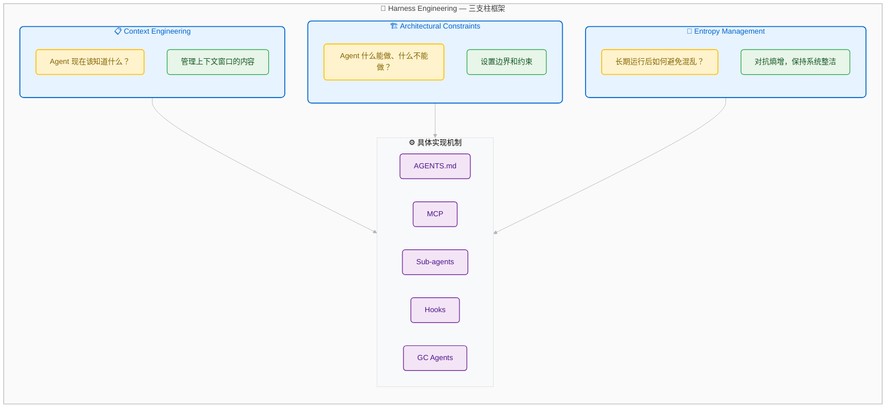

# Harness Engineering：AI Agent 时代的工程范式

> 给 AI 一匹千里马，你需要的不只是缰绳——而是整套马具。

## 30 秒心智模型

**核心问题：** AI 模型很强大，但为什么在真实项目中总是"理想很丰满，现实很骨感"？

同一个模型，在项目 A 里表现优异，在项目 B 里却产出各种奇怪的代码。Prompt 调来调去也填不上这个差距。问题往往出在模型之外——是 Agent 周围的运行环境差异在作祟。

**解决方案：** Harness Engineering 构建的不是更聪明的模型，而是让模型能持续、稳定产出正确结果的整套环境。

```
传统模式：模型 = 核心能力
新时代公式：Agent = Model + Harness
```

**三个关键转变：**

1. **从调 Prompt 到调环境** — 模型相同时，环境决定了输出质量
2. **从一次性指令到持续反馈循环** — 让 Agent 不断自我修正
3. **从人工监督到系统约束** — 把规则刻进基础设施，而不是塞进 Prompt

---

## 目录

1. [起源：从 Prompt 工程到 Harness 工程](#1)
2. [核心概念：什么是 Harness](#2)
3. [Harness 的三大支柱](#3)
4. [Harness 的核心技术组件](#4)
5. [实战模式：如何构建你的 Harness](#5)
6. [行业案例：验证过的实践](#6)
7. [总结与展望](#7)
8. [参考资料](#8)

---

## 1. 起源：从 Prompt 工程到 Harness 工程

### 演进时间线

```
2023-2024    Prompt 工程巅峰期
             一问一答模式，优化指令文本

2025 中期    Context 工程崛起
             Karpathy 强调：上下文设计比 Prompt 更重要
             RAG、MCP、Memory 等系统级上下文方案出现

2026.02      Harness 工程正式命名
             02.05  Mitchell Hashimoto 博客文章
             02.11  OpenAI 发布 "Harness Engineering" 实战报告
             范围扩展到 Agent 的完整环境设计
```

### 三个层次的嵌套关系

| 层次 | 核心问题 | 设计目标 |
|------|---------|---------|
| Prompt 工程 | "该问什么？" | 发送给 LLM 的指令文本 |
| Context 工程 | "该展示什么？" | LLM 推理时看到的所有 Token |
| Harness 工程 | "整体环境该如何设计？" | Agent 外部的约束、反馈和操作系统 |

如果 Prompt 工程是喊"向右转"，Context 工程就是给马配上地图和路标，让它知道要去哪里。Harness 工程则更进一步——设计缰绳、马鞍、围栏和道路本身，让十匹马能同时安全奔跑。

### 关键认知转变

Madplay 在分析中指出了一个重要现象：当 AI Agent 进入生产环境后，最终结果往往更多取决于模型周围的运行环境，而非模型本身。

OpenAI 内部团队曾做过一个实验：只需要正确构建 Agent 周围的运行环境，五个多月内就产生了约百万行纯 AI 生成的软件，没有任何手动编写的代码。这个实验让行业终于意识到，环境设计本身就是一种核心能力。

---

## 2. 核心概念：什么是 Harness

### 简洁定义

```
Agent = Model + Harness
如果你不是模型，那你就是 Harness。
```

Harness 是除了模型权重之外的所有代码、配置和执行逻辑。它不是简单的包装，而是给模型装上"手脚"和"五官"的系统：

- 模型只能接收文本、图像、音频、视频，输出文本
- Harness 让模型能够：持久化状态、执行代码、访问实时信息、设置工作环境

### Harness 不是框架

Phil Schmid 给了一个很清晰的类比：

```
Model      = CPU     提供原始算力
Context    = RAM     有限的、易失的工作内存
Harness    = OS      管理系统资源、处理启动序列、提供标准驱动
Agent      = APP     在 OS 上运行的具体应用逻辑
```

Framework 提供构建块（工具、Agent 循环的实现），Harness 则在此基础上提供 Opinionated 的配置：Prompt 预设、工具调用处理、生命周期钩子、文件系统访问、子 Agent 管理等开箱即用的能力。

### Mitchell Hashimoto 的六阶段 AI 采用路径

Hashimoto 在他的 AI 采用旅程文章中，将 Harness 工程定义为第五阶段：

```
Step 1: Drop the Chatbot        放弃纯聊天界面
Step 2: Reproduce Your Own Work 亲手复现 AI 的工作
Step 3: End-of-Day Agents       每天结束时启动 Agent
Step 4: Outsource the Slam Dunks 让 Agent 处理确定能搞定的事
Step 5: Engineer the Harness   构建 Harness 让错误不再重复
Step 6: Always Have an Agent Running 始终保持一个 Agent 运行
```

核心洞察：**Harness 工程的核心思想是：每次发现 Agent 犯错，就花时间构建一个机制，确保 Agent 再也不会犯同样的错误。**

---

## 3. Harness 的三大支柱

Martin Fowler 网站上 Birgitta Böckeler 的文章将 Harness 工程分解为三个支柱，每个支柱回答一个核心问题：

| 支柱 | 核心问题 | 关注点 |
|------|---------|--------|
| **Context Engineering** | Agent 现在该知道什么？ | 管理上下文窗口的内容 |
| **Architectural Constraints** | Agent 什么能做、什么不能做？ | 设置边界和约束 |
| **Entropy Management** | 长期运行后如何避免混乱？ | 对抗熵增，保持系统整洁 |



**读图要点**：三支柱回答「知道什么」「能做什么」「如何保持整洁」三个问题，每个支柱对应具体实现机制。

---

### 3.1 Context Engineering（上下文工程）

给 Agent 足够的上下文来做出好的决策，而不需要持续的人工干预。

#### 为什么这是第一支柱

模型只能直接操作其上下文窗口内的知识。上下文窗口是有限资源，必须精心管理。五个独立团队（OpenAI、Anthropic、Huntley、Horthy、Vasilopoulos）都得出了同样结论：**瓶颈在基础设施，而非智能本身。**

| 问题 | 后果 |
|------|------|
| 信息不足 | Agent 缺乏做决策的依据 |
| 信息过多 | 关键信息被噪音淹没 |
| 信息过时 | Agent 基于错误前提行动 |
| 信息冗余 | 浪费宝贵的上下文空间 |

Dex Horthy 提出了一个关键发现：**上下文窗口利用率存在「甜蜜点」**。对于约 168K token 的上下文窗口，性能在利用率超过 40% 后开始下降。

```
智能区（0-40%）：专注、准确的推理，Agent 有相关且简洁的信息
笨区（>40%）：幻觉、循环、格式错误的工具调用、低质量代码
```

这意味着：给 Agent 加载更多 MCP、冗长文档、累积的对话历史，不会让它更聪明，反而会让它更糟。

#### 核心实践

**1. AGENTS.md — 项目知识注入**

AGENTS.md 是一个 Markdown 文件，放在代码仓库根目录，Agent 每次启动时自动读取。它相当于给 Agent 的「入职手册」。

| 原则 | 说明 | 反例 |
|-----|------|------|
| 简洁 | 控制在 60 行以内 | 几百行的「百科全书」 |
| 通用 | 规则应适用于所有场景 | 大量条件判断 |
| 渐进披露 | 不一次性塞入所有信息 | 把所有工具说明都写进去 |
| 人写优于机写 | 人工精心编写 | LLM 自动生成 |

ETH Zurich 的研究发现了几个反直觉的结论：
- LLM 生成的 AGENTS.md 实际上会降低性能
- 人类编写的帮助率仅约 4%
- 包含条件的规则太多会让 Agent 表现更差

HumanLayer 的 CLAUDE.md 不到 60 行，核心原则是：**少即是多**。

```markdown
# Project Name

## Build & Test Commands
- Build: `npm run build`
- Test: `npm test`
- Lint: `npm run lint`

## Code Style
- Use TypeScript strict mode
- Prefer functional components

## Architecture
- src/components/ - React components
- src/services/ - Business logic

## Common Pitfalls
- Don't modify files in dist/
- Always run tests before commit
```

**2. 三层上下文架构**

Vasilopoulos 在 2026 年的研究中验证了三层架构的有效性：

```
┌─────────────────────────────────────────────────────────┐
│                    热记忆层（Hot Memory）                 │
│  项目规范、检索钩子、编排协议 — 会话期间即时访问           │
├─────────────────────────────────────────────────────────┤
│                    专家层（Domain Expert）               │
│  专门化的 Agent — 每个针对不同功能领域                    │
├─────────────────────────────────────────────────────────┤
│                    冷存储层（Cold Storage）               │
│  按需规范文档 — 需要时访问                                │
└─────────────────────────────────────────────────────────┘
```

研究发现：系统的多层上下文管理显著提升了 Agent 可靠性。单文件指令集（如孤立的 AGENTS.md）在规模上会失效，因为它们无法编码领域专业化、渐进披露或会话持久知识。

**3. 渐进式披露策略**

正确做法是把 AGENTS.md 当成地图，而不是百科全书：

```
docs/
├── design-docs/
│   ├── index.md
│   └── core-beliefs.md
├── exec-plans/
│   └── tech-debt-tracker.md
├── product-specs/
└── references/
    └── design-system-reference-llms.txt
```

让 Agent 只读取当前工作目录附近的指令文件，减少上下文浪费。

**4. MCP 服务器 — 能力与知识扩展**

Model Context Protocol (MCP) 是一个开放协议，用于连接 AI 应用与外部工具和数据源。

⚠️ **安全警告**：MCP 服务器的工具描述会被注入到系统提示中，不要连接不信任的服务器。

⚠️ **工具数量陷阱**：连接太多 MCP 工具会导致上下文窗口被工具描述填满，Agent 进入「笨区」更快。只保留高频使用的 3-5 个工具。

**5. 上下文压缩与卸载**

| 策略 | 说明 | 实现方式 |
|-----|------|---------|
| 压缩 (Compaction) | 智能总结已有上下文 | 保留关键信息，丢弃噪音 |
| 工具输出卸载 | 大型输出只保留头尾 | 完整内容存文件，需要时读取 |
| 渐进式披露 | 按需加载信息 | Skills 机制，而非一次性全部加载 |

---

### 3.2 Architectural Constraints（架构约束）

让某些类型的错误在结构上变得不可能。

#### 为什么需要约束

Birgitta 指出：在人类优先的工作流中，严格规则可能显得繁琐。但在 Agent 优先的工作流中，它们变成倍增器——一旦编码，就处处适用。

> 「文档中写规则，Agent 仍然可能违反。但在系统层面强制执行，Agent 就无法绕开。」

OpenAI 团队的发现：

> 「Agents are most effective in environments with strict boundaries and predictable structure.」

#### 核心实践

**1. 架构即护栏**

OpenAI 团队 enforced 严格的分层架构：

```
Types → Config → Repo → Service → Runtime → UI
```

每层有固定的依赖方向，任何违反都被机械地阻止。

**2. Linter 作为约束执行者**

关键创新：Linter 不仅返回错误，错误信息本身就是修复指南。

```bash
# 普通 linter 输出
Error: Dependency violation in src/ui/component.ts

# Harness-aware linter 输出
Error: Dependency violation in src/ui/component.ts
  UI layer cannot import Service layer directly.
  Fix: Move the logic to a Service and inject it via props.
```

这样，工具在阻止错误的同时，也教会 Agent 如何修复。

**3. 结构化测试**

ArchUnit 等工具检查模块边界违规：

```java
@ArchTest
static final ArchRule noUiShouldAccessService =
    noClasses()
        .that().resideInPackage("..ui..")
        .should().accessClassesThat().resideInPackage("..service..");
```

**4. Pre-commit Hooks**

在代码提交前自动执行验证：

```bash
#!/bin/bash
# Pre-commit hook: 运行测试和 lint
npm run lint && npm test
```

**5. 沙箱隔离**

Stripe 的 Minions 运行在隔离的「开发盒」中——与人类工程师相同的开发环境，但与生产环境隔离。Agent 只能访问它应该访问的资源。

#### 约束设计原则

| 原则 | 说明 |
|-----|------|
| 机械执行 | 约束应该由工具自动执行，不依赖 Agent 记住 |
| 错误即指南 | 错误信息应该告诉 Agent 如何修复 |
| 边界清晰 | 灰色地带越少，Agent 越不容易犯错 |
| 可配置 | 不同项目可能有不同的约束需求 |

#### Ashby 定律的启示

维纳的控制论有一个核心原则：有效的控制器必须拥有与系统相当的变体度（variety）。对于 Agent，这意味着：约束必须与 Agent 的能力范围相匹配。如果约束太宽松，Agent 仍会找到漏洞；如果太严格，会限制 Agent 的有效性。

---

### 3.3 Entropy Management（熵管理）

防止系统在增长过程中腐化。

#### 什么是熵增

当 Agent 大规模生成代码时，不可避免地会：
- 复制糟糕的模式
- 积累技术债务
- 产生不一致的代码风格
- 留下过时的文档和注释

这些被称为「AI slop」或「entropy」。Anthropic 的 Nicholas Carlini 观察到：LLM 生成的代码经常会重复实现已有功能，造成大量冗余。

#### 核心挑战：上下文腐烂（Context Rot）

Context Rot 描述了一个关键现象：随着上下文窗口被填满，模型的推理和任务完成能力会下降。

| 阶段 | 表现 |
|------|------|
| 初期 | Agent 准确、专注 |
| 中期 | 开始重复操作，忽略指令 |
| 后期 | 推理质量下降，最终完全迷失 |

#### 核心实践

**1. 后台 GC Agents**

OpenAI 团队运行后台 Agent，持续扫描代码和文档的不一致，并自动打开重构 PR。

这类似于编程语言中的垃圾回收，但针对的是代码库的质量问题。

**2. 子 Agent 作为上下文防火墙**

子 Agent 是对抗熵增的关键机制：

```mermaid
%%{init: {'theme': 'base', 'themeVariables': { 
  'primaryColor': '#F8F9FA',
  'primaryTextColor': '#212529',
  'primaryBorderColor': '#E9ECEF',
  'lineColor': '#ADB5BD',
  'secondaryColor': '#FFFFFF',
  'tertiaryColor': '#F8F9FA'
}}}%%

flowchart TB
    subgraph main["🎯 主 Agent — 编排者"]
        direction TB
        ma["负责任务分配与协调\n保持简洁的编排上下文"]
    end
    
    subgraph subA["👤 子 Agent A — 前端任务"]
        direction TB
        sa1["独立上下文窗口"]
        sa2["中间状态、错误日志\n调试信息..."]
    end
    
    subgraph subB["👤 子 Agent B — 后端任务"]
        direction TB
        sb1["独立上下文窗口"]
        sb2["中间状态、错误日志\n调试信息..."]
    end
    
    ma -.-"|分配任务|" sa1
    ma -.-"|分配任务|" sb1
    sa1 --> sa2
    sb1 --> sb2
    
    classDef mainAgent fill:#E7F3FF,stroke:#0066CC,stroke-width:3px,color:#0066CC,rx:10,ry:10
    classDef subAgent fill:#D4EDDA,stroke:#28A745,stroke-width:2px,color:#155724,rx:8,ry:8
    classDef noise fill:#FFEBEE,stroke:#DC3545,stroke-width:1.5px,color:#721C24,rx:6,ry:6,stroke-dasharray: 5 5
    
    class ma mainAgent
    class sa1,sb1 subAgent
    class sa2,sb2 noise
```

**读图要点**：子 Agent 作为「上下文防火墙」，隔离任务执行的噪音。主 Agent 只负责编排，保持长期一致性。没有子 Agent 时，所有中间状态会累积在主线程中导致上下文腐烂。

**3. 规则修剪循环**

Sam Zoloth 描述了他的实践：

```
日记条目 → 反思 → 模式提取 → 高于阈值的模式 → 活跃规则 → 过时规则被修剪
```

这是一个持续的过程，确保规则库不会无限膨胀。

**4. Hooks — 确定性控制流**

Hooks 是在 Agent 生命周期的特定时刻自动执行的代码：

| Hook 类型 | 触发时机 | 用途 |
|----------|---------|------|
| Pre-tool | 工具调用前 | 验证参数、记录日志 |
| Post-tool | 工具调用后 | 处理输出、截断过长输出 |
| Pre-commit | 代码提交前 | 运行 lint、测试 |
| Context-full | 上下文将满时 | 触发压缩 |
| Session-start | 会话开始时 | 加载环境、读取进度 |

#### 三支柱的协同

三支柱不是独立的，而是相互支撑：

```
Context Engineering ─── 提供正确信息
        │
        ▼
Architectural Constraints ─── 限制错误行为
        │
        ▼
Entropy Management ─── 清理累积问题
        │
        ▼
    稳定可靠的 Agent 系统
```

| 场景 | Context Engineering | Architectural Constraints | Entropy Management |
|------|---------------------|--------------------------|-------------------|
| Agent 不知道项目结构 | AGENTS.md 告诉它 | - | - |
| Agent 试图违反架构 | - | Linter 阻止并指导 | - |
| Agent 累积了大量 slop | - | - | GC Agent 清理 |
| Agent 上下文过载 | 压缩、卸载 | - | 子 Agent 隔离 |
| Agent 重复犯错 | 更新 AGENTS.md | 添加新约束 | - |

**核心洞见**：设计环境，让 Agent 的默认行为就是正确行为。

---

## 4. Harness 的核心技术组件

Vivek Trivedy 在 LangChain 的文章中详细分解了 Harness 的组件：

### 4.1 Filesystem（文件系统）

```
Agent 需要持久化存储来：
- 与真实数据交互
- 卸载不在上下文窗口内的信息
- 跨会话持久化工作
```

Filesystem 是最基础的原语，它解锁了：
- Agent 的工作空间（读取数据、代码、文档）
- 中间输出的增量存储
- 多 Agent 和人类通过共享文件的协作接口

### 4.2 Bash + Code Execution（执行能力）

Harness 提供 Bash 工具，让 Agent 能通过编写和执行代码来自主解决问题。

这是给 Agent 一台电脑，让它自己想办法的关键一步。Agent 可以即时设计自己的工具，而不是被限制在预配置的固定工具集里。

### 4.3 Sandboxes（沙箱）

Agent 需要一个安全的环境来执行操作、观察结果、推进进度。

- 本地执行代码有风险，单一环境无法支撑大规模 Agent 工作
- Sandboxes 提供隔离的安全执行环境
- 可按需创建、并行分发、完成即销毁
- 支持命令白名单、网络隔离
- 预装语言运行时、CLI 工具（git、测试框架）、浏览器自动化

### 4.4 Memory & Search（记忆与搜索）

模型权重之外无法直接"添加知识"，唯一的办法是通过上下文注入。

```
记忆：AGENTS.md 文件 → 启动时加载 → 跨会话持续学习
知识：Web Search + MCP（如 Context7）→ 获取训练截止后的最新信息
```

### 4.5 核心挑战：Context Rot

Context Rot 描述的是模型随着上下文窗口填满而推理和完成任务的能力下降的问题。

Harness 应对策略：

| 策略 | 作用 |
|------|------|
| **Compaction（压缩）** | 智能卸载和摘要上下文窗口内容 |
| **Tool Call Offloading** | 只保留工具输出的头尾 Token |
| **Skills（技能）** | 按需渐进加载，而不是一次全加载 |

---

## 5. 实战模式：如何构建你的 Harness

### 5.1 Feedforward 与 Feedback 循环

Birgitta 的框架将控制分为两类：

```
Feedforward（事前控制）→ 在 Agent 行动前引导，增加一次做对的概率
Feedback（事后控制）→ 观察 Agent 行动后帮助其自我修正
```

两种都需要：
- 只有 Feedforward：Agent 编码规则但从不验证是否有效
- 只有 Feedback：Agent 不断重复同样的错误

### 5.2 Computational vs Inferential 控制

| 类型 | 特点 | 示例 | 适用场景 |
|------|------|------|---------|
| **Computational** | 确定性、快速、CPU 执行 | 测试、Linter、类型检查 | 每次变更都运行 |
| **Inferential** | 语义分析、AI 代码审查 | LLM as Judge | 验证意图、语义判断 |

Computational 控制便宜快速，Inferential 控制更贵且非确定性，但能提供更丰富的语义理解。

### 5.3 实际配置建议

HumanLayer 分享了他们在复杂企业级代码库中总结的经验：

#### AGENTS.md 最佳实践

ETH Zurich 的研究发现：
- LLM 生成的 AGENTS.md 实际上会降低性能
- 人类编写的帮助率仅约 4%
- 包含条件的规则太多会让 Agent 表现更差

核心原则：**少即是多**。HumanLayer 的 CLAUDE.md 不到 60 行。

#### MCP 服务器使用原则

- MCP 主要用于给 Agent 添加工具能力
- 不要连接不信任的服务器（Prompt 注入风险）
- 工具太多反而有害——工具描述占用上下文，推你进入"笨区"

#### Sub-agents（子代理）

在需要大量上下文窗口的复杂问题中，子代理是关键。

子代理充当"上下文防火墙"——确保离散任务在隔离的上下文窗口中运行，防止中间噪音在父线程中积累，实现长时间尺度的连贯性。

---

## 6. 行业案例：验证过的实践

### 6.1 Anthropic：长时运行 Agent 的有效 Harness

Anthropic 的工程团队发现，即使有 Compaction，Agent 仍然会失败：

**失败模式 1：** Agent 试图一次性搞定所有功能，运行到一半就耗尽上下文

**失败模式 2：** 后来的 Agent 实例环顾四周，看到已有进展就宣布任务完成

**解决方案：初始化 Agent + 编码 Agent 的双组件架构**

```
初始化 Agent：
- 生成 init.sh 脚本
- 创建 claude-progress.txt 进度日志
- 建立 feature_list.json 功能清单

编码 Agent：
- 每次只做一件事
- 完成后留干净的代码状态
- 用 git 提交信息记录进度
```

feature_list.json 示例：

```json
{
  "category": "functional",
  "description": "New chat button creates a fresh conversation",
  "steps": [
    "Navigate to main interface",
    "Click the 'New Chat' button",
    "Verify a new conversation is created"
  ],
  "passes": false
}
```

所有功能初始标记为"未通过"，让后续 Agent 有清晰的完成标准。

### 6.2 Anthropic：16 个并行 Claude 构建 C 编译器

这是用 Agent 团队构建复杂系统的极限测试：

- 16 个 Claude 实例并行工作
- 任务：编写 Rust 版 C 编译器，能编译 Linux 内核
- 结果：10 万行代码，2000 次 Claude Code 会话，2 万美元 API 成本
- 支持 x86、ARM、RISC-V 架构

**关键经验：**

1. **写极其高质量的测试** — Agent 会自主解决你给它的任何问题，所以任务验证器必须近乎完美

2. **从 Agent 的视角思考** — 语言模型有固有限制：
   - 上下文窗口污染：测试输出不应有大量无用字节
   - 时间盲区：Agent 无法感知时间，会在运行测试上花几小时

3. **让并行变得容易** — 用 GCC 作为已知良好的编译器 Oracle 来对比

4. **多角色分工** — 专门的 Agent 负责：代码合并、性能优化、设计批评、文档维护

### 6.3 OpenAI：百万行代码，零手工代码

OpenAI 团队历时五个月，用正确构建的 Harness 产生了约百万行纯 AI 生成的软件。

关键洞察：
- Harness 模板 = 未来的服务模板
- 大多数组织只有两三种主要技术栈
- 针对每种技术栈构建专门的 Harness 可以复用

### 6.4 Sam Zoloth：产品视角的 Harness 工程

从产品角度补充了工程视角的一个关键缺口：

**工程框架忽略的是：** 每个工程师的 Harness 是局部最优的。当各自的 AI 生成代码在 PR 中相遇时，会产生双方 Harness 都没预料到的 Bug。

```
四层上下文模型：
Layer 1: 动态基础设施（实时上下文）
Layer 2: 项目上下文（静态文档）
Layer 3: 团队能力（组织级约束）
Layer 4: 个人偏好（个体化设置）
```

只有 Layer 4 是 OpenAI 框架能自然处理的，其他都需要跨团队协调。

**第二个缺口：** OpenAI 的 Harness 设计用于自主执行，对于涉及判断力的工作（写作、优先级决策、沟通）需要人类质量门。

Sam 的实验：完全自动化产生了 2% 的回复率；加入四个人类质量门后，回复率达到 40%。关键在于系统准备材料让人类做决策，而不是让系统代替人类做决策。

---

## 7. 总结与展望

### 核心要义

1. **Agent = Model + Harness** — 如果你不是模型，那你就是 Harness

2. **问题不在模型，在环境** — 当 Prompt 调优无法填补差距时，差异通常来自运行环境

3. **Harness 的三大支柱** — 上下文工程、架构约束、熵管理

4. **设计目标是让正确行为成为默认行为** — 不是告诉 Agent 什么不该做，而是让错误在结构上变得不可能

5. **工程师的角色转变** — 从手工写代码 → 设计环境、明确意图、构建反馈循环

### 实践建议

```
开始简单：
- 提供原子化的强健工具
- 让模型自己制定计划
- 实现 Guardrails、Retry、Verification

为删除而构建：
- 让架构模块化
- 新模型会取代你昨天的逻辑
- 准备好随时替换代码

Harness 就是数据集：
- 竞争优势不再是 Prompt
- 而是 Harness 捕获的 Trajectories
- 每次 Agent 在第 100 步后无法遵循指令都可用于训练
```

### 未来趋势

Phil Schmid 的判断：

> Labs 会用 Harness 来检测模型在第 100 步后何时停止遵循指令或正确推理。这个数据会直接反馈到训练中，创造出在长时间任务中不会"疲劳"的模型。

---

## 8. 参考资料

1. **HumanLayer**: "Skill Issue: Harness Engineering for Coding Agents"  
   https://www.humanlayer.dev/blog/skill-issue-harness-engineering-for-coding-agents

2. **Charlie Guo**: "The Emerging Harness Engineering Playbook"  
   https://ignorance.ai/p/the-emerging-harness-engineering

3. **Phil Schmid**: "The Importance of Agent Harness in 2026"  
   https://www.philschmid.de/agent-harness-2026

4. **Anthropic**: "Building a C Compiler with a Team of Parallel Claudes"  
   https://www.anthropic.com/engineering/building-c-compiler

5. **LangChain (Vivek Trivedy)**: "The Anatomy of an Agent Harness"  
   https://blog.langchain.com/the-anatomy-of-an-agent-harness/

6. **Anthropic**: "Effective Harnesses for Long-Running Agents"  
   https://www.anthropic.com/engineering/effective-harnesses-for-long-running-agents

7. **Martin Fowler (Birgitta Böckeler)**: "Harness Engineering for Coding Agent Users"  
   https://martinfowler.com/articles/harness-engineering.html

8. **Mitchell Hashimoto**: "My AI Adoption Journey"  
   https://mitchellh.com/writing/my-ai-adoption-journey

9. **Sam Zoloth**: "Harness Engineering from the Product Side"  
   https://www.samzoloth.com/blog/harness-engineering-from-the-product-side

10. **Madplay**: "Beyond Prompts and Context: Harness Engineering for AI Agents"  
    https://madplay.github.io/en/post/harness-engineering
