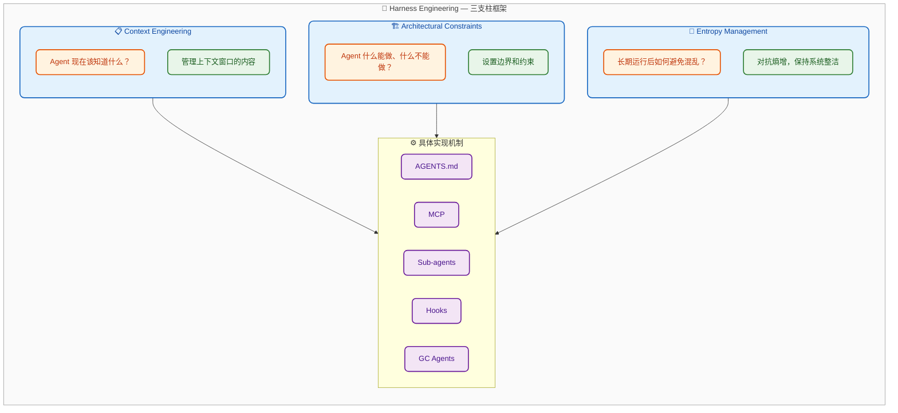
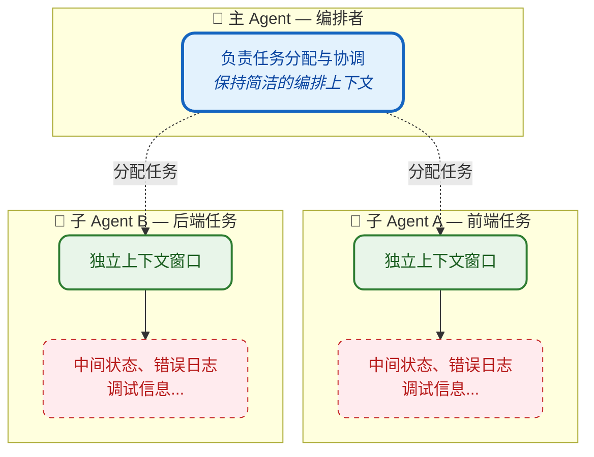

# Harness Engineering：让 AI Agent 稳定可靠运行的工程实践

> 本文系统性地介绍 Harness Engineering 的概念、核心组件、最佳实践与真实案例，帮助读者理解如何构建让 AI Agent 长期稳定运行的"脚手架"系统。

## 阅读路径

- **快速理解**：阅读「30 秒心智模型」→「核心结论」
- **系统学习**：按顺序阅读全文，重点关注「三支柱框架」和「真实案例」
- **实践导向**：阅读「三支柱框架」→「实践指南」

---

## 30 秒心智模型

用 Phil Schmid 的类比来理解：

| 计算机概念 | Agent 类比 | 说明 |
|-----------|-----------|------|
| CPU | AI Model | 提供原始处理能力 |
| RAM | Context Window | 有限的、易失的工作记忆 |
| Operating System | Agent Harness | 管理上下文、处理启动序列、提供标准驱动 |
| Application | Agent | 运行在 OS 之上的特定用户逻辑 |

**核心洞见**：模型是 CPU，Harness 是操作系统。没有好的操作系统，再强的 CPU 也无法稳定运行复杂应用。

---

## 核心结论

1. **Agent = Model + Harness**：模型提供智能，Harness 让智能变得有用。

2. **三支柱框架**：Context Engineering（知道什么）、Architectural Constraints（能做什么）、Entropy Management（如何保持整洁）。

3. **失败是设计输入**：每次 Agent 犯错，就改进 Harness 让它不再犯同样的错误。

---

## 一、什么是 Harness Engineering

### 1.1 核心定义

**Harness（脚手架/ Harness）** 是包裹在 AI 模型外部的软件系统，用于管理 Agent 的运行方式，确保其在长时间、复杂任务中保持可靠、高效、可控。

用 Phil Schmid 的类比来理解：

| 计算机概念 | Agent 类比 | 说明 |
|-----------|-----------|------|
| CPU | AI Model | 提供原始处理能力 |
| RAM | Context Window | 有限的、易失的工作记忆 |
| Operating System | Agent Harness | 管理上下文、处理启动序列、提供标准驱动 |
| Application | Agent | 运行在 OS 之上的特定用户逻辑 |

**Harness Engineering** 是一种工程实践：每当发现 Agent 犯错，就设计一个解决方案，让 Agent 永远不再犯同样的错误。

> "It is the idea that anytime you find an agent makes a mistake, you take the time to engineer a solution such that the agent never makes that mistake again."
> — Mitchell Hashimoto, Terraform 和 Ghostty 创始人

### 1.2 Agent = Model + Harness

这是理解 Harness 最简洁的公式：

```
Agent = Model + Harness
```

**如果你不是模型，你就是 Harness。**

一个原始模型本身不是 Agent。但当 Harness 给它加上状态管理、工具执行、反馈循环、可执行约束后，它就变成了 Agent。

具体来说，Harness 包括：

| 组件 | 说明 | 示例 |
|------|------|------|
| System Prompts | 系统级指令 | 角色定义、行为约束 |
| Tools/MCP/Skills | 能力扩展 | 文件操作、API 调用 |
| Bundled Infrastructure | 基础设施 | 文件系统、沙箱、浏览器 |
| Orchestration Logic | 编排逻辑 | 子 Agent 调度、模型路由 |
| Hooks/Middleware | 确定性控制 | 压缩、续接、lint 检查 |

### 1.3 概念的演变：从实践到理论

Harness Engineering 作为术语在 **2026年2月** 才正式出现：

| 时间 | 里程碑 |
|------|--------|
| 2023~2024 | Prompt Engineering 时代：单轮问答，优化提示词措辞 |
| 2025年中 | Context Engineering 兴起：Andrej Karpathy 强调上下文设计的重要性 |
| 2026.02.05 | Mitchell Hashimoto 在博客中使用 "harness engineering" 术语 |
| 2026.02.11 | OpenAI 发布 "Harness engineering: leveraging Codex in an agent-first world" |

**术语的提出者**：Vivek Trivedy (Viv)，LangChain 作者。

**关键洞见**：在此之前，人们已经在做 AGENTS.md、MCP、子 Agent 等配置——这些实践早就存在。但直到 2026年2月，才有人给这套实践起了一个名字，并将其系统化为一门工程学科。

这类似于 "DevOps" 术语的出现：持续集成、自动化部署等实践早就存在，但 "DevOps" 这个术语让这些实践有了统一的框架和社区。Harness Engineering 也是如此——它为 "如何让 Agent 稳定运行" 这类实践提供了统一的理论框架。

### 1.4 不是什么 vs 是什么

| ❌ 不是 | ✅ 是 |
|--------|-------|
| 简单的提示词优化 | 系统性的基础设施构建 |
| 单次对话的技巧 | 跨会话、长时间运行的保障 |
| 只关注模型输出 | 关注模型如何与环境交互 |
| 一次性配置 | 持续演进的反馈循环 |
| 框架代码（building blocks） | 框架之上的"操作系统"（batteries included） |
| Agent 本身 | Agent 赖以运行的环境 |

**框架 vs Harness 的区别**：
- **框架**提供构建块（如何实现工具、如何实现 agent loop）
- **Harness**提供预置的提示模板、工具处理逻辑、生命周期钩子、现成能力（规划、文件系统、子 Agent 管理）

### 1.5 与 Prompt Engineering、Context Engineering 的关系

三个概念关注不同层面：

| 概念 | 核心问题 | 关注层面 |
|------|---------|--------|
| Prompt Engineering | 如何写好这条提示？ | 单次输入的措辞 |
| Context Engineering | Agent 现在应该看到什么？ | 上下文窗口的内容 |
| Harness Engineering | 如何设计 Agent 运行的环境？ | 约束、反馈、操作系统 |

**关系**：
- Prompt Engineering 是 Context Engineering 的一部分（措辞影响上下文）
- Context Engineering 是 Harness Engineering 的一根支柱（三支柱之一）
- Harness Engineering 还包括 Architectural Constraints 和 Entropy Management

不同来源对术语层级有不同表述，但核心一致：**Prompt Engineering 关注措辞，Context Engineering 关注信息，Harness Engineering 关注环境**。

---

## 二、为什么需要 Harness Engineering

### 2.1 模型的根本局限

模型本身的能力是有限的。LangChain 的文章从模型的角度解释了为什么需要 Harness：

**模型（本质上）只能做什么**：
- 接收输入：文本、图像、音频、视频
- 输出：文本

**仅此而已**。开箱即用，模型无法：

| 模型不能直接做的事 | 为什么这是问题 |
|------------------|----------------|
| 维持跨会话的持久状态 | 每次对话都是"白纸一张" |
| 执行代码 | 无法验证自己的想法 |
| 访问实时知识 | 训练数据有截止日期 |
| 设置环境、安装依赖 | 无法完成实际工作 |
| 记住之前的教训 | 同样的错误反复犯 |

**这些都是 Harness 层面的功能**。LLM 的结构决定了必须有某种机制包裹它们才能做有用的工作。

### 2.2 "等更强的模型就行了" 是陷阱

当 Agent 频繁失败时，常见的本能反应是：

> "我们只需要更好的模型，GPT-6 会解决的。"

但 HumanLayer 团队在数十个项目、数百次 Agent 会话后得出结论：**这不是模型问题，是配置问题**。

**为什么更强的模型不是答案**：

1. **任务难度会水涨船高**
   - 模型变强 → 我们给它更难的任务
   - 更难的任务 → 新的失败模式
   - 非确定性系统的意外失败是根本问题

2. **Benchmark 无法衡量长期可靠性**
   - 传统 benchmark 测试单轮输出
   - 无法测试模型在第 50 或 100 次工具调用后的行为
   - 1% 的 benchmark 差异无法检测模型在五十步后是否偏离轨道

3. **模型可能被过度拟合到特定 Harness**
   - Opus 4.6 在 Claude Code 中排名第 33
   - 同一模型在不同 Harness 中排名第 5
   - 定制 Harness 可能比依赖默认配置更好

### 2.3 长时任务的核心挑战

Anthropic 在研究长时间运行的 Agent 时发现了两个关键失败模式：

**失败模式 1：试图一次性完成太多**
```
问题：Agent 尝试 "one-shot" 整个应用
结果：上下文在中途耗尽
后续：下一个会话面对半成品，不知从何下手
```

**失败模式 2：过早宣布完成**
```
问题：Agent 看到一些进展就认为任务完成
结果：功能实际不完整或有 bug
后续：人类需要大量时间修复
```

**核心挑战**：上下文窗口有限，而复杂项目无法在单个窗口内完成。Agent 需要一种方式来桥接多个会话之间的鸿沟。

### 2.4 上下文腐烂（Context Rot）

**上下文腐烂**描述了一个关键现象：

> 随着上下文窗口被填满，模型的推理和任务完成能力会下降。

**为什么会发生**：
- 上下文窗口是有限资源
- 每个工具输出、每条消息都在消耗这个资源
- 无关信息累积 → "噪音"比例增加 → 模型更难找到关键信息

**表现**：
- Agent 开始重复同样的操作
- 忽略之前的指令
- 推理质量下降
- 最终完全迷失

**Harness 的价值**：通过压缩、卸载、隔离、渐进披露等策略，对抗上下文腐烂，让 Agent 在长时间任务中保持稳定。

### 2.5 "Bitter Lesson" 的启示

Rich Sutton 的 "Bitter Lesson" 论文指出：使用计算的通用方法最终会击败手工编码的人类知识。

**在 Agent 开发中的体现**：

| 案例 | 教训 |
|------|------|
| Manus | 6 个月重构 Harness 5 次，移除僵化假设 |
| LangChain | 一年内重构 "Open Deep Research" Agent 3 次 |
| Vercel | 移除 80% 的 Agent 工具，结果：更少步骤、更少 token、更快响应 |

**核心原则**：Harness 必须轻量化。每个新模型版本都有不同的最优 Agent 结构。2024 年需要复杂手工流水线的能力，2026 年可能一个上下文窗口内的提示就能解决。

> **构建可删除的架构**：如果你过度设计控制流，下一个模型更新会破坏你的系统。

---

## 三、三支柱框架：Harness Engineering 的核心方法论

Martin Fowler 团队的 Birgitta Böckeler 将 Harness Engineering 拆解为三根支柱，每根支柱回答一个核心问题：

| 支柱 | 核心问题 | 关注点 |
|------|---------|--------|
| **Context Engineering** | Agent 现在该知道什么？ | 管理上下文窗口的内容 |
| **Architectural Constraints** | Agent 什么能做、什么不能做？ | 设置边界和约束 |
| **Entropy Management** | 长期运行后如何避免混乱？ | 对抗熵增，保持系统整洁 |

> **术语说明**：这里的 "Context Engineering" 指三支柱中的具体实践——管理 Agent 当前应该知道什么。这与第一节中提到的 "Context Engineering" 概念层级不同，但指向的是同一类工作：让 Agent 的上下文窗口包含正确信息。



**读图要点**：
- 三支柱分别回答「知道什么」「能做什么」「如何保持整洁」三个核心问题
- 每个支柱都有对应的实现机制（AGENTS.md、MCP、子 Agent 等）
- 三支柱相互支撑，共同构成稳定的 Agent 运行环境

### 3.1 支柱一：Context Engineering

**核心问题**：Agent 现在该知道什么？

Context Engineering 的目标是让 Agent 的上下文窗口始终包含正确、适量的信息——不多也不少。

#### 为什么这是第一支柱

模型只能直接操作其上下文窗口内的知识。上下文窗口是有限资源，必须精心管理：

| 问题 | 后果 |
|------|------|
| 信息不足 | Agent 缺乏做决策的依据 |
| 信息过多 | 关键信息被噪音淹没 |
| 信息过时 | Agent 基于错误前提行动 |
| 信息冗余 | 浪费宝贵的上下文空间 |

#### 核心实践

**1. AGENTS.md — 项目知识注入**

AGENTS.md 是一个 Markdown 文件，放在代码仓库根目录，Agent 每次启动时自动读取。它相当于给 Agent 的"入职手册"。

| 原则 | 说明 | 反例 |
|-----|------|------|
| 简洁 | 控制在 60 行以内 | 几百行的"百科全书" |
| 通用 | 规则应适用于所有场景 | 大量条件判断 |
| 渐进披露 | 不一次性塞入所有信息 | 把所有工具说明都写进去 |
| 人写优于机写 | 人工精心编写 | LLM 自动生成 |

一个好的 AGENTS.md 结构：

```markdown
# Project Name

## Build & Test Commands
- Build: `npm run build`
- Test: `npm test`
- Lint: `npm run lint`

## Code Style
- Use TypeScript strict mode
- Prefer functional components

## Architecture
- src/components/ - React components
- src/services/ - Business logic

## Common Pitfalls
- Don't modify files in dist/
- Always run tests before commit
```

**ETH Zurich 研究的启示**：一项针对 138 个 AGENTS.md 文件的研究发现，LLM 生成的文件反而降低性能，人工编写的文件如果包含太多条件规则也帮助有限。核心教训：每一行都应该经过深思熟虑。

**2. MCP 服务器 — 能力与知识扩展**

Model Context Protocol (MCP) 是一个开放协议，用于连接 AI 应用与外部工具和数据源。

| 功能 | 说明 | 示例 |
|-----|------|------|
| Tools | 可调用的函数 | 查询数据库、调用 API |
| Resources | 可读取的数据 | 文件、日志 |
| Prompts | 预定义的提示模板 | 常用任务模板 |

⚠️ **安全警告**：MCP 服务器的工具描述会被注入到系统提示中，不要连接不信任的服务器。

**工具数量陷阱**：连接太多 MCP 工具会导致上下文窗口被工具描述填满，Agent 进入"愚蠢区域"更快。

**3. 上下文压缩与卸载**

| 策略 | 说明 | 实现方式 |
|-----|------|---------|
| 压缩 (Compaction) | 智能总结已有上下文 | 保留关键信息，丢弃噪音 |
| 工具输出卸载 | 大型输出只保留头尾 | 完整内容存文件，需要时读取 |
| 渐进式披露 | 按需加载信息 | Skills 机制，而非一次性全部加载 |

### 3.2 支柱二：Architectural Constraints

**核心问题**：Agent 什么能做、什么不能做？

Architectural Constraints 的目标是通过设置边界和约束，让某些错误在结构上变得不可能。

#### 为什么需要约束

在人类优先的工作流中，严格规则可能显得繁琐。但在 Agent 优先的工作流中，它们变成倍增器——一旦编码，就处处适用。

OpenAI 团队的发现：

> "Agents are most effective in environments with strict boundaries and predictable structure."

#### 核心实践

**1. 架构即护栏**

OpenAI 团队 enforced 严格的分层架构：

```
Types -> Config -> Repo -> Service -> Runtime -> UI
```

每层有固定的依赖方向，任何违反都被机械地阻止。

**2. Linter 作为约束执行者**

关键创新：Linter 不仅返回错误，错误信息本身就是修复指南。

```bash
# 普通 linter 输出
Error: Dependency violation in src/ui/component.ts

# Harness-aware linter 输出
Error: Dependency violation in src/ui/component.ts
  UI layer cannot import Service layer directly.
  Fix: Move the logic to a Service and inject it via props.
```

这样，工具在阻止错误的同时，也教会 Agent 如何修复。

**3. Pre-commit Hooks**

在代码提交前自动执行验证：

```bash
#!/bin/bash
# Pre-commit hook: 运行测试和 lint
npm run lint && npm test
```

**4. 沙箱隔离**

Stripe 的 Minions 运行在隔离的"开发盒"中——与人类工程师相同的开发环境，但与生产环境隔离。Agent 只能访问它应该访问的资源。

#### 约束设计原则

| 原则 | 说明 |
|-----|------|
| 机械执行 | 约束应该由工具自动执行，不依赖 Agent 记住 |
| 错误即指南 | 错误信息应该告诉 Agent 如何修复 |
| 边界清晰 | 灰色地带越少，Agent 越不容易犯错 |
| 可配置 | 不同项目可能有不同的约束需求 |

### 3.3 支柱三：Entropy Management

**核心问题**：长期运行后如何避免混乱？

Entropy Management 的目标是对抗系统随时间推移而产生的熵增——代码质量下降、文档过时、架构腐化。

#### 什么是熵增

当 Agent 大规模生成代码时，不可避免地会：
- 复制糟糕的模式
- 积累技术债务
- 产生不一致的代码风格
- 留下过时的文档和注释

这些被称为 "AI slop" 或 "entropy"。

#### 核心实践

**1. 后台 GC Agents**

OpenAI 团队运行后台 Agent，持续扫描代码和文档的不一致，并自动打开重构 PR。

这类似于编程语言中的垃圾回收，但针对的是代码库的质量问题。

**2. 规则修剪循环**

Sam Zoloth 描述了他的实践：

```
日记条目 → 反思 → 模式提取 → 高于阈值的模式 → 活跃规则 → 过时规则被修剪
```

这是一个持续的过程，确保规则库不会无限膨胀。

**3. 子 Agent 作为上下文防火墙**

子 Agent 是对抗熵增的关键机制：



**读图要点**：
- 子 Agent 作为「上下文防火墙」，隔离任务执行的噪音
- 主 Agent 只负责编排，保持长期一致性
- 没有子 Agent 时，所有中间状态会累积在主线程中导致上下文腐烂

没有子 Agent，所有中间噪音都会累积在主线程中。子 Agent 让主 Agent 只负责编排，保持长期一致性。

**4. Hooks — 确定性控制流**

Hooks 是在 Agent 生命周期的特定时刻自动执行的代码：

| Hook 类型 | 触发时机 | 用途 |
|----------|---------|------|
| Pre-tool | 工具调用前 | 验证参数、记录日志 |
| Post-tool | 工具调用后 | 处理输出、截断过长输出 |
| Pre-commit | 代码提交前 | 运行 lint、测试 |
| Context-full | 上下文将满时 | 触发压缩 |
| Session-start | 会话开始时 | 加载环境、读取进度 |

### 3.4 三支柱的协同

三支柱不是独立的，而是相互支撑：

```
Context Engineering ─── 提供正确信息
        │
        ▼
Architectural Constraints ─── 限制错误行为
        │
        ▼
Entropy Management ─── 清理累积问题
        │
        ▼
    稳定可靠的 Agent 系统
```

| 场景 | Context Engineering | Architectural Constraints | Entropy Management |
|------|---------------------|--------------------------|-------------------|
| Agent 不知道项目结构 | AGENTS.md 告诉它 | - | - |
| Agent 试图违反架构 | - | Linter 阻止并指导 | - |
| Agent 累积了大量 slop | - | - | GC Agent 清理 |
| Agent 上下文过载 | 压缩、卸载 | - | 子 Agent 隔离 |
| Agent 重复犯错 | 更新 AGENTS.md | 添加新约束 | - |

**核心洞见**：设计环境，让 Agent 的默认行为就是正确行为。

---

## 四、真实案例剖析

### 4.1 OpenAI 团队：100 万行代码，5 个月，3 名工程师

Greg Brockman 分享了 OpenAI 内部团队的经历：

**背景**：
- 3 名工程师，5 个月，100 万行代码
- 0 行手写代码（设计决策）
- 平均每人每天 3.5 个 PR
- 团队扩大后，吞吐量反而增加

**关键实践**：

1. **架构即护栏**
   - 严格的分层架构，每层有固定的依赖方向
   - 自定义 linter 强制执行架构约束
   - 违反约束时，错误信息直接告诉 Agent 如何修复

2. **工具即反馈**
   - 测试必须快速运行
   - 组件间有高质量接口
   - Linter 错误信息 = 修复指南

3. **文档即反馈循环**
   - 每次 Agent 犯错，更新 AGENTS.md
   - 文档不是静态产物，是活的系统

> **对你的启发**：在人类优先的工作流中，严格规则可能显得繁琐；但在 Agent 优先的工作流中，它们变成倍增器——一旦编码，就处处适用。

### 4.2 Stripe 的 Minions：每周 1000+ 合并 PR

Stripe 内部的编码 Agent 系统，称为 "Minions"：

**架构特点**：
- 运行在隔离的"开发盒"中——与人类工程师相同的开发环境
- 通过 MCP 集成 400+ 内部工具
- 用户在 Slack 发布任务 → Agent 写代码 → 过 CI → 开 PR → 人类审查

**关键洞见**：Agent 需要的是与人类工程师相同的上下文和工具，而不是事后添加的"附加"集成。

### 4.3 Anthropic：16 个 Agent 并行写 C 编译器

Nicholas Carlini 用 16 个 Claude Agent 并行开发了一个 Rust 编写的 C 编译器：

**规模**：
- 近 2000 个 Claude Code 会话
- $20,000 API 成本
- 10 万行代码
- 能编译 Linux 6.9 (x86, ARM, RISC-V)

**核心设计**：

1. **无限循环 Harness**
```bash
while true; do
    COMMIT=$(git rev-parse --short=6 HEAD)
    claude --dangerously-skip-permissions \
           -p "$(cat AGENT_PROMPT.md)" \
           --model claude-opus-X-Y &> "agent_logs/agent_${COMMIT}.log"
done
```

2. **任务锁机制**
   - Agent 通过在 `current_tasks/` 目录写文件来"锁定"任务
   - Git 同步强制第二个 Agent 选择不同任务

3. **高质量测试**
   - 测试是 Agent 的"指南针"
   - 测试输出必须简洁（避免上下文污染）
   - 日志文件便于 grep 搜索错误

4. **并行策略**
   - 多个独立失败测试 → 每个 Agent 选一个
   - 单一大任务（如编译内核）→ 用 GCC 作为"预言机"，随机分配文件

### 4.4 Peter Steinberger：一个月 6600+ 提交

OpenClaw 的创作者：

**工作模式**：
- 同时运行 5-10 个 Agent
- 发布他不读的代码
- 花大量时间与 Agent 规划，然后启动执行
- 作为架构的"仁慈独裁者"

**关键洞见**：工程师的工作正在分裂成两半——构建环境和管理执行。

---

## 五、实践指南

### 5.1 从哪里开始

**最小可行 Harness**（1-2 天）：

```
项目根目录/
├── AGENTS.md          # < 60 行，人工编写
├── package.json       # 或其他包管理文件
└── .github/
    └── workflows/     # CI 配置
        └── test.yml
```

AGENTS.md 模板：

```markdown
# 项目名称

## 构建 & 测试
- 构建：`npm run build`
- 测试：`npm test`
- Lint：`npm run lint`

## 代码风格
- 使用 TypeScript strict mode
- 所有公共 API 需要 JSDoc

## 架构
- src/components/ - React 组件
- src/services/ - 业务逻辑

## 常见陷阱
- 不要修改 dist/ 目录
- 提交前必须运行测试
```

### 5.2 Context Engineering 实践

**核心原则**：上下文窗口是稀缺资源，每一行信息都要有价值。

| 实践 | 具体做法 | 避免的错误 |
|------|---------|-----------|
| AGENTS.md | < 60 行，只写通用规则 | 几百行的"百科全书" |
| MCP 工具 | 只连接高频使用的工具 | 连接所有可用的工具 |
| 文档组织 | 按需加载，渐进披露 | 一次性加载所有文档 |
| 输出控制 | 截断过长输出，存文件 | 让大量输出填满上下文 |

**关键检查点**：
- Agent 启动时，上下文窗口有多少被工具描述占用？
- AGENTS.md 中的每条规则，是否都曾被 Agent 实际使用？
- 是否有重复或冗余的信息？

### 5.3 Architectural Constraints 实践

**核心原则**：约束应该由工具自动执行，不依赖 Agent 记住。

**Linter 配置示例**：

```json
// .eslintrc.json - 架构约束
{
  "rules": {
    "no-restricted-imports": ["error", {
      "patterns": [{
        "group": ["src/services/*"],
        "message": "UI 层不能直接导入 Service。请通过 props 注入或使用 hooks。"
      }]
    }]
  }
}
```

**关键点**：错误信息本身是修复指南，不只是 "Error: violation"。

**约束层级**：

| 层级 | 机制 | 示例 |
|------|------|------|
| 代码层面 | Linter、Formatter | 依赖方向、命名规范 |
| 提交层面 | Pre-commit hooks | 测试必须通过 |
| 运行层面 | 沙箱隔离 | 限制网络访问 |
| 架构层面 | 结构测试 | 层级边界检查 |

### 5.4 Entropy Management 实践

**核心原则**：系统会自然熵增，需要主动清理。

**清理机制**：

```
定期运行（如每周）
├── 后台 Agent 扫描代码库
│   ├── 检测重复代码
│   ├── 检测过时文档
│   └── 检测架构违规
│
└── 自动创建重构 PR
    └── 人类审查后合并
```

**子 Agent 使用场景**：

| 场景 | 是否需要子 Agent | 原因 |
|------|-----------------|------|
| 单文件修改 | 否 | 单会话可完成 |
| 跨模块重构 | 是 | 需要多个上下文窗口 |
| 并行独立任务 | 是 | 隔离上下文，避免污染 |
| 有依赖的多任务 | 是（串行） | 保持一致性 |

### 5.5 常见反模式

| 反模式 | 表现 | 解决方案 |
|-------|------|---------|
| 工具爆炸 | 连接了 20+ MCP 工具 | 只保留高频使用的 3-5 个 |
| 文档膨胀 | AGENTS.md 超过 100 行 | 精简到核心规则，其他按需加载 |
| 约束缺失 | Agent 可以提交任何代码 | 添加 pre-commit hook 运行测试 |
| 手动修复 | 同样错误反复出现 | 每次失败后更新 Harness |
| 无验证 | Agent 声称完成但实际有 bug | 强制端到端测试 |

### 5.6 实施路线图

**阶段 1：最小可行 Harness（1-2 天）**

```
□ AGENTS.md
  ├── 构建命令
  ├── 测试命令
  └── 核心架构说明

□ CI 配置
  ├── 测试自动运行
  └── Lint 自动运行
```

**阶段 2：增强约束（1 周）**

```
□ 架构约束
  ├── 依赖方向检查
  └── 错误信息包含修复指南

□ Pre-commit hooks
  └── 提交前运行测试
```

**阶段 3：持续改进（持续）**

```
□ 每次失败后
  ├── 记录失败模式
  ├── 更新 AGENTS.md 或添加约束
  └── 验证修复有效

□ 定期审查
  ├── AGENTS.md 是否过长？
  ├── 工具是否过多？
  └── 是否需要添加新的约束？
```

---

## 参考资料

本文学习过程中参考了以下资料：

1. HumanLayer: "Skill Issue: Harness Engineering for Coding Agents"
2. Charlie Guo: "The Emerging Harness Engineering Playbook"
3. Phil Schmid: "The Importance of Agent Harness in 2026"
4. Anthropic: "Building a C Compiler with a Team of Parallel Claudes"
5. LangChain (Vivek Trivedy): "The Anatomy of an Agent Harness"
6. Anthropic: "Effective Harnesses for Long-Running Agents"
7. Martin Fowler (Birgitta Böckeler): "Harness Engineering"
8. Mitchell Hashimoto: "My AI Adoption Journey"
9. Sam Zoloth: "Harness Engineering from the Product Side"
10. madplay: "Beyond Prompts and Context: Harness Engineering for AI Agents"
11. Model Context Protocol 官方规范
12. agents.md 官方网站