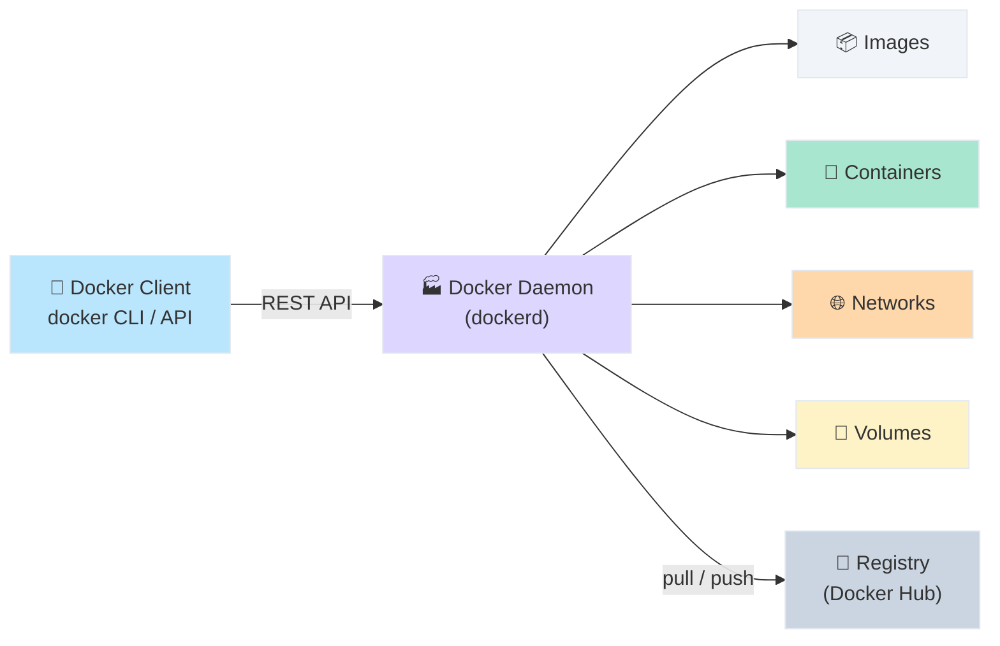

# Docker 容器化技术学习笔记

> [!abstract] 本文定位
> 面向想要理解并实际使用 Docker 的开发者，从核心概念到实战操作，系统梳理 Docker 容器化技术的知识体系。读完本文，你能：
> - 理解 Docker 的核心概念和工作原理
> - 编写 Dockerfile 构建自定义镜像
> - 使用 Docker Compose 编排多容器应用
> - 掌握网络、存储、安全等进阶知识

> [!tip] 阅读路径
> **想快速上手** → [[#30 秒心智模型]] → [[#Docker 核心三件套 — "蓝图、集装箱、码头"]] → [[#Dockerfile — "施工图纸"]] → [[#常用命令速查]] → [[#总结与一页速查]]
>
> **想搞懂原理** → [[#30 秒心智模型]] → [[#Docker 是什么]] → [[#架构总览 — "港口调度中心"]] → 逐章阅读

---

## 30 秒心智模型

> **Docker = 国际物流港口**
>
> 把 Docker 想成一个标准化的国际物流港口，你的应用就是货物。不管货物是什么（Node.js、Python、Java），只要装进标准集装箱（容器），就能在任何港口（服务器）卸货运行。

| 物流港口 | Docker 概念 | 一句话解释 |
|---------|-----------|----------|
| 🏗️ 施工图纸 | **Dockerfile** | 描述如何把货物打包成集装箱的步骤说明 |
| 📦 货物模板 | **镜像 (Image)** | 按图纸打包好的只读集装箱模板，可无限复制 |
| 🚢 运行中的集装箱 | **容器 (Container)** | 从模板创建的、正在运行的独立实例 |
| 🏬 仓库 / 码头 | **Registry (Docker Hub)** | 存放和分发集装箱模板的中心仓库 |
| 📋 编排调度单 | **Docker Compose** | 同时管理多个集装箱的调度计划表 |
| 🌐 港口内部道路 | **Network** | 集装箱之间通信的网络通道 |
| 💾 保险柜 | **Volume** | 集装箱销毁后仍保留的持久化存储 |
| 🏭 港务局 | **Docker Daemon** | 管理所有集装箱的后台服务进程 |

---

## 阅读指南

**本文语境：** 讨论 Docker 容器化技术，涵盖 Docker Engine（CE 社区版）在 Linux/macOS 上的使用。不涉及 Kubernetes 等容器编排平台。

**前置知识：** 基本的命令行操作、了解什么是操作系统和进程。

**术语表：**

| 术语 | 英文 | 本文中的落点 |
|------|------|-----------|
| 镜像 | Image | 只读模板，类似"类定义"，用于创建容器 |
| 容器 | Container | 镜像的运行实例，类似"类的实例" |
| 仓库 | Registry | 存储和分发镜像的服务（如 Docker Hub） |
| 数据卷 | Volume | Docker 管理的持久化存储区域 |
| 绑定挂载 | Bind Mount | 将宿主机目录直接映射到容器内 |
| 层 | Layer | 镜像由多个只读层叠加而成，共享相同的底层 |
| 编排 | Orchestration | 管理多个容器的生命周期和协作 |

---

## Docker 是什么

### 不是什么 vs 是什么

| ❌ Docker 不是 | ✅ Docker 是 |
|---------------|-------------|
| 虚拟机（不模拟完整硬件和 OS） | 操作系统级别的进程隔离技术 |
| 一种编程语言 | 一套容器化工具和平台 |
| 只能用于生产部署 | 贯穿开发、测试、部署全链路的工具 |
| 替代所有运维工具 | 简化应用打包和分发的一种方式 |

**正式定义：** Docker 是一个开源的容器化平台，利用 Linux 内核的 Namespace（隔离）和 Cgroups（资源限制）技术，将应用及其所有依赖打包成轻量级、可移植的容器，实现"一次构建，到处运行"。

> [!info]- Docker vs 虚拟机：为什么容器更轻？
> 虚拟机通过 Hypervisor 模拟完整硬件，每个 VM 需运行独立的客户操作系统（Guest OS），占用 GB 级内存，启动需要分钟级。
>
> Docker 容器直接共享宿主机内核，无需额外操作系统层，仅包含应用和必要依赖，启动仅需秒级，单机可运行数千个容器。
>
> ```
> 虚拟机：           Docker 容器：
> ┌──────────┐       ┌──────────┐
> │  App A   │       │  App A   │
> │  Bins/Libs│       │  Bins/Libs│
> │  Guest OS │       └──────────┘
> └──────────┘       ┌──────────┐
> ┌──────────┐       │  App B   │
> │  App B   │       │  Bins/Libs│
> │  Bins/Libs│       └──────────┘
> │  Guest OS │         Docker Engine
> └──────────┘       ┌──────────────┐
>   Hypervisor       │   Host OS    │
> ┌──────────────┐   │   Hardware   │
> │   Host OS    │   └──────────────┘
> │   Hardware   │
> └──────────────┘
> ```

---

## 背景与痛点 — "小明的日常"

> 小明是个全栈开发者。他的项目用 Node.js 18 + PostgreSQL 15 + Redis 7。每次新同事入职，他需要花半天帮忙配环境——有人 Mac、有人 Windows、有人 Ubuntu，版本不一样、路径不一样、配置不一样。上线时更头疼：测试环境好好的，生产环境就是跑不起来，DBA 说是依赖版本问题……

| 现状 | 痛点 | 根因 |
|------|------|------|
| 每人手动装依赖 | 环境不一致，"我本地是好的" | 缺乏环境标准化方案 |
| 开发/测试/生产配置不同 | 上线经常翻车 | 环境差异导致不可预测行为 |
| 一台机器跑多个项目 | 依赖冲突，版本互相踩踏 | 缺乏进程级隔离 |
| 手写部署文档 | 步骤遗漏、版本老旧 | 部署过程不可复现 |

**Docker 的解法：** 把"小明的环境"打包成一个标准集装箱（镜像），任何人在任何机器上 `docker run` 就能启动完全相同的环境。新同事入职？`docker compose up`，5 分钟搞定。

> **对你的启发**：如果你的项目有超过 2 个外部依赖（数据库、缓存、消息队列等），Docker Compose 能极大减少"配环境"的时间。

---

## 架构总览 — "港口调度中心"



**读图结论：**
1. Docker 采用 **C/S 架构**：Client 发命令，Daemon 干活
2. Daemon 管理四大核心对象：镜像、容器、网络、数据卷
3. Registry 是镜像的远程仓库，`docker pull` / `docker push` 与之交互

---

## Docker 核心三件套 — "蓝图、集装箱、码头"

### 镜像 (Image) — "集装箱模板"

> **类比**：镜像 = 集装箱出厂模板。你可以用同一个模板造出无数个一模一样的集装箱。
>
> **一句话**：镜像是一个只读的多层文件系统，包含运行应用所需的一切——代码、运行时、库、环境变量、配置。

| 特性 | 说明 |
|------|------|
| 只读 | 镜像一旦构建就不可修改 |
| 分层 | 每条 Dockerfile 指令生成一层，层可在镜像间共享 |
| 可复制 | 同一镜像可创建无限个容器 |
| 可版本化 | 通过 tag 管理版本（如 `node:18-slim`） |

> [!info]- 镜像分层机制详解
> Docker 镜像由多个只读层（Layer）叠加而成。当多个镜像共享同一基础层时（如都基于 `ubuntu:22.04`），这一层只需存储一份，节省磁盘空间。
>
> ```
> ┌─────────────────────────┐
> │ Layer 4: COPY app.js    │  ← 你的应用代码
> ├─────────────────────────┤
> │ Layer 3: RUN npm install │  ← 安装的依赖
> ├─────────────────────────┤
> │ Layer 2: RUN apt-get ... │  ← 系统包
> ├─────────────────────────┤
> │ Layer 1: FROM node:18   │  ← 基础镜像
> └─────────────────────────┘
> ```
>
> **关键点：** 层的顺序影响构建缓存。如果某一层发生变化，它及其上面所有层都需要重新构建。因此，应该把不常变动的层放前面（如安装系统包），常变动的放后面（如复制代码）。

### 容器 (Container) — "运行中的集装箱"

> **类比**：容器 = 从模板造出的、正在码头上运转的集装箱。里面有独立的电力（CPU）、水源（内存）、通讯（网络）。
>
> **一句话**：容器是镜像的运行实例，拥有自己的文件系统、网络栈和进程空间，彼此隔离。

```bash
# 从镜像创建并运行容器
docker run -d --name my-app -p 3000:3000 my-image:latest

# 进入运行中的容器
docker exec -it my-app /bin/bash

# 查看运行中的容器
docker ps

# 停止并删除容器
docker stop my-app && docker rm my-app
```

| 容器状态 | 说明 |
|---------|------|
| Created | 已创建但未启动 |
| Running | 正在运行 |
| Paused | 已暂停 |
| Stopped | 已停止（可重新启动） |
| Deleted | 已删除（不可恢复） |

### Registry — "集装箱码头仓库"

> **类比**：Registry = 全球集装箱模板仓库。Docker Hub 就像"模板大超市"，你可以从中取现成的模板，也能上传自己定制的。
>
> **一句话**：Registry 是存储和分发 Docker 镜像的远程服务。

```bash
# 从 Docker Hub 拉取官方镜像
docker pull nginx:latest

# 推送自定义镜像到 Docker Hub
docker tag my-app:latest username/my-app:v1.0
docker push username/my-app:v1.0
```

> **对你的启发**：公司内部项目建议搭建私有 Registry（如 Harbor），避免将内部代码推到公共仓库，同时加速镜像拉取速度。

---

## Dockerfile — "施工图纸"

### 核心指令速查

| 指令 | 港口类比 | 用途 | 示例 |
|------|---------|------|------|
| `FROM` | 选择基础模板 | 指定基础镜像 | `FROM node:18-slim` |
| `WORKDIR` | 设定工作区域 | 设置工作目录 | `WORKDIR /app` |
| `COPY` | 装货入箱 | 复制文件到镜像 | `COPY package*.json ./` |
| `ADD` | 装货+解压 | 复制并自动解压 tar | `ADD archive.tar.gz /app/` |
| `RUN` | 箱内施工 | 构建时执行命令 | `RUN npm install` |
| `ENV` | 贴标签 | 设置环境变量 | `ENV NODE_ENV=production` |
| `EXPOSE` | 标记出入口 | 声明端口（仅文档） | `EXPOSE 3000` |
| `CMD` | 默认启动指令 | 容器启动时执行 | `CMD ["node", "app.js"]` |
| `ENTRYPOINT` | 固定启动程序 | 不可被覆盖的启动命令 | `ENTRYPOINT ["nginx"]` |

> [!question]- CMD vs ENTRYPOINT：什么时候用哪个？
> **CMD** — 定义默认命令，可以被 `docker run` 的参数覆盖。适合提供"默认行为 + 可选参数"的场景。
>
> **ENTRYPOINT** — 定义固定入口，`docker run` 的参数会追加到后面而非覆盖。适合把容器当"可执行程序"用。
>
> **组合使用**是最佳实践：
> ```dockerfile
> ENTRYPOINT ["python", "app.py"]
> CMD ["--port", "8080"]
> ```
> - `docker run my-app` → 执行 `python app.py --port 8080`
> - `docker run my-app --port 3000` → 执行 `python app.py --port 3000`（CMD 被覆盖）

### 实战：一个 Node.js 应用的 Dockerfile

**❌ Before — 新手写法（问题多）：**

```dockerfile
FROM node:18
COPY . /app
WORKDIR /app
RUN npm install
EXPOSE 3000
CMD node app.js
```

问题：镜像体积大（~900MB）、用 root 运行不安全、每次代码改动都重新安装依赖、没有 `.dockerignore`。

**✅ After — 最佳实践：**

```dockerfile
FROM node:18-slim AS builder
WORKDIR /app
COPY package*.json ./
RUN npm ci --only=production
COPY . .

FROM node:18-slim
WORKDIR /app
RUN groupadd -r appuser && useradd -r -g appuser appuser
COPY --from=builder /app .
USER appuser
EXPOSE 3000
HEALTHCHECK --interval=30s --timeout=3s \
  CMD curl -f http://localhost:3000/health || exit 1
CMD ["node", "app.js"]
```

**改进点：**
1. **多阶段构建**：分离构建和运行环境，最终镜像更小
2. **`slim` 基础镜像**：比完整版小约 60%（~200MB vs ~900MB）
3. **先 COPY `package*.json`**：利用层缓存，代码改动不重装依赖
4. **非 root 用户**：使用 `appuser` 运行，遵循最小权限原则
5. **健康检查**：自动监测容器健康状态

> **对你的启发**：始终使用多阶段构建 + slim/alpine 基础镜像 + 非 root 用户，这三条能解决 90% 的镜像安全和体积问题。

---

## Docker Compose — "编排调度单"

### 为什么需要 Compose

> 当你的应用包含 Web 服务 + 数据库 + 缓存 + 消息队列时，手动管理几十条 `docker run` 命令既容易出错又难以维护。Compose 用一个 YAML 文件定义整个技术栈，一条命令启动所有服务。

### 实战：一个完整的 Web 应用栈

```yaml
# docker-compose.yml
services:
  web:
    build: ./web
    ports:
      - "3000:3000"
    environment:
      - DATABASE_URL=postgres://user:pass@db:5432/myapp
      - REDIS_URL=redis://cache:6379
    depends_on:
      db:
        condition: service_healthy
      cache:
        condition: service_started
    restart: unless-stopped
    networks:
      - frontend
      - backend

  db:
    image: postgres:16-alpine
    volumes:
      - pgdata:/var/lib/postgresql/data
    environment:
      POSTGRES_USER: user
      POSTGRES_PASSWORD: pass
      POSTGRES_DB: myapp
    healthcheck:
      test: ["CMD-SHELL", "pg_isready -U user"]
      interval: 10s
      timeout: 5s
      retries: 5
    networks:
      - backend

  cache:
    image: redis:7-alpine
    volumes:
      - redisdata:/data
    networks:
      - backend

volumes:
  pgdata:
  redisdata:

networks:
  frontend:
  backend:
```

### 常用 Compose 命令

```bash
docker compose up -d          # 后台启动所有服务
docker compose down            # 停止并移除所有容器
docker compose logs -f web     # 实时查看 web 服务日志
docker compose ps              # 查看服务状态
docker compose exec web sh     # 进入 web 容器
docker compose build           # 重新构建镜像
docker compose pull            # 拉取最新镜像
```

> **对你的启发**：项目根目录放一个 `docker-compose.yml`，新成员 clone 后 `docker compose up` 就能跑起完整环境，这是最实用的 Docker 落地方式。

---

## 网络 — "港口内部道路"

### 网络驱动类型

| 驱动 | 类比 | 适用场景 | 特点 |
|------|------|---------|------|
| **bridge** | 港区内部道路 | 单机多容器通信（默认） | 自动 DNS、网络隔离 |
| **host** | 直接用港口外马路 | 性能敏感场景 | 无网络隔离，直接用宿主网络 |
| **overlay** | 跨港口高速公路 | Swarm 多机通信 | 跨主机容器互通 |
| **none** | 不修路 | 完全隔离 | 无任何网络 |

> [!info]- 用户自定义 bridge vs 默认 bridge
> **默认 bridge**：容器只能通过 IP 互访，不支持 DNS 解析，无法按名称通信。
>
> **自定义 bridge**（推荐）：支持 DNS 自动解析——容器 A 可以直接用 `ping container-b` 访问容器 B。Docker Compose 会自动为每个项目创建独立的自定义 bridge 网络。
>
> ```bash
> # 创建自定义网络
> docker network create my-network
>
> # 容器加入网络
> docker run -d --name api --network my-network my-api
> docker run -d --name db --network my-network postgres
>
> # api 容器内可直接用 "db" 作为主机名访问 postgres
> ```

---

## 存储 — "保险柜"

### 三种挂载方式对比

| 类型 | 类比 | 数据持久性 | 管理方 | 典型场景 |
|------|------|----------|-------|---------|
| **Volume** | 港口保险柜 | ✅ 持久 | Docker | 数据库、应用数据 |
| **Bind Mount** | 直接搬货到办公室 | ✅ 持久 | 宿主机 | 开发时共享源码 |
| **tmpfs** | 临时便签纸 | ❌ 内存中，重启丢失 | 内存 | 缓存、临时密钥 |

```bash
# Volume（推荐用于持久化）
docker run -v mydata:/var/lib/data my-app

# Bind Mount（推荐用于开发）
docker run -v $(pwd)/src:/app/src my-app

# tmpfs（推荐用于临时/敏感数据）
docker run --mount type=tmpfs,dst=/tmp my-app
```

> **对你的启发**：
> - **生产环境** → 用 Volume，Docker 统一管理，便于备份和迁移
> - **开发环境** → 用 Bind Mount，宿主机改代码容器内实时生效
> - **敏感数据** → 用 tmpfs，避免持久化到磁盘

---

## 常用命令速查

### 镜像操作

```bash
docker images                     # 列出所有镜像
docker pull nginx:latest          # 拉取镜像
docker build -t my-app:v1 .       # 构建镜像
docker rmi my-app:v1              # 删除镜像
docker image prune                # 清理悬空镜像
docker tag my-app:v1 repo/app:v1  # 打标签
```

### 容器操作

```bash
docker run -d -p 8080:80 --name web nginx   # 创建并启动容器
docker ps                                     # 查看运行中容器
docker ps -a                                  # 查看所有容器（含已停止）
docker logs -f web                            # 实时查看日志
docker exec -it web /bin/bash                 # 进入容器
docker stop web                               # 停止容器
docker rm web                                 # 删除容器
docker stats                                  # 查看容器资源使用
```

### 系统清理

```bash
docker system df                  # 查看 Docker 磁盘使用
docker system prune -a            # 清理所有未使用的资源（慎用）
docker volume prune               # 清理无主数据卷
docker network prune              # 清理无主网络
```

---

## 安全最佳实践

| 原则 | 做法 | 原因 |
|------|------|------|
| 最小权限 | `USER appuser`，不用 root | 防止容器逃逸后获得宿主机 root 权限 |
| 最小镜像 | 用 `slim`/`alpine`/`distroless` | 更少的包 = 更少的攻击面 |
| 固定版本 | `FROM node:18.19-slim`，不用 `latest` | 避免意外拉到破坏性更新 |
| 扫描漏洞 | `docker scout cves my-image` | 及时发现已知漏洞 |
| 保护密钥 | 用 Docker Secrets 或环境变量，不写进镜像 | 防止密钥泄露到镜像层中 |
| 资源限制 | `--memory=512m --cpus=1` | 防止单个容器耗尽宿主机资源 |

---

## 总结与一页速查

> [!success] Docker 带走的 7 条经验
>
> 1. **Dockerfile 层序很重要** — 不常变的放前面，常变的放后面，最大化利用缓存
> 2. **多阶段构建是标配** — 构建环境和运行环境分离，镜像体积减少 50%~90%
> 3. **Docker Compose 是团队协作利器** — 一个文件定义整个开发环境
> 4. **自定义 bridge 网络** — 永远不要用默认 bridge，自定义网络支持 DNS 解析
> 5. **Volume 用于持久化，Bind Mount 用于开发** — 场景不同，选择不同
> 6. **不用 root，不用 latest** — 安全和可复现性的两条基本线
> 7. **定期清理** — `docker system prune` 避免磁盘被废弃镜像和容器填满

### 决策流程

```
需要容器化？
├── 单个服务 → Dockerfile + docker run
├── 多个服务 → Docker Compose
├── 多机集群 → Docker Swarm 或 Kubernetes
│
存储选择？
├── 数据需要持久化 → Volume
├── 开发时需要热加载 → Bind Mount
├── 临时/敏感数据 → tmpfs
│
网络选择？
├── 单机多容器 → 自定义 bridge
├── 性能极致要求 → host
├── 跨主机通信 → overlay
```

---

## 参考资料

- [Docker 官方文档](https://docs.docker.com/)
- [Docker Hub](https://hub.docker.com/)
- [Dockerfile 指令参考](https://docs.docker.com/reference/dockerfile/)
- [Docker Compose 指南](https://docs.docker.com/compose/)
- [Docker 网络驱动概览](https://docs.docker.com/network/drivers/)
- [Docker 存储机制](https://docs.docker.com/storage/)
- [Docker 安全最佳实践](https://docs.docker.com/develop/security-best-practices/)
