# OpenClaw 从零认知：设计思想与技术原理全解

> [!abstract] 本文定位
> 目标是：读完这篇文章，你能清晰地说出 OpenClaw 是什么、为什么火、它的设计思想是什么、核心机制怎么运转——而不需要看懂任何一行源码。**文章从用户视角出发，逐层深入技术原理**，图文并茂，通俗易懂。
>
> 配套笔记：[[OpenClaw学习笔记]] · 关联主题：[[Agent-开发技术]]

---

## 阅读路径

> [!tip] 根据你的目标选择入口
> 
> **路径 Zero：只有 30 秒？**
> → 看完下面的 [[#30 秒建立认知]] 就够了
> 
> **路径 A：想快速建立认知（15 分钟）**
> → [[#OpenClaw 是什么]] → [[#它解决了什么问题]] → [[#核心能力全景]] → [[#为什么它这么火]] → [[#总结]]
> 
> **路径 B：想深入理解设计与原理（50 分钟）**
> → 完整从头阅读，重点关注 [[#整体架构：从感性到理性]]、[[#五大核心机制深入]] 和 [[#Pi 是什么：OpenClaw 的 AI 大脑]]

---

## 30 秒建立认知

> [!abstract] 如果你只看这一段
> 
> 想象你雇了一个**住在你家里的全能管家**：
> 
> | 管家的能力 | 对应 OpenClaw |
> |-----------|-------------|
> | 📱 你打电话、发微信、发短信都能找到他 | **多通道接入**——WhatsApp · Telegram · Slack · Discord · iMessage |
> | 🔧 他不只陪聊，真的去买菜、寄快递、交水电费 | **真实任务执行**——跑代码 · 读写文件 · 调 API · 发邮件 |
> | 🏠 他住在你家，不是外包公司派来的 | **本地私有**——数据在你机器上，不经过任何云端 |
> | 📝 他有本小本本，记着你的习惯和偏好 | **三层记忆**——短期 · 中期 · 长期，不会"失忆" |
> | ⏰ 他会自己巡逻——快递到没？水电费到期没？ | **自主调度**——Heartbeat 心跳 + Cron 定时任务 |
> | 📚 你可以教他新技能（用新的外卖 App、办签证） | **Skills 扩展**——5700+ 社区技能，可自定义 |
> 
> **一句话**：OpenClaw = 跑在你自己机器上的 AI 管家，通过你常用的聊天 App 随时听你差遣，而且**真的会去做事**。

---

## 阅读指南

### 前置知识

你只需要了解：
- 什么是 API（接口调用）
- 什么是进程（一个跑在机器上的程序）
- 什么是 WebSocket（双向实时通信协议）

不需要了解 Agent 开发、LLM 原理、或 TypeScript。

> [!tip] 路径 B 读者
> 深入阅读路径（[[#整体架构：从感性到理性]] 之后各节）涉及 npm 包结构、EventEmitter、进程嵌入等概念，有基础编程经验（了解 Node.js 更佳）阅读效果更好。

### 术语速查表

| 术语 | 通俗解释 | 在本文中的落点 |
|------|----------|----------------|
| **Gateway（网关）** | OpenClaw 的"总控台"进程，负责把所有聊天 App 的消息汇总，再交给 AI 处理 | 本文的核心主角，贯穿始终 |
| **Agent（智能体）** | 有记忆、有工具、能自主执行任务的 AI 助手 | 理解为"能干活的 AI"，不只是聊天 |
| **Pi** | Gateway 内嵌的 AI 执行引擎（由奥地利开发者 Mario Zechner 创作），负责实际推理和执行工具 | 相当于 AI 的"大脑" |
| **Channel（通道）** | 各种聊天平台的接入适配器，如 Telegram 插件、WhatsApp 插件 | AI 的"耳朵和嘴巴" |
| **Node（节点）** | 手机或电脑上的配套 App，提供摄像头、录屏、位置等设备能力 | AI 的"手脚延伸" |
| **Session（会话）** | 一次对话上下文，同一个发话人有独立的 Session | 保证 AI 不会"认错人" |
| **Skills（技能）** | 教 Agent 如何使用某个工具或完成某类任务的插件模块 | 可扩展的能力包 |
| **Workspace（工作区）** | Agent 的工作目录，存放记忆文件、技能、配置 | AI 的"个人文件夹" |
| **Heartbeat（心跳）** | Agent 定期自动"醒来"检查任务的机制 | AI 的"自主巡逻" |

---

## OpenClaw 是什么

### 一句话版

> **OpenClaw 是一个跑在你自己机器上的 AI 助理网关**——它把你常用的聊天 App 统一接入，让 AI 助手不只"聊天"，还能真正帮你执行任务。

### 它不是什么 vs 它是什么

很多人第一次听到 OpenClaw 会产生误解，先划清边界：

| | ❌ 不是 | ✅ 是 |
|---|--------|------|
| **和 ChatGPT 的关系** | 不是又一个 ChatGPT 套壳——它自己没有模型 | 一个**调度框架**，调用你选择的任意 LLM（Claude / GPT / Gemini / 本地模型） |
| **和聊天机器人的关系** | 不是只会回消息的 Bot | 一个**任务执行引擎**——收到消息后，真的去跑命令、改文件、调接口 |
| **和云服务的关系** | 没有中心服务器，不是 SaaS | 一个**本地进程**（Gateway），跑在你自己的机器上，数据不出本地 |

> [!tip] 类比理解
> 如果 ChatGPT 是"电话客服"（你打给它，它口头告诉你答案），那 OpenClaw 就是"住家管家"（你用任何方式联系他，他直接帮你把事办了）。

### 产品形态

想象这样一个场景：

```
你在 WhatsApp 发消息："帮我把今天的日报整理成 PDF 发给我"
你在 Telegram  发消息："查一下 GitHub 上有没有新的 issue"
你在 iMessage  发消息："今晚 7 点提醒我给客户回邮件"
```

三条消息发往不同的 App，但背后都连接到**同一个在你机器上跑的 AI 网关**——由同一个 Agent 处理、执行，结果再分别回传到对应的 App。

一句话：**单机、多通道、可执行任务的私人 AI 基础设施**。

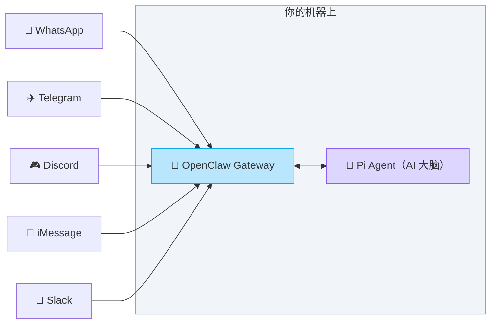

> **读图结论**：① 所有聊天 App 都连接到中间的 Gateway；② Gateway 再连接 Pi Agent 做实际的 AI 推理和任务执行；③ 一切都跑在你自己的机器上，数据不出本地。

---

## 它解决了什么问题

### 一个开发者的日常（Before OpenClaw）

> [!example] 小明是个全栈开发者，他的 AI 使用日常是这样的：
> 
> 🌅 **早上** — 打开 ChatGPT 网页，问它写一段爬虫脚本。ChatGPT 给了代码——然后小明得自己复制、粘贴、创建文件、运行、调试。**AI 只是个"写手"，不是个"干活的人"**。
> 
> 🌤️ **上午** — 想让 AI 帮忙盯着 GitHub 有没有新 issue。发现做不到——ChatGPT 连你的终端都访问不了，更别说定时检查了。**AI 不能自主行动**。
> 
> 🚶 **下午** — 出门在外，想起一个任务要处理，但 ChatGPT 在电脑浏览器里。手机上只有 Telegram 和 WhatsApp……**AI 被锁在一个 App 里**。
> 
> 🌙 **晚上** — 回家打开 ChatGPT 继续聊，发现上午的对话上下文已经模糊了。之前在 Telegram 上跟另一个 Bot 说的内容？完全是两个世界。**AI 没有统一记忆**。

小明的四个痛苦，其实就是 OpenClaw 要解决的四个问题：

| 痛点 | 一句话 |
|------|--------|
| 🔒 **平台孤岛** | AI 被锁在单一入口里，不能随时随地用 |
| 🗣️ **只说不做** | 给你文字回复，但不帮你真正执行 |
| 🧊 **被动等待** | 你不找它，它就不动——没有自主性 |
| 🧠 **记忆割裂** | 不同平台、不同会话之间没有共享记忆 |

### OpenClaw 的解法

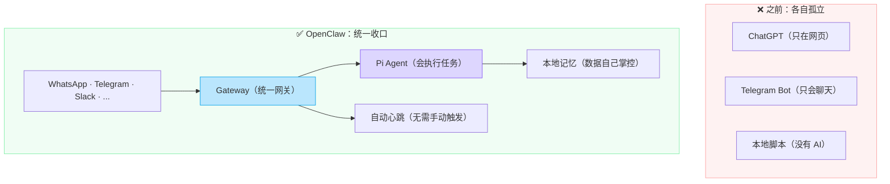

> **读图结论**：OpenClaw 用一个统一的 Gateway 把"多平台入口""AI 执行能力""本地记忆""自动调度"整合到一起，解决了孤岛问题。

---

## 核心能力全景

### 能力一览

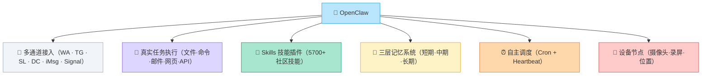

### 能力详解

> [!tip] 阅读方式
> 每个能力用**类比 → 一句话 → 示例**的格式呈现。想深入了解某个能力，可以跳到后面的 [[#五大核心机制深入]] 章节。

#### 📡 多通道接入 — "不管你用什么方式联系管家，他都接得到"

一个 Gateway 进程同时连接多个聊天平台。你在哪个 App 发消息，就从哪个 App 收到回复。原生支持 WhatsApp、Telegram、Discord、iMessage、Slack、Signal，社区持续扩展中。

> **对 Agent 开发者的启发**：通道（Channel）只负责消息格式转换，Agent 完全不知道消息来自哪个平台——这种"入口与智能解耦"的设计让新增平台接入零代码改动。

#### 🔧 真实任务执行 — "管家不只是陪聊，他真的会去办事"

这是 OpenClaw 和普通聊天机器人**最本质的区别**。Agent 内置 4 把"瑞士军刀"：

| 工具 | 做什么 | 类比 |
|------|--------|------|
| `read` | 读文件 | 管家翻阅你的文件柜 |
| `write` | 写文件 | 管家写一份新报告放好 |
| `edit` | 精准改文件 | 管家只改合同里的一个条款，不动其他 |
| `bash` | 执行任意命令 | 管家走出家门去跑腿——**万能钥匙** |

> [!example]- 对比：普通 Bot vs OpenClaw
> **普通 Bot**：你说"帮我写一个 Python 爬虫"→ 它给你一段代码文本，你自己复制、创建文件、运行、调试。
> 
> **OpenClaw**：你说"帮我爬 HackerNews 前 10 条，保存到 news.txt"→ 它自动写文件、运行脚本、把结果发给你——全程不用你动手。

> **对 Agent 开发者的启发**：工具设计不是越多越好——OpenClaw 只有 4 个工具，却覆盖了绝大多数场景。`read/write/edit` 处理文件，`bash` 处理一切其他事。**极简工具集 + 通用 bash = 最大覆盖面**。

#### 🧩 Skills 技能插件 — "教管家学新技能"

Skills 是可扩展的"能力包"。每个 Skill 就是一个 Markdown 文件（`SKILL.md`），用自然语言告诉 Agent 怎么完成某类任务。

- **搜索优先级**：Workspace 自定义 > 本地安装 > 内置
- **社区生态**：ClawHub 已有 **5700+ 技能**（网页搜索、邮件、GitHub、Notion、代码分析……）

> **对 Agent 开发者的启发**：Skill 本质就是"Prompt 即插件"——不需要写代码，一个 Markdown 文件就是一个能力。这是目前 Agent 扩展最轻量的模式之一。

#### 🧠 三层记忆系统 — "管家的小本本、日记本、和刻在脑子里的常识"

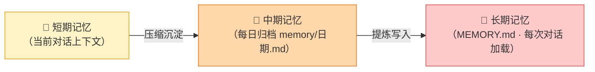

| 层级 | 类比 | 特点 |
|------|------|------|
| 短期 | 管家正在听你说话 | 受 Context Window 限制，对话结束后消失 |
| 中期 | 管家的工作日记 | 按天自动归档压缩，保留重要细节 |
| 长期 | 刻在脑子里的事实 | `MEMORY.md` 文件，每次对话都加载，永不遗忘 |

> **对 Agent 开发者的启发**：记忆不是简单地"把历史塞进 context"。分层设计让 Agent 在 token 预算内兼顾"当下理解力"和"长期认知"——这是构建有状态 Agent 的关键架构模式。

#### ⏰ 自主调度 — "管家会自己定闹钟巡逻"

这是让 OpenClaw 从"被动应答"变成"主动执行"的关键：

- **Cron 定时任务**：像服务器 crontab 一样，指定时间自动执行（如"每天 8:30 推送天气到 Telegram"）
- **Heartbeat 心跳**：Agent 定期自动"醒来"检查待办，频率自适应——忙时 5 分钟一次，闲时几小时一次

| 等级 | 间隔 | 什么时候 |
|------|------|----------|
| 🔴 Active | 5–15 min | 近期高频交互 |
| 🟡 Watching | 30–60 min | 有监控任务 |
| 🟢 Idle | 2–4 h | 日常后台 |
| ⚪ Dormant | 4–8 h | 长时间无任务 |

> **对 Agent 开发者的启发**：大多数 Agent 是"问一句答一句"的被动模式。Heartbeat 机制让 Agent 拥有了"自主时间线"——这是从聊天机器人到真正 Agent 的分水岭。

---

## 为什么它这么火

### 数据说话

OpenClaw（前身 Moltbot）于 **2025 年 11 月**由奥地利开发者 Peter Steinberger 创立，2026 年初爆炸性增长，**2 个月内在 GitHub 斩获 19 万+ Star**，是 GitHub 历史上冲到 10 万 Star 最快的项目之一。

### 与同类工具的对比

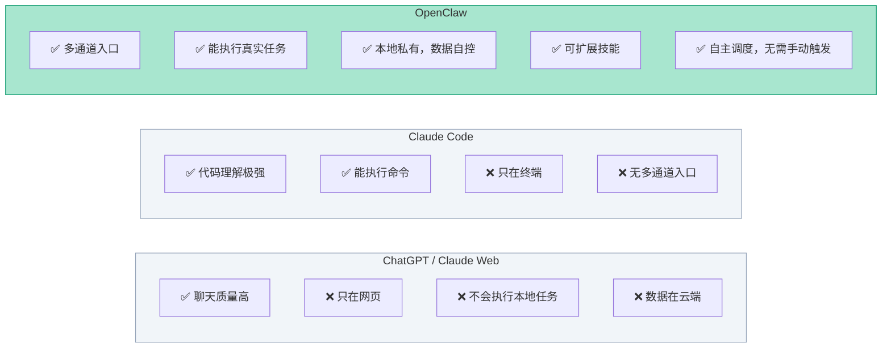

> **读图结论**：OpenClaw 的独特价值不是 AI 本身更聪明，而是**把 AI 的入口、执行能力、数据主权、自主调度整合到一起**——这是其他工具没有做到的组合。

### 为什么开发者特别喜欢它

| 理由 | 一句话 |
|------|--------|
| 🔒 **私有可控** | 数据在自己机器上，不受云平台约束 |
| 🔀 **模型无关** | Claude / GPT / Gemini / DeepSeek / 本地模型，随时切换 |
| 🔧 **真正执行** | 不只生成文本——跑代码、操作文件、调接口 |
| 📱 **随处可达** | 在任何聊天 App 里唤起同一个 AI |
| 🧩 **开放扩展** | MIT 开源，5700+ 社区 Skills |
| ⏰ **自主运行** | Heartbeat + Cron，后台持续工作 |

### 从 OpenClaw 可以学到的 Agent 开发思想

如果你自己在做 Agent 开发，OpenClaw 的设计中有几个值得反复咀嚼的决策：

> [!important] 思想一：把 Agent 当基础设施做，而不是当应用做
> 大多数人做 Agent 是"LLM + Prompt + 工具 = 一个应用"。OpenClaw 反过来——先建好基础设施（网关、队列、鉴权、广播），再把 AI 作为其中一个"可插拔模块"接入。**结果是：AI 模型换了、Agent 逻辑改了，基础设施层纹丝不动。**

> [!important] 思想二：确定性比灵活性更重要
> 入站链固定四步（握手 → 鉴权 → 路由 → 广播），任务队列严格排序。这看起来"不灵活"，但让系统行为**可预测、可追踪、可调试**——在生产环境中，这比花哨的灵活性重要一百倍。

> [!important] 思想三：极简工具 + 通用 Shell = 最大覆盖
> 别给 Agent 塞几十个专用工具。OpenClaw 只给 4 个（read / write / edit / bash），其中 `bash` 是万能钥匙——任何命令行能做的事，Agent 都能做。**工具越少，LLM 的调用决策越准确。**

> [!important] 思想四：Agent 需要"时间线"，不能只有"对话线"
> Heartbeat 机制让 Agent 有了独立于用户消息的时间感知。这是从"对话式 AI"进化到"自主 Agent"的关键一步——Agent 不再只是"被问才答"，而是"自己知道什么时候该做什么"。

> [!quote] 一句话总结
> OpenClaw 是"给开发者的私人 AI 基础设施"——你拥有它，它在你的机器上跑，帮你在所有聊天 App 里随时使用 AI，还能自主执行任务。

---

## 整体架构：从感性到理性

> [!tip] 类比导读
> 如果 OpenClaw 是一家公司：
> - **消息通道**（WhatsApp、Telegram…）= 前台电话 / 邮箱 / 前台窗口——客户通过各种方式找上门
> - **Gateway** = 总经理办公室——接待来客、安排优先级、分配任务，但**自己不干活**
> - **Execution 层** = 项目经理——把任务排队、分配给执行人、出问题就换人重试
> - **Pi Agent** = 全能工程师——真正动手写代码、跑脚本、查资料
> - **Workspace** = 公司的文件柜和知识库——工程师每次上班先翻一遍
>
> 记住这个类比，下面的架构图就不再抽象了。

### 系统全景图

下图是 OpenClaw 的**完整系统拓扑**——建议先整体扫一遍，再结合后续各小节逐层深入。

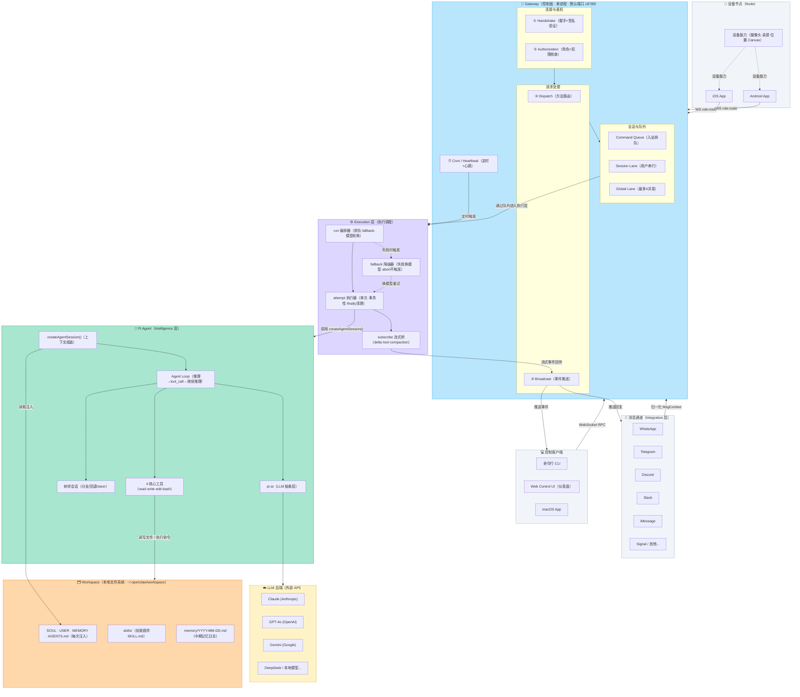

> **读图结论**：
> ① **所有入口（消息通道 / 控制客户端 / 设备节点）都汇聚到 Gateway**，Gateway 是唯一的中心控制面；
> ② **请求在 Gateway 内按固定四步处理**（Handshake → Authorization → Dispatch → Broadcast），经队列进入 Execution 层；
> ③ **Execution 层调度 Pi Agent** 完成实际 AI 推理和工具执行，Pi 通过 `pi-ai` 抽象层对接任意 LLM 后端；
> ④ **执行结果以流式事件经 Broadcast 原路回传**给发起方（聊天 App 或控制客户端）；
> ⑤ **Workspace 本地文件系统**是 Pi 的"记忆与技能仓库"，每次会话都注入，数据始终在本地。

---

### 用户视角的完整工作流

先从用户视角感受一次完整的请求流程：

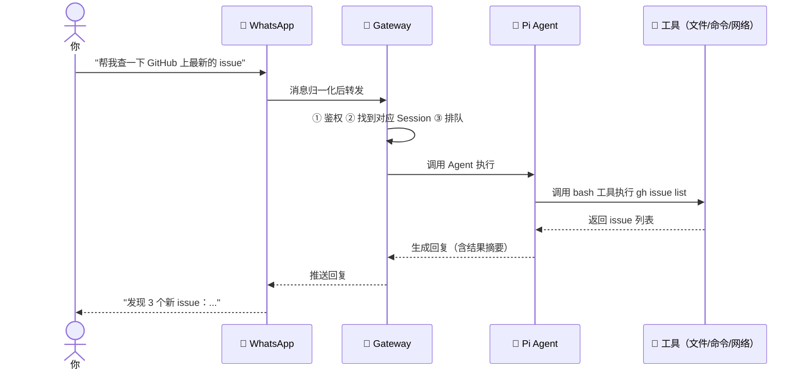

> **读图结论**：① 你的消息从任意聊天 App 进入；② Gateway 做调度和鉴权；③ Pi Agent 负责思考和调用工具；④ 结果原路回传。整个过程对你透明，就像"发条消息、等结果"。

### Hub-and-Spoke 架构图

OpenClaw 采用"轮毂辐条"（Hub-and-Spoke）结构——就像机场的航站楼：**Gateway 是中央枢纽（Hub），所有聊天通道和客户端是连接各地的航线（Spoke）**。所有航班都经停枢纽，航线之间互不直接通航。

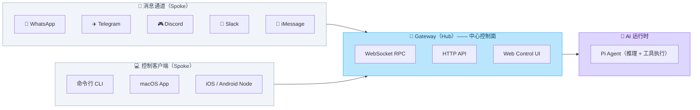

> **读图结论**：① 所有通道和客户端都只和 Gateway 通信，互不直接耦合；② Gateway 内部统一处理连接、鉴权、路由；③ Pi Agent 只负责"在给定上下文中执行一次推理"，不关心来自哪个通道。

### 四层架构：职责分层

更深一层，OpenClaw 内部像一条**流水线**——每层只做自己该做的事，做完就交给下一层：

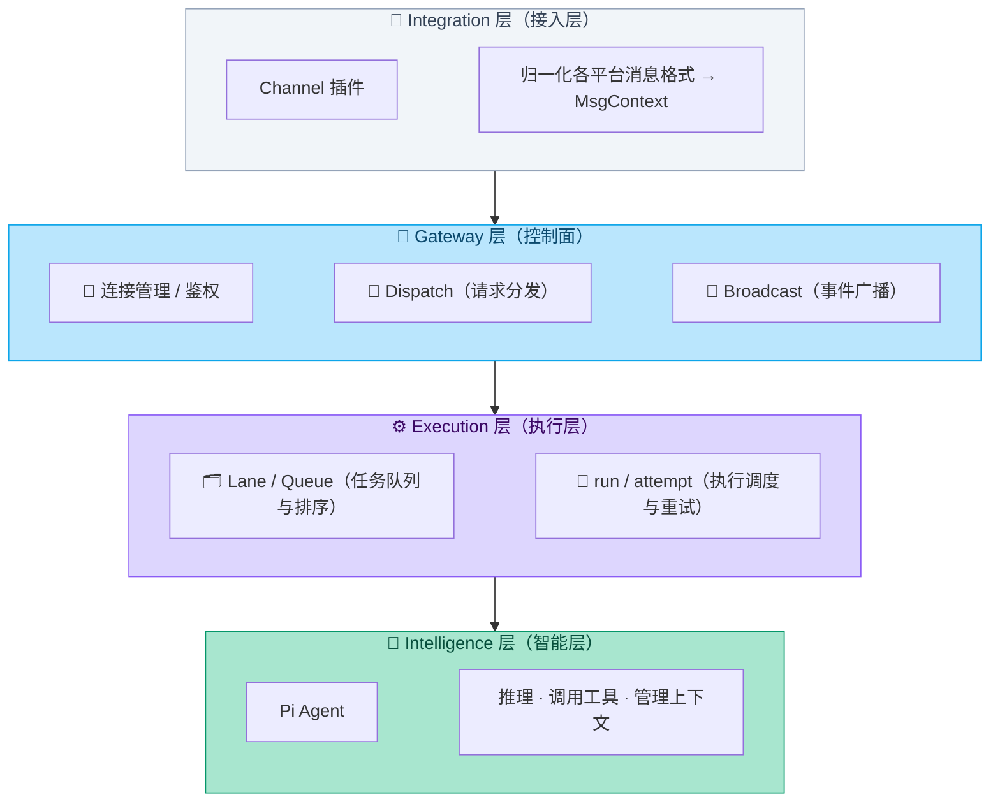

| 层 | 类比 | 做什么 | **不**做什么 |
|----|------|--------|-------------|
| **Integration** | 📞 前台接待 | 把各平台消息翻译成统一格式 | 不关心 AI 怎么回答 |
| **Gateway** | 📋 总经理 | 连接管理、鉴权、路由、广播 | 不做任何 AI 推理 |
| **Execution** | 🗂️ 项目经理 | 排队、串行化、超时重试、模型降级 | 不关心 AI 输出了什么 |
| **Intelligence** | 🧠 工程师 | 推理、调用工具、生成结果 | 不关心消息从哪来 |

> [!tip] 设计哲学一句话
> **Gateway 不"思考"，只"调度"**——把"智能"和"基础设施"分开，是 OpenClaw 整个架构最核心的设计思想。这意味着：换 AI 引擎不影响基础设施，加新通道不影响 AI 逻辑——两侧独立演进。

---

## 五大核心机制深入

> [!tip] 阅读方式
> 每个机制用 **"是什么 → 图 → 为什么这样设计"** 的格式呈现，重点关注设计决策背后的权衡。

### 机制一：确定性入站链 — "流水线上的四道关卡"

就像机场安检：**先查护照 → 再过安检门 → 然后登机口分流 → 最后广播登机信息**——每条消息都必须按固定四步顺序通过，不会乱序、不会跳步：

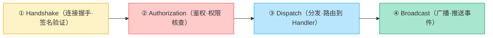

**为什么要固定顺序？** 行为可预测、易排错——你知道"没完成握手就不会进入业务处理"，调试时只需按顺序排查。这就是前面提到的"确定性优先"原则的落地。

### 机制二：两级任务队列 — "银行叫号 + 限流窗口"

想象银行大厅：每位客户有自己的**排队号**（同一客户的业务严格排序），但银行只开了 **4 个柜台**（全局并发上限）。OpenClaw 用两级队列实现同样的效果：

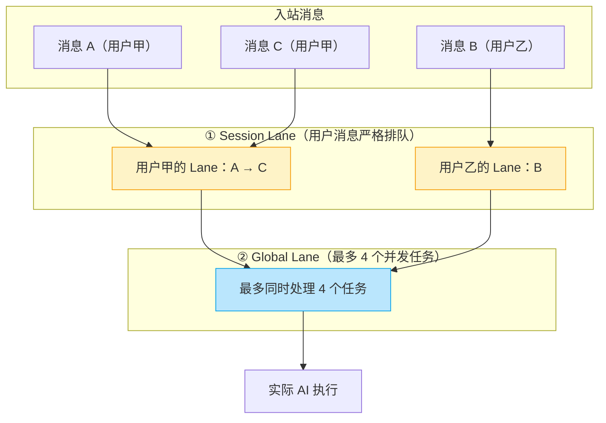

| 队列 | 类比 | 解决的问题 |
|------|------|------------|
| **Session Lane** | 每位客户的排队号 | 同一用户的消息严格按先后执行，不会串话 |
| **Global Lane** | 银行最多开 4 个柜台 | 全局并发上限，防止单机过载（数量可配置） |

> **对 Agent 开发者的启发**：多用户 Agent 系统必须解决"用户间隔离"和"全局限流"两个问题。两级队列是一种经典且高效的方案——第一层保证用户内有序，第二层保证系统不崩。

### 机制三：Agent 执行流水线 — "导演、演员、摄影师、替补"

一个 AI 任务从进入队列到返回结果，内部有四个角色各司其职：

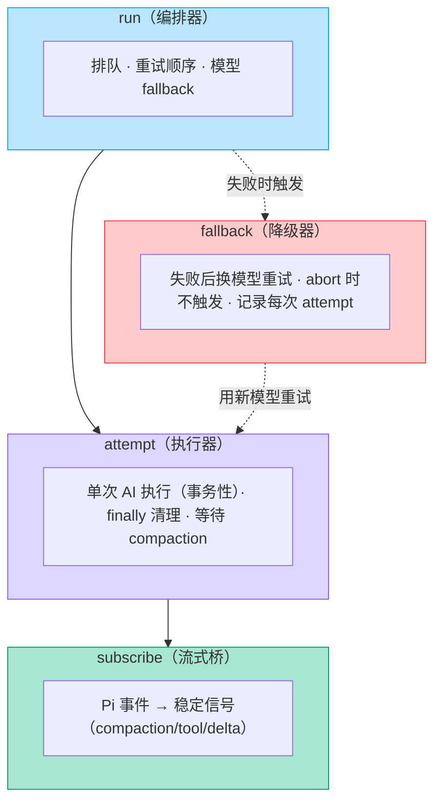

> [!info]- 为什么 subscribe 要先于 prompt 发出？
> 如果先发 prompt 再订阅事件，就可能漏掉 AI 执行过程中的早期事件（类似"先注册监听，再触发"的编程原则）。这是一个很精细的设计细节，体现了对"不丢事件"的重视。

### 机制四：通道归一化 — "同声传译"

不同国家的客人说不同的语言（Telegram 说 MarkdownV2、Discord 说 Embeds、WhatsApp 有自己的方言），Channel 层就是**同声传译**——把所有语言翻译成统一的 **MsgContext**（标准化消息对象）再交给 Agent：

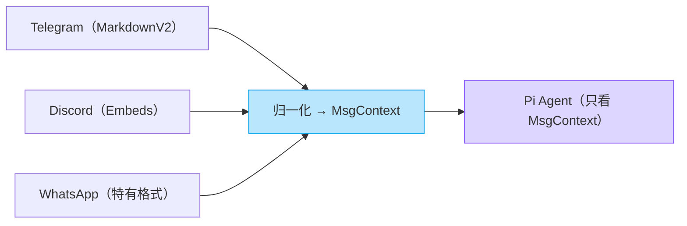

> **读图结论**：Agent 完全不需要知道消息从哪个平台来——这让新增一个平台通道**零行 AI 代码改动**。

> **对 Agent 开发者的启发**：这是经典的"适配器模式"（Adapter Pattern）在 Agent 系统中的应用。如果你的 Agent 需要对接多个输入源（API、CLI、消息平台），用归一化层将它们统一为内部格式，Agent 核心逻辑就可以保持纯粹。

### 机制五：Workspace 工作区体系 — "工程师的个人文件柜"

Agent 的"家"是一个本地目录（默认 `~/.openclaw/workspace`）——就像工程师每天上班打开的工位文件柜，里面有一套精心组织的文件：

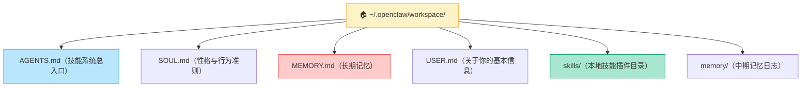

每次对话开始时，Gateway 会把这些文件"注入"到 Agent 的上下文里——就像工程师每天上班先翻一遍文件柜，回忆"我是谁、老板是谁、我会什么技能、之前做过什么"。

> **对 Agent 开发者的启发**：Workspace 本质是**用文件系统做 Agent 的持久化状态管理**。相比数据库方案，文件系统有两个独特优势：① Agent 自己就能用 `read/write/edit` 工具读写，不需要额外的数据库工具；② 用户可以直接用文本编辑器查看和修改——完全透明，没有黑箱。

---

## Pi 是什么：OpenClaw 的 AI 大脑

> [!tip] 一句话
> 如果 Gateway 是"总经理"，那 Pi 就是公司里**唯一的全能工程师**——总经理告诉他"做什么"，他自己决定"怎么做"。

Pi 是 OpenClaw 内嵌的 AI 执行引擎，由奥地利开发者 Mario Zechner 独立开发并开源。三个关键词理解 Pi：

- **极简**：只有 4 个工具（read / write / edit / bash），不堆功能
- **嵌入式**：不是独立子进程，而是作为 SDK 直接嵌入 Gateway 同一进程
- **可控**：Gateway 完全掌控它的生命周期——创建、注入工具、订阅事件、中止清理

### Pi 的包结构

Pi 由四个 npm 包协同构成（像俄罗斯套娃，外层包裹内层）：

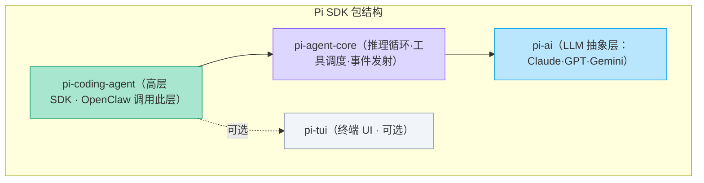

> **读图结论**：OpenClaw 调用最顶层的 `pi-coding-agent` SDK；`pi-agent-core` 负责循环与工具调度；`pi-ai` 是对各大 LLM 的统一抽象，换模型只需换底层实现，上层代码不变。

### 嵌入式 vs 子进程 — "请了个住家保姆，还是叫了个外卖骑手？"

大多数 Agent 框架把 AI 运行时作为**独立子进程**启动（像叫外卖——你只能在门口等结果，控制不了厨房发生什么）。OpenClaw 选择了完全不同的路——**直接嵌入 Pi SDK**（像请了个住家保姆——你随时能指挥、观察、叫停）：

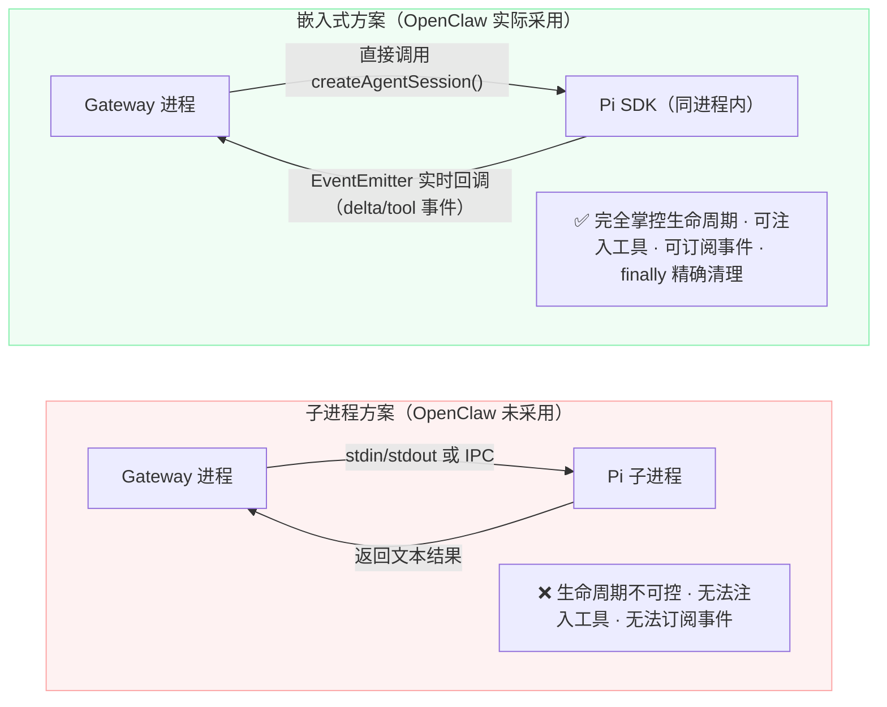

> **读图结论**：嵌入式方案让 Gateway 能以代码级精度控制 Pi——注入工具、订阅事件、在任意时机中止或清理，这是子进程方案无法做到的。

> **对 Agent 开发者的启发**：选择"嵌入 vs 子进程"是 Agent 架构中的关键分叉点。嵌入式获得最大控制力（事件订阅、工具注入、生命周期管理），代价是耦合度更高。子进程获得隔离性，代价是失去细粒度控制。OpenClaw 选嵌入式，因为它需要**实时流式事件**和**精确的 finally 清理**——这两点在子进程方案中极难实现。

### Agent 循环 — "工程师的工作节奏：想 → 做 → 看结果 → 再想"

Pi 的核心是一个**推理 → 工具 → 推理**的循环（也称 ReAct Loop）。就像一个工程师的工作节奏：想清楚做什么 → 动手做 → 看结果 → 根据结果继续想。循环如下：

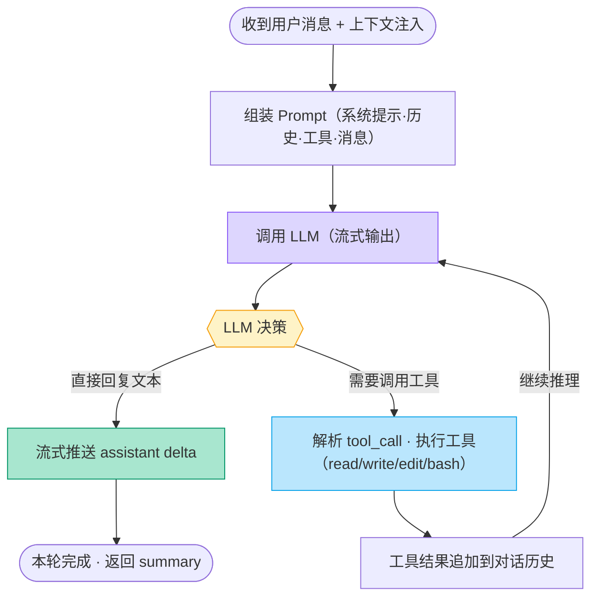

> **读图结论**：① Pi 不是"一问一答"，而是在单次任务中可以**多轮调用工具**，直到任务完成；② 每一步的文本输出都以流式 delta 实时推给 Gateway；③ 工具执行结果会追加回对话历史，让 LLM 看到执行结果后继续推理。

### 四个核心工具：设计深入

> [!info] 工具概览见 [[#🔧 真实任务执行 — "管家不只是陪聊，他真的会去办事"]]，这里聚焦**设计决策**。

| 工具 | 签名 | 设计意图 |
|------|------|----------|
| `read` | `read(path)` | "先理解、再行动"——大文件自动分段，不截断 |
| `write` | `write(path, content)` | 创建或完整覆盖——适合全新文件 |
| `edit` | `edit(path, old, new)` | 精准替换——只改变化部分，省 token 且不误改 |
| `bash` | `bash(command)` | 万能钥匙——任何命令行能做的事 |

> [!question]- 为什么要同时有 `write` 和 `edit`？
> 如果只有 `write`，每次改一行代码都得先 `read` 全文 → 内存中修改 → 完整写回——**消耗大量 token 且容易出错**。`edit` 只处理变化部分，且 `old` 必须精确匹配（含缩进），保证"不会误改别处"。这个设计让 Pi 在修改大文件时既高效又安全。

> [!question]- 为什么只有 4 个工具，不多加几个？
> 这是**刻意的极简设计**。`read/write/edit` 覆盖所有文件操作，`bash` 覆盖一切其他事（网络、进程、系统、外部服务）。工具越少，LLM 在选择工具时决策空间越小，调用准确率越高。如果需要更多能力（邮件、日历、API），通过 **Skills** 用 Prompt 描述即可，不需要增加底层工具。

**四工具协同示例**：你说"帮我分析项目里的 TODO 注释，整理成 report.md"——

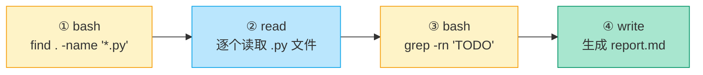

### 上下文组装 — "工程师上班前先翻文件柜"

每次 `createAgentSession()` 调用前，OpenClaw 会将 Workspace 中的关键文件**注入到 Pi 的初始 Prompt**——就像工程师每天上班先翻一遍文件柜，回忆自己是谁、老板是谁、之前做过什么：

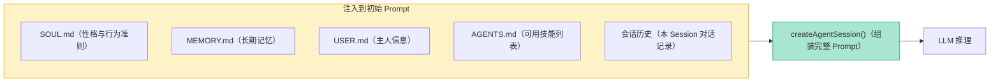

这套"注入"机制是记忆系统的落地点：`MEMORY.md` 每次都加载 → 不失忆；会话历史提供短期上下文 → 知道"聊到哪了"。

> **对 Agent 开发者的启发**：上下文组装的质量直接决定 Agent 表现。OpenClaw 的做法是**把上下文拆成不同"角色"的文件**（SOUL=性格、USER=主人信息、MEMORY=记忆、AGENTS=技能清单），每个文件独立可编辑，比"一个大 system prompt"灵活得多。

### 流式事件 — "施工现场的实时监控摄像头"

Pi 执行过程中不是"闷头干完再报告"，而是通过 **EventEmitter** 持续发射事件——就像施工现场装了摄像头，项目经理（Gateway）能实时看到每一步进展：

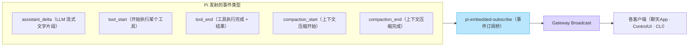

> **读图结论**：① `assistant_delta` 事件让用户在聊天 App 里看到"逐字打字"的流式效果；② `tool_start/end` 事件让 Control UI 能实时显示"Agent 正在执行 bash 命令"；③ `compaction_*` 事件是 OpenClaw 决定"何时返回完成"的关键信号——必须等 compaction 结束才能安全返回，否则记忆写入可能丢失。

### 树状会话 — "像 Git 一样管理对话，试错可以回退"

大多数 AI 的对话历史是一条**直线**（消息 1 → 2 → 3 → …），Pi 不一样——它的会话是一棵**分支树**，就像 Git 的分支模型：

```mermaid
flowchart TB
  ROOT["对话起点（Root）"] --> N1["消息1：帮我写个爬虫"]
  N1 --> N2["消息2：Pi 开始写..."]
  N2 --> N3["消息3：bash 出错"]
  N3 --> N4A["分支 A：requests 库"]
  N3 --> N4B["分支 B：playwright"]
  N4A --> N5A["方案一失败 → 回退"]
  N4B --> N5B["方案二成功 ✅"]

  style ROOT fill:#f1f5f9,stroke:#94a3b8
  style N4A fill:#fecaca,stroke:#ef4444
  style N4B fill:#a8e6cf,stroke:#059669
  style N5B fill:#a8e6cf,stroke:#059669
```

这种设计的三个价值：

| 能力 | 类比 | 效果 |
|------|------|------|
| **试错回退** | Git 的 `git checkout` | 方案失败就"剪掉"分支，从同一节点换个方案重试 |
| **token 隔离** | 每个分支独立计费 | 失败分支的 token 不会带入下一次尝试 |
| **用户引导（steer）** | 在施工过程中改需求 | 用户中途发新消息，Gateway 在当前节点插入，Pi 调整方向 |

> **对 Agent 开发者的启发**：线性对话历史是大多数 Agent 的默认选择，但它有一个致命问题——**失败尝试的 token 会永久占用 context**。树状结构彻底解决了这个问题，是处理 Agent "试错-回退" 场景的最优数据结构。

### 模型 Fallback — "主治医生请假了，自动换副主任"

Pi 支持配置**模型优先级列表**，调用失败时自动按顺序尝试下一个：

```mermaid
flowchart LR
  TRY1["主模型：claude-opus-4"] -->|"成功"| DONE["✅ 返回结果"]
  TRY1 -->|"失败（限速/超时）"| TRY2["备选：claude-sonnet-4"]
  TRY2 -->|"成功"| DONE
  TRY2 -->|"再次失败"| TRY3["兜底：gpt-4o"]
  TRY3 -->|"成功"| DONE
  TRY3 -->|"全部失败"| FAIL["❌ 返回错误"]

  style DONE fill:#a8e6cf,stroke:#059669
  style FAIL fill:#fecaca,stroke:#ef4444
```

> [!info]- Fallback 的关键约束
> 用户**主动中止**（abort）时不触发 fallback——这是一个有意识的设计：用户说"停"就是真的要停，不应该偷偷切换模型继续执行。每次 attempt 的失败原因都会被结构化记录，便于后续观测和调试。

---

## 总结

### OpenClaw 的核心价值主张

```mermaid
flowchart LR
  P1["🏠 私有自托管（数据在你手里）"] --> OC["🦞 OpenClaw · 私人 AI 基础设施"]
  P2["📡 多通道统一（任意 App）"] --> OC
  P3["🔧 真实执行（不只是聊天）"] --> OC
  P4["🧩 开放扩展（5700+ 技能）"] --> OC
  P5["⏰ 自主运行（无需手动触发）"] --> OC
  
  style OC fill:#bae6fd,stroke:#0ea5e9
  style P1 fill:#a8e6cf,stroke:#059669
  style P2 fill:#a8e6cf,stroke:#059669
  style P3 fill:#a8e6cf,stroke:#059669
  style P4 fill:#a8e6cf,stroke:#059669
  style P5 fill:#a8e6cf,stroke:#059669
```

### 三个关键设计思想

| # | 思想 | 一句话 | 对你的启发 |
|---|------|--------|-----------|
| 1 | **Agent 当基础设施做** | 通道接入、会话管理、任务队列、鉴权等"循环之外"的工程问题，交给 Gateway 统管 | 别把所有逻辑塞进一个 Agent——分离基础设施和智能层 |
| 2 | **Hub-and-Spoke 架构** | Gateway 是唯一中心，所有入口只和 Gateway 通信 | 接口层与智能层完全解耦，新增入口不改 AI 逻辑 |
| 3 | **确定性优先** | 入站链固定四步、队列严格排序、run/attempt 边界清晰 | 可预测 > 灵活——生产环境中可调试性是生命线 |

### 适合谁用

| 场景 | 适合？ | 原因 |
|------|--------|------|
| 在手机聊天 App 里随时用 AI 助手 | ✅ | 多通道是核心能力 |
| 让 AI 自动化日常重复任务 | ✅ | Cron + Skills 生态 |
| 自建 AI 自动化工作流 | ✅ | 开放扩展、执行能力强 |
| 数据隐私要求高 | ✅ | 完全本地，MIT 开源 |
| 想学习 Agent 架构设计 | ✅ | 分层清晰、设计讲究，是极好的学习样本 |
| 偶尔问问 AI 写作业 | ⚠️ | 杀鸡用牛刀，成本收益不成比例 |
| 企业多用户多租户 | ❌ | 定位是个人/单操作者 |

### Agent 开发者的一页速查

> [!abstract] 从 OpenClaw 带走的 5 条设计经验
> 
> 1. **分离"调度"与"智能"** — Gateway 不思考，Pi 不调度。分层让两边各自可替换、可演进。
> 2. **极简工具集** — 4 个工具覆盖 90% 场景。工具越少，LLM 决策越准。
> 3. **记忆要分层** — 短期（对话）· 中期（日归档）· 长期（MEMORY.md）。不是所有信息都值得塞进 context。
> 4. **给 Agent 一条时间线** — Heartbeat 让 Agent 有了"自主节奏"，从被动响应进化到主动行动。
> 5. **Skill = Prompt 即插件** — 最轻量的扩展方式：一个 Markdown 文件就是一个能力包。

---

## 参考资料

> [!info] 注
> 以下是本文写作时参考和学习的来源，供进一步深入探索使用。

| 类型 | 链接 | 说明 |
|------|------|------|
| 官方文档 | [docs.openclaw.ai](https://docs.openclaw.ai) | 架构、协议、通道、安全的官方权威说明 |
| GitHub 仓库 | [github.com/openclaw/openclaw](https://github.com/openclaw/openclaw) | 源码，含 `src/`、`extensions/`、`apps/` |
| 技能市场 | [ClawHub](https://clawhub.ai) | 5700+ 社区技能浏览与安装 |
| 入门教程 | [dev.to OpenClaw The AI Agent That Actually Does Stuff](https://dev.to/shresthapandey/openclaw-the-ai-agent-that-actually-does-stuff-part-1-51n4) | 英文入门实战 |
| 记忆系统 | [learnopenclaw.com/core-concepts/memory](https://learnopenclaw.com/core-concepts/memory) | 三层记忆详解 |
| 技能系统 | [docs.openclaw.ai/skills](https://docs.openclaw.ai/skills) | Skills 官方说明 |
| 配套笔记 | [[OpenClaw学习笔记]] | 本笔记的实践操作与上手记录 |
| 关联主题 | [[Agent-开发技术]] | Agent 开发技术全景梳理 |
