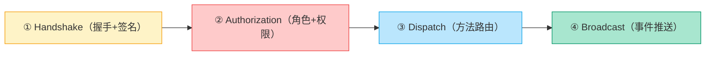
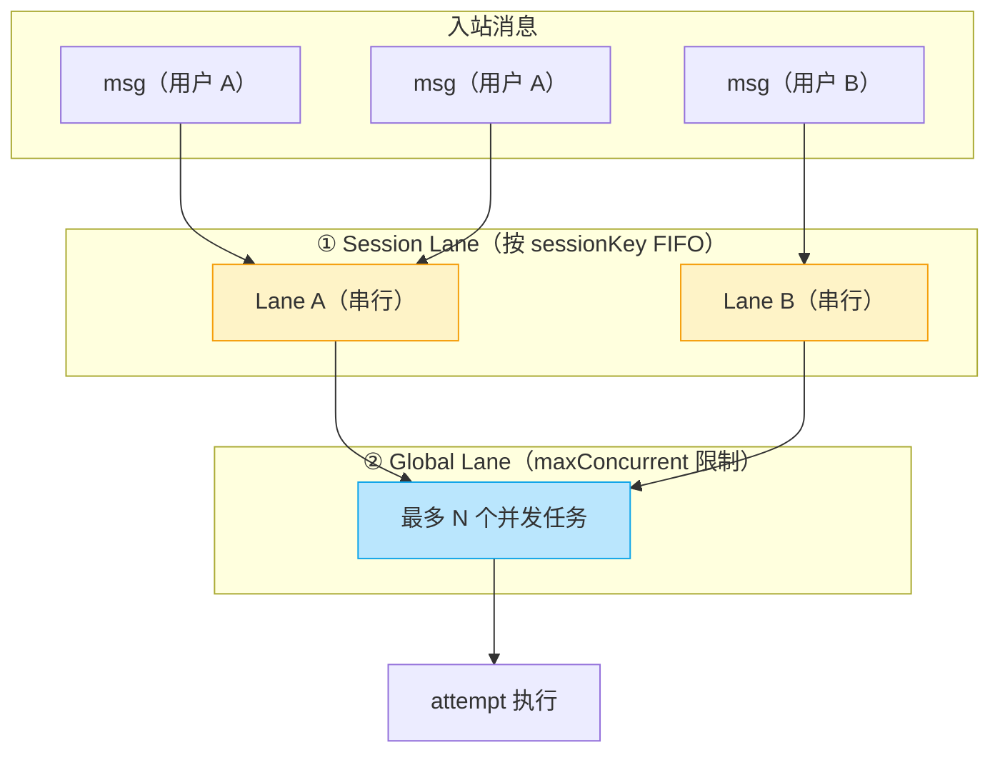
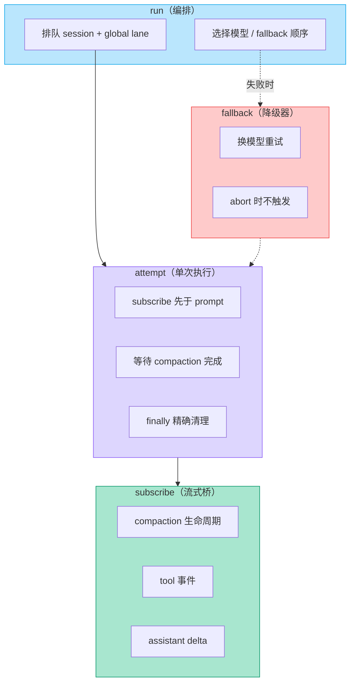
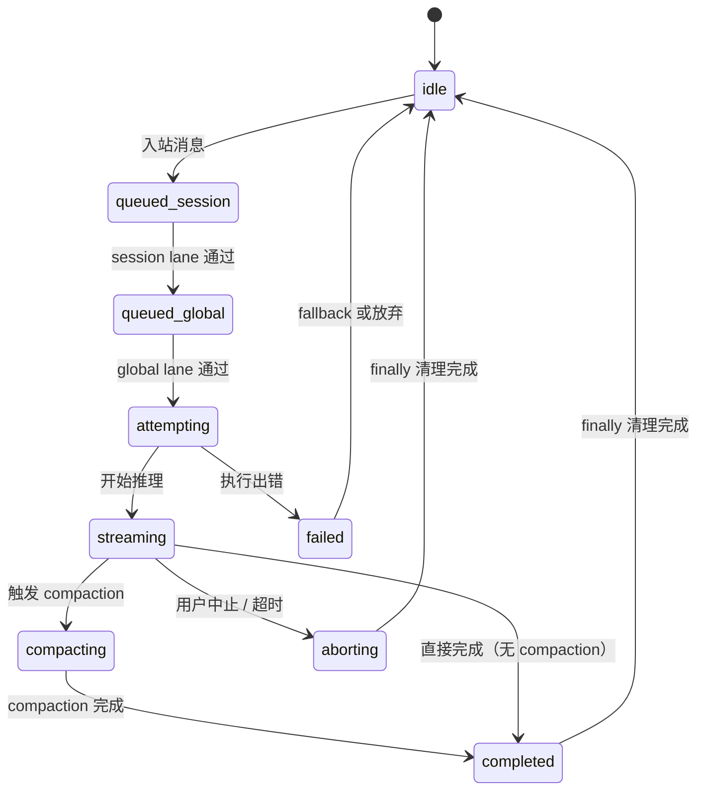
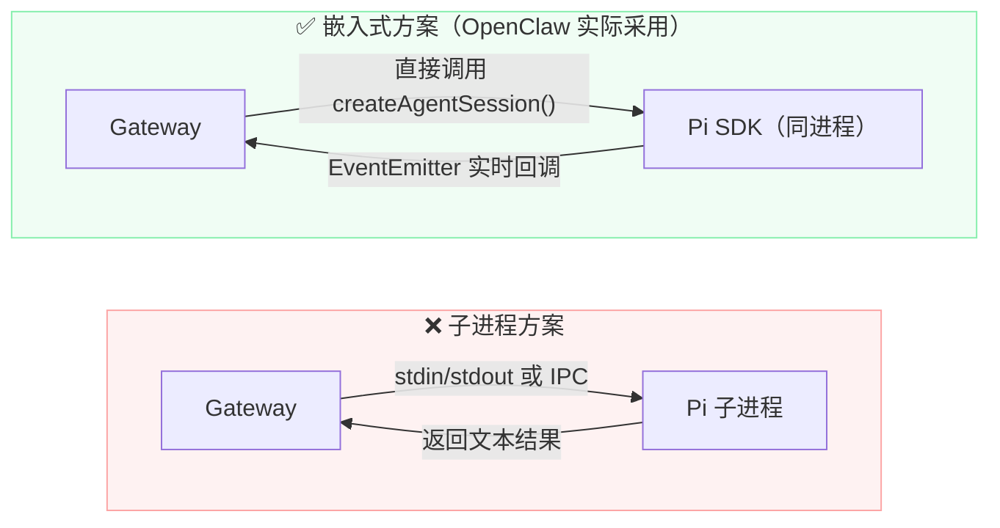

# OpenClaw 源码解析

> [!abstract] 本文定位
> 面向希望深入了解 OpenClaw **具体实现**的开发者，以**源码路径 + 示意代码 + 机制逐层解析**的方式，拆解入站链、两级队列、Agent 执行流水线、Pi SDK 嵌入、通道归一化等核心模块。
>
> 配套阅读：[[OpenClaw从零认知]]（概念与架构入门）
> 官方仓库：[github.com/openclaw/openclaw](https://github.com/openclaw/openclaw)

> [!warning] 关于代码片段
> 本文代码片段为**示意代码**（Illustrative Code），基于仓库公开架构、文档及目录结构推导，用于说明实现模式，并非逐行引用源码。**请以文中标注的源码路径在仓库中查阅原始实现为准。**

---

## 仓库结构导航

理解 OpenClaw 代码库的第一步是建立目录与功能的映射：

```
openclaw/
├── src/
│   ├── index.ts                        # 进程入口
│   ├── cli/
│   │   └── program.ts                  # CLI 命令树（start / agent / config ...）
│   ├── gateway/
│   │   ├── server.impl.ts              # Gateway 核心：WS 服务 + HTTP + Control UI
│   │   ├── server-broadcast.ts         # 事件广播（scope 守卫 + 慢消费保护）
│   │   ├── server-methods.ts           # RPC 方法注册与路由
│   │   ├── server-lanes.ts             # 两级队列：session lane + global lane
│   │   └── server/ws-connection/
│   │       └── message-handler.ts      # 四步确定性入站链
│   ├── process/
│   │   └── command-queue.ts            # 入站消息排队
│   ├── agents/
│   │   ├── pi-embedded-runner/
│   │   │   ├── run.ts                  # 编排层：排队、fallback、模型轮换
│   │   │   ├── run/attempt.ts          # 单次执行（事务性）
│   │   │   └── lanes.ts                # 执行侧队列
│   │   ├── pi-embedded-subscribe.ts    # 流式事件桥：Pi → Gateway
│   │   └── model-fallback.ts           # 结构化降级重试
│   └── config/
│       └── sessions/session-key.ts     # sessionKey 计算
├── extensions/                         # 通道插件（Telegram / Discord / Slack ...）
│   ├── telegram/
│   ├── discord/
│   ├── slack/
│   └── whatsapp/
└── apps/                               # Node 客户端（iOS / macOS / Android）
```

> [!tip] 阅读建议
> 按文中各节顺序，结合上表逐文件打开对照阅读效果最好。每节末尾都有「**源码路径速查**」表汇总对应文件。

---

## 一、启动链：从进程入口到 Gateway 就绪

### 1.1 进程入口

OpenClaw 以单一进程启动，入口在 `src/index.ts`，负责解析命令行参数并启动 Gateway：

```typescript
// src/index.ts（示意）
import { createProgram } from './cli/program'

const program = createProgram()
program.parseAsync(process.argv)
```

`src/cli/program.ts` 定义了完整的 CLI 命令树（`start`、`agent`、`config`、`skills` 等），`start` 命令触发 Gateway 初始化：

```typescript
// src/cli/program.ts（示意）
program
  .command('start')
  .description('Start the OpenClaw gateway')
  .option('--port <port>', 'Gateway port', '18789')
  .action(async (opts) => {
    const config = await loadConfig()   // 加载 openclaw.json（JSON5 + Zod 校验）
    await startGateway({ ...config, port: Number(opts.port) })
  })
```

### 1.2 Gateway 初始化

`src/gateway/server.impl.ts` 是核心控制面，单端口同时提供：

| 服务 | 说明 |
|------|------|
| **WebSocket RPC** | 所有客户端（CLI、通道插件、Node App、Control UI）的双向通信 |
| **HTTP API** | 健康检查、配置查询等 REST 接口 |
| **Control UI 静态资源** | 内嵌 Vite 构建产物，浏览器直接访问 |

```typescript
// src/gateway/server.impl.ts（示意）
export async function startGateway(config: GatewayConfig) {
  const server = createServer()             // HTTP server
  const wss = new WebSocketServer({ server })

  wss.on('connection', (ws) => {
    const ctx = createConnectionContext()   // 每个连接独立上下文
    ws.on('message', (data) => {
      const frame = JSON.parse(data.toString())
      handleFrame(ws, frame, ctx)           // 路由到 message-handler
    })
  })

  server.listen(config.port)
  console.log(`Gateway listening on :${config.port}`)
}
```

**源码路径速查：**

| 职责 | 文件 |
|------|------|
| 进程入口 | [`src/index.ts`](https://github.com/openclaw/openclaw/blob/main/src/index.ts) |
| CLI 命令树 | [`src/cli/program.ts`](https://github.com/openclaw/openclaw/blob/main/src/cli/program.ts) |
| Gateway 服务端 | [`src/gateway/server.impl.ts`](https://github.com/openclaw/openclaw/blob/main/src/gateway/server.impl.ts) |

---

## 二、连接处理：四步确定性入站链

每一个进入 Gateway 的 WebSocket 帧，都在 `message-handler.ts` 中经过固定的四步处理。这是 OpenClaw 架构确定性的基础。



### 2.1 帧结构

Gateway 使用三种 JSON 帧（WebSocket 文本帧）：

```typescript
// 协议帧类型（示意）
type Frame =
  | { type: 'req'; id: string; method: string; params: unknown }   // 客户端请求
  | { type: 'res'; id: string; ok: boolean; result?: unknown; error?: string } // 服务端响应
  | { type: 'event'; event: string; payload: unknown }             // 服务端主动推送
```

### 2.2 message-handler.ts 解析

`message-handler.ts` 是入站链的核心，结构大致如下：

```typescript
// src/gateway/server/ws-connection/message-handler.ts（示意）
export async function handleFrame(
  ws: WebSocket,
  frame: Frame,
  ctx: ConnectionContext
) {
  // ① Handshake：未握手时只允许 connect 帧
  if (!ctx.handshaked) {
    if (frame.type !== 'req' || frame.method !== 'connect') {
      return sendError(ws, frame.id, 'handshake_required')
    }
    return handleConnect(ws, frame, ctx)
  }

  // ② Authorization：验证 role + scopes
  if (!isAuthorized(ctx.role, frame)) {
    return sendError(ws, frame.id, 'forbidden')
  }

  // ③ Dispatch：req 帧路由到对应 handler
  if (frame.type === 'req') {
    return dispatch(ws, frame, ctx)
  }
}
```

### 2.3 Handshake：challenge-response 机制

握手阶段使用 challenge-response 防止未授权连接：

```typescript
// handleConnect（示意）
async function handleConnect(ws: WebSocket, frame: ReqFrame, ctx: ConnectionContext) {
  const { token, role, caps } = frame.params as ConnectParams

  // 本地连接可自动通过；非本地需验证 token
  const isLocal = isLoopback(ws.remoteAddress)
  if (!isLocal && token !== config.gatewayToken) {
    return sendError(ws, frame.id, 'unauthorized')
  }

  ctx.handshaked = true
  ctx.role = role
  ctx.caps = caps

  // 握手成功：推送 hello-ok，再推送 presence + tick 事件
  send(ws, { type: 'res', id: frame.id, ok: true, result: { status: 'hello-ok' } })
  broadcast(ws, { type: 'event', event: 'presence', payload: { ... } })
  broadcast(ws, { type: 'event', event: 'tick', payload: { ... } })
}
```

### 2.4 Authorization：role + scopes

连接携带 `role`（`operator` / `node`），每个 RPC 方法声明所需 scopes，Gateway 在 Dispatch 前核查：

```typescript
// isAuthorized（示意）
function isAuthorized(role: Role, frame: ReqFrame): boolean {
  const method = methodRegistry.get(frame.method)
  if (!method) return false                         // 未知方法拒绝

  const requiredScopes = method.requiredScopes ?? []
  return requiredScopes.every(scope => role.scopes.includes(scope))
}
```

### 2.5 Dispatch：方法路由

`server-methods.ts` 注册所有 RPC 方法，`dispatch` 按 `method` 字段路由：

```typescript
// src/gateway/server-methods.ts（示意）
const methodRegistry = new Map<string, MethodHandler>()

// 注册内置方法
methodRegistry.set('agent', handleAgentRun)
methodRegistry.set('agent.abort', handleAgentAbort)
methodRegistry.set('config.get', handleConfigGet)
methodRegistry.set('sessions.list', handleSessionsList)
// ... 其他方法

// 插件方法优先注册（plugin 可覆盖核心 handler）
function registerPlugin(plugin: GatewayPlugin) {
  for (const [method, handler] of Object.entries(plugin.methods ?? {})) {
    methodRegistry.set(method, handler)
  }
}
```

### 2.6 Broadcast：scope 守卫

执行过程中产生的事件通过 `server-broadcast.ts` 推送给订阅方，并做 scope 过滤防止越权：

```typescript
// src/gateway/server-broadcast.ts（示意）
export function broadcast(event: GatewayEvent, scope: EventScope) {
  for (const [ws, ctx] of connections) {
    if (!hasScope(ctx.role, scope)) continue    // scope 守卫
    if (isSlowConsumer(ws)) continue            // 慢消费保护：跳过消费过慢的连接
    send(ws, { type: 'event', event: event.name, payload: event.payload })
  }
}
```

**源码路径速查：**

| 职责 | 文件 |
|------|------|
| 四步入站链 | [`src/gateway/server/ws-connection/message-handler.ts`](https://github.com/openclaw/openclaw/blob/main/src/gateway/server/ws-connection/message-handler.ts) |
| RPC 方法注册与路由 | [`src/gateway/server-methods.ts`](https://github.com/openclaw/openclaw/blob/main/src/gateway/server-methods.ts) |
| 事件广播 | [`src/gateway/server-broadcast.ts`](https://github.com/openclaw/openclaw/blob/main/src/gateway/server-broadcast.ts) |

---

## 三、会话串行化：两级队列实现

并发问题是多通道 Agent 网关的核心难点。OpenClaw 用**两级队列**解决"同一用户不串话、全局不过载"的问题。



### 3.1 sessionKey 计算

`session-key.ts` 根据「通道 + 会话标识」计算出唯一 `sessionKey`，作为 Session Lane 的分组依据：

```typescript
// src/config/sessions/session-key.ts（示意）
export function computeSessionKey(params: {
  channelId: string
  agentId: string
  conversationId: string
}): string {
  return `${params.channelId}::${params.agentId}::${params.conversationId}`
}
```

同一用户在同一通道的对话始终映射到同一 `sessionKey`，从而保证 Session Lane 串行。

### 3.2 Session Lane：单会话严格串行

```typescript
// src/gateway/server-lanes.ts（示意）
class SessionLaneManager {
  private lanes = new Map<string, PQueue>()

  getOrCreate(sessionKey: string): PQueue {
    if (!this.lanes.has(sessionKey)) {
      // concurrency: 1 → 严格串行，同一会话同一时刻只处理一个任务
      this.lanes.set(sessionKey, new PQueue({ concurrency: 1 }))
    }
    return this.lanes.get(sessionKey)!
  }

  async enqueue(sessionKey: string, task: () => Promise<void>) {
    const lane = this.getOrCreate(sessionKey)

    // 排队超 2 秒打 verbose 日志
    const timer = setTimeout(() => log.verbose(`Lane ${sessionKey} waiting >2s`), 2000)
    return lane.add(async () => {
      clearTimeout(timer)
      return task()
    })
  }

  // 清除某 session 排队中（未开始）的任务
  clear(sessionKey: string) {
    this.lanes.get(sessionKey)?.clear()
  }

  // 重置：清活跃 + 排空（用于 abort / reset 场景）
  reset(sessionKey: string) {
    this.clear(sessionKey)
    // 同时通知 active run 中止
  }
}
```

### 3.3 Global Lane：全局并发上限

```typescript
// src/gateway/server-lanes.ts（示意）
class GlobalLane {
  private semaphore: Semaphore

  constructor(maxConcurrent: number) {
    // 默认 maxConcurrent = 4，可在 agents.defaults.maxConcurrent 配置
    this.semaphore = new Semaphore(maxConcurrent)
  }

  async run<T>(task: () => Promise<T>): Promise<T> {
    await this.semaphore.acquire()
    try {
      return await task()
    } finally {
      this.semaphore.release()
    }
  }
}
```

### 3.4 命令队列：入站排队

`command-queue.ts` 处理入站消息的排队入列，使消息在进入 Session Lane 前先经过一层缓冲：

```typescript
// src/process/command-queue.ts（示意）
export class CommandQueue {
  private queue: Array<Command> = []

  enqueue(cmd: Command) {
    this.queue.push(cmd)
    this.process()
  }

  private async process() {
    while (this.queue.length > 0) {
      const cmd = this.queue.shift()!
      await sessionLanes.enqueue(cmd.sessionKey, () =>
        globalLane.run(() => executeCommand(cmd))
      )
    }
  }
}
```

**源码路径速查：**

| 职责 | 文件 |
|------|------|
| Session Lane + Global Lane | [`src/gateway/server-lanes.ts`](https://github.com/openclaw/openclaw/blob/main/src/gateway/server-lanes.ts) |
| sessionKey 计算 | [`src/config/sessions/session-key.ts`](https://github.com/openclaw/openclaw/blob/main/src/config/sessions/session-key.ts) |
| 命令队列 | [`src/process/command-queue.ts`](https://github.com/openclaw/openclaw/blob/main/src/process/command-queue.ts) |
| 执行侧队列 | [`src/agents/pi-embedded-runner/lanes.ts`](https://github.com/openclaw/openclaw/blob/main/src/agents/pi-embedded-runner/lanes.ts) |

---

## 四、Agent 执行流水线：run → attempt → subscribe → fallback

这是 OpenClaw 最复杂的模块，被拆成四个边界清晰的层次。



### 4.1 run.ts：编排层

`run.ts` 是入口，负责把一个 `agent` RPC 请求串联整个执行链：

```typescript
// src/agents/pi-embedded-runner/run.ts（示意）
export async function run(ctx: RunContext): Promise<RunResult> {
  // 上下文窗口守卫：history 太大则提前拒绝
  if (ctx.session.history.tokenCount > ctx.model.contextWindow * 0.9) {
    return { status: 'context_overflow' }
  }

  // 两级排队
  return sessionLane.enqueue(ctx.sessionKey, () =>
    globalLane.run(async () => {
      // fallback 顺序：依次尝试模型列表中的每个模型
      return withFallback(ctx.models, (model) =>
        attempt(ctx, model)
      )
    })
  )
}
```

### 4.2 attempt.ts：单次执行（事务性）

这是执行层中最关键、也最精细的部分：

```typescript
// src/agents/pi-embedded-runner/run/attempt.ts（示意）
export async function attempt(ctx: RunContext, model: Model): Promise<AttemptResult> {
  const runId = generateRunId()

  // ① 注册 active run（同一 sessionKey 只能有一个）
  activeRuns.register(ctx.sessionKey, runId)

  // ② 先 subscribe，再 prompt——避免丢失早期事件
  const subscription = subscribeToSession(ctx.session)

  try {
    // ③ prepend 钩子（before_agent_start）
    await runPrependHooks(ctx)

    // ④ 发送 prompt（开始 AI 推理）
    await ctx.session.prompt(ctx.message)

    // ⑤ 等待 compaction 完成——确保记忆写入不丢失
    await subscription.waitForCompactionRetry()

    broadcast({ event: 'agent', payload: { runId, status: 'completed' } })
    return { status: 'completed', runId }

  } catch (err) {
    if (isAbortError(err)) {
      broadcast({ event: 'agent', payload: { runId, status: 'aborted' } })
      return { status: 'aborted', runId }
    }
    throw err   // 重新抛出，触发 fallback

  } finally {
    // ⑥ finally 中精确清理——无论成功/失败/abort 都执行
    subscription.unsubscribe()
    activeRuns.unregister(ctx.sessionKey, runId)  // handle 匹配，防止误清
    releaseSession(ctx.sessionKey)
  }
}
```

> [!info]- 为什么 subscribe 要先于 prompt？
> 如果先 prompt 再 subscribe，AI 推理开始后立即产生的早期事件（如第一个 `assistant_delta`）可能在订阅建立前已发出，导致事件丢失。这是一个"先注册监听，再触发"的经典模式，体现了对「不丢事件」的重视。

### 4.3 pi-embedded-subscribe.ts：流式事件桥

这个模块把 Pi SDK 内部的 `EventEmitter` 事件转成 Gateway 可广播的稳定信号：

```typescript
// src/agents/pi-embedded-subscribe.ts（示意）
export function subscribeToSession(session: PiSession): Subscription {
  const emitter = session.events

  // compaction 生命周期：用于 waitForCompactionRetry
  let compactionPending = false
  emitter.on('compaction_start', () => { compactionPending = true })
  emitter.on('compaction_end', () => {
    compactionPending = false
    compactionResolvers.forEach(resolve => resolve())
  })

  // tool 事件：广播给 Control UI 显示"正在执行工具"
  emitter.on('tool_start', (e) => {
    broadcast({ event: 'agent', payload: { type: 'tool_start', tool: e.name } })
  })
  emitter.on('tool_end', (e) => {
    broadcast({ event: 'agent', payload: { type: 'tool_end', result: e.result } })
  })

  // assistant delta：逐字流式推给客户端（聊天气泡的打字效果）
  emitter.on('assistant_delta', (e) => {
    broadcast({ event: 'agent', payload: { type: 'delta', text: e.text } })
  })

  return {
    unsubscribe: () => emitter.removeAllListeners(),
    waitForCompactionRetry: () => new Promise(resolve => {
      if (!compactionPending) return resolve()
      compactionResolvers.push(resolve)
    })
  }
}
```

### 4.4 model-fallback.ts：结构化降级

```typescript
// src/agents/model-fallback.ts（示意）
export async function withFallback<T>(
  models: Model[],
  execute: (model: Model) => Promise<T>
): Promise<T> {
  const attempts: AttemptRecord[] = []

  for (const model of models) {
    try {
      const result = await execute(model)
      return result

    } catch (err) {
      if (isAbortError(err)) throw err    // 用户主动 abort → 不 fallback，直接抛出

      // 记录本次 attempt（便于观测与调试）
      attempts.push({ model: model.id, error: normalizeError(err), timestamp: Date.now() })

      if (models.indexOf(model) === models.length - 1) {
        // 所有模型都失败了
        throw new AllModelsFailedError(attempts)
      }
      // 继续尝试下一个模型
    }
  }

  throw new Error('unreachable')
}
```

### 4.5 执行状态机



**源码路径速查：**

| 职责 | 文件 |
|------|------|
| 编排层 run | [`src/agents/pi-embedded-runner/run.ts`](https://github.com/openclaw/openclaw/blob/main/src/agents/pi-embedded-runner/run.ts) |
| 单次执行 attempt | [`src/agents/pi-embedded-runner/run/attempt.ts`](https://github.com/openclaw/openclaw/blob/main/src/agents/pi-embedded-runner/run/attempt.ts) |
| 流式事件桥 | [`src/agents/pi-embedded-subscribe.ts`](https://github.com/openclaw/openclaw/blob/main/src/agents/pi-embedded-subscribe.ts) |
| 降级重试 | [`src/agents/model-fallback.ts`](https://github.com/openclaw/openclaw/blob/main/src/agents/model-fallback.ts) |

---

## 五、Pi SDK 嵌入：为什么不用子进程

### 5.1 两种方案对比



子进程方案的问题：无法精细控制生命周期、无法注入自定义工具、无法订阅流式事件、崩溃恢复复杂。嵌入式方案完全规避了这些问题。

### 5.2 createAgentSession() 调用

```typescript
// src/agents/pi-embedded-runner/（示意）
import { createAgentSession } from '@mariozechner/pi-coding-agent'

export async function createSession(ctx: RunContext): Promise<PiSession> {
  const systemPrompt = await buildSystemPrompt(ctx.workspace)

  return createAgentSession({
    // 系统提示：注入 Workspace 文件内容
    systemPrompt,

    // 模型配置（支持 Claude / GPT-4o / Gemini / 本地模型）
    model: ctx.model.config,

    // 工具集：Pi 默认工具 + OpenClaw 注入的扩展工具
    tools: [
      ...defaultPiTools,     // read / write / edit / bash
      ...ctx.customTools,    // OpenClaw 注入（如 node.capture、calendar 等）
    ],

    // 会话历史（支持树状分支）
    history: ctx.session.history,

    // 配置
    maxTokens: ctx.model.maxTokens,
    temperature: ctx.model.temperature,
  })
}
```

### 5.3 Pi 的四个 npm 包

```typescript
// Pi SDK 的包依赖关系（示意）
//
// OpenClaw 调用：
import { createAgentSession } from '@mariozechner/pi-coding-agent'  // 高层 SDK
//
// 内部依赖：
// @mariozechner/pi-coding-agent
//   └── @mariozechner/pi-agent-core   // Agent 循环、工具调度、事件发射
//         └── @mariozechner/pi-ai     // LLM 抽象层（Claude / GPT / Gemini）
// @mariozechner/pi-tui                // 终端 UI（CLI 模式下可选）
```

### 5.4 工具注入机制

Pi 的工具系统接受运行时注入，OpenClaw 借此将平台能力（如 Node 设备能力、Skills）暴露给 Agent：

```typescript
// 自定义工具注入（示意）
const customTools = [
  {
    name: 'node.capture',
    description: 'Capture a photo using the connected iOS device',
    parameters: { quality: 'string' },
    execute: async ({ quality }) => {
      // 通过 Gateway 向 Node 发 RPC，触发手机拍照
      return await gatewayRPC('node.invoke', { command: 'capture', quality })
    }
  }
]
```

**源码路径速查：**

| 职责 | 文件 |
|------|------|
| Pi SDK 嵌入 | [`src/agents/pi-embedded-runner/`](https://github.com/openclaw/openclaw/tree/main/src/agents/pi-embedded-runner) |
| 执行层 Lane | [`src/agents/pi-embedded-runner/lanes.ts`](https://github.com/openclaw/openclaw/blob/main/src/agents/pi-embedded-runner/lanes.ts) |

---

## 六、通道层：MsgContext 归一化

### 6.1 核心类型：MsgContext

所有通道的入站消息，最终都被归一化为统一的 `MsgContext` 对象，Agent 只消费这个统一格式：

```typescript
// MsgContext（示意，基于架构推导）
interface MsgContext {
  channelId: string               // 通道标识（'telegram' / 'discord' / ...）
  sessionKey: string              // 会话唯一键
  sender: {
    id: string
    name: string
    isBot: boolean
  }
  text: string                    // 消息正文
  attachments?: Attachment[]      // 图片、文件、语音等
  replyTo?: string                // 引用消息 ID
  editOf?: string                 // 若为编辑消息，原消息 ID
  timestamp: number               // Unix 时间戳（ms）
  raw: unknown                    // 原始平台数据（供调试）
}
```

### 6.2 ChannelPlugin 接口

每个通道插件实现 `ChannelPlugin` 接口，核心职责是归一化与回传：

```typescript
// ChannelPlugin 接口（示意）
interface ChannelPlugin {
  id: string                      // 'telegram' | 'discord' | 'slack' ...

  // 入站：平台消息 → MsgContext
  normalize(raw: unknown): MsgContext | null

  // 出站：Agent 回复 → 平台消息格式
  send(ctx: MsgContext, reply: AgentReply): Promise<void>

  // 启动监听（WebSocket / Webhook / polling）
  start(config: PluginConfig): Promise<void>
  stop(): Promise<void>
}
```

### 6.3 以 Telegram 为例：归一化流程

```typescript
// extensions/telegram/（示意）
import { Update } from 'telegraf/types'

class TelegramPlugin implements ChannelPlugin {
  id = 'telegram'

  normalize(update: Update): MsgContext | null {
    const msg = update.message
    if (!msg?.text) return null   // 忽略非文本消息（或单独处理媒体）

    return {
      channelId: 'telegram',
      sessionKey: computeSessionKey({
        channelId: 'telegram',
        agentId: this.config.agentId,
        conversationId: String(msg.chat.id),
      }),
      sender: {
        id: String(msg.from!.id),
        name: msg.from!.first_name,
        isBot: msg.from!.is_bot,
      },
      text: msg.text,
      replyTo: msg.reply_to_message
        ? String(msg.reply_to_message.message_id)
        : undefined,
      timestamp: msg.date * 1000,
      raw: update,
    }
  }

  async send(ctx: MsgContext, reply: AgentReply) {
    // Telegram 用 MarkdownV2 格式；需转义特殊字符
    const text = escapeMarkdownV2(reply.text)
    await this.bot.telegram.sendMessage(
      ctx.sender.id,
      text,
      { parse_mode: 'MarkdownV2' }
    )
  }
}
```

**源码路径速查：**

| 职责 | 文件 |
|------|------|
| Telegram 插件 | [`extensions/telegram/`](https://github.com/openclaw/openclaw/tree/main/extensions/telegram) |
| Discord 插件 | [`extensions/discord/`](https://github.com/openclaw/openclaw/tree/main/extensions/discord) |
| Slack 插件 | [`extensions/slack/`](https://github.com/openclaw/openclaw/tree/main/extensions/slack) |
| WhatsApp 插件 | [`extensions/whatsapp/`](https://github.com/openclaw/openclaw/tree/main/extensions/whatsapp) |

---

## 七、Workspace 上下文注入

### 7.1 注入机制

每次 `createAgentSession()` 前，OpenClaw 读取 Workspace 文件并组装系统提示：

```typescript
// buildSystemPrompt（示意）
async function buildSystemPrompt(workspace: string): Promise<string> {
  const files = ['SOUL.md', 'USER.md', 'MEMORY.md', 'AGENTS.md']
  const parts: string[] = []

  for (const file of files) {
    const content = await readWorkspaceFile(workspace, file).catch(() => null)
    if (content) parts.push(content)
  }

  return parts.join('\n\n---\n\n')
}
```

| 文件 | 作用 | 典型内容 |
|------|------|---------|
| `SOUL.md` | Agent 性格与行为准则 | "你叫 Clawer，说话简洁直接，遇到不确定的事先问清楚再做…" |
| `USER.md` | 用户基本信息 | 姓名、时区、偏好语言、常用工具等 |
| `MEMORY.md` | 长期记忆（持久化事实） | 重要项目信息、用户偏好、上次讨论的结论等 |
| `AGENTS.md` | 可用技能列表 | Skills 名称及简介，告诉 Agent"你会哪些技能" |

### 7.2 Skills 加载优先级

Agent 处理某类任务时，会按优先级搜索对应的 SKILL.md：

```
1. Workspace Skills：~/.openclaw/workspace/skills/<skill>/SKILL.md   ← 最高优先级
2. 本地 Skills：    ~/.openclaw/skills/<skill>/SKILL.md
3. 内置 Skills：    随 OpenClaw 打包发布的默认技能
```

```typescript
// Skills 加载（示意）
async function loadSkill(name: string, workspace: string): Promise<string | null> {
  const searchPaths = [
    path.join(workspace, 'skills', name, 'SKILL.md'),     // Workspace 优先
    path.join(homedir(), '.openclaw', 'skills', name, 'SKILL.md'),
    path.join(builtinSkillsDir, name, 'SKILL.md'),
  ]

  for (const p of searchPaths) {
    const content = await readFile(p).catch(() => null)
    if (content) return content
  }

  return null
}
```

### 7.3 中期记忆：Compaction 机制

当对话历史接近 Context Window 上限时，Pi 会触发 compaction 把当前对话压缩后写入 `memory/YYYY-MM-DD.md`：

```typescript
// compaction（示意，Pi 内部触发）
async function compact(session: PiSession, memoryDir: string) {
  const summary = await summarizeHistory(session.history)   // LLM 总结对话
  const date = new Date().toISOString().slice(0, 10)
  await appendFile(
    path.join(memoryDir, `${date}.md`),
    `\n\n## ${new Date().toLocaleTimeString()}\n\n${summary}`
  )
  session.history = session.history.slice(-keepLast)        // 只保留最近 N 条
}
```

---

## 八、源码导航速查

| 关键行为 | 你应该看的文件 |
|---------|----------------|
| Gateway 如何启动 | `src/index.ts` → `src/cli/program.ts` → `src/gateway/server.impl.ts` |
| 连接握手如何工作 | `src/gateway/server/ws-connection/message-handler.ts` |
| 方法如何注册和路由 | `src/gateway/server-methods.ts` |
| 事件如何广播 | `src/gateway/server-broadcast.ts` |
| sessionKey 如何计算 | `src/config/sessions/session-key.ts` |
| 两级队列如何实现 | `src/gateway/server-lanes.ts` + `src/process/command-queue.ts` |
| Agent 请求如何编排 | `src/agents/pi-embedded-runner/run.ts` |
| 单次执行如何保证原子性 | `src/agents/pi-embedded-runner/run/attempt.ts` |
| 流式事件如何回传 | `src/agents/pi-embedded-subscribe.ts` |
| 模型降级如何工作 | `src/agents/model-fallback.ts` |
| Pi SDK 如何嵌入 | `src/agents/pi-embedded-runner/`（对照 `@mariozechner/pi-coding-agent`） |
| 通道消息如何归一化 | `extensions/<channel>/`（如 `extensions/telegram/`） |
| Workspace 文件如何注入 | `src/agents/pi-embedded-runner/run.ts`（`buildSystemPrompt` 逻辑） |
| Skills 如何被加载 | Workspace 目录下 `skills/` + 全局 `~/.openclaw/skills/` |

---

## 参考资料

| 类型 | 链接 | 说明 |
|------|------|------|
| 代码仓库 | [github.com/openclaw/openclaw](https://github.com/openclaw/openclaw) | 本文所有源码路径均指向此仓库 main 分支 |
| 官方文档 | [docs.openclaw.ai](https://docs.openclaw.ai) | 协议、Gateway、Agent、通道、节点、安全 |
| 架构深度解析 | [docs.openclaw.ai/concepts/architecture](https://docs.openclaw.ai/concepts/architecture) | 官方四层架构说明 |
| 协议规范 | [docs.openclaw.ai/gateway/protocol](https://docs.openclaw.ai/gateway/protocol) | req/res/event 帧结构、鉴权、幂等 |
| 概念入门 | [[OpenClaw从零认知]] | 配套阅读：不需看源码的架构理解入门 |
