# OpenClaw 自我进化机制深度剖析

> **核心命题：AI Agent 如何做到越用越好用？**

---

## 一、开篇：一个类比

```
人类专家能力 = 智商 × 经验
Agent 能力  = LLM  × 经验

能力决定能做什么，工具决定做到多快。
能力影响的是任务的边界与上限，工具影响的是执行的效率与成本。
```

人类专家之所以越来越强，不是因为智商在涨，而是**经验在以指数方式放大智力的有效作用域**。一个资深工程师看到 bug 时的直觉，本质上是数千次调试经历在大脑中沉淀为模式。

OpenClaw 做了同样的事——它为 LLM 构建了一套**经验沉淀与复用系统**，让 Agent 的每一次对话都成为未来的养分。

### 在 OpenClaw 语境下，"经验"到底是什么？

本文频繁出现"经验"一词。在人类语境中，经验是模糊的、内化的；但在 OpenClaw 中，**经验是具体的、可枚举的、存储在磁盘上的数据**。它由五种可持久化的产物组成：

| 经验类型 | 存储形式 | 举例 | 人类类比 |
|----------|----------|------|----------|
| **记忆** | Markdown 文件 + 向量索引 | "用户偏好 TypeScript"、"服务器 IP 是 10.0.0.1" | 笔记本上的记录 |
| **规则** | `AGENTS.md`、`SOUL.md` 等身份文件 | "回复不超过 1500 字"、"遇到部署问题优先用 Docker" | 内化的行为准则 |
| **技能** | `skills/` 目录下的 SKILL.md + 脚本 + 文档 | "PDF 处理技能"、"K8s 部署工作流" | 掌握的专业方法论 |
| **摘要** | Compaction 生成的结构化总结 | 当前任务状态、未完成 TODO、关键标识符 | 对长期项目的全局认知 |
| **身份认知** | `USER.md`、`IDENTITY.md` | "用户是后端工程师"、"我叫 Pi" | 对自己和对方的了解 |

一句话概括：**经验 = Agent 在交互中积累的、存储在磁盘上的、能被未来会话检索和利用的一切结构化知识**。

LLM 本身不会变——同一个模型，给同样的 prompt，出同样的结果。OpenClaw 让 Agent "变强"的方式，不是改变 LLM，而是不断丰富注入给 LLM 的经验上下文。经验越丰富，LLM 的有效输出就越精准——这就是公式 `Agent 能力 = LLM × 经验` 的工程含义。

---

## 二、全景架构：经验如何流动

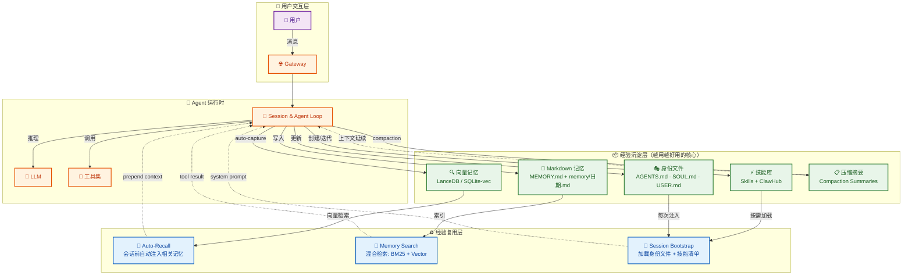

OpenClaw 的"越用越好用"建立在三个层次之上：

| 层次 | 机制 | 类比 |
|------|------|------|
| **经验沉淀** | 记忆写入、技能创建、身份更新 | 人类的学习与笔记 |
| **经验压缩** | Compaction 摘要、上下文修剪 | 人类的遗忘与抽象 |
| **经验复用** | Auto-Recall、Bootstrap、混合搜索 | 人类的直觉与回忆 |

> **钩子速览**：上述机制的自动触发依赖 OpenClaw 的**生命周期钩子**系统——插件可以在关键时间点介入 Agent 流程。后文会频繁出现以下三个钩子，这里先建立印象：
> - `before_agent_start`：会话首条消息前触发 → Auto-Recall 在此注入历史记忆
> - `agent_end`：对话结束后触发 → Auto-Capture 在此捕获用户偏好
> - `before_compaction`：上下文即将压缩前触发 → Memory Flush 在此提醒写入持久记忆
>
> 完整的 24 个钩子将在第六章详细介绍。

---

## 三、经验沉淀：如何把对话变成知识

### 3.1 双层记忆系统

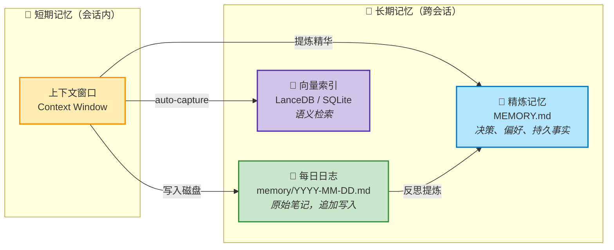

OpenClaw 的核心哲学：

> **"Memory is plain Markdown. The files are the source of truth; the model only 'remembers' what gets written to disk."**
>
> **"Text > Brain 📝"** — 如果你想让它记住，就写到文件里。

这是一个极其务实的设计决策：**记忆 ≠ 上下文**。上下文是 LLM 当前能看到的窗口，记忆是写在磁盘上可以被未来检索的知识。

> **关于向量后端**：图中的 "LanceDB / SQLite-vec" 是两个可选的向量存储实现。LanceDB 是默认推荐方案（独立本地文件，零配置），SQLite-vec 是轻量替代方案（复用 SQLite 生态）。两者通过插件机制互换，上层 API 保持一致。

#### 每日日志（Daily Log）

```
~/.openclaw/workspace/memory/
├── 2026-03-13.md   ← 前天的笔记
├── 2026-03-14.md   ← 昨天的笔记
└── 2026-03-15.md   ← 今天的笔记（会话启动时加载今天+昨天）
```

每日日志是**追加写入**的原始记忆，就像人的日记本，记录对话中的关键信息。

#### 精炼记忆（MEMORY.md）

长期精炼的知识库，存放决策、偏好和持久事实。类比于人类"内化"的经验——不再是原始记录，而是提炼后的智慧。

### 3.2 Auto-Capture：无意识的经验沉淀

这是 OpenClaw "越用越好用"最优雅的机制之一。`memory-lancedb` 插件通过 `agent_end` 生命周期钩子，在每次对话结束后**自动捕获**用户表达中的关键信息：

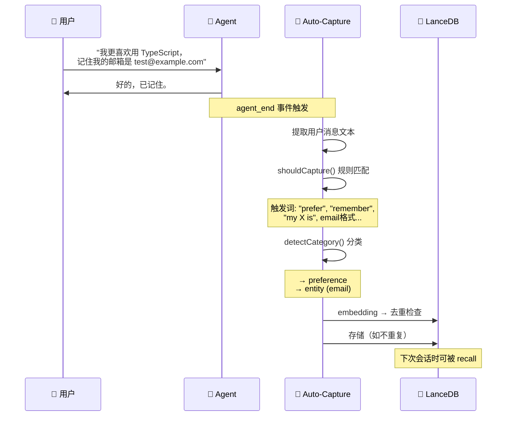

**捕获规则**定义在代码中（`extensions/memory-lancedb/index.ts`）：

| 触发模式 | 示例 | 分类 |
|----------|------|------|
| `prefer/like/love/hate` | "I prefer dark mode" | `preference` |
| `decided/will use` | "We decided to use PostgreSQL" | `decision` |
| 电话号码/邮箱格式 | "+1234567890" | `entity` |
| `my X is` / `remember` | "My name is John" | `fact` |

同时内置了**安全护栏**：
- 过滤 prompt injection 尝试
- 跳过系统生成的内容
- 每次对话最多捕获 3 条
- 高相似度（>0.95）去重

### 3.3 技能的迭代进化

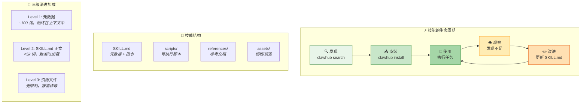

其中 **ClawHub** 是 OpenClaw 的技能市场（类似 npm/pip），提供社区共享的技能包，可通过 `clawhub search` 发现、`clawhub install` 一键安装。

技能系统体现了**渐进式经验积累**：
1. Agent 发现某类任务反复出现
2. 创建/安装技能来固化解决方案（本地创建或从 ClawHub 安装）
3. 在实际使用中发现不足
4. 迭代改进 SKILL.md 和资源文件
5. 下一次遇到同类任务时，更高效地解决

这与人类专家"总结方法论"的过程完全对应。

---

## 四、经验压缩：有限窗口下的智慧保全

LLM 的上下文窗口有限，就像人的工作记忆容量有限。OpenClaw 的 Compaction 系统解决的核心问题是：**如何在有限的窗口中保留最重要的经验？**

### 4.1 Compaction：结构化遗忘

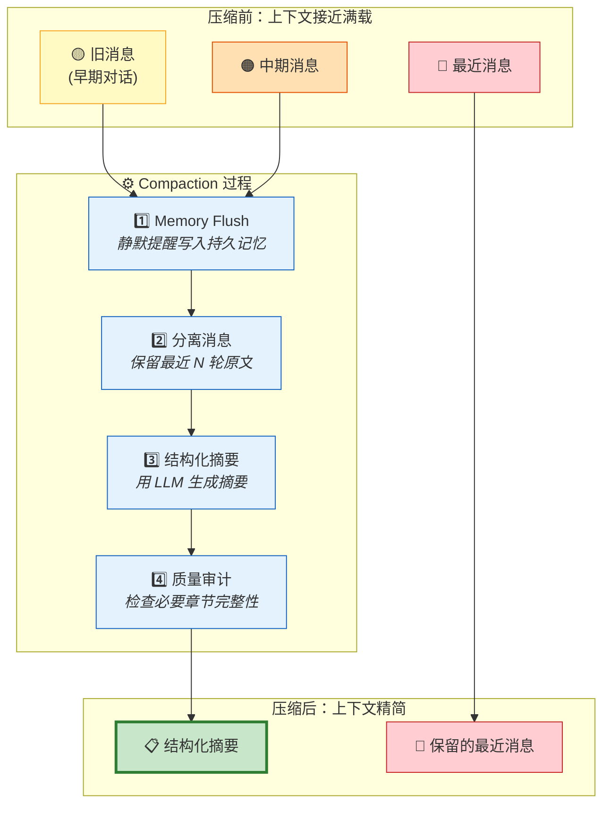

**摘要的必备章节**（代码定义）：

```
## Decisions          ← 已做的决策及理由
## Open TODOs         ← 未完成的任务
## Constraints/Rules  ← 约束和规则
## Pending user asks  ← 用户未被回应的请求
## Exact identifiers  ← 精确标识符（UUID, URL, 路径等）
```

这不是简单的"删旧留新"，而是**结构化遗忘**——像人类一样，忘掉琐碎细节，保留关键决策和规则。

### 4.2 Pre-Compaction Memory Flush

这是一个精妙的设计：在压缩**之前**，系统触发一个"静默轮次"，提醒 Agent 把重要信息写入持久记忆。

```
触发条件: 当前 token 估计 > contextWindow - reserveTokensFloor - softThresholdTokens
行为:     向 Agent 发送静默消息 → Agent 将持久信息写入 memory/日期.md → 回复 NO_REPLY

参数说明:
  contextWindow         模型的最大上下文窗口（如 128k tokens）
  reserveTokensFloor    为工具调用和推理预留的 token 下限（防止压缩后空间不足）
  softThresholdTokens   软阈值缓冲区，提前于硬限制触发（留出压缩操作本身所需空间）
```

类比：就像考试前的"最后 5 分钟提醒"——在上下文被压缩前，确保重要知识已经"存档"。

### 4.3 Context Pruning：精细化修剪

除了 Compaction，还有更精细的上下文修剪：

| 策略 | 操作 | 目的 |
|------|------|------|
| **Soft-trim** | 保留大型工具结果的头部+尾部 | 减少 token 同时保留关键信息 |
| **Hard-clear** | 用占位符替换旧工具结果 | 释放空间给新内容 |
| **Image pruning** | 移除旧图片内容 | 图片消耗大量 token |

保护规则：最近的助手消息和第一条用户消息始终受保护。

---

经验沉淀（第三章）解决了"如何存"，经验压缩（第四章）解决了"放不下怎么办"。但存下来的经验只有在合适时机被检索和注入，才能真正发挥作用——这就是经验复用。

## 五、经验复用：让历史经验成为当下的直觉

### 5.1 Auto-Recall：无感知的经验注入

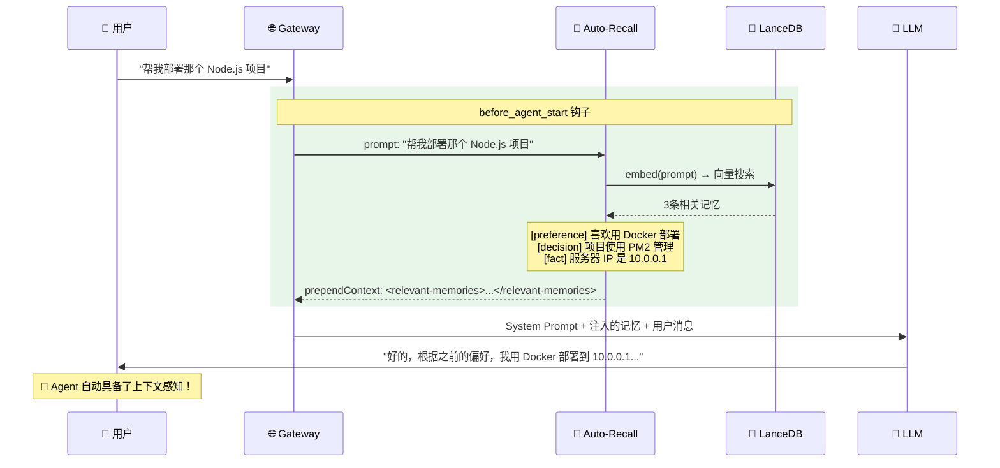

核心代码逻辑：

1. 在 `before_agent_start` 钩子中，将用户 prompt 转为向量
2. 在 LanceDB 中搜索 top-3 相似记忆（相似度阈值 > 0.3）
3. 格式化为 `<relevant-memories>` XML 块注入上下文
4. 安全措施：标记为"不可信历史数据"，防止记忆中的指令被执行

### 5.2 Session Bootstrap：身份的持续性

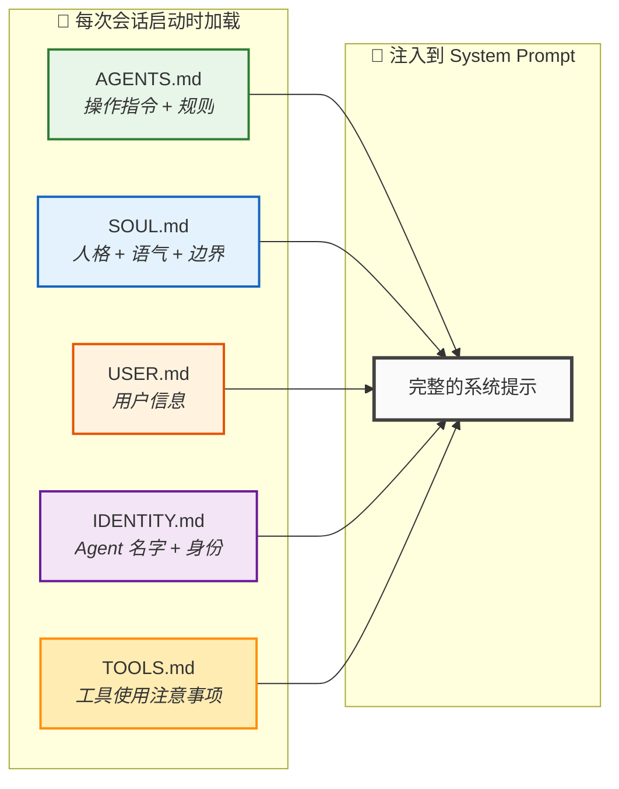

这些文件随着使用不断被更新：
- 用户纠正了 Agent 的行为 → 更新 `AGENTS.md`
- 学到了一个教训 → 写入 `TOOLS.md`
- 了解了用户更多信息 → 更新 `USER.md`

**AGENTS.md 中的关键指令**：

> *"When you make a mistake → document it so future-you doesn't repeat it"*
> *"When you learn a lesson → update AGENTS.md, TOOLS.md, or the relevant skill"*

### 5.3 混合检索：语义 + 关键词

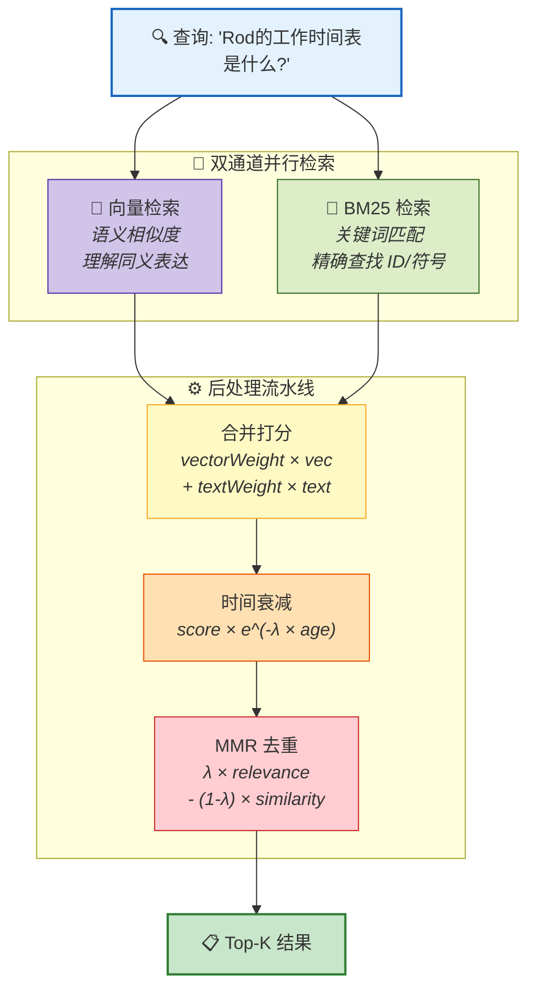

**为什么需要混合？**

| 检索方式 | 擅长 | 不擅长 |
|----------|------|--------|
| 向量 | "这段话的意思相似" | 精确的 ID、代码符号 |
| BM25 | 精确的关键词匹配 | 同义词、换种说法 |
| 混合 | **两者兼顾** | — |

后处理流水线中的 **MMR（Maximal Marginal Relevance）** 用于去重：在保证结果与查询相关的同时，降低结果之间的相似度，避免返回多条内容近乎相同的记忆。

**时间衰减公式**确保新记忆优先：

```
decayedScore = score × e^(-λ × ageInDays)
其中 λ = ln(2) / halfLifeDays

半衰期 30 天时：
  今天的笔记:   100% 原始分数
  7 天前:       ~84%
  30 天前:      50%
  180 天前:     ~1.6%
```

---

## 六、插件生命周期钩子：进化的基础设施

OpenClaw 的 24 个生命周期钩子（定义于 `src/plugins/types.ts`）构成了自我进化的"神经系统"。下图展示了与自我进化最相关的核心钩子及其执行顺序：

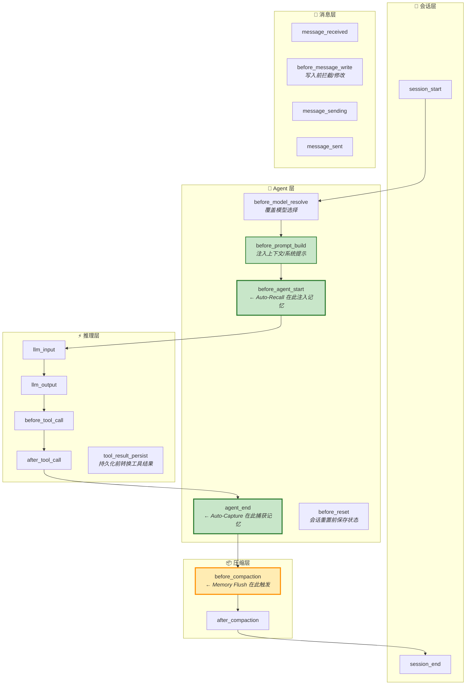

### 6.1 完整钩子参考

| 类别 | 钩子名 | 用途 | 自我进化中的角色 |
|------|--------|------|-----------------|
| **会话** | `session_start` | 会话开始 | 加载身份文件、技能清单 |
| | `session_end` | 会话结束 | — |
| **Agent** | `before_model_resolve` | 覆盖模型/Provider 选择 | — |
| | `before_prompt_build` | 注入上下文和系统提示 | 身份文件注入 |
| | `before_agent_start` | 首条消息前最后注入点 | **Auto-Recall 注入历史记忆** |
| | `agent_end` | 对话完成后分析 | **Auto-Capture 捕获用户偏好** |
| | `before_compaction` | 压缩前（含 token 元数据） | **Memory Flush 静默写入** |
| | `after_compaction` | 压缩后（含摘要元数据） | — |
| | `before_reset` | `/new` 或 `/reset` 清除会话前 | 保存未持久化的状态 |
| **推理** | `llm_input` | 观察发送给 LLM 的 payload | — |
| | `llm_output` | 观察 LLM 返回的 payload | — |
| **工具** | `before_tool_call` | 修改或拦截工具调用 | — |
| | `after_tool_call` | 工具调用完成后 | — |
| | `tool_result_persist` | 持久化前转换工具结果 | — |
| **消息** | `message_received` | 收到消息 | — |
| | `message_sending` | 修改或取消外发消息 | — |
| | `message_sent` | 消息发送完成 | — |
| | `before_message_write` | 消息写入会话日志前拦截 | — |
| **子 Agent** | `subagent_spawning` | 子 Agent 生成前（可拦截） | — |
| | `subagent_delivery_target` | 子 Agent 路由解析 | — |
| | `subagent_spawned` | 子 Agent 生成后 | — |
| | `subagent_ended` | 子 Agent 结束 | — |
| **Gateway** | `gateway_start` | Gateway 启动 | — |
| | `gateway_stop` | Gateway 停止 | — |

> 与自我进化直接相关的钩子已**加粗**标注——仅 3 个钩子（`before_agent_start`、`agent_end`、`before_compaction`）就驱动了记忆注入、自动捕获和压缩前存档三大核心机制。

这套钩子系统是**开放式**的——任何插件都可以在任意节点介入，注入自己的学习和适应逻辑。

---

前面五章介绍了具体机制（沉淀、压缩、复用），第六章介绍了支撑这些机制的钩子基础设施。接下来看看这些设计选择背后的原则——为什么 OpenClaw 要这样做，而不是那样做？

## 七、设计哲学：为什么这套系统有效

### 7.1 四个核心设计原则

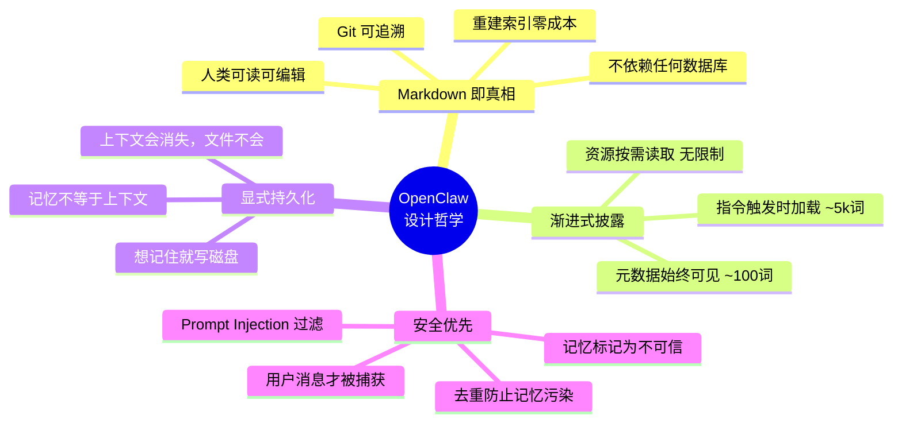

### 7.2 与传统 AI 记忆系统的对比

| 维度 | 传统 Agent 记忆 | OpenClaw |
|------|-----------------|----------|
| 存储介质 | 向量数据库 / JSON | **Markdown 文件**（人类可审查） |
| 可解释性 | 黑盒 embedding | **白盒文本**（可 git diff） |
| 经验来源 | 仅对话记录 | **多源**: 对话 + 技能 + 规则 + 身份 |
| 检索方式 | 纯向量 | **混合**: BM25 + Vector + MMR + 时间衰减 |
| 压缩策略 | 简单截断 | **结构化摘要**（保留决策/TODO/标识符） |
| 进化方式 | 被动累积 | **主动**: Auto-Capture + Memory Flush + 技能迭代 |

### 7.3 Retain / Recall / Reflect：研究中的完整闭环

OpenClaw 的研究文档提出了更完整的进化闭环（尚在实验阶段）：

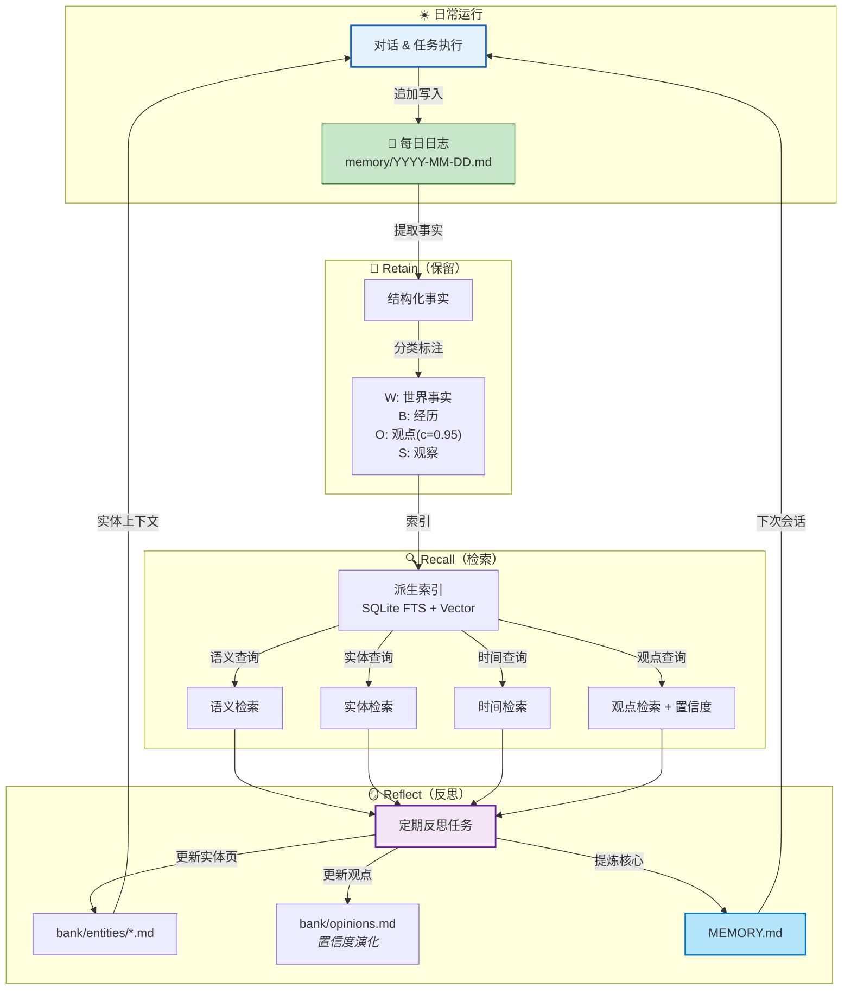

**观点的置信度演化**：
- 每条观点有置信度 `c ∈ [0,1]`
- 新事实到来时，找到相关观点
- 支持性证据 → 小幅增加置信度
- 矛盾性证据 → 需要强矛盾 + 重复证据才大幅降低

这是 Agent 具备**信念修正能力**的基础。

---

理解了设计原则之后，让我们打开文件管理器，看看这些"经验"在磁盘上到底长什么样。

## 八、经验的物理全景：磁盘上长什么样

前面讲了经验的沉淀、压缩、复用机制，但读者可能会问：**这些"经验"到底存在哪里？打开文件夹能看到什么？**

### 8.1 目录结构全景

```
~/.openclaw/workspace/
│
├── AGENTS.md              ← 🎭 操作指令 + 行为规则（Agent 的"工作手册"）
├── SOUL.md                ← 🎭 人格 · 语气 · 边界（Agent 的"性格"）
├── USER.md                ← 🎭 用户信息（Agent 对你的了解）
├── IDENTITY.md            ← 🎭 Agent 名字 + 身份标识
├── TOOLS.md               ← 🎭 工具使用注意事项（踩过的坑）
├── MEMORY.md              ← 📖 精炼记忆（持久决策 · 偏好 · 事实）
│
├── memory/
│   ├── 2026-03-13.md      ← 📅 每日日志（原始对话笔记，追加写入）
│   ├── 2026-03-14.md
│   └── 2026-03-15.md
│
├── skills/
│   ├── my-deploy-skill/
│   │   ├── SKILL.md       ← ⚡ 技能元数据 + 指令
│   │   ├── scripts/       ← ⚡ 可执行脚本
│   │   ├── references/    ← ⚡ 参考文档
│   │   └── assets/        ← ⚡ 模板/资源
│   └── ...
│
└── .lancedb/              ← 🧬 向量数据库（LanceDB 本地文件）
    └── memories.lance     ← 🧬 Auto-Capture 捕获的向量记忆
```

### 8.2 各类经验的存储详解

| 经验类型 | 存储位置 | 格式 | 写入方式 | 读取方式 |
|----------|----------|------|----------|----------|
| **每日日志** | `memory/YYYY-MM-DD.md` | Markdown 纯文本 | Agent 主动追加写入 | 会话启动加载今天+昨天；`memory_search` 检索 |
| **精炼记忆** | `MEMORY.md` | Markdown 纯文本 | Agent 反思提炼后写入 | 会话启动时加载（可选） |
| **向量记忆** | `.lancedb/memories.lance` | 向量 embedding + JSON 元数据 | Auto-Capture 自动捕获（`agent_end` 钩子） | Auto-Recall 向量相似度检索（`before_agent_start` 钩子） |
| **身份文件** | `AGENTS.md` · `SOUL.md` · `USER.md` 等 | Markdown 纯文本 | Agent 学到教训时主动更新 | 每次会话注入 System Prompt |
| **技能** | `skills/<name>/SKILL.md` + 资源目录 | Markdown + 脚本 + 文档 | 创建/迭代/从 ClawHub 安装 | 元数据始终加载 ~100词；详情按需读取 |
| **压缩摘要** | 会话上下文中（非持久化） | 结构化文本（含必备章节） | Compaction 过程自动生成 | 替换旧消息，持续存在于当前上下文 |

### 8.3 向量记忆的内部结构

Auto-Capture 捕获的每条向量记忆，在 LanceDB 中大致包含以下字段：

```
{
  text:       "I prefer using TypeScript",     ← 原始文本
  embedding:  [0.012, -0.034, ...],            ← 向量（用于语义检索）
  category:   "preference",                     ← 分类: preference | decision | entity | fact
  timestamp:  "2026-03-15T10:30:00Z",          ← 捕获时间（用于时间衰减）
  source:     "user"                            ← 来源标记（仅捕获用户消息）
}
```

### 8.4 Markdown 作为主存储的工程优势

第七章 7.2 已从设计维度对比了 OpenClaw 与传统记忆系统。从工程运维角度补充两个独特优势：

- **零成本迁移**：`cp -r ~/.openclaw/workspace/ /new/path/` 一行命令即可完整迁移全部经验，不依赖任何数据库导出工具
- **向量索引可重建**：`.lancedb/` 中的向量记忆是**派生数据**——源头是对话中的用户表达。即使 LanceDB 文件损坏，重新扫描 Markdown 文件即可重建索引。文件才是真相（source of truth）

---

## 九、完整进化闭环

将所有机制串联，OpenClaw 的完整进化闭环如下：

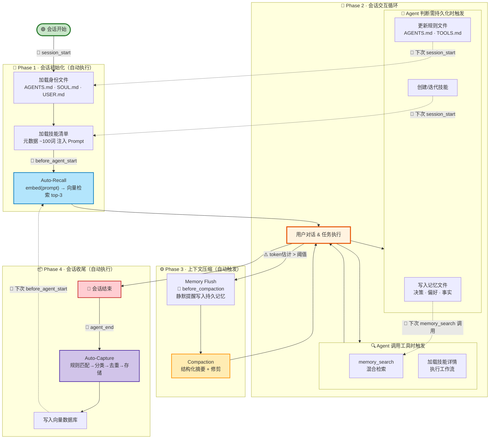

**触发条件速查**：

| 阶段 | 触发条件 | 生命周期钩子 |
|------|----------|-------------|
| 加载身份 + 技能 | 会话启动时，无条件执行 | `session_start` |
| Auto-Recall | 首条用户消息到达前 | `before_agent_start` |
| 按需检索 | Agent 决定调用 `memory_search` 或读取 `SKILL.md` | LLM 推理判断 |
| 主动沉淀 | Agent 判断信息值得持久化（用户指令/自主判断） | LLM 推理判断 |
| Memory Flush | `当前token > contextWindow - reserve - soft阈值` | `before_compaction` |
| Compaction | Memory Flush 完成后立即执行 | 内部流程 |
| Auto-Capture | 会话结束时，对用户消息做规则匹配 | `agent_end` |

---

## 十、总结：Agent 的经验公式

回到开篇的公式：

```
Agent 能力 = LLM × 经验
```

OpenClaw 对"经验"的工程化实现可以进一步展开为：

```
经验 = 记忆沉淀 × 记忆检索 × 记忆压缩 × 规则进化 × 技能积累

其中：
  记忆沉淀 = Auto-Capture + 主动写入 + Memory Flush
  记忆检索 = Auto-Recall + 混合搜索(BM25 + Vector + MMR + 时间衰减)
  记忆压缩 = Compaction(结构化摘要) + Context Pruning(精细修剪)
  规则进化 = AGENTS.md + SOUL.md + TOOLS.md 的持续更新
  技能积累 = Skills 创建 + ClawHub 安装 + 迭代改进
```

OpenClaw 证明了一个深刻的设计哲学：

> **让 AI Agent 变强的最好方式，不是换一个更大的模型，而是让它学会积累和运用经验。**
>
> 就像一个智商普通但经验丰富的老工程师，往往比一个聪明但毫无经验的新手更可靠。
> 
> **经验是智力的放大器。**

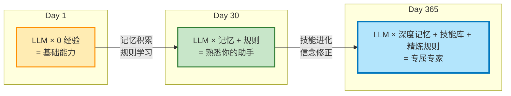

---

*基于 OpenClaw 项目源码（2026.03）及官方文档分析。*
