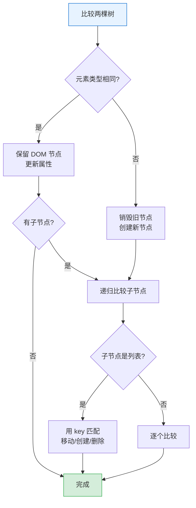
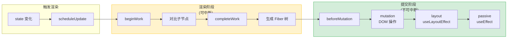
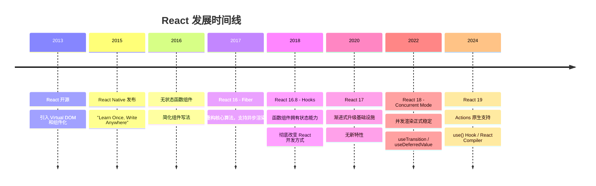

# React 全景概览

> React 用声明式的方式描述 UI，把"怎么更新 DOM"的复杂性藏进了框架内部，让开发者只需关注"UI 应该是什么样子"。

## 阅读指南

```
推荐阅读顺序：
本文 → 02-concurrent-mode-fiber.md → 03-react-hooks-deep-dive.md → 04-react-performance-modern-patterns.md → 05-react-event-system.md
```

## 30 秒心智模型

**React 的 "React" 就是反应。**

UI 是状态的镜像。状态变，UI 就跟着变——React 会自动反应。

```jsx
// 你只需要描述「UI 应该是什么样子」
function Counter() {
  const [count, setCount] = useState(0);
  return <button>{count}</button>;
}

// count 变了 → React 自动更新按钮文字
// 你不用管 DOM 怎么改，React 会反应
```

**核心心智模型：**

```
state（状态）
    │
    └── React 自动反应
            │
            └── UI 更新
```

你不需要告诉 React 「把这个 div 的背景色改成红色」，你只需要说「现在这个组件的状态是活跃」，React 会自动算出该怎么改 DOM。

**为什么不叫别的？** 因为 UI 框架的核心就是「响应变化」——数据动，界面跟着动。

## 目录

- [React 是什么](#react-是什么)
- [设计哲学](#设计哲学)
- [核心概念](#核心概念)
- [渲染管线](#渲染管线)
- [版本演进](#版本演进)
- [React 18/19 新特性](#react-1819-新特性)
- [术语速查](#术语速查)

---

## React 是什么

2013 年，Facebook 开源了一个 JavaScript 库。它的理念在当时相当前卫：把 HTML 写在 JavaScript 里。

这违反了当时"关注点分离"的主流教条。但 React 团队认为：**构建 UI 本来就是把数据映射到视图，这个过程天然应该在一起**。

React 做了一件事：让你用声明式的方式描述 UI，然后它负责高效地更新 DOM。

```jsx
// 你告诉 React"UI 应该是什么样子"
function Welcome({ name }) {
  return <h1>Hello, {name}</h1>;
}

// React 负责把它变成真实 DOM，并在 name 变化时更新
```

### 不是什么

- **不是完整框架**：React 只管视图层，路由、状态管理、数据获取都要自己选
- **不是 MVC**：没有 Model、View、Controller 的划分
- **不是双向绑定**：数据流是单向的，从父组件流向子组件

---

## 设计哲学

### 声明式 vs 命令式

命令式：告诉浏览器每一步怎么做。

```javascript
// 命令式
const button = document.getElementById('submit');
button.disabled = true;
button.textContent = '提交中...';
fetch('/api/submit', { method: 'POST', body: data })
  .then(() => {
    button.disabled = false;
    button.textContent = '提交';
  });
```

声明式：描述 UI 应该是什么样子。

```jsx
function SubmitButton({ data }) {
  const [status, setStatus] = useState('idle');
  
  const handleSubmit = async () => {
    setStatus('loading');
    await fetch('/api/submit', { method: 'POST', body: data });
    setStatus('idle');
  };
  
  return (
    <button 
      onClick={handleSubmit}
      disabled={status === 'loading'}
    >
      {status === 'loading' ? '提交中...' : '提交'}
    </button>
  );
}
```

声明式代码有几个好处：

1. **可预测**：UI 永远是 state 的函数，相同 state 产生相同 UI
2. **易测试**：只需验证给定 state 时的渲染结果
3. **易调试**：问题通常出在 state 变化处，追踪容易

### 组件化

React 把 UI 拆分成独立、可复用的组件。每个组件：

- 拥有自己的状态（state）
- 接收外部数据（props）
- 返回要渲染的 UI（JSX）

```
┌──────────────────────────────────────┐
│              App                      │
│  ┌─────────────┐  ┌───────────────┐  │
│  │   Header    │  │    Sidebar    │  │
│  │ ┌─────────┐ │  │ ┌───────────┐ │  │
│  │ │ Search  │ │  │ │ MenuItem  │ │  │
│  │ └─────────┘ │  │ │ MenuItem  │ │  │
│  └─────────────┘  │ │ MenuItem  │ │  │
│                   │ └───────────┘ │  │
│  ┌─────────────────┴───────────────┘  │
│  │            Content                 │
│  │  ┌─────────┐  ┌─────────┐         │
│  │  │  Card   │  │  Card   │         │
│  │  └─────────┘  └─────────┘         │
│  └───────────────────────────────────┘
└──────────────────────────────────────┘
```

组件树让代码组织更清晰，也便于做性能优化（比如 `React.memo` 粒度控制）。

### 单向数据流

数据从父组件流向子组件，子组件不能直接修改父组件的数据。

```jsx
function Parent() {
  const [count, setCount] = useState(0);
  
  return (
    <>
      <Child count={count} onIncrement={() => setCount(c => c + 1)} />
      {/* 子组件通过回调通知父组件修改 */}
    </>
  );
}

function Child({ count, onIncrement }) {
  return <button onClick={onIncrement}>{count}</button>;
  // 子组件只负责展示和触发回调，不直接修改 count
}
```

单向数据流的好处：

- 数据来源清晰，追踪 bug 更容易
- 避免了双向绑定带来的状态同步问题
- 组件间耦合度低，更易复用

### Learn Once, Write Anywhere

React 的设计不绑定特定平台：

- React DOM：渲染到浏览器
- React Native：渲染到 iOS/Android
- React Three Fiber：渲染 3D 场景
- React PDF：渲染 PDF 文档

核心的组件模型和状态管理是通用的，只是渲染目标不同。

---

## 核心概念

### JSX

JSX 是 JavaScript 的语法扩展，让你能在 JS 里写类似 HTML 的代码。

```jsx
const element = <h1>Hello, world!</h1>;
```

JSX 会被编译成 `React.createElement` 调用：

```javascript
// 编译前
const element = <h1 className="greeting">Hello, world!</h1>;

// 编译后
const element = React.createElement(
  'h1',
  { className: 'greeting' },
  'Hello, world!'
);
```

`React.createElement` 返回一个**React 元素**——一个普通对象：

```javascript
const element = {
  type: 'h1',
  props: {
    className: 'greeting',
    children: 'Hello, world!'
  }
};
```

React 元素是**不可变**的。创建后无法修改其内容或属性，只能创建新的元素来更新 UI。

### 组件

组件是返回 React 元素的函数（或类）。

```jsx
// 函数组件
function Welcome({ name }) {
  return <h1>Hello, {name}</h1>;
}

// 类组件（旧写法，现在很少用）
class Welcome extends React.Component {
  render() {
    return <h1>Hello, {this.props.name}</h1>;
  }
}
```

组件名称必须大写开头。React 用这个区分原生 DOM 元素（`<div>`）和自定义组件（`<Welcome />`）。

### Props

Props 是父组件传给子组件的数据，**只读**。

```jsx
function Avatar({ user, size }) {
  return (
    
  );
}
```

子组件不应该修改 props。如果需要可变数据，用 state。

### State

State 是组件内部的数据，可以在组件生命周期中变化。state 变化会触发组件重新渲染。

```jsx
function Counter() {
  const [count, setCount] = useState(0);
  
  return (
    <button onClick={() => setCount(count + 1)}>
      Clicked {count} times
    </button>
  );
}
```

关键规则：

1. **不要直接修改 state**：`count = count + 1` 不会触发重新渲染
2. **state 更新可能是异步的**：依赖前一个 state 时用函数形式 `setCount(c => c + 1)`
3. **state 更新会合并**：对象类型的 state，更新时会与旧 state 合并（类组件），但函数组件的 useState 不会自动合并

### Virtual DOM

Virtual DOM 是 React 元素组成的 JavaScript 对象树，是真实 DOM 的轻量级表示。

```javascript
// 一个简单的 React 元素
const element = {
  type: 'div',
  props: {
    id: 'container',
    children: [
      { type: 'h1', props: { children: 'Hello' } },
      { type: 'p', props: { children: 'World' } }
    ]
  }
};
```

React 会维护两棵 Virtual DOM 树：

1. **Current Tree**：当前屏幕上显示的树
2. **Work-in-progress Tree**：正在构建的新树

当 state 或 props 变化时，React 会：

1. 创建新的 Work-in-progress Tree
2. 与 Current Tree 对比（Diffing）
3. 计算最小更新操作
4. 提交到真实 DOM

### Reconciliation（协调）

Reconciliation 是 React 对比两棵 Virtual DOM 树，找出差异并计算最小更新的过程。

#### Diff 算法假设

React 做了两个假设来将 O(n³) 的树比较问题简化到 O(n)：

1. **不同类型元素产生不同树**：`<div>` 变成 `<span>`，直接重建
2. **通过 key 标识子元素**：带 key 的元素会保持身份，移动而非重建

#### Diff 规则



**元素类型不同**：

```jsx
// 旧树
<div><Counter /></div>

// 新树
<span><Counter /></span>

// React 会销毁整个 div 及其子树，创建新的 span 和 Counter
// Counter 的 state 会丢失
```

**元素类型相同（DOM 元素）**：

```jsx
// 旧
<div className="before" title="stuff" />

// 新
<div className="after" title="stuff" />

// React 只更新 className，保留 DOM 节点
```

**元素类型相同（组件）**：

```jsx
// 旧
<Profile name="Alice" />

// 新
<Profile name="Bob" />

// React 更新 props，触发组件重新渲染
// 组件实例保留，state 不丢失
```

**列表子元素**：

```jsx
// 没有 key，React 不知道哪个元素是哪个
<ul>
  <li>Duke</li>
  <li>Villanova</li>
</ul>

<ul>
  <li>Connecticut</li>  {/* React 认为这是修改后的 Duke */}
  <li>Duke</li>         {/* React 认为这是修改后的 Villanova */}
  <li>Villanova</li>    {/* React 认为这是新增的 */}
</ul>

// 用 key 标识后，React 知道元素身份
<ul>
  <li key="2015">Duke</li>
  <li key="2016">Villanova</li>
</ul>

<ul>
  <li key="2014">Connecticut</li>  {/* 新增 */}
  <li key="2015">Duke</li>         {/* 移动 */}
  <li key="2016">Villanova</li>    {/* 移动 */}
</ul>
```

---

## 渲染管线

React 的渲染过程分为三个阶段。



### 1. 触发渲染

以下操作会触发渲染：

- `setState` / `useState` 的 setter
- `forceUpdate`（类组件）
- 父组件重新渲染（子组件默认跟着渲染）
- `ReactDOM.createRoot` 的初次渲染

### 2. 渲染阶段（Render Phase）

这个阶段是**纯计算**，不涉及 DOM 操作，可以中断。

React 会：

1. 创建或更新 Fiber 节点
2. 对比新旧元素，标记副作用（Effect）
3. 构建新的 Fiber 树

渲染阶段的工作可以被打断：

- 浏览器需要处理更高优先级任务（如用户输入）
- React 可以"暂停"渲染，稍后继续
- 这是 Concurrent Mode 的基础

### 3. 提交阶段（Commit Phase）

这个阶段**不可中断**，React 会把渲染阶段的计算结果一次性提交到 DOM。

提交阶段分三步：

```
1. beforeMutation
   - 读取 DOM 状态（如 getSnapshotBeforeUpdate）
   
2. mutation
   - 执行 DOM 操作（插入/更新/删除）
   
3. layout
   - 执行 useLayoutEffect
   - 更新 ref
   - 此时 DOM 已更新，但浏览器还没绘制
```

然后是**被动效果**（Passive Effects）：

```
4. passive
   - 执行 useEffect
   - 在绘制后异步执行
```

### Fiber 节点结构

Fiber 是 React 16 引入的新架构。每个 Fiber 节点对应一个组件或 DOM 元素。

```javascript
{
  // 节点类型
  tag: WorkTag,           // 函数组件/类组件/原生DOM等
  type: 'div' | App,      // 元素类型
  
  // 树结构
  return: Fiber | null,   // 父节点
  child: Fiber | null,    // 第一个子节点
  sibling: Fiber | null,  // 下一个兄弟节点
  
  // 状态
  memoizedState: any,     // 组件状态（hooks 链表）
  memoizedProps: any,     // 上次渲染的 props
  
  // 副作用
  flags: Flags,           // 需要执行的操作（更新/删除等）
  subtreeFlags: Flags,    // 子树中的副作用
  
  // DOM 相关
  stateNode: HTMLElement | null,  // 对应的 DOM 节点
}
```

树结构示意：

```
Fiber 树（链表形式）

       App (return: null)
         │
         ├── child ──→ Header (return: App)
         │               │
         │               └── sibling ──→ Content (return: App)
         │                                  │
         │                                  └── child ──→ Card (return: Content)
         │                                                    │
         │                                                    └── sibling ──→ Card
         │
         └── sibling ──→ Footer
```

---

## 版本演进

React 的发展有几个重要节点：



### 关键变化

| 版本 | 重大变化 | 解决的问题 |
|-----|---------|----------|
| 15 及以前 | Stack Reconciler | 同步递归渲染，大应用会卡顿 |
| 16 | Fiber 架构 | 渲染可中断，为并发渲染奠基 |
| 16.8 | Hooks | 函数组件获得完整能力，代码更简洁 |
| 18 | Concurrent Mode | 自动利用并发特性，UI 响应更流畅 |
| 19 | Actions & Compiler | 简化表单处理，编译时优化 |

### 从类组件到 Hooks

Hooks 之前，复用状态逻辑主要靠：

- **高阶组件（HOC）**：函数包裹组件，注入 props
- **Render Props**：通过 props 传递渲染函数

这两种模式都会造成"嵌套地狱"：

```jsx
// Hooks 之前
export default withAuth(
  withTheme(
    withRouter(
      withRedux(UserProfile)
    )
  )
);

// Hooks 之后
export default function UserProfile() {
  const auth = useAuth();
  const theme = useTheme();
  const router = useRouter();
  const dispatch = useDispatch();
  // ...
}
```

Hooks 让状态逻辑可以独立于组件树结构，按功能组织代码。

### 从同步到并发

React 18 之前，渲染是同步的：开始渲染就必须完成，中途不能停下来处理用户输入。

React 18 引入 Concurrent Mode 后：

- 渲染可以分片进行
- 高优先级任务可以打断低优先级任务
- 用户输入总是能得到及时响应

```jsx
// 标记低优先级更新
function SearchResults({ query }) {
  const [isPending, startTransition] = useTransition();
  const [results, setResults] = useState([]);
  
  function handleSearch(query) {
    // 输入是高优先级，立即响应
    startTransition(() => {
      // 搜索结果是低优先级，可被打断
      setResults(fetchResults(query));
    });
  }
}
```

---

## React 18/19 新特性

### React 18

#### 新的 Root API

```jsx
// React 17
import ReactDOM from 'react-dom';
ReactDOM.render(<App />, document.getElementById('root'));

// React 18
import { createRoot } from 'react-dom/client';
const root = createRoot(document.getElementById('root'));
root.render(<App />);
```

`createRoot` 创建的 root 自动启用并发渲染。旧的 `render` 方法仍可用，但不会启用新特性。

#### 自动批处理

React 18 之前，批处理只在 React 事件处理函数中生效：

```javascript
// React 17: 在事件处理函数中，一次渲染
function handleClick() {
  setCount(c => c + 1);
  setFlag(f => !f);
  // 只会重新渲染一次
}

// React 17: 在 setTimeout 中，两次渲染
setTimeout(() => {
  setCount(c => c + 1);
  setFlag(f => !f);
  // 会重新渲染两次
}, 0);
```

React 18 自动批处理所有更新：

```javascript
// React 18: 无论在哪里，都是一次渲染
setTimeout(() => {
  setCount(c => c + 1);
  setFlag(f => !f);
  // 只会重新渲染一次
}, 0);
```

如果需要立即更新，可以用 `flushSync`：

```javascript
import { flushSync } from 'react-dom';

flushSync(() => {
  setCount(c => c + 1);
});
// 此时 DOM 已更新
flushSync(() => {
  setFlag(f => !f);
});
// 两次渲染
```

#### useTransition

标记状态更新为"过渡"（低优先级），不阻塞用户输入。

```jsx
function SearchApp() {
  const [input, setInput] = useState('');
  const [list, setList] = useState([]);
  const [isPending, startTransition] = useTransition();
  
  function handleChange(e) {
    const value = e.target.value;
    setInput(value);  // 高优先级，立即响应输入
    
    startTransition(() => {
      setList(filterLargeList(value));  // 低优先级，可延迟
    });
  }
  
  return (
    <>
      <input value={input} onChange={handleChange} />
      {isPending ? <Spinner /> : <ResultList items={list} />}
    </>
  );
}
```

#### useDeferredValue

延迟更新某个值，类似 debounce 但不需要等待时间。

```jsx
function SearchResults({ query }) {
  // deferredQuery 在 React 有空闲时才会更新
  const deferredQuery = useDeferredValue(query);
  
  const results = useMemo(
    () => filterLargeList(deferredQuery),
    [deferredQuery]
  );
  
  return <ResultList items={results} />;
}
```

`useDeferredValue` vs `useTransition`：

- `useTransition`：你控制何时标记更新为低优先级
- `useDeferredValue`：你告诉 React"这个值延迟更新"，React 决定何时更新

#### 新 Hooks

- `useId`：生成唯一 ID，用于 SSR 一致性
- `useSyncExternalStore`：订阅外部数据源
- `useInsertionEffect`：CSS-in-JS 库注入样式

### React 19

#### Actions

表单提交和异步操作的原生支持。

```jsx
// 之前
function Form() {
  const [error, setError] = useState(null);
  const [isPending, setIsPending] = useState(false);
  
  async function handleSubmit(e) {
    e.preventDefault();
    setIsPending(true);
    try {
      await submitForm(new FormData(e.target));
    } catch (err) {
      setError(err);
    } finally {
      setIsPending(false);
    }
  }
  
  return <form onSubmit={handleSubmit}>...</form>;
}

// React 19: 使用 action
function Form() {
  async function handleSubmit(formData) {
    'use server';  // 或 'use client'
    await submitForm(formData);
  }
  
  return <form action={handleSubmit}>...</form>;
}
```

配合 `useFormStatus` 和 `useFormState`：

```jsx
function SubmitButton() {
  const { pending } = useFormStatus();
  return <button disabled={pending}>Submit</button>;
}

function Form() {
  const [state, formAction] = useFormState(submitAction, initialState);
  return <form action={formAction}>...</form>;
}
```

#### use() Hook

可以在渲染中读取 Promise 或 Context。

```jsx
function Comments({ commentsPromise }) {
  // "suspend" 直到 Promise resolve
  const comments = use(commentsPromise);
  return comments.map(c => <Comment key={c.id} {...c} />);
}

function App() {
  const commentsPromise = fetchComments();
  return (
    <Suspense fallback={<Loading />}>
      <Comments commentsPromise={commentsPromise} />
    </Suspense>
  );
}
```

#### React Compiler

React 19 引入官方编译器，自动优化组件：

- 自动 memoization（无需手动 `useMemo` / `useCallback`）
- 静态分析和优化
- 更少的重新渲染

```jsx
// 编译前：需要手动优化
function TodoList({ todos, onItemClick }) {
  const sortedTodos = useMemo(() => [...todos].sort(), [todos]);
  const handleClick = useCallback((id) => {
    onItemClick(id);
  }, [onItemClick]);
  
  return sortedTodos.map(todo => (
    <TodoItem key={todo.id} todo={todo} onClick={handleClick} />
  ));
}

// 编译后：自动优化
function TodoList({ todos, onItemClick }) {
  const sortedTodos = [...todos].sort();
  
  return sortedTodos.map(todo => (
    <TodoItem 
      key={todo.id} 
      todo={todo} 
      onClick={(id) => onItemClick(id)} 
    />
  ));
}
// React Compiler 自动 memoize sortedTodos 和 onClick
```

#### 其他改进

- `ref` 可以作为 prop 传递，不再需要 `forwardRef`
- `useRef` 简化：`useRef()` 等同于 `useRef(null)`
- 服务端组件（Server Components）稳定
- 文档元数据支持：`<title>`、`<meta>` 可以在组件中渲染

---

## 术语速查

| 术语 | 含义 |
|-----|------|
| **Element** | 描述 UI 的普通对象 `{ type, props }` |
| **Component** | 返回 Element 的函数或类 |
| **JSX** | JavaScript 语法扩展，编译成 `createElement` |
| **Props** | 父组件传给子组件的只读数据 |
| **State** | 组件内部的可变数据 |
| **Virtual DOM** | React 元素组成的 JS 对象树 |
| **Fiber** | React 16+ 的内部数据结构，支持可中断渲染 |
| **Reconciliation** | 对比两棵树，计算最小更新的过程 |
| **Render Phase** | 纯计算阶段，可中断 |
| **Commit Phase** | DOM 操作阶段，不可中断 |
| **Concurrent Mode** | 并发渲染模式，可中断/恢复渲染 |
| **Lane** | 优先级模型，用于调度更新 |
| **Effect** | 副作用，如 DOM 操作、数据获取 |
| **Ref** | 引用 DOM 或保存可变值，不触发渲染 |

---

## 参考

- [React 官方文档](https://react.dev)
- [React Fiber Architecture](https://github.com/acdlite/react-fiber-architecture)
- [React 18 发布说明](https://react.dev/blog/2022/03/29/react-v18.html)
- [React 19 发布说明](https://react.dev/blog/2024/12/05/react-19.html)
- [React 逐步教程](https://react.dev/learn)

---

**下一篇：** [Concurrent Mode 与 Fiber 架构](02-concurrent-mode-fiber.md)
