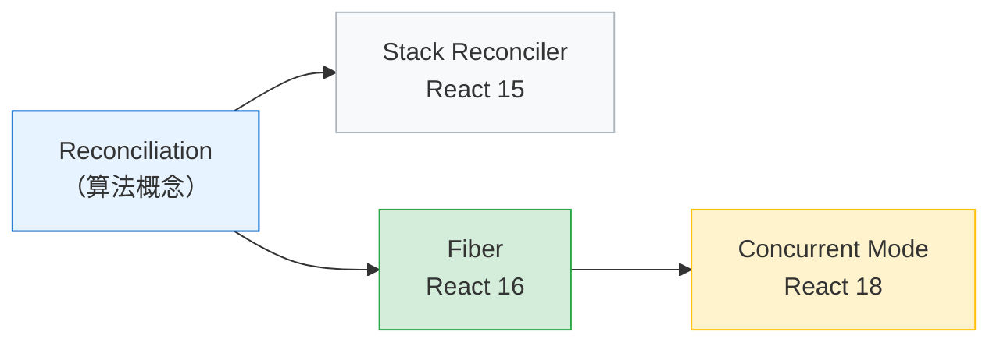
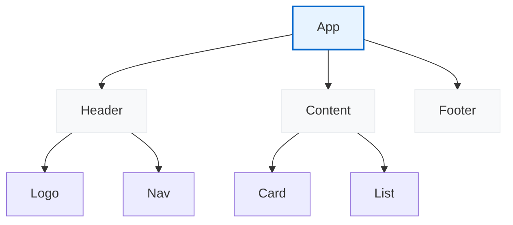
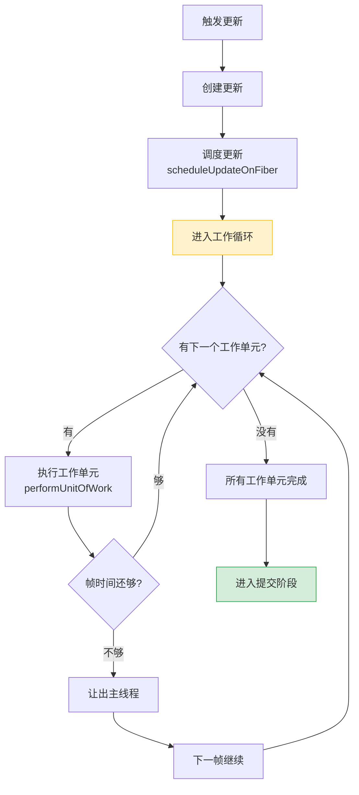
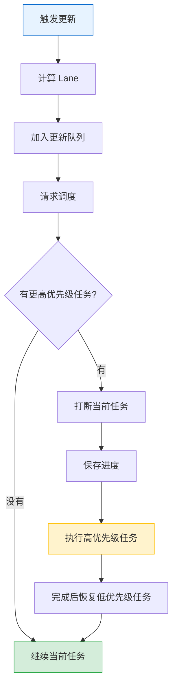
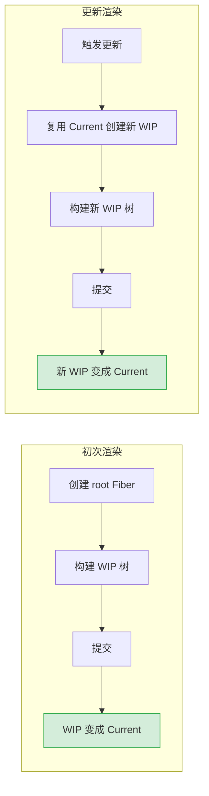

# Concurrent Mode 与 Fiber 架构深度解析

> Fiber 把 React 的渲染工作拆成一个个小单元，让浏览器有机会喘口气——处理用户输入、执行动画、响应点击。这是 React 从"阻塞式"到"响应式"的根本转变。

## 阅读指南

```
前置阅读：01-react-overview.md
推荐阅读顺序：
01-react-overview.md → 本文 → 03-react-hooks-deep-dive.md
```

## 30 秒心智模型

**核心问题：React 渲染时会「冻住」界面。**

React 15 及之前，渲染是同步的——开始就必须完成，中途不能停。如果组件树很大，渲染可能耗时几百毫秒，期间用户点击、输入都没反应。

**Fiber 的解决方案：把渲染拆成小片，每片做完检查一下「要不要暂停」。**

```javascript
// 旧方案：递归，一旦开始就必须完成
function renderRecursive(element) {
  element.children.forEach(child => renderRecursive(child));
}

// Fiber：循环，随时可以暂停
while (workInProgress && !shouldYield()) {
  workInProgress = performUnitOfWork(workInProgress);
}
```

**关键变化：**

1. 递归 → 循环：可以在任何节点暂停
2. 同步 → 可中断：高优先级任务可以插队
3. 一棵树 → 双缓冲：构建新树时不影响当前显示

## 目录

- [概念澄清：Reconciliation、Fiber、Concurrent Mode](#概念澄清reconciliationfiberconcurrent-mode)
- [问题：Stack Reconciler 的局限](#问题stack-reconciler-的局限)
- [Fiber 是什么](#fiber-是什么)
- [Fiber 树结构](#fiber-树结构)
- [工作循环](#工作循环)
- [优先级调度](#优先级调度)
- [双缓冲机制](#双缓冲机制)
- [并发特性](#并发特性)
- [内部实现细节](#内部实现细节)
- [术语速查](#术语速查)

---

## 概念澄清：Reconciliation、Fiber、Concurrent Mode

这三个概念经常被混淆，它们不是同一个东西，但有关联：

```
Reconciliation（协调）
    │
    │  是什么：对比新旧两棵树，计算最小更新的算法
    │  从 React 诞生就存在，是核心概念
    │
    └── 实现方式
            │
            ├── Stack Reconciler（React 15 及以前）
            │   └── 递归遍历，同步执行，不可中断
            │
            └── Fiber（React 16+）
                └── 链表遍历，可中断，支持优先级
                    │
                    └── Concurrent Mode（React 18+ 稳定）
                        └── 启用中断特性，实现并发渲染
```

**三者的关系：**

| 概念 | 层次 | 含义 |
|-----|------|------|
| **Reconciliation** | 算法层 | 「对比两棵树，找出差异」的核心逻辑 |
| **Fiber** | 实现层 | Reconciliation 的一种实现方式（数据结构 + 调度机制） |
| **Concurrent Mode** | 特性层 | 基于 Fiber 启用的并发渲染能力 |

**演进路线：**



**更具体的解释：**

- **Reconciliation 是「做什么」**：对比新旧虚拟 DOM，找出要更新哪些真实 DOM
- **Fiber 是「怎么做」**：用链表结构存储组件树，用工作循环遍历，支持中断恢复
- **Concurrent Mode 是「做到什么程度」**：充分利用 Fiber 的中断能力，实现优先级调度、并发渲染

React 16 引入 Fiber 架构，但默认仍是同步渲染；React 18 才正式启用 Concurrent Mode。

---

## 问题：Stack Reconciler 的局限

React 15 及之前使用 **Stack Reconciler**，它用递归方式遍历组件树。

### 递归渲染的问题

```javascript
// Stack Reconciler 的简化逻辑
function reconcile(parent, children) {
  children.forEach(child => {
    // 同步创建或更新 Fiber
    const instance = createOrUpdate(child);
    // 递归处理子节点
    reconcile(instance, child.children);
  });
}
```

递归调用栈一旦开始，就不能停止。假设组件树很深：

```
App
├── Header
│   ├── Logo
│   ├── Nav
│   │   ├── MenuItem × 100
│   │   └── SearchBox
│   └── UserAvatar
├── Content
│   ├── Article × 50
│   └── Sidebar
│       ├── Widget × 20
│       └── Ad
└── Footer
```

如果触发一次更新，React 必须**一口气**遍历完整个树。用户在这期间点击按钮、输入文字？没反应。等遍历完了，积压的事件才会被处理。

### 帧预算

浏览器每秒需要渲染 60 帧，每帧约 **16.67ms**。

```
一帧的时间分配：
┌────────────────────────────────────────────┐
│ JavaScript 执行 │ 样式计算 │ 布局 │ 绘制 │
├────────────────────────────────────────────┤
│              16.67ms                        │
└────────────────────────────────────────────┘

如果 JS 执行超过 16.67ms → 丢帧 → 卡顿
```

Stack Reconciler 的递归渲染可能耗时几百毫秒，期间浏览器无法响应用户交互，界面看起来"冻住"了。

### 为什么不用 Web Worker？

Web Worker 可以在后台线程执行 JS，但有个硬伤：**Worker 不能操作 DOM**。

React 的渲染最终要更新 DOM，这必须在主线程完成。所以 React 的解决方案不是"换线程"，而是"分片执行"——让出主线程控制权。

---

## Fiber 是什么

Fiber 有两层含义：

1. **架构层面**：React 16 引入的新 Reconciler，支持可中断渲染
2. **数据结构**：每个 Fiber 节点对应一个组件，存储其状态和副作用

### 设计目标

Fiber 的设计要解决几个问题：

| 目标 | 实现方式 |
|-----|---------|
| 可中断渲染 | 把工作拆成小单元，每个单元后检查是否该暂停 |
| 优先级调度 | 不同更新有不同优先级，高优先级可以打断低优先级 |
| 复用中间状态 | 渲染暂停时保存进度，恢复时接着干 |
| 渐进式渲染 | 大任务分多帧完成，不阻塞交互 |

### 核心思想：把递归改成循环

```javascript
// 递归：开始就必须完成
function renderRecursive(element) {
  const dom = createDOM(element);
  element.children.forEach(child => {
    renderRecursive(child); // 递归调用
    dom.appendChild(childDOM);
  });
}

// 循环：可以在任何节点暂停
let nextUnitOfWork = null;
function workLoop(deadline) {
  while (nextUnitOfWork && deadline.timeRemaining() > 0) {
    nextUnitOfWork = performUnitOfWork(nextUnitOfWork);
  }
  if (nextUnitOfWork) {
    requestIdleCallback(workLoop); // 继续下一帧
  }
}
```

Fiber 把组件树转成**链表结构**，可以用循环遍历，随时暂停和恢复。

---

## Fiber 树结构

Fiber 树不是用普通树结构（每个节点存 children 数组），而是用**链表**：

```javascript
// Fiber 节点结构（简化版）
{
  tag: WorkTag,           // 类型标记
  
  // 链表结构：单链表遍历整棵树
  return: Fiber | null,   // 父节点
  child: Fiber | null,    // 第一个子节点
  sibling: Fiber | null,  // 下一个兄弟节点
  
  // 节点信息
  type: any,              // 元素类型：'div'、函数组件、类组件
  key: any,               // 列表 key
  
  // 状态
  memoizedProps: any,     // 上次渲染的 props
  memoizedState: any,     // 状态（hooks 链表或 class state）
  
  // 副作用
  flags: Flags,           // 标记需要执行的操作
  subtreeFlags: Flags,    // 子树中的副作用标记
  
  // DOM 关联
  stateNode: any,         // 对应的 DOM 节点或组件实例
}
```

### 遍历顺序

用"深度优先"遍历 Fiber 树：

```
Fiber 树：

        A (return: null)
        │
        ├── child ──→ B (return: A)
        │              │
        │              └── sibling ──→ C (return: A)
        │                                │
        │                                └── sibling ──→ D (return: A)
        │
        └── (A 的 sibling: null)

遍历顺序（深度优先）：
A → B → C → D

实现逻辑：
1. 从 root 开始
2. 有 child 就往下走
3. 没有 child 就走 sibling
4. sibling 也没有就 return（回父节点）
5. 重复直到回到 root
```



遍历路径：

```
App → Header → Logo → (return) → Header → Nav → (return) → Header 
    → (return) → App → Content → Card → ... → Footer
```

### 为什么用链表

| 数组存储子节点 | 链表存储子节点 |
|--------------|--------------|
| 需要存储完整数组 | 只存第一个子节点 |
| 难以在中间插入/删除 | 插入删除 O(1) |
| 必须一次性遍历完 | 可以暂停在任意节点 |
| 内存占用较大 | 每个节点额外存两个指针 |

链表的代价是：访问第 n 个子节点需要 O(n)，但 React 渲染时必须遍历每个节点，这个代价可以接受。

---

## 工作循环

Fiber 的核心是**工作循环**（Work Loop）：一个不断处理工作单元的循环。

### 核心流程



### 伪代码实现

```javascript
// React 内部简化逻辑

let nextUnitOfWork = null;      // 下一个要处理的工作单元
let workInProgressRoot = null;  // 当前正在渲染的 Fiber 树

// 工作循环
function workLoopConcurrent(deadline) {
  // 是否应该让出主线程
  let shouldYield = false;
  
  while (nextUnitOfWork && !shouldYield) {
    // 执行一个工作单元，返回下一个工作单元
    nextUnitOfWork = performUnitOfWork(nextUnitOfWork);
    
    // 检查帧时间
    shouldYield = deadline.timeRemaining() < 1;
  }
  
  // 所有工作单元完成，进入提交阶段
  if (!nextUnitOfWork && workInProgressRoot) {
    commitRoot();
  }
  
  // 还有工作单元，下一帧继续
  if (nextUnitOfWork) {
    requestIdleCallback(workLoopConcurrent);
  }
}

// 执行单个工作单元
function performUnitOfWork(unitOfWork) {
  const current = unitOfWork.alternate;  // 对应的 current 树节点
  
  // 1. 开始工作：处理当前节点
  let next = beginWork(current, unitOfWork);
  
  // 2. 更新 memoizedProps
  unitOfWork.memoizedProps = unitOfWork.pendingProps;
  
  // 3. 如果没有子节点，完成当前节点
  if (next === null) {
    completeUnitOfWork(unitOfWork);
  } else {
    return next;  // 返回子节点继续处理
  }
  
  // 4. 返回下一个要处理的节点（sibling 或 return）
  return unitOfWork.sibling || unitOfWork.return;
}
```

### beginWork 和 completeWork

**beginWork**：进入节点时调用，处理当前节点。

```javascript
function beginWork(current, workInProgress) {
  // 根据节点类型分发处理
  switch (workInProgress.tag) {
    case FunctionComponent:
      return updateFunctionComponent(current, workInProgress);
    case ClassComponent:
      return updateClassComponent(current, workInProgress);
    case HostComponent:  // 原生 DOM 元素
      return updateHostComponent(current, workInProgress);
    case HostText:       // 文本节点
      return updateHostText(current, workInProgress);
    // ... 其他类型
  }
}

function updateFunctionComponent(current, workInProgress) {
  const nextProps = workInProgress.pendingProps;
  const Component = workInProgress.type;
  
  // 执行函数组件，得到 children
  const children = Component(nextProps);
  
  // 协调子节点
  reconcileChildren(current, workInProgress, children);
  
  // 返回第一个子节点
  return workInProgress.child;
}
```

**completeWork**：离开节点时调用（没有子节点或子节点处理完毕）。

```javascript
function completeWork(current, workInProgress) {
  switch (workInProgress.tag) {
    case HostComponent: {
      // 创建或更新 DOM 节点
      if (current === null) {
        // 挂载：创建 DOM
        const instance = createInstance(workInProgress);
        workInProgress.stateNode = instance;
      } else {
        // 更新：更新属性
        updateInstance(current, workInProgress);
      }
      break;
    }
    case HostText: {
      // 创建或更新文本节点
      const newText = workInProgress.pendingProps;
      if (current === null) {
        workInProgress.stateNode = createTextInstance(newText);
      }
      break;
    }
  }
  
  // 收集副作用
  bubbleEffects(workInProgress);
}
```

### 完整遍历示例

```
组件树：
App
├── Header
│   └── Logo
└── Content
    └── Card

遍历过程：
1. beginWork(App)     → 返回 Header
2. beginWork(Header)  → 返回 Logo
3. beginWork(Logo)    → 返回 null（无子节点）
4. completeWork(Logo) → 处理 Logo，返回 Header
5. completeWork(Header) → 处理 Header，返回 App
6. beginWork(Content) → 返回 Card
7. beginWork(Card)    → 返回 null
8. completeWork(Card) → 返回 Content
9. completeWork(Content) → 返回 App
10. completeWork(App) → 返回 null，遍历结束
```

---

## 优先级调度

Fiber 架构引入了**优先级调度**，让高优先级更新打断低优先级更新。

### Lane 模型

React 用 **Lane（车道）** 表示优先级。Lane 是一个 31 位二进制数，每一位代表一种优先级。

```javascript
// 优先级定义（React 18）
const SyncLane = 0b0000000000000000000000000000001;  // 同步优先级
const InputContinuousLane = 0b0000000000000000000000000000100;  // 连续输入
const DefaultLane = 0b0000000000000000000000000010000;  // 默认优先级
const TransitionLane = 0b0000000000000000000000010000000;  // 过渡更新
const IdleLane = 0b1000000000000000000000000000000;  // 空闲优先级
```

Lane 的优势：

- 用位运算快速判断优先级关系
- 可以同时处理多个优先级（按位或）
- 支持批量更新（同一优先级合并）

### 优先级分类

| Lane 类型 | 用途 | 示例 |
|----------|------|-----|
| SyncLane | 同步更新，必须立即执行 | 用户输入、state 更新 |
| InputContinuousLane | 连续输入 | 拖拽、滚动 |
| DefaultLane | 默认优先级 | 普通更新 |
| TransitionLane | 过渡更新 | useTransition 包裹的更新 |
| IdleLane | 空闲时执行 | 预加载、分析 |

### 调度过程



### 饥饿问题

低优先级更新可能一直被高优先级更新打断，永远没有机会执行。这叫**饥饿问题**。

React 的解决方案：**过期时间**。

每个更新都有一个过期时间，超过这个时间就必须执行，不管优先级多低。

```javascript
// 简化逻辑
function markStarvedLanesAsExpired(root, currentTime) {
  const lanes = root.pendingLanes;
  
  // 检查每个 Lane 是否过期
  for (let i = 0; i < 31; i++) {
    const lane = 1 << i;
    const expirationTime = root.expirationTimes[lane];
    
    if (expirationTime !== NoTimestamp && expirationTime <= currentTime) {
      // 已过期，标记为过期 Lane
      root.expiredLanes |= lane;
    }
  }
}

// 过期更新会被当作同步优先级处理
function getNextLanes(root) {
  if (root.expiredLanes !== NoLanes) {
    // 有过期更新，立即执行
    return root.expiredLanes;
  }
  // 否则按正常优先级调度
  // ...
}
```

---

## 双缓冲机制

Fiber 使用**双缓冲**（Double Buffering）：同时维护两棵 Fiber 树。

### Current 树和 Work-in-Progress 树

```
Current Tree                    Work-in-Progress Tree
（当前显示）                       （正在构建）
┌─────────┐                    ┌─────────┐
│   App   │                    │   App   │
└────┬────┘                    └────┬────┘
     │                              │
   ┌─┴─┐                          ┌─┴─┐
   │   │                          │   │
┌──┴┐ ┌┴──┐                    ┌──┴┐ ┌┴──┐
│ A │ │ B │                    │ A'│ │ B'│
└───┘ └───┘                    └───┘ └───┘

alternate  ←──────────────────→  alternate
```

- **Current Tree**：当前屏幕上显示的 Fiber 树
- **Work-in-Progress Tree**：正在构建的新 Fiber 树

每个 Fiber 节点都有一个 `alternate` 指针，指向另一棵树中对应的节点。

### 工作流程



1. **创建 WIP 节点**：复用 Current 树的节点或创建新节点
2. **构建 WIP 树**：执行组件、协调子节点
3. **提交**：WIP 树一次性替换 Current 树
4. **切换指针**：`current = workInProgress`

### 为什么需要双缓冲

| 单树方案 | 双缓冲方案 |
|---------|-----------|
| 更新时直接修改 | 构建新树，一次性切换 |
| 中间状态可见 | 用户只看到最终状态 |
| 出错难以恢复 | 可以丢弃 WIP 树重试 |
| 不能中断恢复 | 可以保存 WIP 进度 |

双缓冲保证了：用户永远不会看到"半成品"UI。

---

## 并发特性

React 18 提供了几个并发相关的 Hook。

### useTransition

标记更新为"过渡"（低优先级），不阻塞用户输入。

```jsx
function SearchApp() {
  const [input, setInput] = useState('');
  const [list, setList] = useState([]);
  const [isPending, startTransition] = useTransition();
  
  function handleChange(e) {
    const value = e.target.value;
    
    // 高优先级：立即更新输入框
    setInput(value);
    
    // 低优先级：可以延迟的搜索结果
    startTransition(() => {
      setList(filterLargeList(value));
    });
  }
  
  return (
    <>
      <input value={input} onChange={handleChange} />
      {isPending && <Spinner />}
      <ResultList items={list} />
    </>
  );
}
```

#### isPending 的语义

`isPending` 告诉你：**当前有低优先级更新正在处理**。

```jsx
function Example() {
  const [isPending, startTransition] = useTransition();
  
  // isPending = true 的情况：
  // 1. startTransition 内的更新已经调度
  // 2. 但还没有完成提交
  // 3. 期间可能有更高优先级更新插队
}
```

注意：`isPending` 只在**transition 内部**的更新完成前为 true。如果有多个并发 transition，每个都有自己的 `isPending`。

#### startTransition vs setTimeout

| setTimeout | startTransition |
|-----------|----------------|
| 延迟执行 | 立即调度，但优先级低 |
| 固定延迟时间 | 看主线程空闲情况 |
| 代码写在回调里 | 代码写在函数里 |
| 无法取消 | 可以被更高优先级打断 |

```jsx
// setTimeout：总是延迟 100ms
setTimeout(() => {
  setList(filterLargeList(value));
}, 100);

// startTransition：根据主线程情况决定何时执行
startTransition(() => {
  setList(filterLargeList(value));
});
```

### useDeferredValue

创建一个"延迟版本"的值。

```jsx
function SearchResults({ query }) {
  // deferredQuery 会"滞后"于 query
  const deferredQuery = useDeferredValue(query);
  
  const results = useMemo(
    () => filterLargeList(deferredQuery),
    [deferredQuery]
  );
  
  return (
    <>
      <input value={query} onChange={...} />
      <ResultList items={results} />
    </>
  );
}
```

#### 内部机制

`useDeferredValue` 内部用到了 `useTransition`：

```javascript
// React 内部简化逻辑
function useDeferredValue(value) {
  const [deferredValue, setDeferredValue] = useState(value);
  const [isPending, startTransition] = useTransition();
  
  useEffect(() => {
    startTransition(() => {
      setDeferredValue(value);
    });
  }, [value]);
  
  return deferredValue;
}
```

当 `value` 变化时，`deferredValue` 不会立即更新，而是等待低优先级调度。

#### useDeferredValue vs useTransition

| useTransition | useDeferredValue |
|--------------|-----------------|
| 你控制何时标记低优先级 | React 自动延迟值的更新 |
| 更新逻辑在回调里 | 值的延迟是自动的 |
| 适合：用户触发的复杂更新 | 适合：props/state 变化触发的更新 |

```jsx
// 场景：用户输入触发搜索
// 用 useTransition
function handleSearch(query) {
  setInput(query);  // 高优先级
  startTransition(() => {
    setSearchQuery(query);  // 低优先级
  });
}

// 用 useDeferredValue
function SearchResults({ query }) {
  const deferredQuery = useDeferredValue(query);
  // query 变化时，deferredQuery 自动延迟更新
}
```

### 并发渲染的权衡

并发特性不是银弹，有代价：

1. **复杂度增加**：理解优先级、调度需要额外心智负担
2. **一致性风险**：低优先级更新可能基于过时数据
3. **过度优化**：小应用可能感知不到差异

什么时候该用？

- 大列表渲染、复杂计算
- 输入响应要求高的场景（搜索、筛选）
- 动画期间的数据加载

什么时候不该用？

- 简单的 UI 更新
- 逻辑依赖严格的执行顺序
- 不确定是否有性能问题时

---

## 内部实现细节

### 更新的生命周期

一个更新从触发到完成，经历以下阶段：

```
触发更新 → 计算优先级 → 创建更新对象 → 加入更新队列 
→ 调度更新 → 进入 Render Phase → 处理 Fiber 节点 
→ 标记副作用 → 进入 Commit Phase → 执行 DOM 操作 
→ 执行 Effects → 完成
```

### 更新对象

每个更新被封装成一个更新对象：

```javascript
const update = {
  lane: Lane,           // 优先级
  action: any,          // 更新内容（新值或函数）
  hasEagerState: boolean, // 是否已急切计算
  eagerState: any,      // 急切计算的状态
  next: Update | null,  // 链表指针
};
```

更新按优先级分组，形成环形链表：

```
FiberNode.memoizedState
       │
       ┌───┴───┐
       │       │
    Update1 ──→ Update2 ──→ Update3 ──→ Update1 (环)
    (高优先级)  (高优先级)  (低优先级)
```

### 电梯调度

React 的调度算法类似电梯调度：处理一批同优先级更新，再处理下一批。

```javascript
function ensureRootIsScheduled(root) {
  // 获取最高优先级的 Lane
  const nextLanes = getNextLanes(root);
  
  // 如果已有同优先级任务在执行，复用
  if (existingCallbackPriority === nextLanes) {
    return;
  }
  
  // 否则取消旧任务，调度新任务
  if (existingCallbackNode !== null) {
    cancelCallback(existingCallbackNode);
  }
  
  // 调度新任务
  const newCallbackNode = scheduleCallback(
    priorityLevel,
    performConcurrentWorkOnRoot.bind(null, root)
  );
}
```

### Effect List

在 Render Phase，React 会收集所有需要执行的副作用（DOM 操作），形成一个链表。

```
Effect List（单向链表）：

firstEffect → FiberA → FiberC → FiberD → null
               │         │        │
            副作用:    副作用:   副作用:
           Placement  Update   Deletion
```

Commit Phase 只需遍历这个链表执行操作，不用再遍历整棵树。

---

## 术语速查

| 术语 | 含义 |
|-----|------|
| **Fiber** | React 16+ 的内部数据结构，支持可中断渲染 |
| **Work Loop** | 不断处理工作单元的循环，可暂停恢复 |
| **Lane** | 优先级模型，31 位二进制数 |
| **Current Tree** | 当前屏幕显示的 Fiber 树 |
| **Work-in-Progress Tree** | 正在构建的新 Fiber 树 |
| **Double Buffering** | 双缓冲，切换指针完成 UI 更新 |
| **Reconciliation** | 协调阶段，计算 UI 差异 |
| **Commit** | 提交阶段，执行 DOM 操作 |
| **beginWork** | 进入 Fiber 节点时执行的工作 |
| **completeWork** | 离开 Fiber 节点时执行的工作 |
| **Effect** | 副作用，如 DOM 操作 |
| **Expiration** | 过期时间，解决饥饿问题 |
| **Transition** | 过渡更新，低优先级可中断 |
| **Deferred Value** | 延迟更新的值 |

---

## 参考

- [React Fiber Architecture](https://github.com/acdlite/react-fiber-architecture)
- [React Source Code](https://github.com/facebook/react/tree/main/packages/react-reconciler)
- [Lane 模型解析](https://github.com/facebook/react/pull/18796)
- [React 18 工作原理](https://react.dev/blog/2022/03/29/react-v18.html)

---

**上一篇：** [React 全景概览](01-react-overview.md)  
**下一篇：** [React Hooks 深度解析](03-react-hooks-deep-dive.md)
