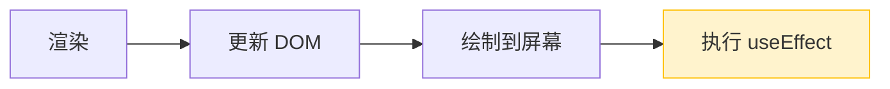

# React Hooks 深度解析

> Hooks 让函数组件拥有了自己的"记忆"。每次渲染，React 都会把上一次的 state 还给你，而不是重新开始。

## 阅读指南

```
前置阅读：01-react-overview.md
推荐阅读顺序：
01-react-overview.md → 02-concurrent-mode-fiber.md → 本文
```

## 30 秒心智模型

**Hook 的 "hook" 就是钩子。**

函数组件本来是纯函数——没有状态，没有生命周期，每次调用都重新开始。如果你想存点东西，只能看着局部变量被重置。

Hooks 的解决方案：**让函数「钩进」React 的内部状态系统。**

```jsx
function Counter() {
  // 钩一个状态出来用
  const [count, setCount] = useState(0);
  
  // 钩一个副作用
  useEffect(() => { ... });
  
  // 钩一个引用
  const ref = useRef();
}
```

**钩进去之后发生了什么？**

```
函数组件
    │
    ├── useState 钩进去 ──→ React Fiber.memoizedState
    │                          （状态存在这）
    │
    ├── useEffect 钩进去 ──→ React Fiber.updateQueue
    │                          （副作用存在这）
    │
    └── useRef 钩进去 ──→ React Hook.memoizedState
                               （引用存在这）
```

**关键规则：钩的位置不能变。**

React 用「调用顺序」匹配 Hook 和它对应的状态。第一个 Hook 对应第一个状态，第二个 Hook 对应第二个状态...

```jsx
// 第一次渲染：useState 钩到状态 A，useEffect 钩到副作用 B
// 第二次渲染：useState 还是钩到状态 A，useEffect 还是钩到副作用 B
// 
// 如果在条件里调用 Hook：
if (condition) {
  useState(); // 有时候钩，有时候不钩
}
// 顺序乱了 → 钩到错误的状态
```

**一句话概括：** Hooks 是函数组件钩进 React 内部系统的入口。钩几个，就有几个能力。

## 目录

- [Hooks 的使命](#hooks-的使命)
- [核心 Hooks](#核心-hooks)
- [状态管理 Hooks](#状态管理-hooks)
- [性能优化 Hooks](#性能优化-hooks)
- [其他常用 Hooks](#其他常用-hooks)
- [Hooks 规则](#hooks-规则)
- [自定义 Hooks](#自定义-hooks)
- [常见陷阱](#常见陷阱)
- [Hooks 内部实现](#hooks-内部实现)
- [术语速查](#术语速查)

---

## Hooks 的使命

### 解决什么问题

**问题一：组件间复用状态逻辑困难**

Hooks 之前，复用状态逻辑靠：
- 高阶组件（HOC）：`withRouter(withAuth(Component))`
- Render Props：`<Auth>{auth => <Component auth={auth} />}</Auth>`

这些模式会导致"嵌套地狱"，组件树变得难以追踪。

**问题二：生命周期代码碎片化**

```javascript
// 类组件：相关逻辑分散在不同生命周期
class FriendStatus extends React.Component {
  state = { isOnline: null };
  
  componentDidMount() {
    // 订阅逻辑在这里
    ChatAPI.subscribe(this.props.friendId, this.handleStatusChange);
  }
  
  componentDidUpdate(prevProps) {
    // 取消旧订阅、建立新订阅在这里
    if (prevProps.friendId !== this.props.friendId) {
      ChatAPI.unsubscribe(prevProps.friendId);
      ChatAPI.subscribe(this.props.friendId, this.handleStatusChange);
    }
  }
  
  componentWillUnmount() {
    // 清理逻辑在这里
    ChatAPI.unsubscribe(this.props.friendId);
  }
  
  handleStatusChange = (status) => {
    this.setState({ isOnline: status.isOnline });
  };
  
  render() {
    return <div>{this.state.isOnline ? 'Online' : 'Offline'}</div>;
  }
}
```

Hooks 把相关逻辑聚合在一起：

```javascript
// 函数组件：订阅和清理在一起
function FriendStatus({ friendId }) {
  const [isOnline, setIsOnline] = useState(null);
  
  useEffect(() => {
    ChatAPI.subscribe(friendId, handleStatusChange);
    return () => ChatAPI.unsubscribe(friendId);
  }, [friendId]); // 依赖项明确
  
  function handleStatusChange(status) {
    setIsOnline(status.isOnline);
  }
  
  return <div>{isOnline ? 'Online' : 'Offline'}</div>;
}
```

**问题三：class 的复杂性**

- `this` 的指向问题
- 事件处理函数需要 `bind`
- 代码压缩效果差
- 无法热重载部分代码

### 设计原则

Hooks 的设计遵循几个原则：

1. **不破坏现有代码**：类组件继续工作，渐进式迁移
2. **组合优于继承**：用自定义 Hook 复用逻辑，不用 HOC
3. **显式优于隐式**：依赖项数组让数据流清晰
4. **按功能组织**：相关代码放一起，而非按生命周期拆分

---

## 核心 Hooks

### useState

最基本的 Hook，给函数组件添加状态。

```jsx
function Counter() {
  const [count, setCount] = useState(0);
  
  return (
    <button onClick={() => setCount(count + 1)}>
      Count: {count}
    </button>
  );
}
```

#### 初始化

```jsx
// 直接传值
const [count, setCount] = useState(0);

// 惰性初始化（函数形式，只在首次渲染执行）
const [state, setState] = useState(() => {
  const initialState = expensiveComputation(props);
  return initialState;
});
```

#### 更新方式

```jsx
// 直接传新值
setCount(1);

// 函数形式（依赖前一个状态）
setCount(prev => prev + 1);

// 对象更新（注意：不会自动合并）
setState(prev => ({ ...prev, newField: 'value' }));
```

#### 批量更新

React 18 默认自动批处理：

```jsx
function handleClick() {
  setCount(c => c + 1);  // 不会立即渲染
  setFlag(f => !f);      // 不会立即渲染
  // 这里的两次更新会被批处理，只渲染一次
}
```

#### 陷阱：闭包捕获旧值

```jsx
// 错误：定时器里 count 是旧值
function Counter() {
  const [count, setCount] = useState(0);
  
  useEffect(() => {
    const id = setInterval(() => {
      console.log(count);  // 永远是 0
      setCount(count + 1); // 永远是 0 + 1 = 1
    }, 1000);
    return () => clearInterval(id);
  }, []); // 空依赖数组，effect 只执行一次
  
  return <div>{count}</div>;
}

// 正确：用函数形式更新
useEffect(() => {
  const id = setInterval(() => {
    setCount(c => c + 1);  // 使用最新的 count
  }, 1000);
  return () => clearInterval(id);
}, []);
```

### useEffect

处理副作用：数据获取、订阅、DOM 操作等。

```jsx
function FriendStatus({ friendId }) {
  const [status, setStatus] = useState('offline');
  
  useEffect(() => {
    // 订阅
    const handleStatusChange = (status) => setStatus(status);
    ChatAPI.subscribe(friendId, handleStatusChange);
    
    // 清理函数：组件卸载或依赖变化时执行
    return () => {
      ChatAPI.unsubscribe(friendId, handleStatusChange);
    };
  }, [friendId]);  // 依赖数组
  
  return <div>{status}</div>;
}
```

#### 执行时机



useEffect 在**绘制后**异步执行，不阻塞浏览器绘制。

#### 依赖数组

```jsx
// 每次渲染后都执行
useEffect(() => {
  console.log('每次渲染');
});

// 只在挂载时执行
useEffect(() => {
  console.log('挂载');
}, []);

// 只在 count 变化时执行
useEffect(() => {
  console.log('count 变化:', count);
}, [count]);
```

#### 清理函数

清理函数在以下时机执行：

1. 组件卸载
2. 下一次 effect 执行前（如果依赖变化）

```jsx
useEffect(() => {
  const subscription = props.source.subscribe();
  
  return () => {
    // 清理：取消订阅
    subscription.unsubscribe();
  };
}, [props.source]);

// 执行顺序：
// 1. 渲染（source=A）
// 2. effect 执行（订阅 A）
// 3. 渲染（source=B）
// 4. 清理执行（取消订阅 A）
// 5. effect 执行（订阅 B）
```

#### useEffect vs useLayoutEffect

| useEffect | useLayoutEffect |
|-----------|----------------|
| 绘制后执行 | 绘制前执行 |
| 异步，不阻塞绘制 | 同步，阻塞绘制 |
| 适合：数据获取、日志 | 适合：DOM 测量、同步更新 |

```jsx
// 测量 DOM 元素尺寸
function Measure() {
  const [height, setHeight] = useState(0);
  const ref = useRef();
  
  useLayoutEffect(() => {
    // 在浏览器绘制前测量，避免闪烁
    setHeight(ref.current.getBoundingClientRect().height);
  }, []);
  
  return <div ref={ref}>Height: {height}</div>;
}
```

### useContext

订阅 React Context，避免 prop drilling。

```jsx
// 创建 Context
const ThemeContext = createContext('light');

// 提供值
function App() {
  return (
    <ThemeContext.Provider value="dark">
      <Toolbar />
    </ThemeContext.Provider>
  );
}

// 消费值
function Button() {
  const theme = useContext(ThemeContext);
  return <button className={theme}>Click</button>;
}
```

#### 性能考虑

Context 更新会导致所有消费组件重新渲染。

```jsx
// 问题：value 每次都是新对象
function App() {
  return (
    <UserContext.Provider value={{ user, setUser }}>
      <DeepTree />
    </UserContext.Provider>
  );
}

// 优化：用 useMemo 或把 value 放在 state
function App() {
  const [value, setValue] = useState({ user, setUser });
  
  return (
    <UserContext.Provider value={value}>
      <DeepTree />
    </UserContext.Provider>
  );
}
```

---

## 状态管理 Hooks

### useReducer

复杂状态逻辑的替代方案，类似 Redux。

```jsx
const initialState = { count: 0 };

function reducer(state, action) {
  switch (action.type) {
    case 'increment':
      return { count: state.count + 1 };
    case 'decrement':
      return { count: state.count - 1 };
    case 'reset':
      return { count: action.payload };
    default:
      throw new Error();
  }
}

function Counter() {
  const [state, dispatch] = useReducer(reducer, initialState);
  
  return (
    <>
      Count: {state.count}
      <button onClick={() => dispatch({ type: 'increment' })}>+</button>
      <button onClick={() => dispatch({ type: 'decrement' })}>-</button>
      <button onClick={() => dispatch({ type: 'reset', payload: 0 })}>
        Reset
      </button>
    </>
  );
}
```

#### 惰性初始化

```jsx
function init(initialCount) {
  return { count: initialCount };
}

const [state, dispatch] = useReducer(reducer, initialCount, init);
```

#### useState vs useReducer

| useState | useReducer |
|----------|-----------|
| 简单状态 | 复杂状态逻辑 |
| 直接设值 | 通过 action 描述变化 |
| 状态类型固定 | 状态结构复杂 |
| 易于理解 | 易于测试 |

### useSyncExternalStore

React 18 引入，用于订阅外部数据源。

```jsx
import { useSyncExternalStore } from 'react';

function useOnlineStatus() {
  return useSyncExternalStore(
    // subscribe
    (callback) => {
      window.addEventListener('online', callback);
      window.addEventListener('offline', callback);
      return () => {
        window.removeEventListener('online', callback);
        window.removeEventListener('offline', callback);
      };
    },
    // getSnapshot
    () => navigator.onLine,
    // getServerSnapshot (SSR)
    () => true
  );
}
```

这个 Hook 解决了 Concurrent Mode 下外部数据源的一致性问题。

---

## 性能优化 Hooks

### useMemo

记忆计算结果，避免重复计算。

```jsx
function ExpensiveComponent({ items, filter }) {
  const filteredItems = useMemo(() => {
    // 只在 items 或 filter 变化时重新计算
    return items.filter(item => item.includes(filter));
  }, [items, filter]);
  
  return <List items={filteredItems} />;
}
```

#### useMemo 什么时候该用

| 场景 | 是否需要 |
|-----|---------|
| 计算量大（超过 1ms） | 需要 |
| 引用相等性重要（传给子组件） | 需要 |
| 简单计算 | 不需要 |
| 创建对象但不会传给子组件 | 不需要 |

```jsx
// 不需要：简单计算
const total = a + b;

// 需要：复杂计算
const sortedList = useMemo(() => {
  return largeArray.sort(expensiveComparator);
}, [largeArray]);

// 需要：引用相等性
const options = useMemo(() => ({ color: 'red' }), []);
return <Child options={options} />;
```

### useCallback

记忆函数，避免函数重新创建。

```jsx
function Parent({ items }) {
  // 每次渲染都创建新函数
  const handleClick1 = () => console.log('click');
  
  // 只在依赖变化时创建新函数
  const handleClick2 = useCallback(() => {
    console.log('click', items);
  }, [items]);
  
  return <Child onClick={handleClick2} />;
}
```

#### useCallback 和 useMemo 的关系

`useCallback(fn, deps)` 等价于 `useMemo(() => fn, deps)`。

```jsx
// 这两种写法等价
const handleClick = useCallback(() => {
  doSomething(a, b);
}, [a, b]);

const handleClick = useMemo(() => {
  return () => doSomething(a, b);
}, [a, b]);
```

#### 什么时候该用

```jsx
// 需要：子组件用 React.memo 优化
const MemoChild = React.memo(Child);

function Parent() {
  const handleClick = useCallback(() => {}, []);
  return <MemoChild onClick={handleClick} />;
}

// 需要：函数是其他 Hook 的依赖
function Parent() {
  const handleClick = useCallback(() => {
    // ...
  }, [id]);
  
  useEffect(() => {
    subscribe(handleClick);
    return () => unsubscribe(handleClick);
  }, [handleClick]);
}

// 不需要：函数传给原生 DOM 元素
function Parent() {
  // 原生元素重新渲染成本很低，不需要优化
  const handleClick = () => {};
  return <button onClick={handleClick}>Click</button>;
}
```

### React.memo

组件级别的记忆。

```jsx
const MemoChild = React.memo(function Child({ name, onClick }) {
  return <div onClick={onClick}>{name}</div>;
});

// 只在 name 或 onClick 变化时重新渲染
```

#### 注意事项

React.memo 做的是**浅比较**。如果 props 是对象或函数，需要用 useMemo/useCallback。

```jsx
function Parent() {
  const [count, setCount] = useState(0);
  
  // 问题：每次都创建新对象
  const user = { name: 'Alice' };
  
  // 优化：记忆对象
  const user = useMemo(() => ({ name: 'Alice' }), []);
  
  return <MemoChild user={user} />;
}
```

---

## 其他常用 Hooks

### useRef

创建可变引用，修改不触发渲染。

```jsx
function TextInput() {
  const inputRef = useRef(null);
  
  const focus = () => {
    inputRef.current.focus();
  };
  
  return (
    <>
      <input ref={inputRef} />
      <button onClick={focus}>Focus</button>
    </>
  );
}
```

#### 用途

1. **访问 DOM 元素**
2. **存储不触发渲染的值**（如定时器 ID）
3. **存储跨渲染的值**

```jsx
function Counter() {
  const [count, setCount] = useState(0);
  const renderCount = useRef(0);
  
  renderCount.current += 1;  // 不触发渲染
  
  return (
    <div>
      Count: {count}
      <p>Rendered {renderCount.current} times</p>
      <button onClick={() => setCount(c => c + 1)}>+</button>
    </div>
  );
}
```

#### useRef vs useState

| useRef | useState |
|--------|----------|
| 修改不触发渲染 | 修改触发渲染 |
| 值持久化 | 值持久化 |
| 可存任意值 | 用于 UI 状态 |
| 同步更新 | 异步更新 |

### useImperativeHandle

自定义暴露给父组件的 ref 方法。

```jsx
const FancyInput = forwardRef((props, ref) => {
  const inputRef = useRef();
  
  useImperativeHandle(ref, () => ({
    focus: () => {
      inputRef.current.focus();
    },
    clear: () => {
      inputRef.current.value = '';
    }
  }));
  
  return <input ref={inputRef} />;
});

// 父组件
function Parent() {
  const inputRef = useRef();
  
  return (
    <>
      <FancyInput ref={inputRef} />
      <button onClick={() => inputRef.current.focus()}>Focus</button>
    </>
  );
}
```

### useId

生成唯一 ID，用于无障碍属性。

```jsx
function Form() {
  const id = useId();
  
  return (
    <>
      <label htmlFor={id}>Name</label>
      <input id={id} />
    </>
  );
}
```

这个 ID 在服务端和客户端保持一致，解决 SSR 水合问题。

### use

React 19 引入，读取 Promise 或 Context。

```jsx
// 读取 Promise
function Comments({ commentsPromise }) {
  const comments = use(commentsPromise);
  return comments.map(c => <Comment key={c.id} {...c} />);
}

// 读取 Context
function Theme() {
  const theme = use(ThemeContext);
  return <div className={theme}>...</div>;
}
```

`use` 可以在条件语句中使用，这是其他 Hook 不允许的。

```jsx
function Item({ condition, promise }) {
  if (condition) {
    const data = use(promise);  // 允许
    return <div>{data}</div>;
  }
  return <div>Loading...</div>;
}
```

---

## Hooks 规则

### 规则一：只在顶层调用

不要在循环、条件或嵌套函数中调用 Hook。

```jsx
// 错误：条件中调用
function Component({ showCounter }) {
  if (showCounter) {
    const [count, setCount] = useState(0);  // 错误！
  }
}

// 正确：条件在 Hook 之后
function Component({ showCounter }) {
  const [count, setCount] = useState(0);
  
  if (showCounter) {
    return <div>{count}</div>;
  }
  return null;
}
```

### 规则二：只在 React 函数中调用

只在：
- 函数组件内部
- 自定义 Hook 内部

不要在：
- 普通函数
- 类组件
- 普通 JavaScript 模块

### 为什么有这些规则

React 用**调用顺序**来追踪每个 Hook 的状态。

```jsx
function Component() {
  // 第一次渲染：
  // useState('A') → Hook 1
  // useState('B') → Hook 2
  // useEffect(...) → Hook 3
  
  // 第二次渲染：
  // useState('A') → Hook 1（React 知道这是第一个 Hook）
  // useState('B') → Hook 2（React 知道这是第二个 Hook）
  // useEffect(...) → Hook 3（React 知道这是第三个 Hook）
}
```

如果在条件中调用，顺序会变：

```jsx
// 第一次渲染：条件为 true
useState('A')     // Hook 1
useState('B')     // Hook 2
useEffect(...)    // Hook 3

// 第二次渲染：条件为 false
useState('A')     // Hook 1
useEffect(...)    // Hook 2 ← 错位！原本是 Hook 3

// React 会把 B 的状态给 useEffect，完全错乱
```

### ESLint 插件

使用 `eslint-plugin-react-hooks` 自动检查：

```json
{
  "plugins": ["react-hooks"],
  "rules": {
    "react-hooks/rules-of-hooks": "error",
    "react-hooks/exhaustive-deps": "warn"
  }
}
```

---

## 自定义 Hooks

自定义 Hook 是复用状态逻辑的方式。

### 什么是自定义 Hook

以 `use` 开头的函数，内部调用其他 Hook。

```jsx
// 自定义 Hook
function useOnlineStatus() {
  const [isOnline, setIsOnline] = useState(navigator.onLine);
  
  useEffect(() => {
    const handleOnline = () => setIsOnline(true);
    const handleOffline = () => setIsOnline(false);
    
    window.addEventListener('online', handleOnline);
    window.addEventListener('offline', handleOffline);
    
    return () => {
      window.removeEventListener('online', handleOnline);
      window.removeEventListener('offline', handleOffline);
    };
  }, []);
  
  return isOnline;
}

// 使用
function StatusBar() {
  const isOnline = useOnlineStatus();
  return <div>{isOnline ? '✅' : '🔴'}</div>;
}
```

### 自定义 Hook vs 普通函数

| 自定义 Hook | 普通函数 |
|------------|---------|
| 以 `use` 开头 | 任意命名 |
| 内部调用 Hook | 不调用 Hook |
| 可以使用 React 状态 | 只能做纯计算 |
| 每次调用独立状态 | 共享逻辑 |

### 自定义 Hook vs HOC

```jsx
// HOC 方式
function withOnlineStatus(Component) {
  return function WrappedComponent(props) {
    const isOnline = useOnlineStatus();
    return <Component {...props} isOnline={isOnline} />;
  };
}

const StatusBarWithOnline = withOnlineStatus(StatusBar);

// 自定义 Hook 方式
function StatusBar() {
  const isOnline = useOnlineStatus();
  return <div>{isOnline ? '✅' : '🔴'}</div>;
}
```

自定义 Hook 更直观，没有嵌套地狱。

### 常用自定义 Hook 模式

**数据获取：**

```jsx
function useFetch(url) {
  const [data, setData] = useState(null);
  const [loading, setLoading] = useState(true);
  const [error, setError] = useState(null);
  
  useEffect(() => {
    let ignore = false;
    
    async function fetchData() {
      try {
        const response = await fetch(url);
        const json = await response.json();
        if (!ignore) {
          setData(json);
          setError(null);
        }
      } catch (e) {
        if (!ignore) setError(e);
      } finally {
        if (!ignore) setLoading(false);
      }
    }
    
    fetchData();
    return () => { ignore = true; };
  }, [url]);
  
  return { data, loading, error };
}
```

**表单处理：**

```jsx
function useForm(initialValues, validate) {
  const [values, setValues] = useState(initialValues);
  const [errors, setErrors] = useState({});
  
  const handleChange = (e) => {
    const { name, value } = e.target;
    setValues(v => ({ ...v, [name]: value }));
    
    if (validate) {
      setErrors(validate({ ...values, [name]: value }));
    }
  };
  
  const reset = () => setValues(initialValues);
  
  return { values, errors, handleChange, reset };
}
```

**窗口尺寸：**

```jsx
function useWindowSize() {
  const [size, setSize] = useState({
    width: window.innerWidth,
    height: window.innerHeight
  });
  
  useEffect(() => {
    const handleResize = () => {
      setSize({ width: window.innerWidth, height: window.innerHeight });
    };
    
    window.addEventListener('resize', handleResize);
    return () => window.removeEventListener('resize', handleResize);
  }, []);
  
  return size;
}
```

---

## 常见陷阱

### 陷阱一：依赖数组遗漏

```jsx
// 错误：遗漏依赖
function Counter() {
  const [count, setCount] = useState(0);
  
  useEffect(() => {
    const id = setInterval(() => {
      setCount(count + 1);  // count 是闭包捕获的旧值
    }, 1000);
    return () => clearInterval(id);
  }, []); // 应该包含 count
  
  return <div>{count}</div>;
}

// 正确：添加依赖或用函数更新
useEffect(() => {
  const id = setInterval(() => {
    setCount(c => c + 1);  // 函数形式，使用最新值
  }, 1000);
  return () => clearInterval(id);
}, []);
```

### 陷阱二：对象依赖

```jsx
// 错误：每次渲染 options 都是新对象
function Search({ query }) {
  const options = { limit: 10 };
  
  useEffect(() => {
    fetchResults(query, options);
  }, [query, options]);  // options 每次都变
}

// 正确：用 useMemo
const options = useMemo(() => ({ limit: 10 }), []);
```

### 陷阱三：在 Effect 中设置状态导致循环

```jsx
// 错误：无限循环
function Component() {
  const [count, setCount] = useState(0);
  
  useEffect(() => {
    setCount(count + 1);  // 触发重渲染
  }, [count]);  // count 变化又触发 effect
}
```

### 陷阱四：清理函数遗漏

```jsx
// 错误：没有清理事件监听
useEffect(() => {
  window.addEventListener('resize', handleResize);
  // 遗漏 return () => window.removeEventListener(...)
}, []);

// 正确：总是清理
useEffect(() => {
  window.addEventListener('resize', handleResize);
  return () => window.removeEventListener('resize', handleResize);
}, []);
```

### 陷阱五：过度优化

```jsx
// 过度：简单计算不需要 useMemo
const total = useMemo(() => a + b, [a, b]);

// 过度：原生元素不需要 useCallback
const handleClick = useCallback(() => console.log('click'), []);
return <button onClick={handleClick}>Click</button>;
```

---

## Hooks 内部实现

### 渲染时发生了什么

函数组件渲染时，React 会执行以下步骤：

```
1. 准备工作
   ├── 设置 currentlyRenderingFiber（当前组件的 Fiber 节点）
   ├── 重置 workInProgressHook（当前处理的 Hook 指针）
   └── 准备 Hooks 链表（从 fiber.memoizedState 读取或创建）

2. 执行组件函数
   ├── 每个 Hook 调用时，获取或创建 Hook 节点
   ├── 读取上次的 memoizedState
   ├── 处理更新队列
   └── 返回新状态

3. 收尾工作
   ├── 保存 Hooks 链表到 fiber.memoizedState
   └── 收集副作用到 fiber.updateQueue
```

### Hooks 链表结构

每个 Fiber 节点的 `memoizedState` 字段存储该组件的 Hooks 链表。

```
Fiber 节点
├── memoizedState ──→ Hook 1 (useState)
│                        ├── memoizedState: 状态值
│                        ├── queue: 更新队列
│                        └── next ──→ Hook 2 (useEffect)
│                                        ├── memoizedState: Effect 对象
│                                        └── next ──→ Hook 3 (useMemo)
│                                                        └── next ──→ null
```

**不同 Hook 的 memoizedState 存储内容：**

| Hook 类型 | memoizedState 存储内容 |
|----------|---------------------|
| useState | 状态值（如 `0`、`{name: 'Alice'}`） |
| useReducer | 状态值 |
| useEffect | Effect 对象 `{ create, destroy, deps }` |
| useMemo | `[value, deps]` |
| useCallback | `[callback, deps]` |
| useRef | `{ current: value }` |

### Hook 对象完整结构

```javascript
const hook = {
  // 核心
  memoizedState: any,      // 当前状态值或 Hook 特定数据
  baseState: any,          // 初始状态（用于重计算）
  
  // 更新队列
  queue: {
    pending: Update | null,  // 待处理的更新（环形链表尾指针）
    dispatch: Function,      // dispatch 函数引用
    lastRenderedReducer: Function,
    lastRenderedState: any,
  },
  
  // 链表指针
  next: Hook | null,       // 下一个 Hook
  
  // 并发模式相关
  baseQueue: Update | null,  // 基础更新队列
};
```

### 更新队列：环形链表

useState/useReducer 的更新存储在**环形链表**中。

```
queue.pending 指向最后一个更新

初始状态：queue.pending = null

第一次更新 setCount(1)：
Update1 ←──┐
    └──────┘  (自己指向自己)
queue.pending → Update1

第二次更新 setCount(2)：
Update1 ←──→ Update2
    ↑              │
    └──────────────┘
queue.pending → Update2（指向最新）

第三次更新 setCount(3)：
Update1 ←──→ Update2 ←──→ Update3
    ↑                            │
    └────────────────────────────┘
queue.pending → Update3
```

**为什么用环形链表？**

1. 插入 O(1)：只需要操作 pending 和新 update 的指针
2. 遍历方便：从 pending.next 开始，回到 pending 结束
3. 顺序保证：按插入顺序遍历

```javascript
// 遍历环形链表
function processQueue(queue) {
  const pending = queue.pending;
  if (pending === null) return;
  
  let update = pending.next;  // 从第一个开始
  do {
    // 处理 update
    update = update.next;
  } while (update !== pending.next);  // 回到起点结束
}
```

### useState 完整实现解析

```javascript
// React 内部全局变量
let currentlyRenderingFiber = null;   // 当前渲染的 Fiber
let workInProgressHook = null;        // 当前处理的 Hook
let currentHook = null;               // 对应的 current 树 Hook

// useState 的实现
function useState(initialState) {
  // 获取或创建 Hook
  const hook = mountWorkInProgressHook();
  
  if (currentlyRenderingFiber.alternate === null) {
    // Mount 阶段：使用初始值
    hook.memoizedState = hook.baseState =
      typeof initialState === 'function' 
        ? initialState() 
        : initialState;
  } else {
    // Update 阶段：处理更新队列
    hook.memoizedState = processUpdateQueue(
      hook,
      currentlyRenderingFiber.alternate.memoizedState
    );
  }
  
  // 返回状态和 dispatcher
  const queue = hook.queue;
  const dispatch = dispatchAction.bind(null, currentlyRenderingFiber, queue);
  
  return [hook.memoizedState, dispatch];
}

// 创建或获取 Hook
function mountWorkInProgressHook() {
  const hook = {
    memoizedState: null,
    baseState: null,
    queue: null,
    next: null,
  };
  
  if (workInProgressHook === null) {
    // 第一个 Hook，挂到 fiber 上
    currentlyRenderingFiber.memoizedState = hook;
  } else {
    // 后续 Hook，追加到链表
    workInProgressHook.next = hook;
  }
  
  workInProgressHook = hook;
  return hook;
}

// 处理更新队列
function processUpdateQueue(hook, currentState) {
  const queue = hook.queue;
  const pending = queue.pending;
  
  if (pending === null) {
    return currentState;
  }
  
  queue.pending = null;  // 清空队列
  
  let state = hook.baseState;
  let update = pending.next;  // 第一个更新
  
  do {
    if (typeof update.action === 'function') {
      state = update.action(state);  // 函数更新
    } else {
      state = update.action;  // 直接设值
    }
    update = update.next;
  } while (update !== pending.next);
  
  hook.baseState = state;
  return state;
}

// dispatch 实现
function dispatchAction(fiber, queue, action) {
  const update = {
    action,
    lane: requestUpdateLane(),  // 优先级
    next: null,
  };
  
  // 加入环形链表
  const pending = queue.pending;
  if (pending === null) {
    update.next = update;  // 自己指向自己
  } else {
    update.next = pending.next;
    pending.next = update;
  }
  queue.pending = update;
  
  // 调度更新
  scheduleUpdateOnFiber(fiber);
}
```

### useEffect 完整实现解析

useEffect 的实现比 useState 复杂，因为它涉及副作用调度。

```javascript
// useEffect 的实现
function useEffect(create, deps) {
  const hook = mountWorkInProgressHook();
  
  const nextDeps = deps === undefined ? null : deps;
  
  if (currentHook !== null) {
    // Update 阶段
    const prevEffect = currentHook.memoizedState;
    
    // 检查依赖是否变化
    if (areHookInputsEqual(nextDeps, prevEffect.deps)) {
      // 依赖没变，标记为 NoFlags（不需要执行）
      pushEffect(NoFlags, create, prevEffect.destroy, nextDeps);
      return;
    }
  }
  
  // 标记为需要执行
  const fiberFlags = UpdateEffect | PassiveEffect;
  currentlyRenderingFiber.flags |= fiberFlags;
  
  // 创建 Effect 并加入队列
  const destroy = prevEffect ? prevEffect.destroy : undefined;
  pushEffect(HasEffect | Passive, create, destroy, nextDeps);
}

// Effect 对象
const effect = {
  tag: HookFlags,        // 标记：是否需要执行
  create: Function,      // 副作用函数
  destroy: Function,     // 清理函数
  deps: Array | null,    // 依赖数组
  next: Effect,          // 环形链表指针
};

// Effect 也是环形链表
function pushEffect(tag, create, destroy, deps) {
  const effect = { tag, create, destroy, deps, next: null };
  
  let componentUpdateQueue = currentlyRenderingFiber.updateQueue;
  
  if (componentUpdateQueue === null) {
    componentUpdateQueue = createUpdateQueue();
    currentlyRenderingFiber.updateQueue = componentUpdateQueue;
    effect.next = effect;  // 第一个，自己指向自己
  } else {
    const lastEffect = componentUpdateQueue.lastEffect;
    if (lastEffect === null) {
      effect.next = effect;
    } else {
      effect.next = lastEffect.next;
      lastEffect.next = effect;
    }
  }
  
  componentUpdateQueue.lastEffect = effect;
}

// Effect 执行时机（在 commit 阶段）
function commitPassiveEffects(finishedWork) {
  const updateQueue = finishedWork.updateQueue;
  
  if (updateQueue !== null) {
    const lastEffect = updateQueue.lastEffect;
    
    if (lastEffect !== null) {
      let effect = lastEffect.next;  // 第一个 Effect
      do {
        if (effect.tag & HasEffect) {
          // 先执行清理
          if (effect.destroy !== undefined) {
            effect.destroy();
          }
          // 再执行 create
          effect.destroy = effect.create();
        }
        effect = effect.next;
      } while (effect !== lastEffect.next);
    }
  }
}
```

### Hook 规则的底层原因

**为什么不能在条件中调用 Hooks？**

React 用**调用顺序**作为索引来匹配 Hook 和状态。

```javascript
// 组件代码
function Component() {
  const [a, setA] = useState('a');  // Hook 1
  const [b, setB] = useState('b');  // Hook 2
  useEffect(() => {});               // Hook 3
}

// Fiber.memoizedState 存储：
// Hook 1 (a 的状态) → Hook 2 (b 的状态) → Hook 3 (effect)
```

**如果条件调用：**

```javascript
function Component({ showB }) {
  const [a, setA] = useState('a');  // Hook 1
  
  if (showB) {
    const [b, setB] = useState('b');  // showB=true: Hook 2
  }                                    // showB=false: 不存在
  
  useEffect(() => {});  // showB=true: Hook 3
                         // showB=false: Hook 2 ← 错位！
}
```

当 `showB` 从 `true` 变成 `false`：
- Fiber 中存储的是 3 个 Hook（a, b, effect）
- 渲染时只调用 2 次 useState（a, effect）
- React 把 b 的状态给 useEffect，effect 的状态丢失
- 完全错乱

### useMemo 和 useCallback 的实现

```javascript
function useMemo(nextCreate, deps) {
  const hook = mountWorkInProgressHook();
  
  if (currentHook !== null) {
    const prevState = currentHook.memoizedState;
    
    // 检查依赖
    if (areHookInputsEqual(deps, prevState[1])) {
      return prevState[0];  // 返回缓存的值
    }
  }
  
  // 重新计算
  const nextValue = nextCreate();
  hook.memoizedState = [nextValue, deps];
  return nextValue;
}

function useCallback(callback, deps) {
  // useCallback 本质上是 useMemo 的特例
  return useMemo(() => callback, deps);
}
```

### useRef 实现

```javascript
function useRef(initialValue) {
  const hook = mountWorkInProgressHook();
  
  if (currentHook === null) {
    // Mount：创建对象
    const ref = { current: initialValue };
    hook.memoizedState = ref;
  } else {
    // Update：直接复用
    hook.memoizedState = currentHook.memoizedState;
  }
  
  return hook.memoizedState;
}
```

`useRef` 返回的对象在整个组件生命周期保持不变，因为它的引用存储在 Hook 的 memoizedState 中。

### Mount vs Update

| 阶段 | 行为 |
|-----|------|
| **Mount** | 创建 Hook 链表，初始化 memoizedState |
| **Update** | 复用现有 Hook 链表，处理更新队列 |

```javascript
// React 内部用这个区分
const isMount = currentHook === null;

// Mount 时
if (isMount) {
  hook.memoizedState = initialState;
}
// Update 时
else {
  hook.memoizedState = processUpdateQueue(hook);
}
```

### 并发模式下的 Hooks

React 18 并发模式下，Hooks 需要处理优先级。

```javascript
// 更新携带 Lane（优先级）
const update = {
  action,
  lane: requestUpdateLane(),  // 获取当前优先级
  next: null,
};

// 渲染时只处理足够高优先级的更新
function processUpdateQueue(hook, renderLanes) {
  let update = hook.queue.pending;
  
  do {
    if (update.lane === NoLane || !isSubsetOfLanes(renderLanes, update.lane)) {
      // 优先级不够，跳过，留到下次
      continue;
    }
    
    state = update.action(state);
  } while (...);
  
  return state;
}
```

这就是为什么 `useState` 的更新可以「暂停」——低优先级更新不会立即应用。

---

## 术语速查

| 术语 | 含义 |
|-----|------|
| **Hook** | 以 `use` 开头的函数，使用 React 状态 |
| **memoizedState** | Fiber 节点上存储 Hooks 链表的字段 |
| **依赖数组** | useEffect/useMemo/useCallback 的第二个参数 |
| **闭包陷阱** | Effect 中引用过时状态的常见错误 |
| **惰性初始化** | useState 传入函数，只在首次渲染执行 |
| **批处理** | 多次状态更新合并为一次渲染 |
| **Custom Hook** | 自定义 Hook，复用状态逻辑 |
| **Effect** | 副作用，如数据获取、订阅 |
| **Cleanup** | useEffect 的清理函数 |

---

## 参考

- [React Hooks 官方文档](https://react.dev/reference/react)
- [Hooks FAQ](https://react.dev/reference/react/hooks)
- [useEffect 完整指南](https://overreacted.io/a-complete-guide-to-useeffect/)
- [Hooks 内部实现](https://github.com/facebook/react/tree/main/packages/react-reconciler)

---

**上一篇：** [Concurrent Mode 与 Fiber 架构](02-concurrent-mode-fiber.md)  
**下一篇：** [React 性能优化与现代模式](04-react-performance-modern-patterns.md)
