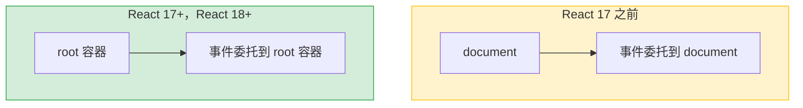
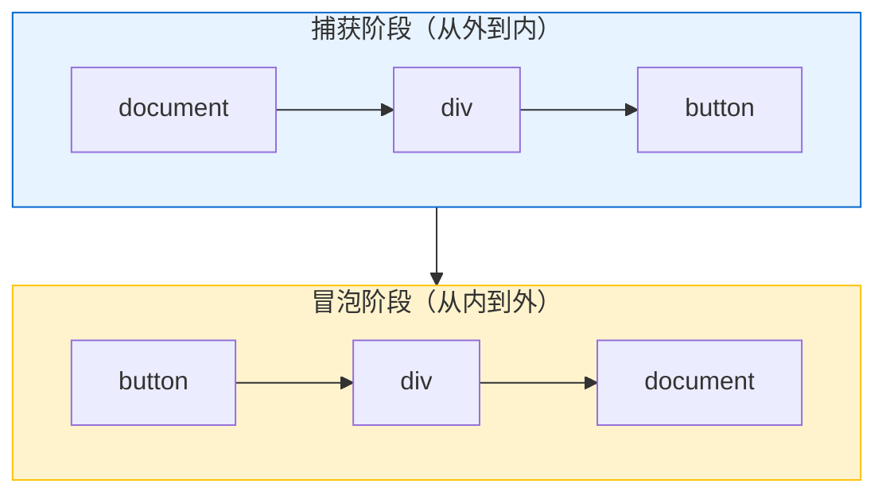

# React 事件系统

> React 没有把事件绑定到每个 DOM 元素上，而是统一委托到根节点。这看似多余的设计，实际上解决了跨浏览器兼容、内存管理和并发渲染的一系列问题。

## 阅读指南

```
前置阅读：01-react-overview.md
推荐阅读顺序：
01-react-overview.md → 本文
```

## 30 秒心智模型

**Event Delegation 的 "delegation" 就是委托。**

原生做法：每个元素自己绑定事件监听器。
React 做法：把事件处理「委托」给根节点统一管理。

```
原生方式：                     React 委托方式：

<ul>                          <ul> ─────────────┐
  <li onClick={...} />         <li />            │
  <li onClick={...} />         <li />            ├── 一个监听器
  <li onClick={...} />         <li />            │   处理所有事件
</ul>                         </ul> ────────────┘

1000 个 li = 1000 个监听器      1000 个 li = 1 个监听器
```

**为什么要委托？**

| 问题 | 委托解决什么 |
|------|-------------|
| 内存占用大 | 1000 个元素只需 1 个监听器 |
| 动态元素麻烦 | 新增元素自动有事件处理 |
| 浏览器差异 | React 统一处理兼容性 |
| 事件清理困难 | 组件卸载时自动清理 |

**委托给谁？**

- React 16 及之前：委托给 `document`
- React 17+：委托给 React 根容器（更可控）

**一句话概括：** 事件处理统一委托给祖先节点，React 根据事件目标找到对应组件，执行处理函数。

## 目录

- [为什么需要 Synthetic Events](#为什么需要-synthetic-events)
- [事件委托机制](#事件委托机制)
- [事件对象](#事件对象)
- [事件传播](#事件传播)
- [React 17 的变化](#react-17-的变化)
- [与原生事件混用](#与原生事件混用)
- [常见问题](#常见问题)
- [术语速查](#术语速查)

---

## 为什么需要 Synthetic Events

### 问题一：浏览器兼容性

不同浏览器的事件对象有差异：

```javascript
// IE 11
event.cancelBubble = true;  // 停止冒泡
event.returnValue = false;  // 阻止默认行为

// 标准
event.stopPropagation();
event.preventDefault();

// 获取事件目标
event.srcElement;  // IE
event.target;      // 标准

// 鼠标位置
event.clientX; event.clientY;  // 相对于视口
event.pageX; event.pageY;      // 相对于文档（IE 没有）
event.offsetX; event.offsetY;  // 相对于目标元素（计算方式不同）
```

React 的 SyntheticEvent 提供统一的 API，屏蔽浏览器差异：

```jsx
function handleClick(e) {
  // 不需要判断浏览器
  e.stopPropagation();
  e.preventDefault();
  console.log(e.target);  // 统一的 target
}
```

### 问题二：内存管理

如果每个组件实例都绑定事件：

```jsx
// 假设：每个元素都绑定事件
function List({ items }) {
  return (
    <ul>
      {items.map(item => (
        <li 
          key={item.id}
          onClick={() => console.log(item.id)}
        >
          {item.name}
        </li>
      ))}
    </ul>
  );
}

// 1000 个 item = 1000 个事件监听器
// 内存开销大
```

React 用事件委托，只在根节点绑定一个监听器：

```
document (或 root 容器)
  │
  └── 一个监听器处理所有事件
       │
       ├── 事件发生时，找到目标元素
       ├── 找到对应的组件
       └── 调用对应的处理函数
```

### 问题三：动态元素

动态创建的元素（如条件渲染、列表项）不需要手动绑定/解绑事件：

```jsx
function ConditionalButton({ show }) {
  return (
    <>
      {show && <button onClick={handleClick}>Click</button>}
      {/* 不需要手动解绑事件 */}
    </>
  );
}
```

---

## 事件委托机制

### 委托位置



### 事件监听过程

```
1. 应用启动时，React 在根节点绑定所有事件类型
   - click
   - input
   - keydown
   - change
   - ...共 20+ 种事件

2. 用户点击某个元素

3. 浏览器触发事件，冒泡到根节点

4. React 捕获事件，查找：
   - 事件目标元素
   - 该元素对应的 Fiber 节点
   - 该 Fiber 上的 onClick 处理函数

5. 构造 SyntheticEvent

6. 按冒泡/捕获顺序执行处理函数
```

### 源码简化版

```javascript
// React 事件监听简化逻辑
function listenToAllSupportedEvents(rootContainerElement) {
  // 所有支持的事件类型
  const allNativeEvents = new Set([
    'click', 'dblclick', 'mousedown', 'mouseup', 'mouseover',
    'mousemove', 'mouseout', 'keydown', 'keyup', 'keypress',
    'focus', 'blur', 'change', 'input', 'submit', 'reset',
    // ...
  ]);
  
  allNativeEvents.forEach(domEventName => {
    // 捕获阶段
    listenToNativeEvent(
      domEventName,
      true,  // capture
      rootContainerElement
    );
    // 冒泡阶段
    listenToNativeEvent(
      domEventName,
      false, // bubble
      rootContainerElement
    );
  });
}

function dispatchEvent(
  domEventName,  // 'click'
  eventSystemFlags,
  nativeEvent    // 原生事件对象
) {
  // 获取事件目标
  const nativeEventTarget = nativeEvent.target;
  
  // 找到对应的 Fiber 节点
  const targetInst = getClosestInstanceFromNode(nativeEventTarget);
  
  // 构造 SyntheticEvent
  const syntheticEvent = createSyntheticEvent(nativeEvent);
  
  // 收集事件处理函数路径
  const dispatchListeners = [];
  let instance = targetInst;
  while (instance !== null) {
    // 收集 onClick 等处理函数
    if (instance.pendingProps.onClick) {
      dispatchListeners.push(instance.pendingProps.onClick);
    }
    instance = instance.return;
  }
  
  // 按顺序执行
  dispatchListeners.forEach(listener => {
    listener(syntheticEvent);
  });
}
```

---

## 事件对象

SyntheticEvent 是原生事件的包装。

### 标准属性

```jsx
function handleClick(e) {
  console.log(e.type);      // 事件类型：'click'
  console.log(e.target);    // 事件目标（实际点击的元素）
  console.log(e.currentTarget); // 当前处理事件的元素
  console.log(e.nativeEvent);   // 原生事件对象
  console.log(e.timeStamp);     // 时间戳
  
  // 鼠标事件
  console.log(e.clientX, e.clientY);  // 视口坐标
  console.log(e.pageX, e.pageY);      // 文档坐标
  console.log(e.screenX, e.screenY);  // 屏幕坐标
  
  // 键盘事件
  console.log(e.key);        // 按键值：'Enter', 'Escape'
  console.log(e.code);       // 物理按键：'Enter', 'Escape'
  console.log(e.keyCode);    // 已废弃，但仍有用
  console.log(e.ctrlKey, e.shiftKey, e.altKey, e.metaKey);
}
```

### 方法

```jsx
function handleClick(e) {
  // 阻止默认行为
  e.preventDefault();
  
  // 停止冒泡
  e.stopPropagation();
  
  // 阻止后续监听器（包括原生）
  e.nativeEvent.stopImmediatePropagation();
  
  // 持久化事件（React 17 后不再需要）
  e.persist();
}
```

### target vs currentTarget

```jsx
function Container() {
  const handleClick = (e) => {
    console.log(e.target);        // 实际点击的元素（可能是 Button 或 Span）
    console.log(e.currentTarget); // 绑定 onClick 的元素（Container）
  };
  
  return (
    <div onClick={handleClick}>
      <button>
        <span>Click me</span>
      </button>
    </div>
  );
}

// 点击 span 时：
// target = span
// currentTarget = div
```

---

## 事件传播

### 捕获和冒泡

React 支持 DOM 标准的捕获和冒泡阶段。

```jsx
function App() {
  return (
    <div 
      onClickCapture={() => console.log('div capture')}
      onClick={() => console.log('div bubble')}
    >
      <button 
        onClickCapture={() => console.log('button capture')}
        onClick={() => console.log('button bubble')}
      >
        Click
      </button>
    </div>
  );
}

// 点击按钮时，输出顺序：
// 1. 'div capture'
// 2. 'button capture'
// 3. 'button bubble'
// 4. 'div bubble'
```

### 传播流程



### stopPropagation

```jsx
function App() {
  return (
    <div onClick={() => console.log('div')}>
      <button 
        onClick={(e) => {
          console.log('button');
          e.stopPropagation();  // 阻止冒泡到 div
        }}
      >
        Click
      </button>
    </div>
  );
}

// 输出：'button'
// 不输出：'div'
```

### stopImmediatePropagation

阻止后续监听器执行（包括同一元素上的其他监听器）：

```jsx
function App() {
  const handleClick1 = (e) => {
    console.log('handler 1');
    e.nativeEvent.stopImmediatePropagation();
  };
  
  const handleClick2 = () => {
    console.log('handler 2');  // 不会执行
  };
  
  return (
    <div>
      <button onClick={handleClick1} onClick={handleClick2}>
        {/* React 不支持多个 onClick，这只是示意 */}
      </button>
      
      {/* 实际场景：用 addEventListener 添加多个监听器 */}
    </div>
  );
}
```

---

## React 17 的变化

### 事件委托位置

React 17 之前，事件委托到 `document`；React 17+ 委托到 React 树的根容器。

```jsx
// React 16：事件委托到 document
ReactDOM.render(<App />, document.getElementById('root'));

// React 17+：事件委托到 root 容器
const root = ReactDOM.createRoot(document.getElementById('root'));
root.render(<App />);
```

这个变化的影响：

```jsx
// React 16 的问题
document.addEventListener('click', () => {
  console.log('document click');
});

// React 事件处理在 document，冒泡顺序不可控
// React 17+ 事件处理在 root，可以控制顺序

// React 17+
// 原生 document 监听器 → React 事件处理 → document 监听器
```

### 移除事件池

React 16 及之前，SyntheticEvent 是池化的——事件处理完后，事件对象被回收，属性被重置。

```jsx
// React 16：事件池化
function handleClick(e) {
  console.log(e.type);  // 'click'
  
  setTimeout(() => {
    console.log(e.type);  // null！对象被回收了
  }, 0);
}

// 解决：持久化
function handleClick(e) {
  e.persist();  // 从池中取出
  setTimeout(() => {
    console.log(e.type);  // 'click'
  }, 0);
}
```

React 17 移除了事件池，事件对象不会被回收：

```jsx
// React 17+：不需要 persist
function handleClick(e) {
  setTimeout(() => {
    console.log(e.type);  // 'click'，正常工作
  }, 0);
}
```

### 其他变化

- `onFocus`/`onBlur` 改用 `focusin`/`focusout` 事件（支持冒泡）
- `onChange` 事件在更多场景下触发
- 事件对象不再有 `persist` 方法（但不会报错，只是为了兼容）

---

## 与原生事件混用

### 执行顺序

原生事件和 React 事件的执行顺序：

```jsx
function App() {
  const buttonRef = useRef();
  
  useEffect(() => {
    const button = buttonRef.current;
    
    // 原生事件
    button.addEventListener('click', () => {
      console.log('native click');
    });
    
    return () => {
      button.removeEventListener('click', () => {});
    };
  }, []);
  
  // React 事件
  const handleClick = () => {
    console.log('react click');
  };
  
  return <button ref={buttonRef} onClick={handleClick}>Click</button>;
}

// 执行顺序：
// 1. 'native click'  （原生事件先执行）
// 2. 'react click'   （React 事件后执行）
```

### 为什么原生事件先执行

```
事件传播路径：
document → ... → button (原生) → 冒泡回 document → React 处理

原生事件在 button 上直接触发
React 事件在冒泡到 root 后才处理
```

### 混用的陷阱

```jsx
function App() {
  useEffect(() => {
    document.addEventListener('click', () => {
      console.log('document native');
    });
  }, []);
  
  const handleClick = (e) => {
    console.log('react click');
    e.stopPropagation();  // 只阻止 React 事件冒泡
  };
  
  return <button onClick={handleClick}>Click</button>;
}

// React 16：
// 输出：'document native'（document 事件先执行）
// React 事件被阻止冒泡，但原生已经执行了

// React 17+：
// 输出：'react click'
// React 事件先处理，stopPropagation 阻止了冒泡到 document
```

### 阻止原生事件传播

```jsx
function App() {
  useEffect(() => {
    const handleClick = (e) => {
      e.stopPropagation();
      console.log('native stop');
    };
    
    document.addEventListener('click', handleClick, true);  // 捕获阶段
    return () => document.removeEventListener('click', handleClick, true);
  }, []);
  
  return <button onClick={() => console.log('react click')}>Click</button>;
}

// 捕获阶段的 document 监听器先执行
// stopPropagation 阻止了事件到达 React 根节点
// React 事件不会触发
```

### 建议

1. **避免混用**：尽量用 React 事件系统
2. **必须混用时**：注意执行顺序
3. **第三方库**：可能需要调用其 cleanup 方法

```jsx
// 第三方库集成示例
function DatePicker() {
  const inputRef = useRef();
  
  useEffect(() => {
    const picker = new Flatpickr(inputRef.current, {
      onChange: (dates) => {
        // 第三方库的事件回调
      }
    });
    
    return () => {
      picker.destroy();  // 清理事件监听
    };
  }, []);
  
  return <input ref={inputRef} />;
}
```

---

## 常见问题

### 问题一：获取事件触发的组件

```jsx
function List({ items }) {
  const handleClick = (e, itemId) => {
    console.log('clicked:', itemId);
  };
  
  return (
    <ul>
      {items.map(item => (
        <li 
          key={item.id}
          onClick={(e) => handleClick(e, item.id)}
        >
          {item.name}
        </li>
      ))}
    </ul>
  );
}

// 或者用 data 属性
function List({ items }) {
  const handleClick = (e) => {
    const itemId = e.currentTarget.dataset.id;
    console.log('clicked:', itemId);
  };
  
  return (
    <ul>
      {items.map(item => (
        <li 
          key={item.id}
          data-id={item.id}
          onClick={handleClick}
        >
          {item.name}
        </li>
      ))}
    </ul>
  );
}
```

### 问题二：阻止表单提交

```jsx
function Form() {
  const handleSubmit = (e) => {
    e.preventDefault();  // 阻止默认提交行为
    // 自定义提交逻辑
  };
  
  return (
    <form onSubmit={handleSubmit}>
      <input type="text" />
      <button type="submit">Submit</button>
    </form>
  );
}
```

### 问题三：事件处理函数的 this

```jsx
// 类组件：this 问题
class Button extends React.Component {
  // 错误：this 未绑定
  handleClick() {
    console.log(this);  // undefined（严格模式）
  }
  
  // 方案一：绑定
  constructor() {
    this.handleClick = this.handleClick.bind(this);
  }
  
  // 方案二：箭头函数
  handleClick = () => {
    console.log(this);  // 正确
  }
  
  render() {
    return <button onClick={this.handleClick}>Click</button>;
  }
}

// 函数组件：没有 this 问题
function Button() {
  const handleClick = () => {
    console.log('clicked');
  };
  
  return <button onClick={handleClick}>Click</button>;
}
```

### 问题四：传递额外参数

```jsx
function List({ items }) {
  // 方案一：箭头函数
  return (
    <ul>
      {items.map(item => (
        <li 
          key={item.id}
          onClick={() => handleItemClick(item.id)}
        >
          {item.name}
        </li>
      ))}
    </ul>
  );
  
  // 方案二：bind
  return (
    <ul>
      {items.map(item => (
        <li 
          key={item.id}
          onClick={handleItemClick.bind(null, item.id)}
        >
          {item.name}
        </li>
      ))}
    </ul>
  );
  
  // 方案三：data 属性（见上面示例）
}

function handleItemClick(id, e) {  // bind 方式，e 在最后
  console.log(id);
}
```

### 问题五：事件只触发一次

```jsx
function Button() {
  const [clicked, setClicked] = useState(false);
  
  const handleClick = (e) => {
    if (clicked) {
      e.preventDefault();
      return;
    }
    setClicked(true);
    // 执行一次性的操作
  };
  
  return <button onClick={handleClick}>Click once</button>;
}

// 或者用 useRef 跟踪
function Button() {
  const hasClicked = useRef(false);
  
  const handleClick = () => {
    if (hasClicked.current) return;
    hasClicked.current = true;
    // 执行一次性的操作
  };
  
  return <button onClick={handleClick}>Click once</button>;
}
```

### 问题六：异步事件处理

```jsx
function Form() {
  const handleSubmit = async (e) => {
    e.preventDefault();
    
    try {
      await submitForm();
    } catch (error) {
      // 错误处理
    }
  };
  
  return <form onSubmit={handleSubmit}>...</form>;
}
```

---

## 术语速查

| 术语 | 含义 |
|-----|------|
| **SyntheticEvent** | React 包装的跨浏览器事件对象 |
| **Event Delegation** | 事件委托，统一处理所有事件 |
| **Event Pooling** | 事件池化（React 17 已移除） |
| **Capture Phase** | 捕获阶段，从外到内 |
| **Bubble Phase** | 冒泡阶段，从内到外 |
| **stopPropagation** | 阻止事件冒泡 |
| **preventDefault** | 阻止默认行为 |
| **nativeEvent** | 原生浏览器事件对象 |
| **target** | 事件目标（实际触发事件的元素） |
| **currentTarget** | 当前处理事件的元素 |

---

## 参考

- [React 事件处理](https://react.dev/reference/react-dom/components/common#handling-events)
- [React 17 事件委托变化](https://react.dev/blog/2020/08/10/react-v17-rc.html#changes-to-event-delegation)
- [SyntheticEvent](https://react.dev/reference/react-dom/components/common#react-event-objects)
- [事件传播](https://developer.mozilla.org/en-US/docs/Web/API/Event/Event)

---

**上一篇：** [React 性能优化与现代模式](04-react-performance-modern-patterns.md)
