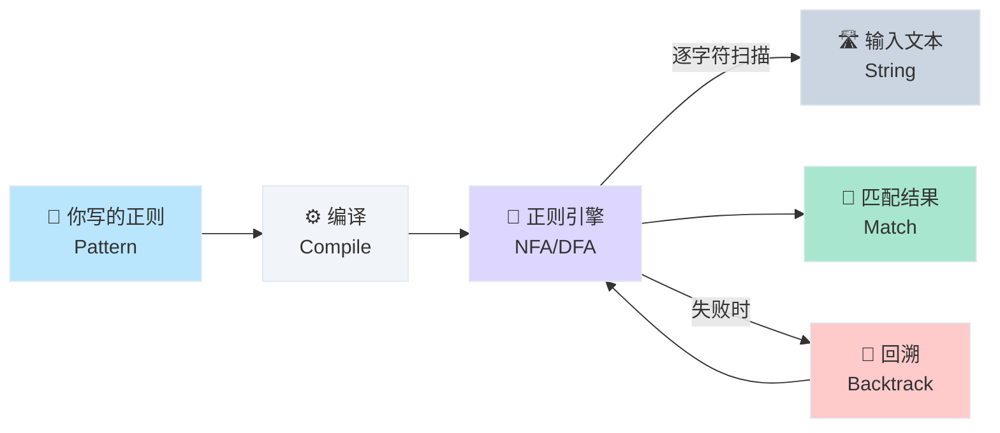

# 正则表达式学习笔记

> [!abstract] 本文定位
> 面向"知道正则表达式存在，但总觉得看不懂、记不住"的开发者。从直觉建立到语法精通，再到性能陷阱，系统掌握正则表达式。读完本文，你能：
> - 读懂别人写的正则，不再一头雾水
> - 自己编写中等复杂度的正则来匹配、提取、替换文本
> - 理解贪婪/非贪婪、回溯原理，避免性能灾难
> - 掌握零宽断言、命名捕获组等高级特性

> [!tip] 阅读路径
> **想快速上手** → [[#30 秒心智模型]] → [[#基础元字符 — "交通标志牌"]] → [[#量词 — "几车道"]] → [[#字符类 — "车辆类型筛选"]] → [[#实战正则库]] → [[#总结与一页速查]]
>
> **想搞懂原理** → [[#30 秒心智模型]] → [[#正则表达式是什么]] → 逐章阅读 → [[#引擎原理 — "导航仪怎么工作的"]] → [[#性能陷阱 — "堵车与死胡同"]]

---

## 30 秒心智模型

> **正则表达式 = GPS 导航系统**
>
> 想象你在一座巨大的文本城市里开车。正则表达式就是你的 GPS 导航——你输入一个"目的地模式"（pattern），GPS 沿着文本街道逐字扫描，把符合描述的所有地点（匹配结果）标记出来。

| GPS 导航 | 正则概念 | 一句话解释 |
|----------|---------|----------|
| 🗺️ 导航指令 | **Pattern（模式）** | 你写的正则表达式，描述"要找什么" |
| 🚗 导航车 | **引擎 (Engine)** | 执行匹配的程序，沿文本逐字前进 |
| 🛣️ 道路（文本） | **输入字符串** | 被搜索的文本内容 |
| 📍 标记的地点 | **匹配结果 (Match)** | 符合模式的文本片段 |
| 🔤 路牌字符 | **字面量** | 精确匹配的普通字符，如 `abc` |
| 🚦 交通标志 | **元字符** | 有特殊含义的符号，如 `.` `^` `$` `*` |
| 🚧 车道数 | **量词** | 控制重复次数，如 `+`（一次以上）`*`（零次以上） |
| 🅿️ 停车分组 | **捕获组 `()`** | 把匹配到的部分"停车保存"，供后续使用 |
| 🔭 前方观察哨 | **零宽断言** | 只看不吃——检查前后是否满足条件，但不消耗字符 |
| ⛽ 贪心/节约模式 | **贪婪/非贪婪** | 尽量多吃 vs 尽量少吃字符 |

---

## 阅读指南

**本文语境：** 讲解正则表达式通用语法，示例以 JavaScript 和 Python 为主，涉及 Bash/grep/sed 中的差异会标注。

**前置知识：** 任意一门编程语言的基础。

**术语表：**

| 术语 | 英文 | 本文中的落点 |
|------|------|-----------|
| 元字符 | Metacharacter | 有特殊含义的字符（`.` `*` `+` `?` 等），正则的"交通标志" |
| 量词 | Quantifier | 控制前一个 token 重复几次（`*` `+` `?` `{n,m}`） |
| 字符类 | Character Class | 用 `[]` 定义的一组可选字符 |
| 捕获组 | Capturing Group | 用 `()` 包围的子模式，匹配内容会被"捕获"供引用 |
| 反向引用 | Backreference | 用 `\1` `\2` 引用前面捕获组匹配到的内容 |
| 零宽断言 | Lookaround / Zero-width Assertion | 检查位置条件但不消耗字符 |
| 贪婪 | Greedy | 量词默认尽可能多地匹配字符 |
| 非贪婪 | Lazy / Non-greedy | 量词后加 `?`，尽可能少地匹配字符 |
| 回溯 | Backtracking | 引擎匹配失败时回退尝试其他路径 |

---

## 正则表达式是什么

### 不是什么 vs 是什么

| ❌ 不是 | ✅ 是 |
|--------|------|
| 一种编程语言 | 一种**模式描述语言**，嵌入在各编程语言中使用 |
| 只用于表单验证 | 通用的文本搜索、提取、替换、分割工具 |
| 万能文本处理器 | 适合模式匹配，不适合解析嵌套结构（如 HTML） |
| 每种语言语法都不同 | 核心语法（PCRE）高度统一，细节有差异 |

**正式定义：** 正则表达式（Regular Expression，简称 regex）是一种用特定语法描述字符串模式的微型语言。引擎根据模式在输入文本中搜索、匹配、提取或替换符合描述的文本片段。

> [!info]- 正则的"方言"：BRE / ERE / PCRE
> 正则有几种主要"方言"，核心语法相同但细节有别：
>
> | 方言 | 全称 | 用在哪 | 特点 |
> |------|------|-------|------|
> | **BRE** | Basic Regular Expression | `grep`、`sed` 默认 | `()`、`{}` 等需要转义（`\(\)`） |
> | **ERE** | Extended Regular Expression | `grep -E`、`awk` | `()`、`+`、`?` 等无需转义 |
> | **PCRE** | Perl Compatible Regular Expression | JavaScript、Python、Java、PHP | 最强大，支持零宽断言、命名组等 |
>
> **建议：** 日常编程用 PCRE 语法；写 grep/sed 脚本时加 `-E` 用 ERE，避免满篇 `\`。

---

## 背景与痛点 — "没有 GPS 的日子"

> 小华是一名后端开发者。他需要从 10GB 的 Nginx 日志中找出所有 4xx 错误请求的 URL 和 IP 地址。如果手动搜索——不现实。如果写个逐字符遍历的程序——代码又长又脆弱。一行正则 `grep -oP '(\d+\.\d+\.\d+\.\d+).*" (4\d{2}) '` 搞定。

| 现状 | 痛点 | 根因 |
|------|------|------|
| 手动找关键词 | 效率极低，10GB 日志不可能人肉看 | 缺乏模式匹配工具 |
| 写字符串处理代码 | 代码冗长、硬编码、难维护 | 逐字符判断不具备模式表达能力 |
| 用简单的 `contains` 判断 | 无法处理"格式化匹配"（如日期、IP） | 精确匹配 ≠ 模式匹配 |
| 搜索引擎查"常用正则" | 复制来的正则看不懂、改不动 | 没有系统理解正则语法 |

**正则的解法：** 用一行模式描述"我要的东西长什么样"，引擎自动在文本中精准定位。

---

## 架构总览 — "GPS 系统全景"



**读图结论：**
1. 正则先被**编译**成内部状态机，然后引擎用这个状态机扫描文本
2. 匹配成功就输出结果；匹配失败引擎会**回溯**，尝试其他路径
3. 回溯是性能问题的根源——嵌套量词可导致指数级回溯

---

## 基础元字符 — "交通标志牌"

> 元字符是正则中有特殊含义的字符，就像交通标志牌指挥车流方向。

### 位置锚点 — "起点和终点"

| 元字符 | 含义 | 示例 | 匹配 |
|--------|------|------|------|
| `^` | 字符串/行的开头 | `^Hello` | "**Hello** world" |
| `$` | 字符串/行的结尾 | `world$` | "Hello **world**" |
| `\b` | 单词边界 | `\bcat\b` | "the **cat** sat"（不匹配 "category"） |
| `\B` | 非单词边界 | `\Bcat\B` | "con**cat**enate" |

### 通配与转义

| 元字符 | 含义 | 示例 | 匹配 |
|--------|------|------|------|
| `.` | 任意字符（除换行符） | `a.c` | "a**bc**"、"a**1c**"、"a**@c**" |
| `\` | 转义下一个字符 | `\.` | 匹配字面量 "**.**" |
| `\|` | 或（alternation） | `cat\|dog` | "**cat**" 或 "**dog**" |

> [!warning] 需要转义的特殊字符
> 以下字符在正则中有特殊含义，如果想匹配字面量，需要加 `\` 转义：
> ```
> . * + ? ^ $ { } [ ] ( ) | \
> ```
> 例如匹配价格 `$9.99` → 正则：`\$\d+\.\d{2}`

> **对你的启发**：遇到正则报错或匹配不到，首先检查特殊字符有没有正确转义。这是最常见的新手 bug。

---

## 字符类 — "车辆类型筛选"

> **类比**：字符类就像停车场的"准入牌"——`[轿车SUV]` 表示只允许轿车或 SUV 进入这个车位。

### 自定义字符类 `[]`

| 语法 | 含义 | 示例 | 匹配 |
|------|------|------|------|
| `[abc]` | a 或 b 或 c | `[aeiou]` | 任意元音 |
| `[a-z]` | a 到 z | `[a-zA-Z]` | 任意英文字母 |
| `[0-9]` | 0 到 9 | `[0-9]{3}` | 三位数字 |
| `[^abc]` | 不是 a、b、c | `[^0-9]` | 任意非数字 |
| `[a-z&&[^aeiou]]` | 交集（Java） | — | 辅音字母 |

> [!question]- `[]` 内哪些字符不需要转义？
> 在 `[]` 内部，大多数元字符失去特殊含义，无需转义。但以下几个要注意：
> - `]` — 结束括号，需转义 `\]` 或放在最前面 `[]...]`
> - `\` — 仍然是转义符
> - `^` — 放在开头表示取反，放在其他位置是字面量
> - `-` — 两个字符之间表示范围，放在开头/结尾是字面量

### 预定义字符类 — "快捷方式"

| 简写 | 等价写法 | 含义 | 反义 |
|------|---------|------|------|
| `\d` | `[0-9]` | 数字 | `\D` = `[^0-9]` |
| `\w` | `[a-zA-Z0-9_]` | 单词字符 | `\W` = `[^a-zA-Z0-9_]` |
| `\s` | `[ \t\n\r\f\v]` | 空白字符 | `\S` = 非空白 |

```javascript
// 匹配一个 6 位数字验证码
/^\d{6}$/.test("123456")   // true
/^\d{6}$/.test("12345a")   // false
```

---

## 量词 — "几车道"

> **类比**：量词决定前面那个"车位"可以停几辆车。`+` 是"至少停一辆"，`*` 是"可以空着"，`{3}` 是"必须停 3 辆"。

### 量词一览

| 量词 | 含义 | 等价 | 示例 | 匹配 |
|------|------|------|------|------|
| `*` | 0 次或多次 | `{0,}` | `ab*c` | "ac"、"abc"、"abbc" |
| `+` | 1 次或多次 | `{1,}` | `ab+c` | "abc"、"abbc"（不匹配 "ac"） |
| `?` | 0 次或 1 次 | `{0,1}` | `colou?r` | "color"、"colour" |
| `{n}` | 恰好 n 次 | — | `\d{4}` | "2026" |
| `{n,}` | 至少 n 次 | — | `\d{2,}` | "12"、"123"、"1234" |
| `{n,m}` | n 到 m 次 | — | `\d{2,4}` | "12"、"123"、"1234" |

### 贪婪 vs 非贪婪 — "吃自助餐"

> **类比**：贪婪模式是"大胃王"——先把整盘吃完，吃多了再一口口吐回来（回溯）。非贪婪模式是"小鸟胃"——每次只吃一口，够了就停。

| 模式 | 语法 | 行为 |
|------|------|------|
| **贪婪（默认）** | `*`、`+`、`{n,m}` | 尽可能**多**匹配，失败再回退 |
| **非贪婪** | `*?`、`+?`、`{n,m}?` | 尽可能**少**匹配，不够再扩展 |
| **独占** | `*+`、`++`、`{n,m}+` | 尽可能多匹配，失败**不回退** |

**经典案例：匹配 HTML 标签内容**

```
输入：<b>hello</b> and <b>world</b>

贪婪：  <b>.*</b>     → "<b>hello</b> and <b>world</b>"  ← 吃太多！
非贪婪：<b>.*?</b>    → "<b>hello</b>"                    ← 刚好
否定类：<b>[^<]*</b>  → "<b>hello</b>"                    ← 最佳方案
```

> [!info]- 为什么"否定字符类"比非贪婪更好？
> `[^<]*` 表示"匹配任意非 `<` 字符"，引擎不需要回溯——遇到 `<` 就停，性能最佳。
>
> `.*?` 虽然结果正确，但引擎实现上仍然存在回溯：每吃一个字符就尝试后面的模式，不匹配再多吃一个。在短文本上差异不大，在大文本上性能差距明显。
>
> **原则：能用否定字符类 `[^...]` 就不用 `.*?`。**

> **对你的启发**：默认贪婪是正则新手最大的困惑来源。记住两条规则：① 量词默认贪婪（吃最多）；② 加 `?` 变非贪婪（吃最少）；③ 最佳方案往往是用否定字符类避免歧义。

---

## 分组与捕获 — "停车保存"

### 捕获组 `()`

> **类比**：捕获组就像停车位上的摄像头——不仅让车（字符）通过，还拍下来（保存），供你事后调用。

```javascript
const dateRegex = /(\d{4})-(\d{2})-(\d{2})/;
const match = "2026-03-09".match(dateRegex);

// match[0] = "2026-03-09"  ← 完整匹配
// match[1] = "2026"        ← 第 1 组：年
// match[2] = "03"          ← 第 2 组：月
// match[3] = "09"          ← 第 3 组：日
```

### 命名捕获组

```javascript
const regex = /(?<year>\d{4})-(?<month>\d{2})-(?<day>\d{2})/;
const { groups } = "2026-03-09".match(regex);

// groups.year  = "2026"
// groups.month = "03"
// groups.day   = "09"
```

```python
import re
m = re.match(r'(?P<year>\d{4})-(?P<month>\d{2})-(?P<day>\d{2})', '2026-03-09')
m.group('year')   # '2026'
m.group('month')  # '03'
```

> [!warning] 命名组语法差异
> - JavaScript / C#：`(?<name>...)`
> - Python：`(?P<name>...)`
> - Java (7+)：`(?<name>...)`

### 非捕获组 `(?:)`

当你需要分组但不需要保存匹配结果时使用——节省内存，也让组编号更清晰。

```javascript
// 捕获组：$1 = "http" 或 "https"
/(https?)://.*/

// 非捕获组：不创建 $1，只用于分组
/(?:https?)://.*/
```

### 反向引用

> 反向引用让你在正则内部引用前面捕获组已匹配到的**同样内容**。

```javascript
// 匹配重复的单词（如 "the the"）
/\b(\w+)\s+\1\b/g

// 匹配成对的引号
/(['"]).*?\1/
// 匹配 "hello" 或 'world'，但不匹配 "hello'
```

| 语法 | 含义 | 示例 |
|------|------|------|
| `\1`、`\2` | 引用第 n 个捕获组 | `(\w+)\s\1` 匹配重复单词 |
| `\k<name>` | 引用命名组（JS） | `(?<q>['"])\w+\k<q>` |
| `(?P=name)` | 引用命名组（Python） | `(?P<q>['"])\w+(?P=q)` |

> **对你的启发**：复杂正则中捕获组一多就容易混乱。养成习惯：① 不需要捕获的用 `(?:)`；② 需要捕获的用命名组 `(?<name>)` 而非编号。

---

## 零宽断言 — "前方观察哨"

> **类比**：零宽断言就像高速路上的"前方测速"标志——它会检查条件是否满足，但你的车（匹配位置）不会因此前进或后退。它只看，不吃字符。

### 四种断言

| 断言 | 名称 | 含义 | 示例 |
|------|------|------|------|
| `(?=...)` | 正向前瞻 | 后面**是** X | `\d+(?=元)` 匹配 "100**元**" 中的 `100` |
| `(?!...)` | 负向前瞻 | 后面**不是** X | `\d+(?!元)` 匹配 "100个" 中的 `100` |
| `(?<=...)` | 正向后瞻 | 前面**是** X | `(?<=\$)\d+` 匹配 "$**100**" 中的 `100` |
| `(?<!...)` | 负向后瞻 | 前面**不是** X | `(?<!\$)\d+` 匹配 "€**100**" 中的 `100` |

### 实战：密码强度验证

```javascript
// 至少 8 位，包含大写、小写、数字、特殊字符
const strongPassword = /^(?=.*[A-Z])(?=.*[a-z])(?=.*\d)(?=.*[^A-Za-z0-9]).{8,}$/;

// 拆解：
// ^               → 开头
// (?=.*[A-Z])     → 前瞻：后面存在至少一个大写字母
// (?=.*[a-z])     → 前瞻：后面存在至少一个小写字母
// (?=.*\d)        → 前瞻：后面存在至少一个数字
// (?=.*[^A-Za-z0-9]) → 前瞻：后面存在至少一个特殊字符
// .{8,}           → 主体：任意字符至少 8 个
// $               → 结尾
```

> [!question]- 为什么密码验证用多个前瞻叠加？
> 每个 `(?=...)` 都是从字符串开头独立检查，互不干扰。它们像一组"检查清单"——全部通过后，主模式 `.{8,}` 才匹配实际内容。
>
> 如果不用前瞻，你需要枚举所有字符类型的排列组合（大写在前还是数字在前？），正则会极其复杂。

### 实战：千分位格式化

```javascript
// 给数字添加千分位逗号：1234567 → 1,234,567
"1234567".replace(/\B(?=(\d{3})+(?!\d))/g, ",")

// 拆解：
// \B          → 非单词边界（不在数字开头加逗号）
// (?=         → 正向前瞻
//   (\d{3})+  →   后面有一组或多组 3 位数字
//   (?!\d)    →   且这些 3 位数字后面不再跟数字（即到末尾）
// )
```

> **对你的启发**：零宽断言的核心价值是"检查但不消耗"。需要"匹配 A 旁边的 B"但只要 B 时，断言就是你的工具。密码验证、千分位、不定长前缀匹配都是经典场景。

---

## 引擎原理 — "导航仪怎么工作的"

### NFA vs DFA

| 特性 | NFA（大多数语言） | DFA（grep/awk） |
|------|-----------------|----------------|
| 全称 | 非确定性有限自动机 | 确定性有限自动机 |
| 驱动方式 | 模式驱动（走正则的路线图） | 文本驱动（走文本的字符流） |
| 回溯 | ✅ 有（性能隐患） | ❌ 没有（保证线性时间） |
| 支持特性 | 完整（断言、反向引用等） | 有限（不支持反向引用） |
| 使用者 | JavaScript、Python、Java、C#、PHP | grep、awk、RE2（Go） |

### 回溯过程可视化

以模式 `a.*b` 匹配文本 `"aXYbZb"` 为例：

```
步骤 1: a 匹配 'a'        ✅ 前进
步骤 2: .* 贪婪吃掉 "XYbZb" ✅ 吃到底
步骤 3: b 没有字符可匹配    ❌ 回溯！
步骤 4: .* 吐出 'b'        → 现在 .* = "XYbZ"
步骤 5: b 匹配 'b'          ✅ 成功！
结果: "aXYbZb"
```

| 步骤 | `.*` 吃掉的 | 剩余 | `b` 能匹配？ |
|------|-----------|------|------------|
| 1 | `XYbZb` | （空） | ❌ 回溯 |
| 2 | `XYbZ` | `b` | ✅ 成功 |

> **对你的启发**：理解回溯机制后就能预判哪些正则可能慢。关键判断：正则中有没有多个量词争抢同一段字符？如果有，就可能触发大量回溯。

---

## 性能陷阱 — "堵车与死胡同"

### 灾难性回溯 (Catastrophic Backtracking)

> 当嵌套量词在不匹配的输入上创造出指数级的回溯路径时，引擎可能卡死。

**❌ 危险模式：**

```javascript
// 嵌套量词 — 灾难性回溯
/(a+)+$/        // 输入 "aaaaaaaaaaaaaaab" → 指数级回溯
/(x+x+)+y/     // 同理
/(\w+\s*)+$/    // 常见于"匹配整行单词"的天真写法
```

**为什么会爆？** 以 `(a+)+$` 匹配 `"aaab"` 为例：
- 外层 `()+` 和内层 `a+` 都可以吃 `a`
- 引擎需要尝试所有 `a` 在内/外层之间的分配组合
- 3 个 `a` 有 8 种分配（2³），30 个 `a` 有 10⁹ 种！

### 安全的替代方案

| 危险写法 | 安全写法 | 原因 |
|---------|---------|------|
| `(a+)+` | `a+` | 消除嵌套量词 |
| `(a\|b)*` | `[ab]*` | 字符类比交替更高效 |
| `.*?target` | `[^t]*target` | 否定字符类无需回溯 |
| `(\w+\s*)+$` | `[\w\s]+$` | 合并为单一字符类 |

### 性能检查清单

> [!success] 写正则前的 5 秒自检
> 1. **有没有嵌套量词？** `(X+)+`、`(X+Y*)+` → 危险！
> 2. **交替分支有没有重叠？** `(a\|ab)` → 用 `ab?` 替代
> 3. **能用否定字符类吗？** `.*?end` → `[^e]*end` 或更精确的否定
> 4. **加了锚点没？** `^\d{4}$` 比 `\d{4}` 更快（限定搜索范围）
> 5. **正则对象缓存了没？** 循环里 `new RegExp()` 每次重编译很浪费

> **对你的启发**：灾难性回溯是真实的安全威胁——攻击者可以构造特定输入让你的服务器 CPU 100%（ReDoS 攻击）。所有面向用户输入的正则都必须检查。

---

## 各语言用法速查

### JavaScript

```javascript
// 测试匹配
/^\d+$/.test("123")                // true

// 提取匹配
"2026-03-09".match(/(\d{4})-(\d{2})-(\d{2})/);
// ["2026-03-09", "2026", "03", "09"]

// 全局匹配（ES2020+ matchAll）
const matches = [...text.matchAll(/\b\w+@\w+\.\w+/g)];

// 替换
"hello world".replace(/world/, "regex")   // "hello regex"

// 替换 + 捕获组引用
"2026-03-09".replace(/(\d{4})-(\d{2})-(\d{2})/, "$2/$3/$1")
// "03/09/2026"
```

### Python

```python
import re

# 编译（推荐在循环外编译一次）
pattern = re.compile(r'\d{4}-\d{2}-\d{2}')

# 测试匹配
bool(pattern.match("2026-03-09"))     # True

# 提取
m = re.search(r'(?P<year>\d{4})-(?P<month>\d{2})', "date: 2026-03")
m.group('year')    # '2026'

# 全部匹配
re.findall(r'\b[A-Z]\w+', "Hello World Regex")  # ['Hello', 'World', 'Regex']

# 替换
re.sub(r'\s+', ' ', "hello   world")   # "hello world"

# 分割
re.split(r'[,;\s]+', "a, b; c d")      # ['a', 'b', 'c', 'd']
```

### Bash / grep / sed

```bash
# grep — 搜索匹配行
grep -E '\d{3}-\d{4}' contacts.txt     # ERE 模式
grep -P '(?<=\$)\d+' prices.txt        # PCRE 模式（需要 grep -P）

# sed — 替换
sed -E 's/([0-9]{4})-([0-9]{2})-([0-9]{2})/\2\/\3\/\1/g' dates.txt

# bash 内置正则（=~ 操作符）
if [[ "hello123" =~ ^[a-z]+[0-9]+$ ]]; then
    echo "匹配成功"
    echo "完整匹配: ${BASH_REMATCH[0]}"
fi
```

---

## 实战正则库

### 常用验证正则

| 场景 | 正则 | 说明 |
|------|------|------|
| 邮箱 | `^[a-zA-Z0-9._%+-]+@[a-zA-Z0-9.-]+\.[a-zA-Z]{2,}$` | 覆盖常见邮箱格式 |
| 中国手机号 | `^1[3-9]\d{9}$` | 1 开头，第二位 3~9 |
| IPv4 | `^((25[0-5]\|2[0-4]\d\|[01]?\d?\d)\.){3}(25[0-5]\|2[0-4]\d\|[01]?\d?\d)$` | 含 0~255 范围校验 |
| 日期 YYYY-MM-DD | `^\d{4}-(0[1-9]\|1[0-2])-(0[1-9]\|[12]\d\|3[01])$` | 月 01~12，日 01~31 |
| URL | `^https?://[^\s/$.?#].[^\s]*$` | HTTP/HTTPS |
| 十六进制颜色 | `^#([0-9a-fA-F]{3}\|[0-9a-fA-F]{6})$` | #FFF 或 #FFFFFF |
| 强密码 | `^(?=.*[A-Z])(?=.*[a-z])(?=.*\d)(?=.*[^A-Za-z0-9]).{8,}$` | 大小写+数字+特殊+8位 |

### 文本处理实战

```javascript
// 提取 Markdown 中的所有链接
const links = text.matchAll(/\[([^\]]+)\]\(([^)]+)\)/g);
for (const [, title, url] of links) {
    console.log(`${title} → ${url}`);
}

// 驼峰转下划线
"userName".replace(/([A-Z])/g, "_$1").toLowerCase()
// "user_name"

// 下划线转驼峰
"user_name".replace(/_([a-z])/g, (_, c) => c.toUpperCase())
// "userName"

// 去除 HTML 标签
"<p>Hello <b>World</b></p>".replace(/<[^>]*>/g, "")
// "Hello World"

// 提取所有数字
"价格: ¥99.5, 数量: 3个".match(/\d+\.?\d*/g)
// ["99.5", "3"]
```

### 日志分析实战

```bash
# 提取 Nginx 日志的 IP、状态码、URL
grep -oP '^(\S+).*?"(GET|POST) (\S+).*?" (\d{3})' access.log

# 找出所有 5xx 错误
grep -E '" 5[0-9]{2} ' access.log

# 统计每小时请求数
grep -oP '\d{2}(?=:\d{2}:\d{2})' access.log | sort | uniq -c

# 提取 JSON 中的某个字段值
grep -oP '"name"\s*:\s*"\K[^"]+' data.json
```

> **对你的启发**：不要试图写"完美的"邮箱/URL 正则——RFC 标准极其复杂。实际开发中，覆盖 95% 常见情况 + 后端校验才是正确策略。

---

## 调试工具推荐

| 工具 | 地址 | 特点 |
|------|------|------|
| **regex101** | [regex101.com](https://regex101.com) | 实时匹配 + 详细解释 + 多语言支持 |
| **Regexper** | [regexper.com](https://regexper.com) | 将正则可视化为铁路图 |
| **RegExr** | [regexr.com](https://regexr.com) | 实时测试 + 社区模式库 |
| **Debuggex** | [debuggex.com](https://debuggex.com) | 可视化 + 步进执行 |

> **对你的启发**：regex101 是最推荐的调试工具——粘贴正则后它会逐个 token 解释含义，写复杂正则时建议边写边用它验证。

---

## 总结与一页速查

> [!success] 正则表达式带走的 8 条经验
>
> 1. **从字面量开始**，逐步加元字符 — 先匹配固定文本，再泛化为模式
> 2. **量词默认贪婪** — 加 `?` 变非贪婪，但最佳方案往往是否定字符类 `[^...]`
> 3. **不需要捕获就用 `(?:)`** — 保持组编号清晰，也微提升性能
> 4. **需要捕获就用命名组** — `(?<name>)` 比 `\1` `\2` 可读性强十倍
> 5. **零宽断言只看不吃** — 需要"匹配 A 旁边的 B 但只要 B"时用
> 6. **绝对避免嵌套量词** — `(a+)+` 是灾难性回溯的万恶之源
> 7. **用 regex101 调试** — 不要在脑中运行正则，让工具帮你
> 8. **别用正则解析 HTML/JSON** — 嵌套结构请用专用解析器

### 元字符速查表

```
.       任意字符          \d  数字       \s  空白       \w  单词字符
^       行首              \D  非数字     \S  非空白     \W  非单词字符
$       行尾              \b  单词边界   \B  非单词边界
|       或
[]      字符类            [^] 否定字符类
()      捕获组            (?:) 非捕获组
(?=)    正向前瞻          (?!) 负向前瞻
(?<=)   正向后瞻          (?<!) 负向后瞻
*       0+ 次 (贪婪)      *?  0+ 次 (非贪婪)
+       1+ 次 (贪婪)      +?  1+ 次 (非贪婪)
?       0~1 次            {n,m} n到m次
\       转义
```

---

## 参考资料

- [Regular-Expressions.info — 最权威的正则教程](https://www.regular-expressions.info/)
- [RexEgg — 从基础到高级的正则指南](https://www.rexegg.com/)
- [MDN — JavaScript 正则表达式](https://developer.mozilla.org/zh-CN/docs/Web/JavaScript/Reference/Regular_expressions)
- [Python re 模块文档](https://docs.python.org/zh-cn/3/library/re.html)
- [regex101 — 在线正则调试工具](https://regex101.com/)
- [Russ Cox — Regular Expression Matching Can Be Simple And Fast](https://swtch.com/~rsc/regexp/regexp1.html)
