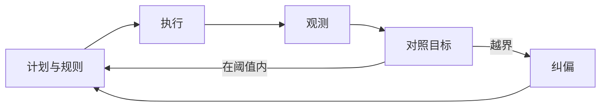

# 学习笔记：治理层（控制论、运营与质量改进）

文献锚点：Wiener (1948)、Ashby (1956)、Goldratt & Cox (1984)、Shewhart (1939)、Goodhart (1975)。下面是**接到人机系统运行**的读法。

## 30 秒心智模型

**治理层解决的是：跑起来以后，你怎么知道偏了、偏了多少、该不该动刀、动了谁负责、怎么回滚。**  
控制论谈反馈与信息；运营管理谈**队列与瓶颈**；质量改进谈**规范—执行—检验**的循环。Goodhart 单独敲一棍：**别把指标当成无辜的真理**——它一旦变成目标，行为会改，统计规律也会跟着改。[5]

## 这层在解决什么

规则和架构都会老化；模型、数据、用户行为会变。**治理**回答：偏差从哪来、动作分几级、什么时候只告警、什么时候必须人介入、复盘后改的是规则还是结构。

三样别混在一起：

1. **控制论**：Wiener 把**控制与通信**放在同一框架里；没有信息就没有闭环。[1] Ashby 的**必要多样性**：调节手段的「花样」要配得上被调对象的复杂程度，否则只剩**硬关**或**失灵**。[2]  
2. **运营管理**：Goldratt 用小说讲**约束**：系统瓶颈决定产出，局部优化常常无效。[3] 人机协作里也有队列：任务排队、审核排队、算力排队。问**瓶颈在哪一段**，比问「要不要加卡」更靠前。  
3. **质量改进**：休哈特把**规范—生产—检验**写成循环；戴明在后世推广 PDCA/PDSA。[4] 对你有用的是：**规范能否版本化、检验是否独立、行动是否回到规则与架构**，而不是背四个字母。  
4. **Goodhart**：原句说**观测到的统计规律在承受控制压力时会塌**。[5] 落到指标：主指标旁边要有**护栏**，还要有人**抽检**，别单押一个数。

## 核心概念：再往下一层

### 反馈：先找延迟，再谈调参

没有测量就没有治理——Wiener–Ashby 这条线都成立。[1][2]  
调参过猛、观测又滞后，系统会**振荡**。实务上先问：**从动作到可观测结果，延迟几步？** 延迟大，自动纠偏就要**保守**，否则你会在日志里看到来回抽风。

### 必要多样性：预案厚度

Ashby：**只有多样性才能对付多样性**。[2] 翻译成工程语言：  
长尾 case 要**分类**——哪些自动拒答、哪些升级、哪些补数据、哪些改架构。预案库太薄，运行时只剩「关停」和「祈祷」。

### Goodhart：主指标 + 护栏 + 人

Goodhart 的原始表述针对货币统计； generalized 后到处适用。[5]  
例：若只盯「任务完成率」，完成率可以通过**降低质量**刷上去。常见做法是：**主指标**（业务真正在乎的）+ **护栏**（安全、合规、明显错误率）+ **固定比例抽检**（让人看模型没写在指标里的东西）。

### PDCA：闭环要回到「规则/架构」

休哈特—戴明一脉关心的是**系统与变异**。[4]  
一次复盘若只以「再训一下模型」结束，而**规则与架构**不动，同样问题会回来。双环学习里那句老话：**纠错**（单环）和**改目标/改规则本身**（双环）不是一层活。

## 微型案例：指标怎么配才不「自毁」

设主指标：**用户任务完成率**。  
护栏：**严重事实错误率**、**违规工具调用拦截率**。  
若完成率上升但护栏全亮，Goodhart 已经在敲门：完成率可能靠**放过不该放过的风险**换来。[5]  
治理动作不是「再压模型」，而是问：**完成率里是否混进了不该算完成的东西**——这就回到规则层与架构层（什么叫完成、在哪一步验收）。

## 和 Agent 协作时的落点

| 机制 | 落地成什么 |
|------|------------|
| 观测 | 结构化日志：提示版本、工具调用、延迟、错误码、请求 id |
| 指标 | 主指标 + 护栏；**计算公式**写进文档，别只写名字 |
| 实验 | 影子、对照、金丝雀；变更与回滚成对出现 |
| 问责 | 复盘：触发条件、放大路径、规则/架构/数据哪条补丁、指标是否该改 |

## 闭环（需要时再看）

没有「对照」这一环，后面全是摆设。[1]

## 易混辨析

- **监控 ≠ 治理**。监控是数据；治理是**带阈值的决策与权责**。  
- **PDCA ≠ 开会**。没有独立检验与版本化规范，循环会变形式主义。[4]  
- **必要多样性 ≠ 堆功能**。是**预案与手段的覆盖**，不是无限加开关。[2]

## 最小练习（任选一个）

1. 写一页指标说明：**主指标、护栏、公式、数据源、刷新频率**。[5]  
2. 桌面演练：模型突然更爱胡编，**哪一条日志或哪一个指标先异常**？  
3. 三次人工救火分别归类：该改规则、改架构、还是加数据/评测。

## 参考文献

[1] Wiener, N. (1948). *Cybernetics: Or Control and Communication in the Animal and the Machine*. MIT Press.

[2] Ashby, W. R. (1956). *An Introduction to Cybernetics*. Chapman & Hall.

[3] Goldratt, E. M., & Cox, J. (1984). *The Goal*. North River Press.

[4] Shewhart, W. A. (1939). *Statistical Method from the Viewpoint of Quality Control*. The Graduate School, Department of Agriculture.

[5] Goodhart, C. A. E. (1975). Problems of monetary management: The U.K. experience. In *Papers in Monetary Economics 1975*. Sydney. 概述：https://en.wikipedia.org/wiki/Goodhart%27s_law

**补充阅读（自选）**

- Deming, W. E. (1986). *Out of the Crisis*. MIT Press.  
- Beyer, B., et al. (2016). *The Site Reliability Workbook*. O'Reilly.

---

上一篇：[洞察层](./03-洞察层-第一性原理与论证.md) · 回到：[总览](./00-学习路径与总览.md)
