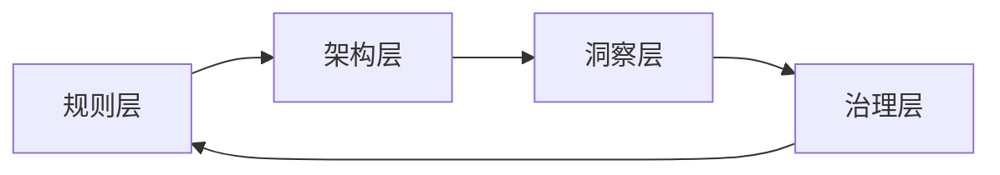

# Agent 时代四层能力：学习计划的外部综合笔记

> **说明**：概念与术语依据百科、教材级公开资料与经典文献综述核对；学习计划的四层结构与「实践优先」等建议来自你提供的提纲文件。本文**未**引用本仓库内其他学习文章作材料来源。

---

## 读完这篇你能做什么

你能用一张「四层分工表」检查自己的人机协作设计：**规则**是否把激励算清楚、**架构**是否把闭环画清楚、**洞察**是否把真问题钉清楚、**治理**是否把反馈和改进行程化。每层下面该补哪类知识、日常怎么练，也有对应条目。

---

## 30 秒心智模型

**核心问题**：自动化越强，人越不靠「手速」吃饭；那人的比较优势落在哪？

把人的工作想成四个旋钮，而不是四条流水线：

| 旋钮 | 你在调什么 |
|------|------------|
| 规则 | 边界、激励、多方博弈下的可执行性 |
| 架构 | 人机分工、模块、降级与闭环 |
| 洞察 | 假设、证据、问题是否值得做 |
| 治理 | 监控、指标、持续改进 |

旋钮会互相拉扯：监控发现系统性失配，往往要回去改规则或改架构。学的时候按层展开；干活时几层叠在一起很正常。

---

## 规则层：博弈论、行为经济学、机制设计

### 为什么归在一层

这一层回答的是：**在多方各怀信息、各追私利的前提下，规则能不能真的「长」出你想要的行为**。拍脑袋写政策，和写清激励约束，差别就在这里。

### 博弈论：给定规则，均衡在哪里

博弈论里常见的解概念是**纳什均衡**：在他人策略不变时，没有人愿意单方面改变自己的策略。传统博弈论往往分析「规则已给定」时会发生什么。

### 机制设计：从想要的结果倒推规则

机制设计常被说成**逆向博弈论**（reverse game theory）：不是给定博弈去求均衡，而是**设计**博弈（规则、信息结构、支付），使理性参与人在均衡处实现设计者想要的社会目标。维基百科与经济学教科书语境下，它研究在参与者有私人信息与自利动机时，如何构造规则与制度。Hurwicz、Maskin、Myerson 因机制设计的基础工作获 2007 年诺贝尔经济学奖（瑞典皇家科学院公开材料可查）。

**激励相容**是这条线上的关键词：要让说真话、做对事成为参与人的自利选择，而不是靠道德喊话。机制设计里常见的问题类型包括信息不对称下的**逆向选择**与**道德风险**——这些词本身就把「规则层」和真实世界对齐了。

### 行为经济学：人不是纸上的理性人

行为经济学把心理学与经济学结合，研究**有限理性**、启发式与系统性偏差。芝加哥大学对「什么是行为经济学」的公开阐释强调：它关注人们**实际**如何决策，而非理想模型假设人们应当如何决策。

Thaler 与 Sunstein 在《Nudge》中推广的**助推（nudge）**指：通过选择架构等方式，以可预测的方式改变行为，同时不显著改变经济激励、也不取消选项。政策与产品设计里很常见；学界对助推效果大小也有持续复盘——这提醒你：**规则层要验收**，不能只看设计意图。

### 这一层怎么练（面向工作）

- 写一个「机制草图」：参与者是谁、私人信息是什么、可观测行动是什么、支付函数怎么写；你希望实现的「好结果」能否写成可检验指标。
- 给 AI 工作流写规则时，问一句：如果使用者要钻空子，空子会在哪？这是博弈视角，不是挑刺。

---

## 架构层：系统论、价值流、服务设计、设计思维

### 为什么归在一层

这一层回答的是：**人和工具怎么接成系统**，需求怎么流、手递手在哪、失败时怎么落回安全态。你画的不是「功能列表」，而是**流与边界**。

### 系统论：先看整体与反馈

系统思维强调组件之间的关系、信息与物料的流动，以及**整体目的**；服务场景里常见表述是：从外部需求出发看流动与决策，而不是只看局部职能切分。这不是唯一正统定义，但对工程化协作足够当「脚手架」。

### 价值流（Value stream mapping）

价值流图是精益里用来**可视化端到端交付步骤**的工具：从概念到客户可用，经过哪些步骤、等待与返工在哪里。它来自丰田生产方式的实践传统，在软件与服务业里常被借用来找浪费与瓶颈。它和「用户旅程」不同：旅程偏体验叙事，价值流更偏运营与交付的事实链——两者可以互补，但别混成一张图。

### 服务设计与设计思维

服务设计关心跨触点的整体服务如何被组织；设计思维通常强调以人为中心、原型与迭代——在「人机协作产品」里，它帮你把**共设计**（人、流程、工具一起改）从口号落到工作坊与原型。

### 这一层怎么练

- 画两张图：一张当前态价值流（含等待与返工），一张目标态；把「AI 介入点」标在**手递手**与**决策点**上，而不是均匀撒胡椒面。
- 给每个自动化模块写「降级路径」：模型不可用、工具超时、人拒绝时，系统退到什么安全行为。

---

## 洞察层：第一性原理、批判性思维、论证分析

### 为什么归在一层

这一层回答的是：**问题问对了没有**，以及**你相信的东西凭什么**。自动化会放大错误前提：前提偏一寸，后面可以偏一里。

### 第一性原理

哲学传统里，亚里士多德式的「第一原理」指推理的起点：不能再从更基本的东西推导出来。工程语境里常被说成：把问题拆到可验证的基本事实，再往上构造方案；它与**类比推理**对照——类比省事，但会把旧假设一起进口。

实务上你不必把每个项目都做成哲学课；把它当**提问纪律**就好：哪些是事实、哪些是行业惯例、哪些是某家产品的实现细节？

### 论证分析：Toulmin 模型很好用

Stephen Toulmin 在《The Uses of Argument》（1958）提出一种分解论证的结构，常见六要素：**Claim（主张）**、**Data/Grounds（依据）**、**Warrant（保证/推理链）**、**Backing（对保证的支援）**、**Qualifier（限定）**、**Rebuttal（反驳与例外）**。写作与沟通课程广泛使用；对你读模型输出、读需求文档、读数据结论都直接有用——因为它逼你把「所以」说清楚。

### 批判性思维

把它落到三个动作就够硬：**澄清概念**、**检验证据强度**、**列出替代解释**。和 Toulmin 一起用，基本能挡住大量「听起来对」的废话。

### 这一层怎么练

- 对任何强结论跑一遍 Toulmin：主张是什么、数据是什么、保证链条有没有跳步、反例在哪里。
- 把「要解决的问题」单独写一行，和「可能的解决方案」分开；很多人把方案当问题。

---

## 治理层：控制论、运营管理、质量改进

### 为什么归在一层

这一层回答的是：**运行起来之后怎么办**。自动化不会一劳永逸；你要监控、学习、改标准。

### 控制论：反馈是核心隐喻

Norbert Wiener 将控制论表述为对**动物与机器中的控制与通信**的研究。工程直觉里最重要的是**反馈**：输出被测量，与目标比较，误差回传影响下一步。负反馈常对应稳定与纠错；正反馈放大偏差，可以导致失控或「越滚越大」——两者在组织与系统里都很常见。维基百科与《大英百科》条目对术语源流有概述可查。

### 质量改进：把学习写成循环

**PDCA**（Plan-Do-Check-Act）通常追溯到 Shewhart 在贝尔实验室的工作，经 Deming 等人在日本产业实践中推广；维基百科与质量管理教材对四步有稳定表述。Deming 后来更强调用 **Study** 替代单纯的 Check（PDSA），强调从结果中学习而不只是判对错——这和 AI 系统里「上线—观测—再训练/再提示」的节奏是同构的。

统计过程控制（SPC）与**控制图**思想，本质是把波动分成**常见原因**与**特殊原因**：前者改系统，后者找异常。这对设定告警阈值、避免「对噪声反应过度」很有帮助。

### 这一层怎么练

- 给自动化流水线选少量**领先指标**（过程）与**滞后指标**（结果），先保证可观测，再谈优化。
- 每次事故做短复盘：变更是信号还是噪声？规则层要改还是架构层要改？

---

## 四层如何转圈（不是直线）

学的时候从浅到深过一遍；运行时常常是：**治理**发现问题 → **洞察**重述问题 → **架构**调整协作 → **规则**改激励与约束 → 再回到治理验证。下面是一张极简示意图。

---

## 学习建议（与提纲对齐）

- **实践优先**：用真实任务驱动；每层各选一个小项目做「刻意练习」。
- **案例研究**：成功与失败都看；失败案例往往把机制暴露得更清楚。
- **迭代框架**：这张四层表本身也该随经验改——它应当是工具，不是护身符。

---

## 参考文献与入口（公开网页）

1. Mechanism design — Wikipedia: https://en.wikipedia.org/wiki/Mechanism_design  
2. The Sveriges Riksbank Prize in Economic Sciences in Memory of Alfred Nobel 2007 — Nobelprize.org（机制设计相关）  
3. What is behavioral economics? — University of Chicago News: https://news.uchicago.edu/explainer/what-is-behavioral-economics  
4. Nudge (book) / Nudge theory — Wikipedia（助推定义与争议入口）  
5. Cybernetics — Wikipedia: https://en.wikipedia.org/wiki/Cybernetics  
6. Norbert Wiener — Britannica（《Cybernetics: Or Control and Communication in the Animal and the Machine》条目入口）  
7. PDCA — Wikipedia: https://en.wikipedia.org/wiki/PDCA  
8. Toulmin method — Wikipedia: https://en.wikipedia.org/wiki/Toulmin_method  
9. Colorado State University Writing Studio — Using the Toulmin Method: https://writing.colostate.edu/guides/guide.cfm?guideid=58  

（若你需要把某一层扩成独立深读清单，可以指定层名与偏好的材料类型：教材、综述或视频课程。）
