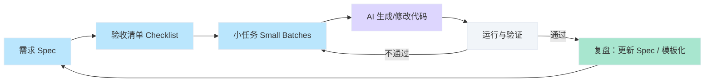
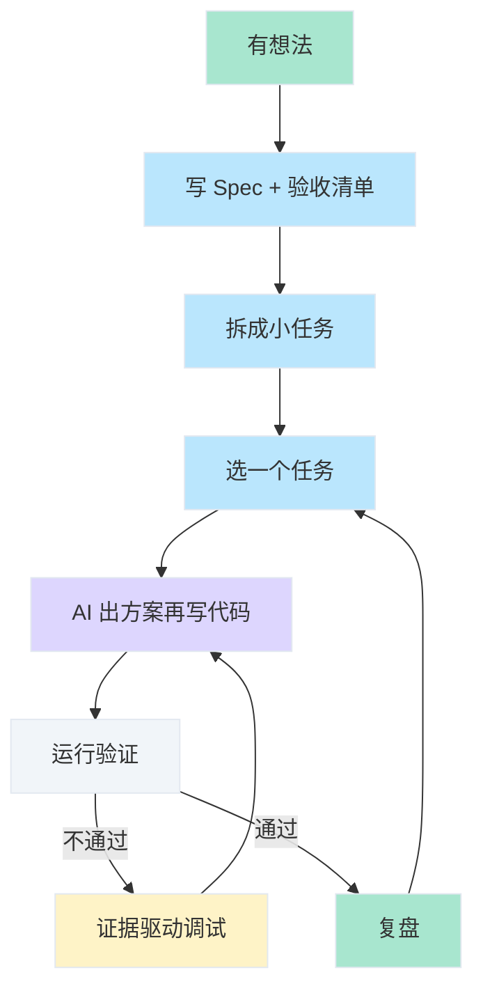

# Vibe Coding 学习总结

> [!abstract] 本文定位
> 面向想「建立正确认知 + 能指导实战」的读者，提炼出一套可复用的方法论、模板与落地路径。读本文即可掌握 Vibe Coding 的核心概念与闭环做法；通过 [一个完整案例讲清流程与技巧](#一个完整案例讲清流程与技巧) 即可按模板动手跟做或自建 MVP。

---

## 阅读路径（怎么用这份总结）

| 目标 | 建议路径 |
|------|----------|
| **想快速落地** | 先看 [快速概览](#快速概览) → [术语表](#术语表) → [可复用模板](#可复用模板) → [一个完整案例讲清流程与技巧](#一个完整案例讲清流程与技巧) |
| **想搞懂原理** | 先看 [快速概览](#快速概览) → [阅读指南](#阅读指南) → [核心概念](#核心概念) → [概念关系图](#概念关系图) → [为什么需要 / 价值](#为什么需要与价值) → 再按上面路径落地 |

---

## 快速概览

**一句话结论**：Vibe Coding 是「你当 PM+QA、AI 当实现者」的协作方式；效率来自 **需求 → 验收清单 → 拆小任务 → 实现 → 验证 → 复盘** 的闭环，不是来自「让 AI 一次性写完全部」。

> [!tip] 闭环一眼记
> **Spec → 验收清单 → 小任务 → AI 写码 → 跑通验证 → 不通过则证据调试 → 复盘 → 下一轮。**

**要解决的问题**：
- 如何用自然语言把需求说清、让 AI 产出可验收的代码
- 如何减少返工：小步迭代、证据驱动调试、质量底线

> [!warning] 核心约束
> **不运行、不验收、不复盘，几乎等于没学会。** 先能跑起来建立正反馈，再谈架构与上线。

---

## 阅读指南

> [!info]- 来源、语境与约定（可展开）
> **来源与语境**：Vibe Coding（氛围编程）一词由 Andrej Karpathy 在 2025 年 2 月提出，指用自然语言描述目标、由 AI 生成代码的协作方式。业界常区分两种形态：**「纯」氛围编程**（完全信任 AI 输出、适合周末即兴项目、速度优先）与 **负责任 AI 辅助开发**（指导 AI → 审查、测试、理解产出 → 对结果拥有完全所有权）。**本文立场**：采用后者（你当 PM+QA、AI 当实现者）；不讨论「纯 vibe」放任式用法。
>
> **本文语境**：讨论范围是「用自然语言 + AI 生成代码」的**可验收、可复盘**迭代开发方式，侧重正确认知、验收流程与可复用模板。**案例以 GitHub Copilot 官方教程与 Microsoft Learn 动手实验（电商原型）为据**，流程与概念可直接套用到 Cursor、Copilot 等 AI 辅助开发环境；其它 IDE/模型选型见 [工具选型](#5-工具选型tooling-fit)。
>
> **建议前置知识**：会用电脑、能本地跑一个小程序或打开一个网页即可；无需先会写代码。
>
> **约定**：文中的「验收清单」「小任务」「证据驱动调试」等均按下方术语表与正文中的「在本文中的落点」理解。

---

## 术语表

| 术语 | 定义 | 在本文中的落点 |
|------|------|----------------|
| **Vibe Coding** | 用自然语言描述需求、由 AI 生成代码的协作方式；开发者从「写代码」转向「写需求、验收、调试与质量控制」。词源：Karpathy 2025 年 2 月提出；韦氏词典 2025 年 3 月收录为「slang & trending」。 | 全文方法论与模板均围绕**负责任协作**形态展开（审查、测试、理解、拥有权），非「纯 vibe」放任式。 |
| **Spec（规格说明）** | 目标、约束、边界、验收的集合；把「愿望」写成 AI 能理解且可验收的说明。 | [自然语言驱动开发](#1-自然语言驱动开发prompt-as-spec)、[项目启动需求模板](#1-项目启动需求模板)。 |
| **验收清单** | 逐条可验证的完成标准，每条约 30 秒内可验证。 | [验收清单](#2-验收清单acceptance-checklist)、[速查清单](#速查清单)。 |
| **小步迭代** | 把项目拆成可独立完成、独立验收的小任务，一次只做一件事。 | [小步迭代](#3-小步迭代small-batches)、[单任务交付模板](#2-单任务交付模板一次只做一件事)。 |
| **证据驱动调试** | 用日志、复现步骤、期望 vs 实际、代码位置来定位并修复问题。 | [证据驱动调试](#4-证据驱动调试evidence-driven-debug)、[Debug 模板](#3-debug-模板修-bug--修构建)。 |

---

## 背景与痛点

**现状**：AI 能生成大量代码，但「生成 ≠ 可用」。一次性要全项目、不验收、不运行，很容易得到无法运行或逻辑错误的产物。

| 常见痛点 | 后果/表现 |
|----------|-----------|
| 需求说不清 | AI 理解偏差 → 反复改 |
| 没有「完成定义」 | 不知道何时算做完 |
| 一次改太多 | 难以定位问题、返工成本高 |
| 报错只丢一句「报错了」 | AI 无法复现，修复低效 |

**根因**：把 Vibe Coding 当成「AI 替你把活全干了」，而不是「你负责规格与质量、AI 负责实现」的闭环协作。

---

## 核心概念

> [!tip] 快速扫读版（若只想用可先跳到 [可复用模板](#可复用模板)）
> 1. 把需求写成可验收的 Spec，一次只做一个小任务。  
> 2. 用验收清单判定「做完」，每条可 30 秒内验证。  
> 3. 先让 AI 出方案（结构/数据/流程），再写代码。  
> 4. 修 bug 时提供完整证据：日志 + 步骤 + 期望/实际 + 代码位置。

### 1) 自然语言驱动开发（Prompt as Spec）

**定义**：把产品需求写成 AI 能理解的规格说明，并持续用其约束生成与修改。

**关键点**：
- 从「描述愿望」升级为「写可验收的规格」：功能、输入输出、边界、错误处理、验收清单。
- 先规格后代码：可让 AI 先在对话里列出方案（文件结构/数据结构/流程），你确认后再让它写代码；避免直接要「全量代码」。
- 一次只做一件事：任务切到可验证的最小单元（Minimum Verifiable Unit），见 [小步迭代](#3-小步迭代small-batches)。

> [!example] 示例：从「愿望」升级为「可验收的规格」
> - 不要说：「做个像 ChatGPT 一样的应用。」  
> - 要说：「做一个本地可运行的 ChatGPT 风格对话网页：有输入框和发送按钮；调用 OpenAI API 流式显示回复；API Key 放 .env 不提交；错误时有明确提示；完成标准见下方验收清单……」完整示例见 [一个完整案例讲清流程与技巧](#一个完整案例讲清流程与技巧)。

### 2) 验收清单（Acceptance Checklist）

**定义**：把「做完」的判定写成逐条可验证的 checklist。

**关键点**：
- 每条都能在约 30 秒内验证（点一下/跑一个命令/看一个输出）。
- 覆盖功能 + 边界 + 错误处理 + 性能/体验底线。完整示例见 [一个完整案例讲清流程与技巧 - 第一步](#第一步从愿望到可验收的-spec)。

> [!example] 验收清单示例（片段）
> - [ ] 本地启动后首页能打开，初次无数据时显示空态说明  
> - [ ] 新增一条金额为 12.34 的记录后，列表立即出现且总额正确  
> - [ ] 输入金额为 "abc" 时不崩溃，有明确错误提示  

### 3) 小步迭代（Small Batches）

**定义**：把项目拆成可独立完成、独立验收的小任务，而不是一次生成全项目。

**关键点**：每个任务有输入/输出/验收点/涉及文件；每做完一个就运行并验证，问题尽早暴露。

### 4) 证据驱动调试（Evidence-driven Debug）

**定义**：修复问题时，给 AI 的输入必须包含可复现证据，让修复变成工程化流程。

**关键点**：完整报错日志、复现步骤、期望 vs 实际、相关代码位置（文件/函数/片段）。对应 [Debug 模板](#3-debug-模板修-bug--修构建)。

### 5) 工具选型（Tooling Fit）

**定义**：选择适合「当前阶段」的 AI 工具与工作方式，而非追最强模型。

**关键点（可借鉴维度）**：适用场景（写新功能/重构/调试/查资料）、调试成本、多文件能力、上下文能力（能否稳定记住约束与历史决策）。选型时比较这几项即可，不必追最新模型；常见流程形态有 Ask/Plan/Agent（先调研→再规划→再实现）、代码级循环、应用生命周期，见 [与官方流程的对应关系](#与官方流程的对应关系)。

> [!note] 代码级 vs 应用级（可选扫读）
> 部分文档（如 Google Cloud）把氛围编程分为两层：**代码级工作流**——单次「描述目标 → AI 生成 → 执行观察 → 反馈优化」的循环；**应用生命周期**——从构思到部署的「构思 → 生成 → 迭代优化 → 测试验证 → 部署」。本文的验收清单与小步迭代同时覆盖两者：每个小任务可以是代码级的一轮循环，整体项目按应用级推进。

---

## 概念关系图



> [!tip] 读图结论（一句话记）
> 与 [快速概览](#快速概览) 一致：**需求 → 验收清单 → 拆小任务 → AI 写码 → 跑通验证 → 出问题则证据驱动调试 → 复盘后进入下一轮。** 与官方流程对应见 [与官方流程的对应关系](#与官方流程的对应关系)。

---

## 为什么需要与价值

> [!failure]- Before（无闭环）
> 随口描述需求 → AI 生成一大坨代码 → 不跑不验 → 上线或联调时才发现跑不通/逻辑错。

> [!success]- After（有闭环）
> 写清 Spec + 验收清单 → 拆小任务 → 每步生成→运行→验证 → 问题用证据驱动调试 → 复盘沉淀模板。

**价值**：更快产出 MVP、更稳定交付、更可复用（一次复盘沉淀成模板与清单）。

### 常见质疑 Q&A

| 质疑 | 一句话结论 |
|------|------------|
| 会不会过度设计？ | 本文强调「先能跑、再交互、再上线」；模板与清单是为减少返工，可按项目规模取舍。 |
| 不会写代码能学吗？ | 能。前置只需会跑本地程序；写需求、验收、复现问题不要求会写代码，但要求会「说清」与「验证」。 |
| AI 生成代码质量靠谱吗？ | 质量由你的 Spec、验收清单和迭代节奏决定；你做得越工程化（PM+QA 角色），AI 越像可靠队友。 |
| 要追最新模型吗？ | 不必。选型看适用场景、调试成本、多文件与上下文能力（见 [工具选型](#5-工具选型tooling-fit)）。 |
| 算不算「真·vibe coding」？ | Simon Willison：若每行都检查、测试且完全理解，更像是「LLM 当打字助理」；本文取负责任协作，强调验收与理解，与「纯 vibe」区分开。 |

---

## 重要细节（小白最容易忽略）

### 1) “先能跑起来”的心理预期

> [!success] 心态优先
> 一开始追求的不是「架构优雅」，而是 **尽快建立正反馈**：先跑一个最小 demo → 再做交互 → 最后再考虑上线/部署。这会显著降低挫败感，也在真实运行中快速练好 debug。

### 2) 先方案后编码

方案（模块边界、文件结构、数据结构、关键流程）先于代码；按任务逐个实现、每次只动少量文件。详见 [核心概念 - 自然语言驱动开发](#1-自然语言驱动开发prompt-as-spec)。

### 3) 角色分工：你是 PM + QA

> [!info] 角色
> AI 是「实现者」，你是 **PM**（目标、范围、优先级、约束）和 **QA**（验收、复现、验证）。你做得越工程化，AI 越可靠。

### 4) 风险与应对

常见风险：安全漏洞、依赖/许可证、逻辑错误、测试缺失导致回归。应对：把 **验收清单 + 最小化变更 + 少量自动化测试** 当作底线。

---

## 一个完整案例讲清流程与技巧

本节以 **GitHub Copilot - Vibe coding** 官方教程（[docs.github.com](https://docs.github.com/en/copilot/tutorials/vibe-coding)）与 **Microsoft Learn - Get started with vibe coding (Copilot Agent)** 动手实验（[用 Copilot Agent 搭建电商原型](https://microsoftlearning.github.io/mslearn-github-copilot-dev/Instructions/Labs/LAB_AK_06_vibe_coding_prototype_ecommerce_app.html)）为据，以后者「搭建电商原型」为示例，按 **Ask → Plan → Agent** 的顺序讲清：需求如何表达、任务如何拆、如何实现与验收、报错如何处理。流程与概念对应官方文档，可直接跟做上述实验或套用到其它项目。操作可在 Cursor、GitHub Copilot 等 AI 辅助开发环境中完成（Chat/Ask、Plan、Agent 或 Cmd+I/Cmd+K）。

| 阶段 | 做什么 | 产出/验收 |
|------|--------|-----------|
| **Ask** | 收窄需求：用户与场景、必须做/不做、技术约束 | 一段或一表 **Spec** + 4～6 条可验证验收标准 |
| **Plan** | 请 AI 按 Spec 拆小任务，每任务 1～2 个文件、有验收点与「不允许做」 | **任务列表**（先能跑 → 再数据 → 再交互） |
| **Agent** | 按任务逐个实现；每完成一个执行固定验收动作 | 通过则下一任务；不通过则带证据调试 |

---

### Ask：从想法到可执行的 Spec（需求如何表达）

在 Chat/Ask 中仅描述「做一个电商原型」时，AI 无法确定范围、用户场景和技术选型，容易做偏或做大。

**需求表达**需按步骤收窄：

1. **用户与场景**：明确「仅本地演示用、浏览器打开、不部署、不接真实支付」。
2. **必须做 / 明确不做**：必须有的——首页、商品列表、加入购物车、购物车页、简单合计；先不做的——登录、订单持久化、支付、多端同步。
3. **技术约束**：约定技术栈（如简单前端 + 本地状态或静态数据）、目录与文件约定。
4. **验收标准**：请 AI 根据以上整理成 4～6 条可验证的验收标准，每条约 30 秒内可验证，例如：① 本地启动后首页可打开、无报错；② 商品列表展示、点击「加入购物车」后购物车数量更新；③ 进入购物车页可见已加商品与合计；④ 清空或删除后合计正确。

将以上结论整理成一段或一张表，即本轮的 **Spec**，作为后续 Plan 与 Agent 的基准。对应官方教程中的 **Ask**：先描述目标、澄清「典型功能」「需考虑什么」、确定数据结构与范围，再进入 Plan。

---

### Plan：从 Spec 到任务列表（任务如何拆）

Spec 确定后，不直接要求「全部实现」，而是先 **Plan**：列出功能、页面/路由、数据结构，再拆成小任务。

在 Chat 中贴入 Spec，请 AI「按此 Spec 拆成 6～8 个小任务，每个任务只改 1～2 个文件，写清验收点和不允许的做法」。对返回的任务列表按「先能跑 → 再数据 → 再交互 → 再增强」检查顺序，并确认每条都有验收点与「不允许做」的边界。例如：

- **任务 1**：项目骨架 + 首页（可启动、首页可打开、无报错）。不允许：商品列表、购物车逻辑。
- **任务 2**：商品列表（静态或简单数据源、列表展示）。不允许：购物车、下单。
- **任务 3**：加入购物车（点击后状态/列表更新、购物车数量可见）。不允许：购物车页、结算。
- **任务 4**：购物车页（已加商品、合计）。**任务 5**：删除/清空与合计重算。**任务 6**（可选）：简单样式或空态。

每个任务在实现前明确：改/新增哪几个文件、输入与输出、验收动作、不允许做什么。实现时**一次只做一个任务**，用 Agent（或 Copilot Agent）执行该任务，做完立即验收，通过后再做下一项。对应官方教程中的 **Plan**：写清功能列表、约束与进一步考虑，迭代到计划可执行。

---

### Agent：实现与验收（每个任务做完如何验收）

验收依据**固定动作**：执行什么 → 观察什么 → 是否通过。

**任务 1 完成后**：在终端启动应用，浏览器打开首页。观察：首页正常渲染、控制台无报错。通过则进入任务 2；未通过则先修或带证据请 AI 修复。

**任务 2 完成后**：打开商品列表所在页面/路由。观察：商品列表展示正确。通过则进入任务 3。

**任务 3 完成后**：点击某商品的「加入购物车」。观察：购物车数量或状态更新、无报错。未通过时（如点击无反应、控制台报错）进入「报错处理」流程，修完再按同一动作验收，通过后再做任务 4。

**任务 4～6**：按拆任务时写明的验收点，同样「执行 → 观察 → 通过/不通过」。原则：每条验收在约 30 秒内可完成；不通过则不进入下一任务，先修当前任务。

对应官方教程中的 **Agent**：按任务逐个实现；**Testing**：在浏览器中操作、记录 2～3 项要改的、按任务迭代修复。

---

### 报错如何处理

出现报错（如点击「加入购物车」无反应、控制台报错）时，不在 Chat 中仅说「报错了」，而应**带证据**：

1. **复现步骤**：按顺序写出操作（如：① 启动应用并打开首页 ② 打开商品列表 ③ 点击某商品「加入购物车」）。
2. **完整报错**：从终端或浏览器控制台复制整段报错（含类型、信息、堆栈）。
3. **相关代码位置**：标出涉及的文件与位置（如 `CartContext.tsx` 第 20 行、`ProductList.tsx` 中按钮的 onClick）。

在 Chat 中 **@ 相关文件**（若有），并贴入结构化描述（格式见 [Debug 模板](#3-debug-模板修-bug--修构建)）：

```
【问题现象】点击「加入购物车」后无反应，控制台报错。
【复现步骤】1. 启动应用打开首页  2. 进入商品列表  3. 点击某商品「加入购物车」
【期望行为】购物车数量更新。
【实际行为】无变化，控制台报错。
【报错日志】此处粘贴完整内容
【相关代码位置】CartContext.tsx 第 20 行；ProductList.tsx 中按钮 onClick。
【请输出】根因 + 最小修改方案 + 如何验证修好。
```

按 AI 给出的方案修改后，再按该任务的验收动作执行一遍；通过则继续下一任务，未通过则更新复现步骤与日志后重复上述过程。对应官方教程：报错时复制完整错误信息到聊天、请 Copilot 修复。

---

### 与官方流程的对应关系

本文 Ask → Plan → Agent、单任务验收、带证据报错与 [GitHub Copilot - Vibe coding](https://docs.github.com/en/copilot/tutorials/vibe-coding)、[Microsoft Learn - Get started with vibe coding (Copilot Agent)](https://microsoftlearning.github.io/mslearn-github-copilot-dev/Instructions/Labs/LAB_AK_06_vibe_coding_prototype_ecommerce_app.html) 一致：Ask = 需求与规格澄清，Plan = 拆小任务与约束，Agent = 按任务实现 + 浏览器/操作验收；报错时贴完整日志与复现步骤。

### 小结：需求表达、拆任务、验收、报错

| 环节 | 本案例对应 |
|------|------------|
| **需求表达 (Ask)** | 从「做电商原型」→ 明确用户与场景 → 必须做/明确不做 → 技术约束 → 整理为可验证的验收标准，得到 Spec。 |
| **拆任务 (Plan)** | 将 Spec 交 AI 拆成若干小任务，每任务仅动 1～2 个文件、有验收点与「不允许做」；人工检查顺序与边界，一次只做一项。 |
| **实现与验收 (Agent)** | 每任务完成后：执行固定验收动作（如启动、打开页面、点击加入购物车）→ 观察固定结果（如数量更新、无报错）→ 通过才做下一项。 |
| **报错** | 复现步骤 + 完整日志 + 代码位置 → Chat 中 @ 文件并贴证据 → 按方案修改 → 再跑同一套验收直至通过。 |

上述流程与 [GitHub Copilot - Vibe coding](https://docs.github.com/en/copilot/tutorials/vibe-coding) 及 [Microsoft Learn - Get started with vibe coding (Copilot Agent)](https://microsoftlearning.github.io/mslearn-github-copilot-dev/Instructions/Labs/LAB_AK_06_vibe_coding_prototype_ecommerce_app.html)（[学习资料汇总](学习资料汇总.md) 有链接）一致，可直接跟做该实验；完成后可用文中的 [项目启动需求模板](#1-项目启动需求模板) 与 [单任务交付模板](#2-单任务交付模板一次只做一件事) 自建小项目。

---

### 可复用要点与常见陷阱

- 先有验收清单再写代码；先方案后编码；一次一个小任务，每步都跑一遍验收；报错时带证据（复现步骤 + 完整日志 + 代码位置）。在 Cursor、Copilot 等环境中善用 Chat/Ask、Plan、Agent 及 @ 文件、Rules。

> [!warning] 四个常见坑
> - **只生成不运行** → 每次生成后立刻做最小验证（启动、打开页面、跑一个用例）。  
> - **一次要全项目** → 拆成多个小任务，每次只改少量文件并保证可运行。  
> - **没有验收标准** → 把「做完」写成 checklist，缺一条都算没完成。  
> - **只说「报错了」** → 带复现步骤、完整日志和代码位置再问 AI。

---

## 可复用模板

### 1) 项目启动需求模板

- **项目目标**：  
- **用户与使用场景**：  
- **必须包含的功能**：  
- **明确不做的内容**：  
- **页面/接口清单**：  
- **数据结构（字段 + 示例）**：  
- **验收标准（逐条可验证）**：  
- **约束**：语言/框架/必须可本地运行/是否需要部署/时间限制……

### 2) 单任务交付模板（一次只做一件事）

- **任务名**：  
- **要改动/新增的文件**：  
- **输入**：  
- **输出**：  
- **验收点**：  
- **不允许的做法**（如：不引入新框架、不改动无关模块、不改 API 形状）：  

### 3) Debug 模板（修 bug / 修构建）

- **问题现象**：  
- **复现步骤**：  
- **期望行为**：  
- **实际行为**：  
- **报错日志**：粘贴完整内容  
- **相关代码位置**：文件路径 + 关键函数/片段  
- **请输出**：根因分析 + 最小修复方案 + 修改点列表 + 如何验证修复成功  

---

## 速查清单（每次开干前过一遍，约 1 分钟；每条验收约 30 秒内可验证）

> [!todo]+ 开干前过一遍
> - [ ] 我写清楚「做什么」和「明确不做什么」了吗？  
> - [ ] 我有逐条可验证的验收清单了吗？  
> - [ ] 我把项目拆成小任务了吗（每次只做一个）？  
> - [ ] 我是否能在本地跑起来并验证？  
> - [ ] 遇到问题我能提供完整日志与复现步骤吗？  
> - [ ] 我准备在结束时做简短复盘并沉淀模板吗？（例如：AI 为什么误解？下次要补哪个约束/示例/验收条目？→ 可复用 [可复用模板](#可复用模板)）  

---

## 延伸学习（卡住时怎么补）

与 [常见质疑 Q&A](#常见质疑-qa) 互补：下表按「卡在哪」指向具体章节与模板，Q&A 针对常见顾虑。

| 卡在哪 | 怎么补 |
|--------|--------|
| 总写不清需求/验收 | 回看 [验收清单](#2-验收清单acceptance-checklist) 的定义与示例，强制把每条写成可验证动作 |
| 总拆不好任务 / 总想一次做太多 | 把任务切到「只改少量文件」、每任务有明确验收点；可复用 [单任务交付模板](#2-单任务交付模板一次只做一件事)，避免一次要全项目 |
| 总修不动 bug | 用 [Debug 模板](#3-debug-模板修-bug--修构建) 补齐证据，让 AI 能复现并给出最小修复 |
| 不知道用什么工具 | 按「适用场景/调试成本/多文件能力/上下文能力」做选型（见 [工具选型](#5-工具选型tooling-fit)） |

---

## 总结与落地建议

**决策流程（一眼记）**：



**核心原则**：  
闭环优于完美；验收优于猜测；证据优于描述；复盘优于重复踩坑。  
落地时优先用 [可复用模板](#可复用模板) 和 [一个完整案例讲清流程与技巧](#一个完整案例讲清流程与技巧)；卡住时按 [延伸学习](#延伸学习卡住时怎么补) 自查。

---

## 参考资料（本文学习时参考的来源，仅作引用与溯源）

- [GitHub Copilot - Vibe coding](https://docs.github.com/en/copilot/tutorials/vibe-coding)：Ask → Plan → Agent 流程、单任务迭代、报错贴完整信息。
- [Microsoft Learn - Get started with vibe coding (Copilot Agent)](https://microsoftlearning.github.io/mslearn-github-copilot-dev/Instructions/Labs/LAB_AK_06_vibe_coding_prototype_ecommerce_app.html)：用 Copilot Agent 搭建电商原型动手实验，本文案例据此展开。
- [Google Cloud - 什么是氛围编程](https://cloud.google.com/discover/what-is-vibe-coding?hl=zh-CN)：两种形态（纯 vibe vs 负责任 AI 辅助）、代码级工作流与应用生命周期、传统 vs 氛围编程对比。
- [Wikipedia - Vibe coding](https://zh.wikipedia.org/wiki/Vibe_coding)（中）：词源（Karpathy 2025-02）、Simon Willison 对「检查并理解则不算 vibe coding」的区分、使用情形与问责/风险。
- [MIT Technology Review - What is vibe coding exactly?](https://www.technologyreview.com/2025/04/16/1115135/what-is-vibe-coding-exactly/)
