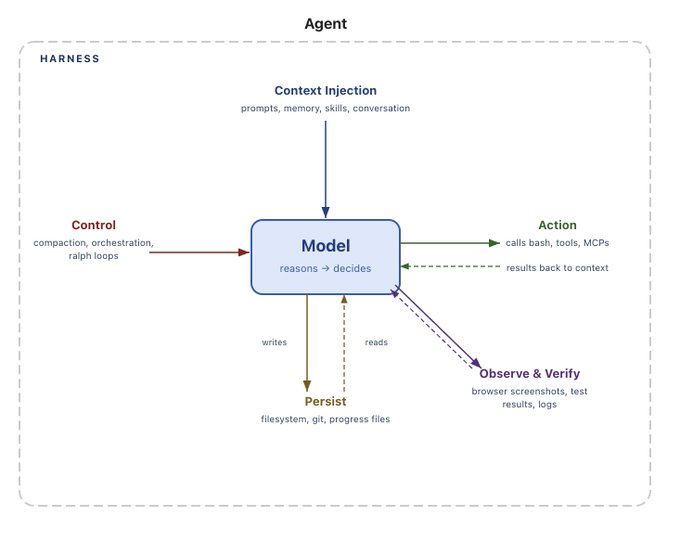
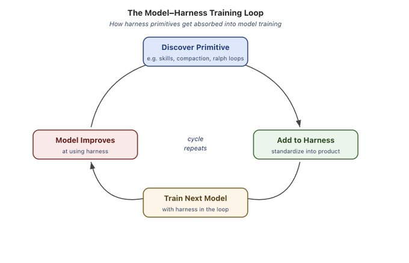

# The Anatomy of an Agent Harness

*By Vivek Trivedy*

**TLDR:** Agent = Model + Harness. Harness engineering is how we build systems around models to turn them into work engines. The model contains the intelligence and the harness makes that intelligence useful.We define what a harness is and derive the core components today's and tomorrow's agents need.

Agent = Model + Harness

**If you're not the model, you're the harness.**

A harness is every piece of code, configuration, and execution logic that isn't the model itself. A raw model is not an agent. But it becomes one when a harness gives it things like state, tool execution, feedback loops, and enforceable constraints.

Concretely, a harness includes things like:

- System Prompts
- Tools, Skills, MCPs + and their descriptions
- Bundled Infrastructure (filesystem, sandbox, browser)
- Orchestration Logic (subagent spawning, handoffs, model routing)
- Hooks/Middleware for deterministic execution (compaction, continuation, lint checks)

There are many messy ways to split the boundaries of an agent system between the model and the harness. But in my opinion, this is the cleanest definition because it forces us to think about **designing systems around model intelligence.**

The rest of this post walks through core harness components and derives *why* each piece exists working backwards from the core primitive of a model.

## Why Do We Need Harnesses…From a Model's Perspective

**There are things we want an agent to do that a model cannot do out of the box. This is where a harness comes in.**Models (mostly) take in data like text, images, audio, video and they output text. That's it. Out of the box they cannot:

- Maintain durable state across interactions
- Execute code
- Access realtime knowledge
- Setup environments and install packages to complete work

These are all **harness level features**. The structure of LLMs requires some sort of machinery that wraps them to do useful work.For example, to get a product UX like "chatting", we wrap the model in a while loop to track previous messages and append new user messages. Everyone reading this has already used this kind of harness. The main idea is that we want to convert a desired agent behavior into an actual feature in the harness.

## Working Backwards from Desired Agent Behavior to Harness Engineering

Harness Engineering helps humans inject useful priors to guide agent behavior. And as models have gotten more capable, harnesses have been used to surgically extend and correct models to complete previously impossible tasks.

We won’t go over an exhaustive list of every harness feature. The goal is to derive a set of features from the starting point of helping models do useful work. We’ll follow a pattern like this:

**Behavior we want (or want to fix) → Harness Design to help the model achieve this.**

## Filesystems for Durable Storage and Context Management

**We want agents to have durable storage to interface with real data, offload information that doesn't fit in context, and persist work across sessions.**

Models can only directly operate on knowledge within their context window. Before filesystems, users had to copy/paste content directly to the model, that’s clunky UX and doesn't work for autonomous agents. The world was already using filesystems to do work so models were naturally trained on billions of tokens of how to use them. The natural solution became:

**Harnesses ship with filesystem abstractions and tools for fs-ops.**

The filesystem is arguably the most foundational harness primitive because of what it unlocks:

- Agents get a workspace to read data, code, and documentation.
- Work can be incrementally added and offloaded instead of holding everything in context. Agents can store intermediate outputs and maintain state that outlasts a single session.
- **The filesystem is a natural collaboration surface.** Multiple agents and humans can coordinate through shared files. Architectures like Agent Teams rely on this.

Git adds versioning to the filesystem so agents can track work, rollback errors, and branch experiments. We revisit the filesystem more below, because it turns out to be a key harness primitive for other features we need.

## Bash + Code as a General Purpose Tool

**We want agents to autonomously solve problems without humans needing to pre-design every tool.**

The main agent execution pattern today is a [ReAct loop](https://docs.langchain.com/oss/python/langchain/agents?ref=blog.langchain.com), where a model reasons, takes an action via a tool call, observes the result, and repeats in a while loop. But harnesses can only execute the tools they have logic for. Instead of forcing users to build tools for every possible action, a better solution is to give agents a general purpose tool like bash.

**Harnesses ship with a bash tool so models can solve problems autonomously by writing & executing code.**

Bash + code exec is a big step towards **giving models a computer** and letting them figure out the rest autonomously. The model can design its own tools on the fly via code instead of being constrained to a fixed set of pre-configured tools.

Harnesses still ship with other tools, but code execution has become the default general-purpose strategy for autonomous problem solving.

## Sandboxes and Tools to Execute & Verify Work

**Agents need an environment with the right defaults so they can safely act, observe results, and make progress.**

We've given models storage and the ability to execute code, but all of that needs to happen somewhere. Running agent-generated code locally is risky and a single local environment doesn’t scale to large agent workloads.

**Sandboxes give agents safe operating environments.** Instead of executing locally, the harness can connect to a sandbox to run code, inspect files, install dependencies, and complete tasks. This creates secure, isolated execution of code. For more security, harnesses can allow-list commands and enforce network isolation. Sandboxes also unlock scale because environments can be created on demand, fanned out across many tasks, and torn down when the work is done.

**Good environments come with good default tooling.** Harnesses are responsible for configuring tooling so agents can do useful work. This includes pre-installing language runtimes and packages, CLIs for git and testing, [browsers](https://github.com/vercel-labs/agent-browser?ref=blog.langchain.com) for web interaction and verification.

Tools like browsers, logs, screenshots, and test runners give agents a way to observe and analyze their work. This helps them create **self-verification loops where** they can **write application code,** run tests, inspect logs, and fix errors.

The model doesn’t configure its own execution environment out of the box. Deciding where the agent runs, what tools are available, what it can access, and how it verifies its work are all harness-level design decisions.

**Agents should remember what they've seen and access information that didn't exist when they were trained.**

Models have no additional knowledge beyond their weights and what's in their current context. Without access to edit model weights, the only way to "add knowledge" is via **context injection.**

For memory, the filesystem is again a core primitive. Harnesses support memory file standards like [AGENTS.md](http://agents.md/?ref=blog.langchain.com) which get injected into context on agent start. As agents add and edit this file, harnesses load the updated file into context. This is a form of [continual learning](https://www.ibm.com/think/topics/continual-learning?ref=blog.langchain.com) where agents durably store knowledge from one session and inject that knowledge into future sessions.

Knowledge cutoffs mean that models can't directly access new data like updated library versions without the user providing them directly. For up-to-date knowledge, Web Search and MCP tools like [Context7](https://context7.com/?ref=blog.langchain.com) help agents access information beyond the knowledge cutoff like new library versions or current data that didn't exist when training stopped.

Web Search and tools for querying up-to-date context are useful primitives to bake into a harness.

## Battling Context Rot

**Agent performance shouldn’t degrade over the course of work.**

[Context Rot](https://research.trychroma.com/context-rot?ref=blog.langchain.com) \*\*\*\*describes how models become worse at reasoning and completing tasks as their context window fills up. Context is a precious and scarce resource, so harnesses need strategies to manage it.

**Harnesses today are largely delivery mechanisms for good context engineering.**

**Compaction** addresses what to do when the context window is close to filling up. Without compaction, what happens when a conversation exceeds the context window? One option is that the API errors, that’s not good. The harness has to use some strategy for this case. So compaction intelligently offloads and summarizes the existing context window so the agent can continue working.

**Tool call offloading** helps reduce the impact of large tool outputs that can noisily clutter the context window without providing useful information. The harness keeps the head and tail tokens of tool outputs above a threshold number of tokens and offloads the full output to the filesystem so the model can access it if needed.

**Skills** address the issue of too many tools or MCP servers loaded into context on agent start which degrades performance before the agent can start working. Skills are a harness level primitive that solve this via **progressive disclosure.** The model didn't choose to have Skill front-matter loaded into context on start but the harness can support this to protect the model against context rot.

## Long Horizon Autonomous Execution

**We want agents to complete complex work, autonomously, correctly, over long time horizons.**

Autonomous software creation is the holy grail for coding agents. But today's models suffer from early stopping, issues decomposing complex problems, and incoherence as work stretches across multiple context windows. A good harness has to design around all of this.

This is where the earlier harness primitives start to compound. Long-horizon work requires durable state, planning, observation, and verification to keep working across multiple context windows.

**Filesystems and git for tracking work across sessions.** Agents produce millions of tokens over a long task so the filesystem durably captures work to track progress over time. Adding git allows new agents to quickly get up to speed on the latest work and history of the project. For multiple agents working together, the filesystem also acts as a shared ledger of work where agents can collaborate.

**Ralph Loops for continuing work.** [The Ralph Loop](https://ghuntley.com/loop/?ref=blog.langchain.com) is a harness pattern that intercepts the model's exit attempt via a hook and reinjects the original prompt in a clean context window, forcing the agent to continue its work against a completion goal. The filesystem makes this possible because each iteration starts with fresh context but reads state from the previous iteration.

**Planning and self-verification to stay on track.** Planning is when a model decomposes a goal into a series of steps. Harnesses support this via good prompting and injecting reminders how to use a plan file in the filesystem. After completing each step, agents benefit from the checking correctness of their work via **self-verification.** Hooks in harnesses can run a pre-defined test suite and loop back to the model on failure with the error message or models can be prompted to self-evaluate their code independently. Verification grounds solution in tests and creates a feedback signal for self-improvement.

## The Future of Harnesses

## The Coupling of Model Training and Harness Design

Today's agent products like Claude Code and Codex are post-trained with models and harnesses in the loop. This helps models improve at actions that the harness designers think they should be natively good at like filesystem operations, bash execution, planning, or parallelizing work with subagents.

This creates a feedback loop. Useful primitives are discovered, added to the harness, and then used when training the next generation of models. As this cycle repeats, models become more capable within the harness they were trained in.

But this co-evolution has interesting side effects for generalization. It shows up in ways like how changing tool logic leads to worse model performance. A good example is described [here in the Codex-5.3 prompting guide](https://developers.openai.com/cookbook/examples/gpt-5/codex_prompting_guide/?ref=blog.langchain.com#apply_patch) with the apply\_patch tool logic for editing files. A truly intelligent model should have little trouble switching between patch methods, but training with a harness in the loop creates this overfitting.

**But this doesn't mean that the best harness for your task is the one a model was post-trained with.** [The Terminal Bench 2.0 Leaderboard](https://www.tbench.ai/leaderboard/terminal-bench/2.0?ref=blog.langchain.com) is a good example. Opus 4.6 in Claude Code scores far below Opus 4.6 in other harnesses. [In a previous blog](https://x.com/Vtrivedy10/status/2023805578561060992?s=20&ref=blog.langchain.com), we showed how we improved our coding agent Top 30 to Top 5 on Terminal Bench 2.0 by only changing the harness. There's a lot of juice to be squeezed out of optimizing the harness for your task.

## Where Harness Engineering is Going

As models get more capable, some of what lives in the harness today will get absorbed into the model. Models will get better at planning, self-verification, and long horizon coherence natively, thus requiring less context injection for example.

That suggests harnesses should matter less over time. But just as prompt engineering continues to be valuable today, it’s likely that harness engineering will continue to be useful for building good agents.

It’s true that harnesses today patch over model deficiencies, but they also engineer systems around model intelligence to make them more effective. A well-configured environment, the right tools, durable state, and verification loops make any model more efficient regardless of its base intelligence.

Harness engineering is a very active area of research that we use to improve our harness building library [deepagents](https://docs.langchain.com/oss/python/deepagents/overview?ref=blog.langchain.com) at LangChain. Here are a few open and interesting problems we’re exploring today:

- orchestrating hundreds of agents working in parallel on a shared codebase
- agents that analyze their own traces to identify and fix harness-level failure modes
- harnesses that dynamically assemble the right tools and context just-in-time for a given task instead of being pre-configured

This blog was an exercise in defining what a harness is and how it’s shaped by the work we want models to do.

**The model contains the intelligence and the harness is the system that makes that intelligence useful.**

To more harness building, better systems, and better agents.