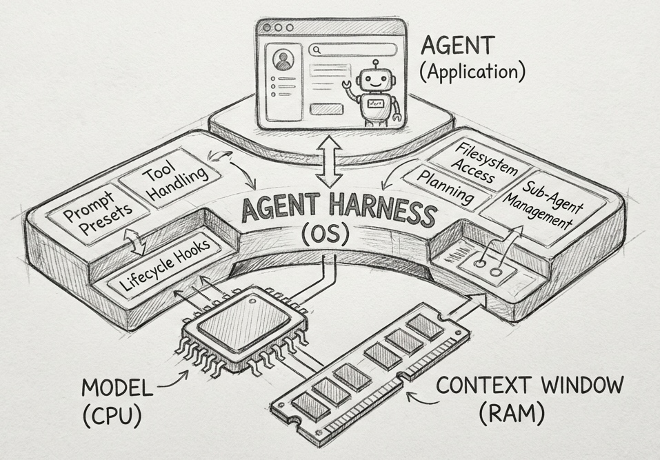

# The importance of Agent Harness in 2026

We are at a turning point in AI. For years, we focused only on the model. We asked how smart/good the model was. We checked leaderboards and benchmarks to see if Model A beats Model B.

The difference between top-tier models on static leaderboards is shrinking. But this could be an illusion. The gap between models becomes clear the longer and more complex a task gets. It comes down to durability: How well a model follows instructions while executing hundreds of tool calls over time. A 1% difference on a leaderboard cannot detect the reliability if a model drifts off-track after fifty steps.

We need a new way to show capabilities, performance and improvements. We need systems that proves models can execute multi-day workstreams reliably. One Answer to this are Agent Harnesses.

## What is an Agent Harness?

An Agent Harness is the infrastructure that wraps around an AI model to manage long-running tasks. It is not the agent itself. It is the software system that governs how the agent operates, ensuring it remains reliable, efficient, and steerable.

It operates at a higher level than agent frameworks. While a framework provides the building blocks for tools or implements the agentic loop. The harness provides prompt presets, opinionated handling for tool calls, lifecycle hooks or ready-to-use capabilities like planning, filesystem access or sub-agent management. It is more than a framework, it comes with batteries included.

We can visualize this by comparing it to a computer:

- **The Model is the CPU:** It provides the raw processing power.
- **The Context Window is the RAM:** It is the limited, volatile working memory.
- **The Agent Harness is the Operating System:** It curates the context, handles the "boot" sequence (prompts, hooks), and provides standard drivers (tool handling).
- **The Agent is the Application:** It is the specific user logic running on top of the OS.

The Agent harness implements "[Context Engineering](https://www.philschmid.de/context-engineering)" strategies like reducing context via compaction, offloading state to storage, or isolating tasks into sub-agents. For developers, this means you can skip building the operating system and focus solely on the application, defining your agent's unique logic.

Currently, general-purpose harnesses are rare. **Claude Code** is a prime example of this emerging category, attempting to standardize with the Claude Agent SDK or LangChain DeepAgents. However, one could argue that **all coding CLIs** are, in a way, specialized agent harnesses designed for specific verticals.

## The Benchmark Problem and the need for Agent Harnesses

In the past, benchmarks were mostly done on single-turn model outputs. Last year, we started to see a trend to evaluate systems instead of raw models, where the model is one component which could use tools or interacts with the environment, e.g. AIMO, SWE-Bench.

These newer benchmarks struggle to measure [reliability](https://www.philschmid.de/agents-pass-at-k-pass-power-k). They rarely test how a model behaves after its 50th or 100th tool call/turn. This is where the real difficulty lies. A model might be smart enough to solve a hard puzzle in one or two tries, but fail to follow a initial instructions or correctly reasons over intermediate steps after running for an hour. Standard benchmarks struggle to capture the durabilitiy required for long workflows.

As Benchmarks are going to become more complex we need to bridge the gap between benchmark claims and user experience. A Agent Harness can be essential for three critical reasons:

- **Validating Real-World Progress:** Benchmarks are misaligned with user needs. As new models are released frequently, a harness allows users to easily test and compare how the latest models perform against their use cases and constraints.
- **Empowering User Experience:** Without a harness, the user's experience might be behind the model's potential. Releasing a harness allows developers to build agents using proven tools and best practices. This ensures that users are interacting with the same system structure.
- **Hill Climbing via Real-World Feedback:** A shared, stable environment (Harness) creates a feedback loop where researchers can iterate and improve ("hill climb") benchmarks based on actual user adoption.

The ability to improve a system is proportional to how easily you can verify its output. [\[Ref\]](https://www.jasonwei.net/blog/asymmetry-of-verification-and-verifiers-law) A Harness turns vague, multi-step agent workflows into structured data that we can log and grade, allowing us to hill-climb effectively.

## The "Bitter Lesson" of building Agents

Rich Sutton wrote an essay called [the Bitter Lesson](http://www.incompleteideas.net/IncIdeas/BitterLesson.html). He argued that general methods that use computation beat hand-coded human knowledge every time. We see this lesson playing out in agent development right now.

- Manus refactored [their harness five times in six months](https://www.youtube.com/watch?v=6_BcCthVvb8) to remove rigid assumptions.
- LangChain [re-architected their "Open Deep Research" agent three times](https://www.youtube.com/watch?v=2Muxy3wE-E0) in a single year.
- [Vercel removed 80% their agents tool](https://vercel.com/blog/we-removed-80-percent-of-our-agents-tools) leading to fewer steps, fewer tokens, faster responses

To survive the Bitter Lesson, our infrastructure (Harness) must be lightweight. Every new model release, has a different, optimal way to structure agents. Capabilities that required complex, hand-coded pipelines in 2024 are now handled by a single context-window prompt in 2026.

Developers must build harnesses that allow them to rip out the "smart" logic they wrote yesterday. If you over-engineer the control flow, the next model update will break your system.

## What Comes Next?

We are heading toward a convergence of training and inference environments. We see a new bottleneck being context durability. The Harness will become the primary tool for solving "model drift". Labs will use the harness to detect exactly when a model stops following instructions or reasoning correctly after the 100th step. This data will be fed directly back into training to create models that don't get "tired" during long tasks.

As builders and developers the focus should shift:

1. **Start Simple:** Do not build massive control flows. Provide robust atomic tools. Let the model make the plan. Implement guardrails, retries and verifications.
2. **Build to Delete:** Make your architecture modular. New models will replace your logic. You must be ready to rip out code.
3. **The Harness is the Dataset:** Competitive advantage is no longer the prompt. It is the trajectories your Harness captures. Every time your agent fails to follow an instruction late in a workflow can be ued for training the next iteration.

---

Thanks for reading! If you have any questions or feedback, please let me know on [Twitter](https://twitter.com/_philschmid) or [LinkedIn](https://www.linkedin.com/in/philipp-schmid-a6a2bb196/).