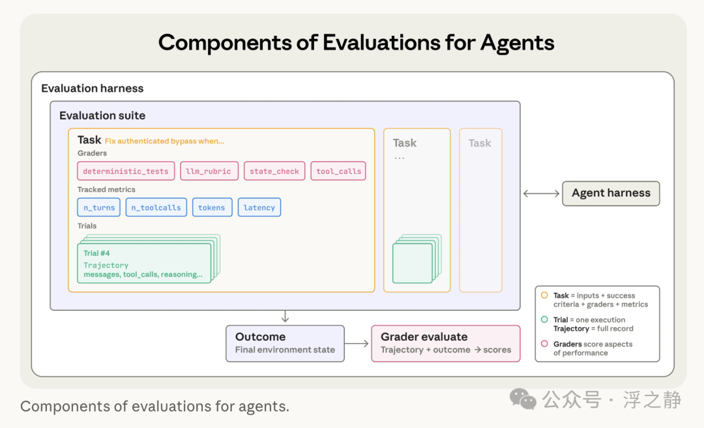
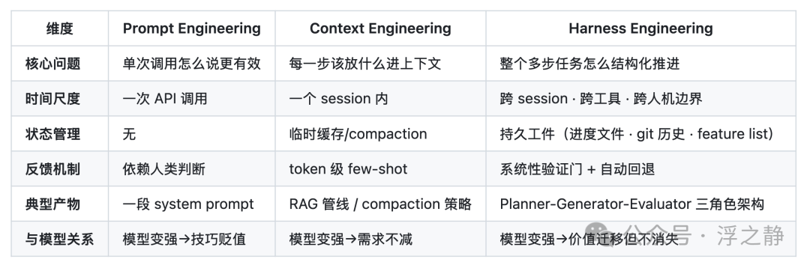
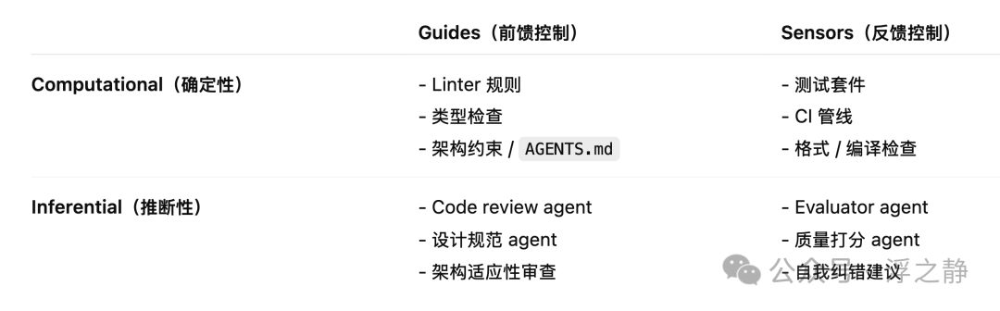
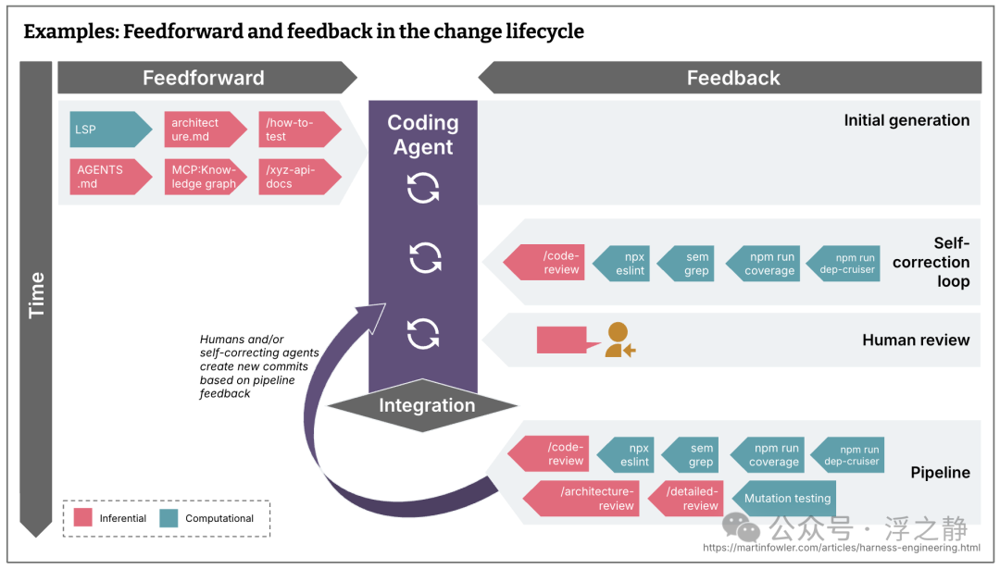
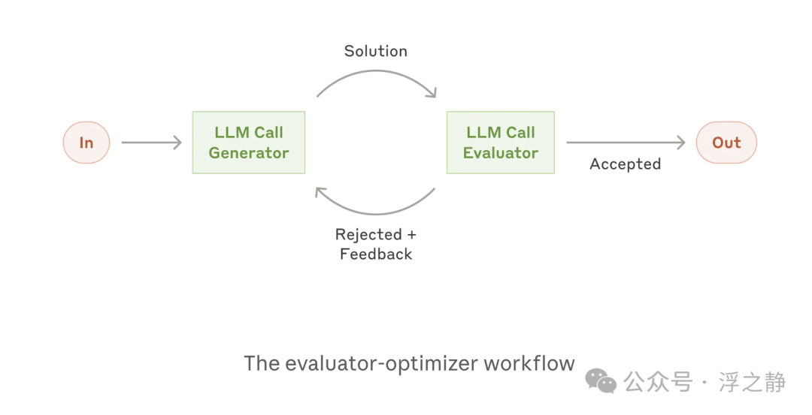
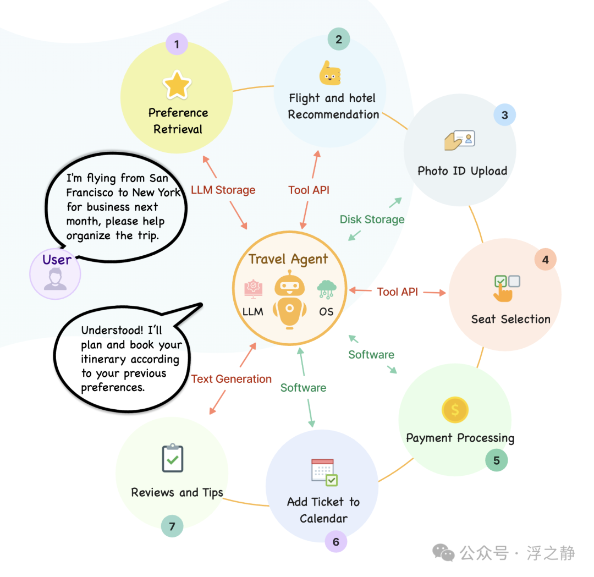
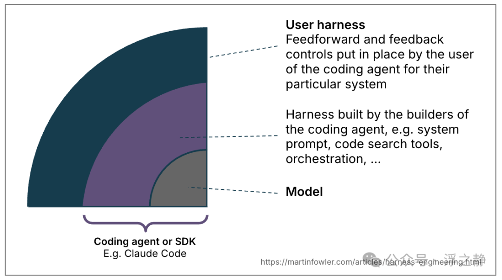
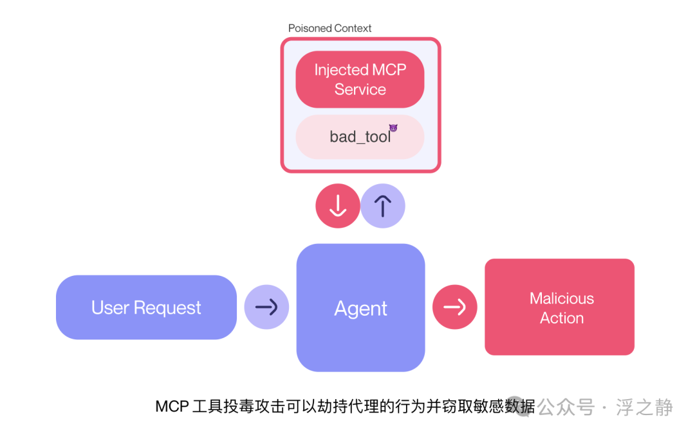

# 深度解析：Harness Engineering

> 公众号: 浮之静
> 发布时间: 2026-04-03 18:19
> 原文链接: https://mp.weixin.qq.com/s/-mgf8K7XZrTKoD0pMOIn3w

---

模型不是瓶颈，系统才是。

当 AI Agent 从“能跑”走向“能治”，一门新的基础学科正在成形。

本文不是概念拼接，而是试图回答一个根本问题：我们怎么走到了这里，接下来该往哪里走。

## 背景

先回答一个前置问题：我们是怎么走到今天的？

要理解 Harness Engineering 为什么在 2026 年突然变成了一个被认真讨论的工程实践，必须先看清楚 AI 工程在过去四年里走过的完整弧线。这条弧线不是线性的，而是一连串 `能力跳变 → 旧框架崩塌 → 新抽象涌现` 的循环。

推荐阅读，补充一些额外背景知识：

- [AI 操作系统：从指令到意图](https://mp.weixin.qq.com/s?__biz=MzIzNjE2NTI3NQ==&mid=2247491695&idx=1&sn=78edff3e611f6e99d9e1deee83453b3b&scene=21#wechat_redirect)
- [从 Prompt Engineering 到 Context Engineering](https://mp.weixin.qq.com/s?__biz=MzIzNjE2NTI3NQ==&mid=2247491129&idx=1&sn=451107b90247a2f8ae5aaacca3804328&scene=21#wechat_redirect)
- [Token 命名困境：当信息论闯入语言学](https://mp.weixin.qq.com/s?__biz=MzIzNjE2NTI3NQ==&mid=2247491711&idx=1&sn=4cfc3812c94a3597329361762fad148b&scene=21#wechat_redirect)
- [OpenClaw：疯狂背后的隐患](https://mp.weixin.qq.com/s?__biz=MzIzNjE2NTI3NQ==&mid=2247491686&idx=1&sn=8c409d92e088757121ee14dca74a3a05&scene=21#wechat_redirect)
- [深度解析：Google Workspace CLI](https://mp.weixin.qq.com/s?__biz=MzIzNjE2NTI3NQ==&mid=2247491628&idx=1&sn=f5b35ee1bad8d767ef694629a667e1cb&scene=21#wechat_redirect)
- [元技能：让 AI 像你一样思考](https://mp.weixin.qq.com/s?__biz=MzIzNjE2NTI3NQ==&mid=2247491581&idx=1&sn=97c15846fe7cdd307e2ef6fda4ca0e38&scene=21#wechat_redirect)
- [Agent 趋势浅思：原生化 & CLI 化](https://mp.weixin.qq.com/s?__biz=MzIzNjE2NTI3NQ==&mid=2247491501&idx=1&sn=8a27caa2edd9148a71699021da0c70e3&scene=21#wechat_redirect)
- [AI 编程生态：Anthropic 收购 Bun 意味着什么？](https://mp.weixin.qq.com/s?__biz=MzIzNjE2NTI3NQ==&mid=2247491031&idx=1&sn=8f2b6a5fa50f09a926d791eb5b76a72e&scene=21#wechat_redirect)
- [深度思考：聊聊 AI 发展趋势](https://mp.weixin.qq.com/s?__biz=MzIzNjE2NTI3NQ==&mid=2247491010&idx=1&sn=4a2dc0ef22832ea003bb0192b2f2f6d4&scene=21#wechat_redirect)
- [浅谈 AI 浏览器](https://mp.weixin.qq.com/s?__biz=MzIzNjE2NTI3NQ==&mid=2247490854&idx=1&sn=8bc51140f9c8a476abc7170a1a700afd&scene=21#wechat_redirect)
- [深度解析：Anthropic MCP 协议](https://mp.weixin.qq.com/s?__biz=MzIzNjE2NTI3NQ==&mid=2247489489&idx=1&sn=6ea58e8984a34a4967e112b44ab01c37&scene=21#wechat_redirect)

### 第一幕：生成（2022.11 — 2023）

2022 年 11 月 30 日，ChatGPT 上线。它在上线约两个月后达到约 1 亿月活用户。但这件事真正改变的不是 NLP 技术——GPT-3 已经存在两年了——而是**交互范式**。在此之前，LLM 是一个 API，只有工程师能用；在此之后，它变成了一个对话界面，所有人都能用。

这一幕里的核心矛盾是：**模型能生成，但不能行动**。它能写一封邮件，但不能发出去；能写一段代码，但不能运行它。用户和模型之间的关系是“你问我答”——一个无状态的、单轮的、被动的信息交换。

工程上的产物是 **Prompt Engineering**：怎么问，才能让模型回答得更好。few-shot、chain-of-thought、角色扮演，本质上都是在一次 API 调用的有限空间里，想办法把信息密度最大化。

### 第二幕：连接（2023 — 2024）

2023 年 3 月，OpenAI 发布 GPT-4，带来了多模态和更长的上下文窗口。同月推出 ChatGPT Plugins，第一次让模型“长出了手”——可以调用外部 API、访问实时数据。6 月，OpenAI 正式发布 Function Calling API，把工具调用标准化为模型输出中的结构化 JSON。

这是一个关键转折：模型从“能说”进化到了“能连”。但 Plugins 生态很快暴露了它的脆弱——每个插件需要独立的 OAuth 流程、独立的 schema 定义、独立的错误处理。连 10 个插件就已经很痛苦了，100 个根本不可能。

2023 年下半年，LangChain 崛起，试图用一层中间抽象来解决“连接”问题。它确实降低了入门门槛，但也引入了过度抽象的代价——太多层包装，调试困难，性能不可预测。同期，AutoGPT 和 BabyAGI 等项目尝试让模型自主循环执行任务，但都因为缺乏可靠的停止条件和验证机制，在 demo 之后迅速沉寂。

🤯 教训一

让模型“能连接工具”是必要的，但远远不够。连接不等于编排，编排不等于治理。

### 第三幕：推理（2024）

2024 年是“推理模型”登场的一年。OpenAI 的 o1 系列在 9 月发布，以“花更多时间思考后再回答”为核心特征，在数学和编程任务上实现了质的飞跃。12 月，ARC Prize 公布 OpenAI o3 在 ARC-AGI-1 Semi-Private Eval 上，high-compute 配置达到 87.5%，震惊了整个社区。与此同时，Anthropic 的 Claude 3.5 Sonnet 在代码生成和长文档理解上表现出色，DeepSeek-R1 作为开放权重模型证明了高性能推理不再是闭源专利。

更重要的是 2024 年末的两件事：

**第一件：Anthropic 发布 Model Context Protocol（MCP）。** 这不是又一个插件系统，而是一个开放标准协议，用 JSON-RPC 2.0 定义了 AI 应用如何与外部工具和数据源通信。它的核心洞察是：连接问题本质上是一个 N×M 问题——N 个 AI 应用 × M 个数据源，每个组合都需要一个定制连接器。MCP 把它简化成了 N+M：每个应用实现一次 MCP 客户端，每个工具实现一次 MCP 服务器。后来 OpenAI、Google DeepMind 先后宣布支持 MCP，2025 年 12 月 Anthropic 将 MCP 捐赠给 Linux Foundation 下的 Agentic AI Foundation。

**第二件：Anthropic 发布 Building Effective Agents[1] 指南（2024 年 12 月）。** 这篇文章第一次系统性地讨论了 agent 的工程模式——从最简单的 prompt chaining 到 evaluator-optimizer loop，并明确提出了一个原则：**先用最简单的模式，只有当复杂性确实带来更好结果时才引入更多结构。** 这个原则后来成为 harness engineering 的核心指导思想之一。

到了 2025 年，Anthropic 又单独把 **context engineering** 提升为一个独立的工程实践 Effective context engineering for AI agents[2]，强调真正的难点不再只是“怎么写 prompt”，而是“在每一步，把什么信息、以什么形式、在什么时机交给模型”。这是从 Prompt Engineering 到 Harness Engineering 之间的关键过渡层——问题已经从“单次调用”上移到“每步上下文”，但还没有上移到“整个任务外循环”。

🤯 教训二

模型的推理能力解决的是“单步质量”问题，但长任务的可靠性不会因为单步更聪明就自动获得。一个能解 IMO 金牌题的模型，仍然会在一个四小时的全栈开发任务中途“忘记自己在干什么”。

### 第四幕：行动（2025）

如果说 2023 是 Chatbot 年、2024 是多模态年，那么 2025 就是 Agent 年。

年初，DeepSeek-R1 的开源发布让市场重新评估了模型竞争的格局。随后是一连串的 agent 产品：Claude Code（终端里的编程 agent）、GitHub Copilot Agent Mode、Cursor 的自主编码循环、Manus（浏览器操作 agent）、OpenAI Operator。MCP 生态爆发，社区构建了数千个 MCP 服务器，SDK 覆盖所有主流语言。Google 发布 Agent2Agent（A2A）协议，解决 agent 之间的跨厂商通信。

但 2025 年最重要的发现，不是 agent 能做什么，而是 agent 在做什么的时候**怎么崩的**：

- agent 试图一次性完成整个任务（一把梭），在做到一半时上下文窗口耗尽。
- agent 在完成 70% 后宣布“已全部完成”，然后停下来。
- 多个 agent 并行时产生级联错误，单个小错误被放大到不可调试。
- 代码库在 agent 连续工作后出现严重的“AI slop”——冗余代码、不一致的命名、过时的文档。

这些不是模型的智力问题，而是**系统的结构问题**。

🤯 教训三

Agent 的能力已经到了“可以自主工作数小时”的水平，但围绕它的工程基础设施还停留在“单次对话”的时代。这个断裂就是 Harness Engineering 诞生的根因。

### 第五幕：治理（2026 — 现在）

2026 年开年，行业的注意力开始从“怎么让 agent 更能干”转向“怎么让 agent 不翻车”。“Harness Engineering”作为公开术语，不是某一天突然发明的，而是在 **2026 年 2 月开始快速成词并扩散**：

- **2026 年 2 月 5 日**，Mitchell Hashimoto 在 My AI Adoption Journey[3] 中明确写出 “Engineer the Harness”——这被认为是该术语进入主流讨论的起点之一。
- **2026 年 2 月 11 日**，OpenAI 直接以 Harness Engineering: Leveraging Codex in an Agent-First World[4] 为题发布工程文章。他们用一个小团队在五个月内从空仓库构建了一个内部 beta 产品，公开表述是“零行人工手写代码”，仓库达到约百万行代码量级、产生约 1,500 个 PR。更准确地说，初始 scaffold 仍是在少量模板引导下由 Codex 生成，之后应用逻辑、测试、CI、文档、可观测性和内部工具才尽量由 agent 产出。核心发现：工程师的工作重心转向了 `设计环境（design environments），明确意图（specify intent），并构建反馈回路（and build feedback loops）`。
- **2026 年 3 月**，Anthropic 发布《Harness Design for Long-Running Application Development》，将之前的 initializer/coding 二角色架构升级为 planner/generator/evaluator 三角色系统，证明 evaluator 在模型能力边界附近仍能带来明显增益。
- **2026 年 4 月**，Thoughtworks / Fowler 体系（Harness Engineering - first thoughts[5]）将这一概念系统化为更完整的方法论框架——guides（前馈控制）与 sensors（反馈控制）的组合，每种又分为 computational（确定性）和 inferential（推断性）两类，形成一个 2×2 控制矩阵。因此，4 月更适合被理解为“方法论抽象变得完整”，而不是“首次命名”。

## Harness 到底是什么？

让我们从第一性原理推导，而不是从定义出发。

### Agent 的五个根本性挑战

Agent 的本质是“在开放环境中自主推进目标的系统”。这个定义暗含五个工程挑战，每一个都不能靠更聪明的模型单独解决：

- **状态持久性**

- **本质**：Agent 需要跨时间、跨 session 记住做过什么。
- **为什么模型解决不了**：模型本身是无状态的，context window 也有上限，无法天然承担长期连续状态。

- **目标一致性**

- **本质**：长任务中，agent 容易漂移、自嗨，甚至提前宣布完成。
- **为什么模型解决不了**：模型缺少外部锚点，无法稳定校准“什么才算真正完成”。

- **行动可验证性**

- **本质**：每一步都是概率性的，需要区分“做了”和“做对了”。
- **为什么模型解决不了**：模型在评价自己结果时，天然存在自我表扬和误判倾向。

- **熵增抑制**

- **本质**：持续产出会不断累积冗余、漂移和不一致。
- **为什么模型解决不了**：模型会复制已有模式，哪怕这些模式本身就是坏的或低质量的。

- **人机边界**

- **本质**：何时自主、何时交给人，需要明确且工程化地定义。
- **为什么模型解决不了**：模型并没有可靠的“不确定性自觉”，无法稳定判断什么时候该停下来交还人类。

Harness 就是系统性地回答这五个挑战的工程实践。

### 一个精确定义

Anthropic 在 Demystifying evals for AI agents[6] 中给出了一个非常值得直接采用的定义：**agent harness（或 scaffold）是让模型能够作为 agent 行动起来的系统；它负责处理输入、编排工具调用并返回结果。** 更关键的是，Anthropic 进一步指出：当我们评估“一个 agent”时，实际上评估的是 **model + harness** 的组合，而不是模型单独的能力。这个定义非常重要，因为它把 agent 效果的解释单位，从模型参数，转移到了模型所处的外循环结构。

这里必须拆开一个经常被混淆的概念：**agent harness** 和 **evaluation harness** 不是一回事。前者负责让 agent 运行（处理输入、编排工具、管理状态），后者负责批量运行任务、记录轨迹、执行 grader、汇总评分。很多讨论把 “harness” 混成一个大筐，结果一会儿在说运行时编排，一会儿又在说评测流水线。本文讨论的 Harness Engineering 指的是前者——**运行时外循环系统的工程化**。

基于此，一个更精确的表述：

📌

**Harness = 让模型能够作为 Agent 行动起来的外循环系统。**

它包含计划分解、持久状态、工具编排、验证门控、反馈回路、回退机制、人机交接点和审计日志。评估一个 Agent 的效果时，评估的不是模型本身，而是 model + harness 的组合。

这里有几个要点值得展开：

- **外循环是关键词**。模型的推理是“内循环”——给定上下文，生成下一步。Harness 是“外循环”——决定什么时候开始新的内循环、给它什么上下文、如何验证它的输出、何时回退、何时停止。内循环的质量取决于模型能力，外循环的质量取决于 harness 设计。
- **Harness 不是 prompt 的升级版**。单个 prompt 解决不了跨 session 状态、验证门、工具发现、失败恢复和持续熵控。把 Harness 当成“一个更长的 system prompt”来做，是当下最常见的失败模式。
- **Harness 也不是一个框架名**。LangChain 是框架，CrewAI 是框架，Harness Engineering 不是。它是一门实践，就像 DevOps 不是一个工具而是一种工程文化一样。

## 三层工程抽象

Prompt → Context → Harness

要理解 Harness 的位置，需先看清它与前两层的关系。这三层不是替代关系，而是递进的抽象层级：

📌 关键洞察

**Context Engineering 是“每一步喂什么”，Harness Engineering 是“整条流水线怎么运转”**。前者是后者的子集。在用户侧，harness engineering 本质上是 context engineering 的一种特定形式；但 harness 还包含多步结构、工具中介、验证门和 durable state——这些超出了单步 context 的范畴。

## Harness 六大工程构件

这一节是全文最硬核的部分。每个构件都会讲清楚它解决什么问题、Anthropic/OpenAI 的具体做法、以及背后的设计原理。

### Durable State Surfaces：让 Agent 不再“失忆上岗”

**问题：** 长时 Agent 的核心痛点，就像一个项目组里的工程师每次换班都完全失忆。Context window 有限，复杂项目无法在单个窗口内完成，Agent 需要一种方式桥接 session 之间的鸿沟。

**Anthropic 解法：** 他们没有试图做一个“无限长上下文”，而是把状态外化成可续航工件：

1. 第一个 initializer agent 搭环境：创建 `init.sh`（启动脚本）、`claude-progress.txt`（进度日志）、初始 git commit（基线快照）。
2. 生成一个 **feature list**：把高层需求展开成 200+ 条具体 feature，初始全部标记为 `failing`。
3. 后续每个 coding agent 只做增量推进，session 结束时留下结构化更新和“clean state”。
4. 关键规则：agent 只能改 feature 的 `passes` 状态，**不能随意修改测试定义本身**。

这个 feature list 设计看起来“土”，但极有效——它把“完成”的定义从 agent 的主观感觉，变成了一个外部、持久、结构化、可继承的**完成面**。Agent 不需要“记住”之前做了什么，它只需要读取 `feature list` 和 `git diff` 就能在 30 秒内续航。

**Anthropic 后来还发现一个更深问题：context anxiety。** 即使用了 compaction（对早期对话做摘要压缩），agent 仍然会因为感觉“上下文太满”而行为退化。解决方案不是更好的 compaction，而是 **context reset**——直接给下一个 agent 一个全新的 context，通过外化的状态工件（而不是对话历史）传递所有必要信息。这比 compaction 更激进，但效果更好。

📌 设计原理

状态 ≠ “保存聊天记录”。真正的 durable state 是 agent 可以在冷启动后、没有任何上下文历史的情况下读取、理解、续航的结构化工件。如果你的 agent 冷启动后不能在 30 秒内知道“上次做到哪了、下一步该做什么”，你的状态管理就是失败的。

### Decomposition & Plans：把长任务切成 Agent 能吃下的块

**问题：** 给一个 agent 说 “build a clone of claude.ai”，它会试图一把梭——在单个 session 里写完所有代码。结果要么上下文爆了，要么做到一半就宣布“完成”。

**演进过程：**

2025 年 11 月，Anthropic 用 **initializer + coding** 二角色结构初步解决了这个问题。initializer 负责分解和初始化，coding 负责逐步实现。

2026 年 3 月，这个结构被升级为 **planner / generator / evaluator** 三角色系统：

- **Planner** 不直接写代码，而是把一两句高层描述扩展成完整 product spec 和分步 feature list
- **Generator** 负责逐 feature 落地，每完成一个就 commit
- **Evaluator** 负责独立评估 generator 的产出，标记 pass/fail，给出具体改进建议

OpenAI 这边的对应物是 `PLANS.md`、`Implement.md`、`Documentation.md`——复杂任务先计划，执行时按 milestone 跑，每个阶段都做验证，同时持续更新文档作为共享记忆。

📌 设计原理

计划必须被提升为**一等工件**，而不是一次性聊天内容。它需要被写入文件系统、被版本管理、被后续 agent 可读取、被验证门引用。一个存在于对话里的计划，本质上不是计划——它只是一次想法。

### Feedback Loops：Guides 与 Sensors

**问题：** Agent 写了代码，怎么知道写得对不对？靠 agent 自己评价？Anthropic 明确发现了一个令人尴尬的事实：**当被要求评价自己的作品时，agent 倾向于热情地自我表扬——即使在人类看来质量明显平庸。**

这就需要一套**不依赖 agent 自我评价**的反馈系统。2026 年 4 月社区就有框架把 harness 拆成了一个非常清晰的 2×2 矩阵：

**Guides** 在 agent 行动**之前**约束它，提高“一次做对”的概率。**Sensors** 在 agent 行动**之后**给信号，支持自纠错。

关键洞察：

- **只有 guides 没有 sensors** → agent 编码了规则但永远不知道规则是否生效
- **只有 sensors 没有 guides** → agent 不断重复同样的错误然后被纠正
- **Computational 控制**便宜、快、确定性，可以跑在每一次变更上
- **Inferential 控制**贵、慢、非确定性，但能处理主观判断（比如“这个 UI 设计是不是太丑了”）

Anthropic 的 evaluator-optimizer 模式与此完全一致。他们同时承认了一个微妙的事实：evaluator 不是永远必要的——当底模能力跨过某个阈值后，evaluator 从“必要部件”退化为“额外开销”。这说明好的 harness 不是固定模板，而是**与模型能力边界共同演进的可裁剪系统**。

### Legibility：为 Agent 建造感知面

**问题：** Agent 能写代码了，但它能“看到”自己写的代码跑起来是什么样吗？能读懂错误日志吗？能理解性能指标吗？

OpenAI 在 harness engineering 实践中给出了一个极其尖锐的判断：**凡是不在 agent 运行时可见范围内的知识，就等于不存在。**

这不是修辞。他们做了以下具体工作来提升 legibility：

- 给每个 git worktree 启动一个独立的浏览器实例，通过 CDP（Chrome DevTools Protocol[7]） 让 agent 可以“看到” UI
- 把 logs、metrics、traces 全部暴露给 agent 查询。
- Repository knowledge 作为 system of record：设计原则、产品意图、执行计划、已知技术债、架构决策记录（ADR），全部放进 repo 并用 lint/CI 维持一致性。
- 把 `AGENTS.md`、结构化 `docs/`、执行计划与知识文档尽量放进 repo，让它们成为 versioned system of record；但 OpenAI 也公开提醒：超长的 `AGENTS.md` 会快速腐烂、挤占上下文、让所有约束同时失焦——更好的做法是把它变成目录索引，真正的知识拆散到结构化文档里。

📌 设计原理

Legibility 不是“让代码更优雅”，而是**让知识、约束、验收标准和决策历史进入 agent 的感知面**。这直接把“知识管理”从团队协作问题转成了 agent 可执行性问题。对 agent 来说，Slack 里的经验、口头传承的架构边界、散落在外部文档里的约束，如果不进入运行时可访问的工件面，就等于不存在。

### Tool Mediation：工具越多越需要 Harness

**问题：** MCP 生态爆发后，一个 agent 可能连接几十个 MCP 服务器、访问上百个工具。但直接把所有工具定义都塞进上下文，会产生严重的问题——token 成本暴增、延迟上升、agent 在工具海洋里迷失方向。

Anthropic 在 MCP + Code Execution 的工程实践中提出了一个核心思路：**不要让模型直接调用工具，让模型写代码来调用工具。**

区别在哪里？

- **直接工具调用模式：** 所有工具定义加载进上下文 → 模型选择工具 → 调用 → 结果回传到上下文 → 模型继续。每一步都消耗上下文空间，中间结果在模型内循环。
- **代码执行模式：** 模型写一段代码 → 代码在沙箱里运行，按需发现和调用 MCP 工具 → 只把最终结果回传模型。工具发现、数据过滤、中间处理全在执行环境内完成，不进上下文。

这个思路的本质是：**把工具使用从模型的内循环，挪到更高效的外部执行回路里**。这恰恰就是 harness engineering——它不是“工具注册中心”，而是决定了工具如何被发现、何时暴露、以什么粒度暴露、结果是否需要进上下文、状态放在哪里、失败怎么回退的系统级设计。

### Entropy Control：Agent 的持续垃圾回收

**问题：** 全自动 agent 代码库会不断复制既有模式——哪怕那些模式不均匀、次优甚至糟糕。久而久之，漂移与熵增不可避免。

OpenAI 对此讲得最直白：他们最初靠人每周花约 20% 时间清理 “AI slop”（冗余代码、过时文档、不一致的命名、复制粘贴的死代码）。后来把这种清理逻辑系统化：

- **Documentation consistency agents** 定期验证文档与代码是否一致
- **Refactor agents** 按计划清理技术债
- **Architectural enforcement** 通过 CI 机械化地维护模块边界

📌 设计原理

Harness 不只负责“让 agent 跑起来”，还负责**持续抑制 agent 放大的系统噪声**。这是它与简单的“agent 框架”最本质的区别——框架关心启动和编排，harness 关心长期可治性。

### Harnessability：不是每个系统都容易被 harness

如果只把 Harness Engineering 理解成“给 agent 多加点规则和回路”，还不够深。更底层的问题是：**不是每个系统都同样容易被 harness。**

OpenAI 的实践不断暗示同一件事：他们之所以能把 Codex 推到高吞吐，不只是因为模型够强，更因为他们持续把知识压回 repo、把计划工件化、把决策版本化、把环境做得对 agent 更可读。一个系统天然有多适合被 agent 驯化，本身就是重要变量。

顺着这个逻辑可以得到一个很有解释力的判断：**强类型、测试完备、边界清晰、文档版本化、运行时可观测的系统，天然更高 harnessability；而知识散落在人脑、聊天工具和口耳相传里的系统，即使模型再强，也会先撞上“看不见 → 无法理解 → 无法治理”的墙。**

这意味着，在 agent 时代，一个团队的工程基础设施质量（CI 完善度、文档结构化程度、架构边界清晰度）不再只是“工程素养”问题——它直接决定了 agent 能在你的系统上走多远。Harnessability 将成为评估系统 “agent-readiness” 的关键维度。

## 意图系统

一个更深层的范式迁移：从指令驱动到意图驱动

上面讲的是 Harness 的工程构件。但如果只看构件，就会陷入“技术细节的拼接”。让我们退后一步，讲一个更根本的事——为什么 Harness Engineering 不只是一个工程实践，而是一个范式迁移的产物。

### 人机交互的四次断裂

回顾计算的全部历史，人与机器的交互经历了四次根本性的断裂：

1. **CLI（命令行）**：人必须精确掌握机器的语言。`ls -la | grep .py` 是一条指令，语法错一个字符就不行。交互的核心假设是“人适应机器”。
2. **GUI（图形界面）**：机器通过视觉隐喻降低门槛。文件夹、桌面、拖拽。交互的核心假设是“机器用人能理解的隐喻来呈现自身”。
3. **App（移动应用）**：逻辑被凝固成固定界面。每个功能一个按钮，每个按钮一个屏幕。交互的核心假设是“人在预设的路径中选择”。
4. **Agent（意图驱动）**：人只表达目标，系统自主规划执行路径。交互的核心假设是 **“机器理解人的意图，自主决定怎么做”**。

每一次断裂都不只是技术升级，而是**控制权的重新分配**。在 CLI 时代，人类拥有 100% 的控制权；在 Agent 时代，人类让渡了大部分执行控制权，只保留目标设定和关键决策点。

这个让渡的工程后果是什么？

在指令驱动的世界里，bug 是“系统没有正确执行我的指令”——可以用传统测试覆盖。在意图驱动的世界里，bug 变成了“系统误解了我的意图”或“系统正确理解了意图，但选择了一条糟糕的执行路径”——**这需要一套全新的验证、约束、反馈机制，而这恰恰就是 Harness 要解决的问题。**

### 应用正在被 “CLI 化”，但不是给人类

一个非常反直觉的趋势：在 Agent 时代，所有应用和网站正在被重新“CLI 化”——不是让用户回到终端，而是从 Agent 的视角把一切变成可编程接口。

MCP 的本质就是这件事的协议层实现。当一个 Agent 需要操作 Google Drive 时，它不需要“打开网页、点击按钮”——它需要一组结构化的 API 调用。MCP 服务器把 Google Drive 抽象成了一组可调用的函数：`gdrive.getDocument`、`gdrive.createFile`、`gdrive.search`。

这意味着三件事：

**第一，可读性的对象变了**。过去的可读性给人看——清晰的 UI、合理的信息架构。现在首先要给 Agent 看——结构化的 API、机器可解析的文档、可编程的权限模型。

**第二，应用的边界正在溶解**。当 Agent 通过 MCP 调用任何工具、通过 A2A 与其他 Agent 协作时，App 从“目的地”退化为“基础设施”。用户不再“打开一个 App 做一件事”，而是“表达一个意图，Agent 编排多个服务来完成”。

**第三，Harness 成为新的“操作系统层”**。GUI 时代的操作系统管理窗口、文件、进程。Agent 时代需要管理的是：Agent 的生命周期、工具的发现与授权、上下文的调度与回收、多 Agent 的协作与隔离、人类审批的介入点。

## 从 Chatbot 到 AgentOS

把以上所有线索串起来，可以看到一条清晰的演化路径。这三个阶段不是功能叠加，而是工程抽象层的根本变化：

### Level 1：Chatbot（2022-2023）

单次对话，无状态，人类完全在环。核心价值是信息检索与内容生成。工程抽象层是 Prompt Engineering。代表产品：ChatGPT、Claude（早期）。

**天花板**：能说不能做。每次对话都是孤立的。

### Level 2：AI Browser / Agent IDE（2024-2025）

多步任务，工具调用，有限自主权。核心价值是任务执行与工作流自动化。工程抽象层是 Context Engineering + 轻量 Harness。代表产品：Claude Code、Cursor、Manus、Codex。

**天花板**：单 agent 能力强但长任务不稳；多 agent 协作缺乏标准；状态管理是手工活。

### Level 3：AgentOS（2026- 萌芽期，前瞻性方向）

这里必须写得克制。**AgentOS 还不是一个已经收敛的产业范式**。但它确实已经进入研究与系统社区议程。2024 年的 AIOS[8] 论文提出把调度、上下文管理、内存管理、访问控制等问题从 agent 应用层抽离到类似 kernel 的层中；ASPLOS 2026 上有专门的 AgenticOS Workshop[9] 探讨 agent 工作负载的 OS 原语。

因此更稳妥的说法不是 “AgentOS 已经到来”，而是：**Harness Engineering 正在把问题从应用层推向系统层。** 当 agent 不再只是一个 coding assistant，而是 always-on、多 agent、跨工具、跨身份的长期执行体时，用户态 harness 最终一定会碰到更底层的系统问题：

- **Agent 生命周期管理**：初始化、运行、挂起、恢复、终止——不是无状态函数调用，是完整的进程管理。
- **上下文调度**：Context window 是稀缺资源，需要决定什么信息何时加载、何时压缩、何时丢弃——这是“内存管理”的 agent 版本。
- **多 Agent 隔离与协作**：一个 agent 的操作不应污染另一个的环境，但它们又需要共享某些状态——需要类似进程隔离 + IPC 的机制。
- **治理与审计**：每个 agent 的每步决策都需要可追溯——在金融、医疗等领域，这不是锦上添花而是合规要求。

📌 关键定位

**Harness 是 AgentOS 的用户态层**。AgentOS 是内核——管调度、管隔离、管资源。Harness 是用户态的 shell 和 daemon——管任务分解、管状态续航、管验证反馈、管人机交接。两者不是竞争关系，而是天然的上下层。

## 五个典型症状

理论说完了，回到现实。如果你观察当前生态，会发现大多数所谓的 “agent 系统”其实还停留在临时搭伙阶段。以下是五个典型症状：

**症状一：框架丛林**。LangChain、CrewAI、AutoGen、Agno、n8n……每个框架解决了一小块问题，但没有一个提供从计划到验证到回退到审计的完整生命周期。用户在不同框架间拼凑，得到的是一个脆弱的管道，而不是可治理的系统。

**症状二：Chatbot 皮 + Agent 芯**。大量产品本质上是一个 chatbot 界面套一个 agent 循环——但缺乏真正的状态管理、任务分解、验证门。在 demo 中惊艳，在生产中频频翻车。

**症状三：工具注册 ≠ 工具治理**。MCP 让连接变得容易，但“能连”不等于“会用”。Agent 面对 50 个工具时会困惑、做冗余调用、走弯路。有工程团队发现最初给 agent 提供全部工具的效果反而很差——精简到最小必要集后才有提升。

**症状四：一次性规则 vs. 可演进约束**。大多数团队的 agent 配置是一个巨大的 AGENTS.md 或 system prompt。但实践表明这种做法必然失败——**当一切都重要时，什么都不重要**。Agent 会在局部模式匹配，而不是有意识地导航。规则腐化的速度比人维护的速度更快。

**症状五：缺乏 on-the-loop 思维**。“In the loop” 是不满意 agent 输出时手动修改产物；“on the loop” 是改 harness，让系统下次自动产出更好的结果。大多数团队还停留在 in the loop——逐个修复错误，而不是系统性地改进产生错误的控制回路。

## Harness 不是什么

厘清边界和厘清定义同样重要。

**它不是“换个更长的 system prompt”**。因为单 prompt 解决不了跨 session 状态、验证门、工具发现、失败恢复和持续熵控。

**它不是某个厂家的私有名词**。Anthropic 和 OpenAI 都在公开使用，学术预印本已经在把它抽象成跨产品的通用概念。

**它也不是“模型变强后就不需要了”**。恰恰相反——Anthropic 明确指出，harness 会随着模型边界外移而重新分配价值：某些检查变成冗余，但对更难任务的规划、验证、handoff、状态治理会更重要。模型越强，越需要把更长、更贵、更危险的任务放进受控外循环。

实际上，interesting harness combinations 的空间不会随着模型变强而缩小——**它会移动**。今天有效的 evaluator 可能在下一代模型面前变成冗余开销，但新的能力边界会催生新的 harness 需求。

## 被忽视的关键问题

### Harness 的可测试性

当我们说 “harness 让 agent 可验证”时，一个元问题是：harness 本身怎么验证？如果 evaluator 用的是另一个 LLM，而那个 LLM 也有幻觉倾向，我们就建造了一个“用不可靠系统验证不可靠系统”的循环。

Anthropic 的做法是尽量用 computational sensors（测试套件、linter、类型检查）做基础验证，只在主观判断层面（UI 美观度、代码风格）才启用 inferential sensors。这是一个务实的分层策略，但不是完美的解决方案。

### 多 Agent 的涌现行为

10 个 agent 并行运行、各自独立决策时，系统行为会涌现出单个 agent 分析无法预测的模式。这类似于分布式系统的并发 bug——但更糟，因为每个“进程”都是非确定性的。目前的 harness 设计主要针对单 agent 场景，多 agent 协作的 harness 原则还没有沉淀下来。

### 成本与延迟的工程权衡

Harness 的每一层——planner、evaluator、sensor、garbage collection——都消耗额外的 token 和延迟。当 harness 本身的开销超过它带来的质量提升时，就是过度工程。如何度量 harness 的 ROI、如何根据任务复杂度动态调整 harness 的深度，是一个尚未解决的工程问题。

### 安全的新维度：攻击目标从数据变成了 agency

这是很多文章最容易轻描淡写带过、但其实最危险的一层。随着 agent 拥有持久状态、外部工具和长时自治（autonomy），攻击面已经不再只是“模型答错了什么”，而是“系统会不会被借力操控”。

Invariant Labs 在 2025 年 4 月披露了 Tool Poisoning Attacks[10]：恶意指令可以藏在 MCP 工具描述里，对用户不可见，却对模型可见，从而诱导 agent 执行未授权操作；一周后，他们又展示了通过不可信 MCP server 联动可信 WhatsApp MCP 的数据外流场景。这意味着 Harness Engineering 不能只谈吞吐和稳定性，还必须正面处理 **tool trust、cross-tool data flow、least privilege、approval boundaries、execution isolation**。

MCP 的开放标准化很重要（Anthropic 2025 年 12 月已将 MCP 捐赠给 Linux Foundation 下的 AAIF），但开放连接越成功，越要求上层 harness 做更严格的治理。Harness 的权限模型必须从静态的“可以/不可以”升级为动态的“在什么条件下可以、到什么上限可以、需要人类确认后才可以”。也就是说，**harness 不只是提高产出的外循环，它本身也是新的安全边界。**

## 判断 & 展望

### 判断一：Harness Engineering 会成为 AI 工程时代的基础学科之一

模型能力提升会持续吞掉一部分微观 prompt 技巧，但不会吞掉 harness engineering。因为它处理的是更高层的问题：如何把不稳定、昂贵、概率性的智能嵌入一个长期可治理的工程系统。只要 agent 要跨时间、跨工具、跨环境、跨人机边界工作，harness 就不会消失——反而会越来越像软件架构、测试工程、SRE 与安全工程的交叉地带。

### 判断二：护城河重心正在从模型质量上移到 Harness 与系统设计

当 GPT、Claude、Gemini 在核心能力上趋同时，决定产品成败的不再是模型差异，而是 harness 质量。最硬的证据来自 LangChain：他们在保持底层模型不变的情况下，仅通过修改 harness，把 deepagents-cli 在 Terminal Bench 2.0 上从 52.8% 提升到 66.5%，增加 13.7 分，排名从 Top 30 外围拉到 Top 5。这个结果不能被夸张成“模型已经不重要”，但它足以说明：**同一模型之上，harness 足以拉开巨大的系统差距。** 护城河重心正在上移到 harness 与系统设计。

### 判断三：从 Chatbot 到 AgentOS 的迁移不会一步到位

中间会经历一个 2-3 年的 “AI Browser + 轻量 Harness” 阶段。大多数企业会先在这个阶段获得价值，然后逐步向更重的 AgentOS 架构演进。试图一步跳到 AgentOS 的团队，大概率会因治理复杂度超出承受能力而失败。

### 判断四：工程师的角色正在从“代码生产者”变为“自治系统的设计者”

这不是失业警告，而是能力升级要求。定义意图、塑造环境、设定边界、设计反馈、吸收异常、沉淀规则——这些能力的价值将急剧上升。**不满意 agent 输出时，低层做法是手改产物；高层做法是改 harness，让系统下次自动做得更好。** 从 in the loop 到 on the loop，这才是工程师在 agent 时代的核心升级路径。

## 附

给实践者的三个自检问题。在开始构建自己的 harness 之前，先回答这三个问题：

1. **你的 agent 有没有 durable state surfaces**？冷启动后能否在 30 秒内续航——还是每次都从头开始？
2. **你的系统有没有 machine-readable acceptance criteria**？“完成”的定义是 agent 的自我感觉，还是外部结构化的验证面——一个 feature list、一组测试用例、一个可检查的 pass/fail 状态？
3. **你的 repo、工具、日志、指标、策略，是否对 agent legible and enforceable**？还是只有人类能读懂——agent 只能猜？

如果这三件事都没有，你做的大概率还只是“会跑命令的聊天机器人”...

### References

[1]

**Building Effective Agents:***https://www.anthropic.com/engineering/building-effective-agents*

[2]

**Effective context engineering for AI agents:***https://www.anthropic.com/engineering/effective-context-engineering-for-ai-agents*

[3]

**My AI Adoption Journey:***https://mitchellh.com/writing/my-ai-adoption-journey*

[4]

**Harness Engineering: Leveraging Codex in an Agent-First World:***https://openai.com/index/harness-engineering*

[5]

**Harness Engineering - first thoughts:***https://martinfowler.com/articles/exploring-gen-ai/harness-engineering-memo.html*

[6]

**Demystifying evals for AI agents:***https://www.anthropic.com/engineering/demystifying-evals-for-ai-agents*

[7]

**Chrome DevTools Protocol:***https://chromedevtools.github.io/devtools-protocol*

[8]

**AIOS:***https://github.com/agiresearch/AIOS*

[9]

**AgenticOS Workshop:***https://os-for-agent.github.io*

[10]

**Tool Poisoning Attacks:***https://invariantlabs.ai/blog/mcp-security-notification-tool-poisoning-attacks*

