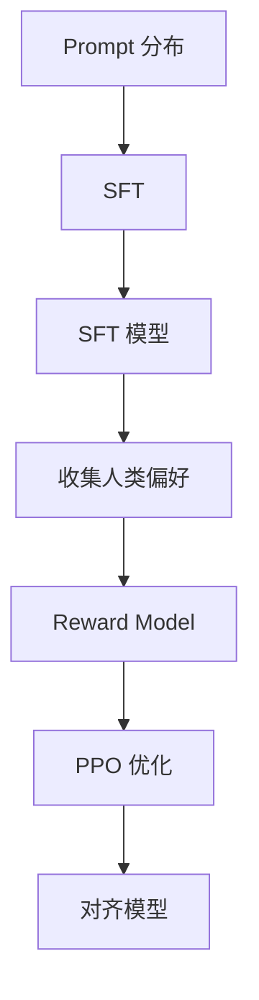

# Alignment

**Alignment = 让 LLM 的行为符合人类意图和价值观。**

## 一句话理解

预训练让 LLM「会说人话」，但不一定「说好话」。Alignment 让它按人类意图行动。

## 问题：预训练的缺陷

| 问题 | 表现 |
|------|------|
| 幻觉 | 看似合理但错误的答案 |
| 有害内容 | 偏见、歧视、暴力 |
| 不听话 | 不按指令行动 |

## RLHF 三步法



### Step 1: SFT (Supervised Fine-Tuning)

```python
# 人工标注的问答对
prompt = "什么是量子计算？"
response = "量子计算是一种..."
loss = CE(model(response), target_response)
```

### Step 2: Reward Model

```python
reward = RewardModel(prompt, response)
loss = -log(sigmoid(reward_pos - reward_neg))
```

### Step 3: PPO 优化

```python
loss = -E[reward(prompt, response)] + β * KL(π || π_sft)
```

## Fine-tuning vs Alignment

| 方法 | 目标 | 数据 |
|------|------|------|
| SFT | 格式对齐 | 人工标注 |
| RLHF | 偏好对齐 | 人类反馈 |
| DPO | 偏好对齐 | 偏好对 |

## 来源

- [[../sources/instructgpt|InstructGPT]]
