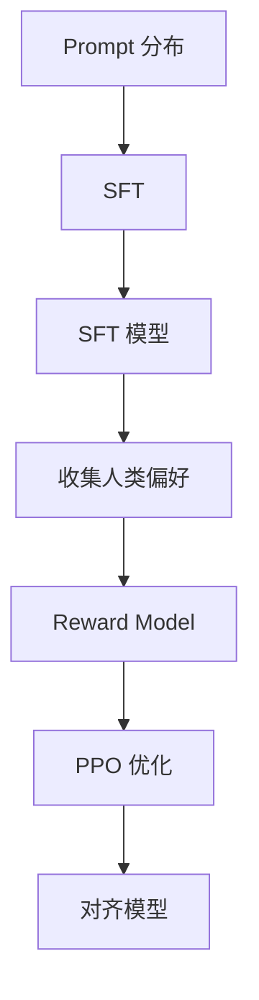

# Alignment

**Alignment = 让 LLM 的行为符合人类意图和价值观。**

## 一句话理解

预训练让 LLM「会说人话」，但不一定「说好话」。Alignment 让它按人类意图行动。

## 问题：预训练的缺陷

| 问题 | 表现 |
|------|------|
| 幻觉 | 看似合理但错误的答案 |
| 有害内容 | 偏见、歧视、暴力 |
| 不听话 | 不按指令行动 |

## RLHF 三步法



### Step 1: SFT (Supervised Fine-Tuning)

使用人工标注的问答对进行监督学习。

```python
prompt = "什么是量子计算？"
response = "量子计算是一种..."
loss = CE(model(response), target_response)
```

### Step 2: Reward Model

训练一个模型预测人类偏好。

```python
reward = RewardModel(prompt, response)
loss = -log(sigmoid(reward_pos - reward_neg))
```

### Step 3: PPO 优化

用 Reward Model 指导策略优化，同时保持与 SFT 模型的 KL 散度约束。

```python
loss = -E[reward(prompt, response)] + β * KL(π || π_sft)
```

| 方法 | 目标 | 数据 | 概念页 |
|------|------|------|--------|
| SFT | 格式对齐 | 人工标注 | [[ai-fundamentals/concepts/fine-tuning|Fine-tuning]] |
| RLHF | 偏好对齐 | 人类反馈 | [[ai-fundamentals/concepts/alignment|Alignment]] |
| DPO | 偏好对齐 | 偏好对 | [[ai-fundamentals/concepts/direct-preference-optimization|DPO]] |

## 来源

- [[ai-fundamentals/sources/instructgpt|InstructGPT]]
- [[ai-fundamentals/concepts/direct-preference-optimization|DPO]] — 偏好优化的简化方法
