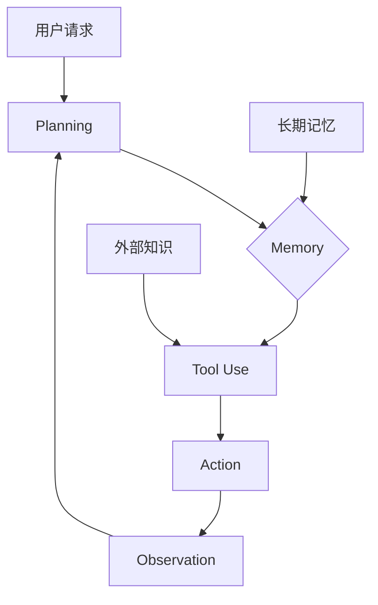

# LLM Agents

**LLM Agent = LLM + Planning + Memory + Tools，让 LLM 能够自主行动。**

## 一句话理解

Agent 让 LLM 从「被动回答」变成「主动执行」——它能感知环境、制定计划、使用工具。

## 核心架构



## 四大组件

### 1. Planning

| 方法 | 描述 |
|------|------|
| CoT | 链式思考，一步一步推理 |
| ReAct | Thought → Action → Observation |
| Reflexion | 加入自我反思 |
| ToT | 探索多条推理路径 |

### 2. Memory

```python
class Memory:
    short_term: List[str]      # 当前对话
    long_term: VectorDB        # 历史经验
```

### 3. Tool Use

```python
tools = [
    "搜索引擎",
    "代码执行器",
    "文件操作",
    "API 调用"
]
```

### 4. Action

| 类型 | 示例 |
|------|------|
| 对话 | 输出文字回复 |
| API 调用 | 搜索、发送消息 |
| 代码执行 | 运行 Python、Shell |

## ReAct 示例

```
Thought: 我需要找北京的天气
Action: search["北京天气"]
Observation: 北京今天晴，25度
Thought: 天气不错，适合户外活动
Action: finish["北京今天25度，晴天"]
```

## 与传统 Agent 的区别

| 传统 Agent | LLM Agent |
|------------|-----------|
| 规则驱动 | LLM 驱动 |
| 固定策略 | 可学习、可适应 |
| 简单任务 | 开放域任务 |

