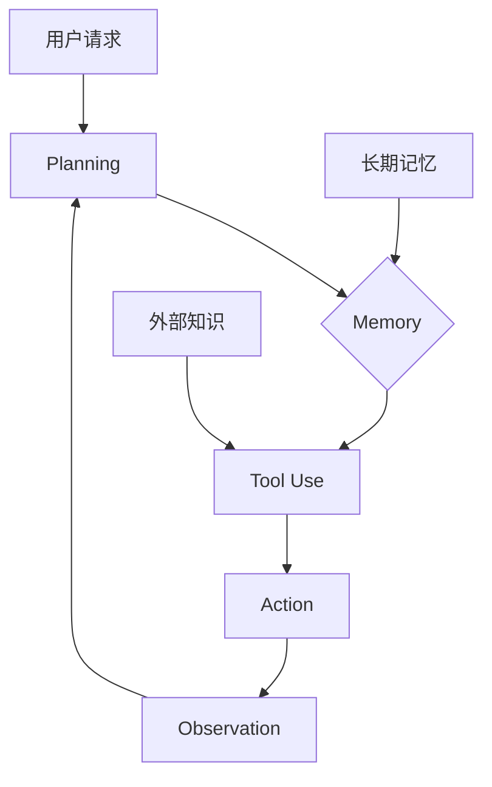

# LLM Agents

**LLM Agent = LLM + Planning + Memory + Tools[[ai-fundamentals/sources/llm-powered-autonomous-agents|1]]。**

## 一句话理解

Agent 让 LLM 从「被动回答」变成「主动执行」——它能感知环境、制定计划、使用工具[[ai-fundamentals/sources/llm-powered-autonomous-agents|1]]。

## 核心架构



**关键区分**：Agent 是 LLM + 外部工具 + 循环执行 + 状态管理的**系统**，而不是更聪明的 LLM[[ai-fundamentals/sources/llm-powered-autonomous-agents|1]]。

## 四大组件

### 1. Planning

| 方法        | 描述                             | 来源                                                        |
| --------- | ------------------------------ | --------------------------------------------------------- |
| CoT       | 链式思考，一步一步推理                    | —                                                         |
| ReAct     | Thought → Action → Observation | [[ai-fundamentals/sources/react-chain-of-thought|ReAct]] |
| Reflexion | 加入自我反思                         | —                                                         |
| ToT       | 探索多条推理路径                       | —                                                         |

### 2. Memory

LLM 的 Context Window 是工作记忆的物理上限[[ai-fundamentals/sources/gpt3-language-models-few-shot|3]]。Agent 需要额外的长期记忆机制：

```python
class Memory:
    short_term: List[str]      # 当前对话（Context Window）
    long_term: VectorDB        # 历史经验（外部存储）
```

### 3. Tool Use

[[ai-fundamentals/sources/toolformer|4]] 证明语言模型可以自学使用工具[[ai-fundamentals/sources/react-chain-of-thought|2]]：

```python
tools = [
    "搜索引擎",      # Web search
    "代码执行器",    # Code interpreter
    "文件操作",      # File system
    "API 调用"       # External APIs
]
```

### 4. Action

| 类型 | 示例 |
|------|------|
| 对话 | 输出文字回复 |
| API 调用 | 搜索、发送消息 |
| 代码执行 | 运行 Python、Shell |

## ReAct 循环

[[ai-fundamentals/sources/react-chain-of-thought|2]] 提出将 reasoning traces（Thought）和 task-specific actions（Action）交织执行[[ai-fundamentals/sources/react-chain-of-thought|2]]：

```
Thought: 我需要找北京的天气
Action: search["北京天气"]
Observation: 北京今天晴，25度
Thought: 天气不错，适合户外活动
Action: finish["北京今天25度，晴天"]
```

**核心洞察**：ReAct 优于单独的 chain-of-thought 或 action-only 基线[[ai-fundamentals/sources/react-chain-of-thought|2]]。

## 与传统 Agent 的区别

| 传统 Agent | LLM Agent |
|------------|-----------|
| 规则驱动 | LLM 驱动 |
| 固定策略 | 可学习、可适应 |
| 简单任务 | 开放域任务 |

## 来源

- [[ai-fundamentals/sources/llm-powered-autonomous-agents|LLM-powered Autonomous Agents]]
- [[ai-fundamentals/sources/react-chain-of-thought|ReAct]]
- [[ai-fundamentals/sources/toolformer|Toolformer]]
