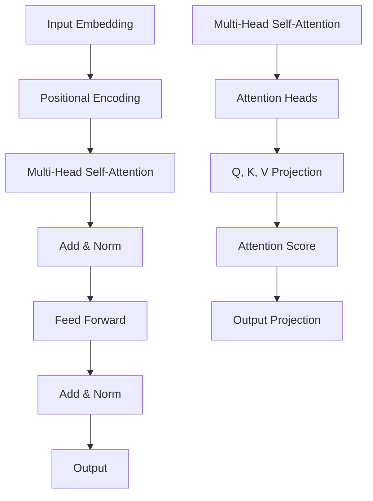

# Transformer

**Transformer = Attention + Feed-Forward + Positional Encoding，让序列建模并行化。**

## 一句话理解

Transformer 通过「注意力机制」取代了 RNN，让序列可以完全并行处理，同时捕捉任意距离的依赖关系。

## 核心架构



## 关键组件

### 1. Self-Attention

```python
def attention(Q, K, V):
    scores = Q @ K.T / sqrt(d_k)
    weights = softmax(scores)
    return weights @ V
```

**核心思想**：每个 token 都要「注意」到其他所有 token。

### 2. Multi-Head Attention

- 每个头学习不同的注意力模式
- 常见配置：8-16 个头
- 最终拼接所有头的输出

### 3. Feed-Forward Network

```python
FFN(x) = ReLU(x @ W1 + b1) @ W2 + b2
```

- 两层线性变换 + ReLU
- 每个位置独立计算
- 参数量占整个 Transformer 的 2/3

### 4. 位置编码

| 类型 | 特点 |
|------|------|
| Sinusoidal | 可外推，但外推效果差 |
| RoPE | 旋转矩阵，相对位置 |
| ALiBi | 线性偏置，长 context |

## 为什么 Transformer 有效

1. **并行计算**：无需 RNN 的序列依赖
2. **长距离依赖**：注意力直接连接任意位置
3. **可扩展**：参数量大，容量大
4. **通用性**：NLP 之外也可应用（ViT、SAM）

## 来源

- [[ai-fundamentals/sources/attention-is-all-you-need|Attention Is All You Need]]
