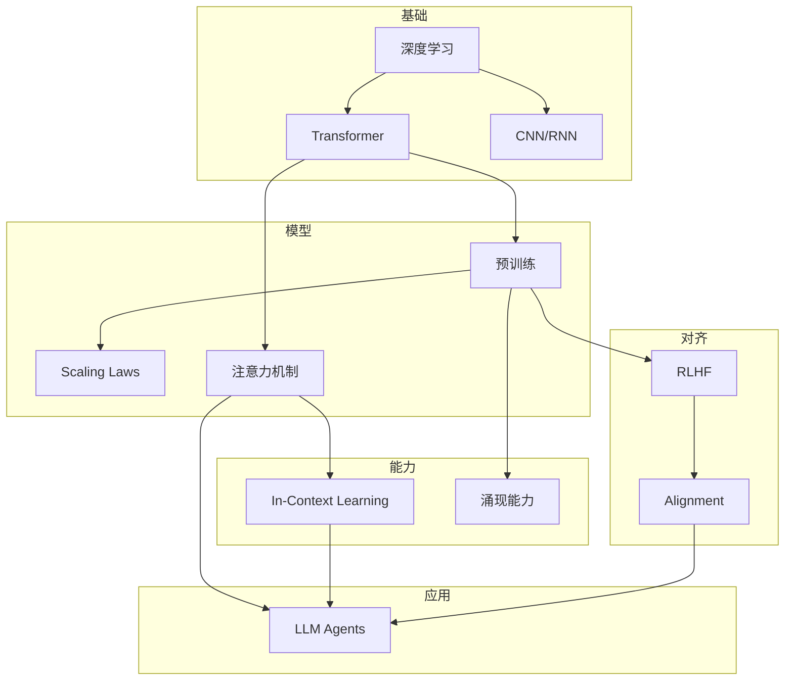

# AI Fundamentals

**理解 AI 从基础理论到 LLM Agent 的完整知识图谱。**

## 一句话理解

AI 经历了符号主义 → 深度学习 → 大语言模型的演进，如今 LLM Agent 正在成为 AI 应用的主流形态。

## 知识图谱

## 核心概念

| 概念 | 说明 |
|------|------|
| [[ai-fundamentals/concepts/transformer|Transformer]] | 序列建模的革命性架构 |
| [[ai-fundamentals/concepts/attention-mechanism|Attention Mechanism]] | 注意力机制的核心原理 |
| [[ai-fundamentals/concepts/language-model-training|Language Model Training]] | 预训练与 Scaling Laws |
| [[ai-fundamentals/concepts/alignment|Alignment]] | RLHF 与 LLM 对齐 |
| [[ai-fundamentals/concepts/llm-agents|LLM Agents]] | LLM Agent 的架构与能力 |

## 发展时间线

| 年份 | 里程碑 |
|------|--------|
| 2012 | AlexNet 开启深度学习时代 |
| 2014 | GAN 生成对抗网络 |
| 2015 | ResNet 残差连接 |
| 2017 | Transformer 架构提出 |
| 2018 | BERT 预训练+微调范式 |
| 2020 | GPT-3 涌现能力 |
| 2022 | InstructGPT RLHF |
| 2023 | GPT-4 LLM Agent |

## 来源导航

### Transformer
- [[sources/attention-is-all-you-need|Attention Is All You Need]] — Transformer 原始论文

### 预训练
- [[sources/bert-pre-training|BERT]] — 双向预训练
- [[sources/gpt3-language-models-few-shot|GPT-3]] — Few-Shot Learning

### Scaling Laws
- [[sources/scaling-laws-kaplan|Scaling Laws]] — 规模化规律

### Alignment
- [[sources/instructgpt|InstructGPT]] — RLHF 对齐

### 效率优化
- [[sources/flash-attention|Flash Attention]] — IO感知注意力

## 下一步

1. 从 [[ai-fundamentals/concepts/transformer|Transformer]] 开始，理解注意力机制
2. 学习 [[ai-fundamentals/concepts/language-model-training|Language Model Training]]，了解 Scaling Laws
3. 掌握 [[ai-fundamentals/concepts/alignment|Alignment]]，理解 RLHF
4. 探索 [[ai-fundamentals/concepts/llm-agents|LLM Agents]]，进入 Agent 时代

---

*本知识库基于经典论文和权威资料构建，每篇文章链接回原始来源。*
