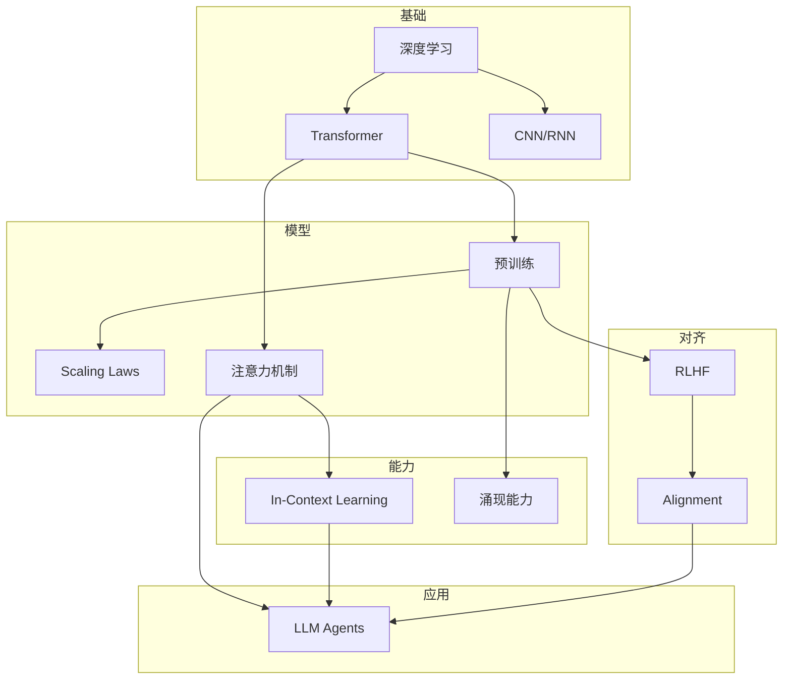

# AI Fundamentals

理解 AI 从基础理论到 LLM Agent 的完整知识图谱。

## 一句话理解

AI 经历了符号主义 → 深度学习 → 大语言模型的演进[[ai-fundamentals/sources/history-of-artificial-intelligence|1]]，如今 LLM Agent 正在成为 AI 应用的主流形态[[ai-fundamentals/sources/llm-powered-autonomous-agents|2]]。

## 知识图谱

## 核心概念

| 概念 | 说明 | 概念页 |
|------|------|--------|
| [[ai-fundamentals/concepts/transformer|Transformer]] | 序列建模的革命性架构 | 注意力机制是核心 |
| [[ai-fundamentals/concepts/language-model-training|Language Model Training]] | 预训练与 Scaling Laws | GPT 系列的理论基础 |
| [[ai-fundamentals/concepts/alignment|Alignment]] | RLHF 与 LLM 对齐 | InstructGPT 的核心贡献 |
| [[ai-fundamentals/concepts/llm-agents|LLM Agents]] | LLM Agent 的架构与能力 | ReAct + 工具 + 记忆 |

## 发展时间线

| 年份 | 里程碑 | 关键突破 |
|------|--------|----------|
| 2012 | [[ai-fundamentals/sources/alexnet|AlexNet]] | 深度学习时代的开端 |
| 2014 | [[ai-fundamentals/sources/gan|GAN]] | 生成模型的突破 |
| 2015 | [[ai-fundamentals/sources/resnet|ResNet]] | 残差连接解决梯度消失 |
| 2017 | [[ai-fundamentals/sources/attention-is-all-you-need|Transformer]] | 注意力机制取代 RNN |
| 2018 | [[ai-fundamentals/sources/bert-pre-training|BERT]] | 双向预训练+微调范式 |
| 2020 | [[ai-fundamentals/sources/gpt3-language-models-few-shot|GPT-3]] | 175B 参数，Few-shot learning |
| 2022 | [[ai-fundamentals/sources/instructgpt|InstructGPT]] | RLHF 对齐，人类偏好训练 |
| 2023 | [[ai-fundamentals/sources/llm-powered-autonomous-agents|LLM Agents]] | Agent 系统综述，ReAct 循环 |

## 来源导航

### Transformer 系列
- [[ai-fundamentals/sources/attention-is-all-you-need|Attention Is All You Need]] — Transformer 原始论文
- [[ai-fundamentals/sources/the-illustrated-transformer|The Illustrated Transformer]] — Jay Alammar 可视化教程

### 预训练与 Scaling
- [[ai-fundamentals/sources/bert-pre-training|BERT]] — 双向预训练
- [[ai-fundamentals/sources/gpt3-language-models-few-shot|GPT-3]] — Few-Shot Learning
- [[ai-fundamentals/sources/scaling-laws-kaplan|Scaling Laws]] — Kaplan 规模化规律
- [[ai-fundamentals/sources/chinchilla|Chinchilla]] — 计算最优 scaling

### Alignment 与 RLHF
- [[ai-fundamentals/sources/instructgpt|InstructGPT]] — RLHF 对齐
- [[ai-fundamentals/sources/rlhf-from-feedback|RLHF from Human Feedback]] — Ouyang 等
- [[ai-fundamentals/sources/dpo|DPO]] — 直接偏好优化

### Agent 与推理
- [[ai-fundamentals/sources/llm-powered-autonomous-agents|LLM-powered Autonomous Agents]] — Agent 系统综述
- [[ai-fundamentals/sources/react-chain-of-thought|ReAct]] — 推理与行动协同
- [[ai-fundamentals/sources/toolformer|Toolformer]] — 模型自学使用工具

### 效率优化
- [[ai-fundamentals/sources/flash-attention|Flash Attention]] — IO 感知注意力
- [[ai-fundamentals/sources/gqa|GQA]] — 分组查询注意力
- [[ai-fundamentals/sources/rope|RoPE]] — 旋转位置编码

## 下一步

1. 从 [[ai-fundamentals/concepts/transformer|Transformer]] 开始，理解注意力机制
2. 学习 [[ai-fundamentals/concepts/language-model-training|Language Model Training]]，了解 Scaling Laws
3. 掌握 [[ai-fundamentals/concepts/alignment|Alignment]]，理解 RLHF
4. 探索 [[ai-fundamentals/concepts/llm-agents|LLM Agents]]，进入 Agent 时代

---

*本知识库基于经典论文和权威资料构建，每篇文章链接回原始来源。*
