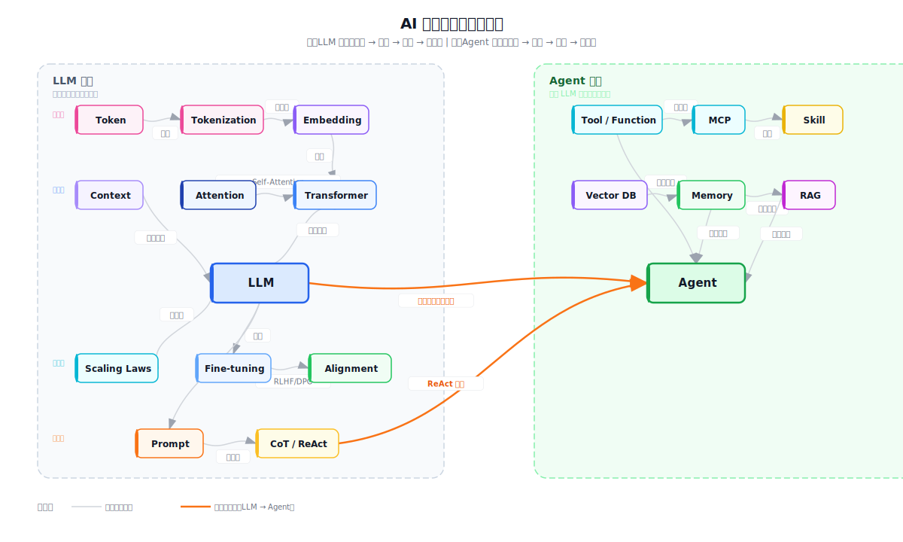

# AI核心概念体系

> AI 核心概念分为 LLM 系统（输入→架构→训练→接口）和 Agent 系统（记忆→工具→循环），两者通过推理引擎和 ReAct 循环集成。

## 概念关系总览

**读图方法**：
- 灰色连线 = 系统内部组件关系
- **橙色粗线** = 跨系统集成（LLM → Agent）
- 所有概念均有独立概念页，详见下方关系表

## 概念关系表

| 概念 | 在系统中的位置 | 关键关联 | 概念页 |
|------|--------------|----------|--------|
| **Token** | LLM 输入层 | → Embedding → Self-Attention | [[Tokenization]] |
| **Embedding** | 符号→向量映射 | → Transformer → LLM | [[Embedding]] |
| **Context** | 模型工作记忆上限 | → 短期记忆的物理限制 | [[Tokenization]] |
| **Attention** | 架构核心机制 | → Self-Attention → Transformer | [[Attention Mechanism]] |
| **Transformer** | LLM 基石架构 | → LLM 的核心骨架 | [[Transformer]] |
| **LLM** | 系统核心 | → Scaling Laws → RLHF | [[Language Model Training]] |
| **Scaling Laws** | 训练规模规律 | → Kaplan → Chinchilla | [[Scaling Laws]] |
| **Fine-tuning** | 预训练后适配 | → SFT → RLHF/DPO | [[Fine-tuning]] |
| **Alignment** | 行为对齐 | → RLHF → InstructGPT | [[Alignment]] |
| **Prompt** | 交互输入接口 | → CoT → ReAct | [[LLM Agents]] |
| **CoT / ReAct** | 推理+行动循环 | → Thought-Action-Observation | [[Chain-of-Thought & ReAct]] |
| **Tool** | 外部能力扩展 | → Function Calling → Agent | [[LLM Agents]] |
| **Function Calling** | 结构化工具接口 | → JSON schema → Execution | [[Function Calling]] |
| **MCP** | 工具标准化协议（工程实践） | → 跨平台互操作 | — |
| **Vector DB** | 长期记忆基础设施 | → Memory → RAG | [[Vector Database]] |
| **Memory** | 信息存储与检索 | → Context / Vector DB | [[Memory]] |
| **Agent** | 自主决策循环系统 | → ReAct Loop → Skill | [[LLM Agents]] |
| **RAG** | 检索增强生成 | → Vector DB + LLM | [[RAG]] |
| **Skill** | 模块化能力封装（工程实践） | → Agent 的可复用组件 | — |

## 框架级边界澄清

| 误区 | 事实（source-grounded） |
|------|------------------------|
| LLM "理解"语言 | LLM 只做一件事：预测下一个 token 的分布（[[sources/gpt3-language-models-few-shot\|source]]） |
| Agent 是更聪明的 LLM | Agent 是 LLM + 外部工具 + 循环执行 + 状态管理的**系统**（[[sources/llm-powered-autonomous-agents\|source]]） |
| MCP 是一种工具 | MCP 是**协议**——标准化接口（工程实践，无学术论文 source） |
| Skill 是 Prompt 的别名 | Skill 是**完整工作流**的封装（工程实践，无学术论文 source） |

## 实践集成：Agent 调用链路

当你对一个 AI 系统说"查一下北京天气并写封邮件"，背后的完整链路基于 [[sources/react-chain-of-thought\|ReAct]] 的 Thought-Action-Observation 循环：

**Source 依据**: ReAct 论文证明，将 reasoning traces（Thought）和 task-specific actions（Action）交织执行，优于单独的 chain-of-thought 或 action-only 基线。

## Sources

- [[sources/attention-is-all-you-need]] — Transformer 原始论文
- [[sources/the-illustrated-transformer]] — Transformer 可视化教程
- [[sources/gpt3-language-models-few-shot]] — Few-shot learning 与 next-token prediction
- [[sources/scaling-laws-kaplan]] — 模型、数据、算力的规模化规律
- [[sources/chinchilla]] — 计算最优 scaling
- [[sources/instructgpt]] — RLHF 与人类反馈对齐
- [[sources/rlhf-from-feedback]] — RLHF 奠基（summarization）
- [[sources/dpo]] — 直接偏好优化
- [[sources/llm-powered-autonomous-agents]] — Agent 系统综述
- [[sources/react-chain-of-thought]] — 推理与行动协同框架
- [[sources/toolformer]] — 语言模型自学使用工具

> **MCP** 和 **Skill** 目前未出现在任何已 ingest 的学术论文 source 中，定义来自工程实践文档。

