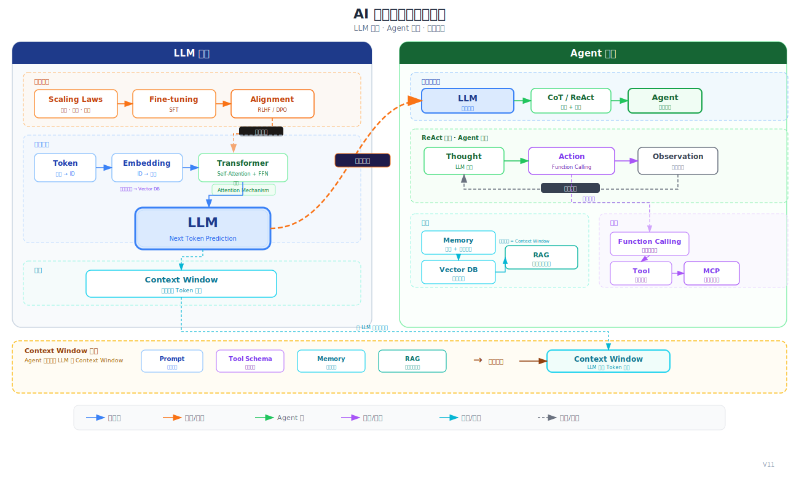
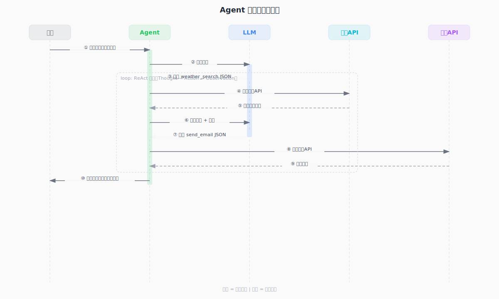

# AI核心概念体系

AI 核心概念分为 **LLM 系统**（输入→架构→训练→接口）和 **Agent 系统**（推理→行动→循环），两者通过推理引擎和 ReAct 循环集成[[ai-fundamentals/sources/llm-powered-autonomous-agents|1]]。Context Window 是 LLM 的输入容器，由 Prompt、Tool Schema、Memory 注入、RAG 检索结果共同组成。

## 概念关系总览

**读图方法**：
- **蓝色箭头** = 数据流（Token → Embedding → Transformer → LLM）
- **橙色箭头** = 训练/对齐（Scaling Laws → Fine-tuning → Alignment → LLM）
- **绿色箭头** = Agent 流（LLM → CoT/ReAct → Agent → Function Calling）
- **紫色箭头** = 协议/工具（Tool → Function Calling → MCP → Skill；Embedding → Vector DB）
- **青色箭头** = 记忆/检索（Context → Vector DB → Memory → RAG → 注入 Context Window）
- **灰色虚线** = 反馈/循环（Observation → Agent；ReAct 循环反馈给 LLM）

**Context Window** 是 LLM 的输入容器，包含：Prompt（用户指令）、Tool Schema（函数定义）、Memory 注入（记忆检索结果）、RAG 检索结果。其容量受 Token 数量限制。

**ReAct 循环**：LLM 生成 Thought → Function Calling 执行 Action → Observation 返回 → LLM 继续推理，形成闭环[[ai-fundamentals/sources/react-chain-of-thought|3]]。

共 18 个核心概念，所有概念均有独立概念页，详见下方关系表。

## 概念关系表

| 概念 | 在系统中的位置 | 关键关联 | 概念页 |
|------|--------------|----------|--------|
| **Token** | LLM 输入层 | → Embedding → Self-Attention | [[ai-fundamentals/concepts/tokenization|Tokenization]] |
| **Embedding** | 符号→向量映射 | → Transformer → LLM；→ Vector DB（向量化存储） | [[ai-fundamentals/concepts/embedding|Embedding]] |
| **Context** | LLM 输入容器 | 包含 Prompt + Tool Schema + Memory + RAG | [[ai-fundamentals/concepts/tokenization|Tokenization]] |
| **Attention** | 架构核心机制 | → Self-Attention → Transformer | [[ai-fundamentals/concepts/attention-mechanism|Attention Mechanism]] |
| **Transformer** | LLM 基石架构 | → LLM 的核心骨架 | [[ai-fundamentals/concepts/transformer|Transformer]] |
| **LLM** | 系统核心 | → Scaling Laws → RLHF；→ Agent 推理引擎 | [[ai-fundamentals/concepts/language-model-training|Language Model Training]] |
| **Scaling Laws** | 预训练规模规律 | → Kaplan → Chinchilla | [[ai-fundamentals/concepts/scaling-laws|Scaling Laws]] |
| **Fine-tuning** | 预训练后适配 | → SFT → RLHF/DPO | [[ai-fundamentals/concepts/fine-tuning|Fine-tuning]] |
| **Alignment** | 行为对齐 | → RLHF → InstructGPT | [[ai-fundamentals/concepts/alignment|Alignment]] |
| **Prompt** | Context Window 组成 | → CoT → ReAct | [[ai-fundamentals/concepts/llm-agents|LLM Agents]] |
| **CoT / ReAct** | 推理+行动循环 | Thought → Action → Observation 循环 | [[ai-fundamentals/concepts/chain-of-thought-react|Chain-of-Thought & ReAct]] |
| **Tool** | 外部能力扩展 | → Function Calling → Agent | [[ai-fundamentals/concepts/llm-agents|LLM Agents]] |
| **Function Calling** | 结构化工具接口 | → JSON schema → Execution | [[ai-fundamentals/concepts/function-calling|Function Calling]] |
| **MCP** | 工具标准化协议 | → 跨平台互操作 | — |
| **Vector DB** | 长期记忆基础设施 | → Memory → RAG | [[ai-fundamentals/concepts/vector-database|Vector Database]] |
| **Memory** | 记忆管理（短期+长期） | → Context（短期）+ Vector DB（长期） | [[ai-fundamentals/concepts/memory|Memory]] |
| **Agent** | 自主决策循环系统 | → ReAct Loop → Function Calling → Skill | [[ai-fundamentals/concepts/llm-agents|LLM Agents]] |
| **RAG** | 检索增强生成 | → Vector DB + 注入 Context → LLM | [[ai-fundamentals/concepts/rag|RAG]] |
| **Skill** | 模块化能力封装 | → Agent 的可复用组件 | — |

## 框架级边界澄清

LLM 与 Agent 是两个不同层次的概念[[ai-fundamentals/sources/llm-powered-autonomous-agents|1]]：

| 误区 | 事实（source-grounded） |
|------|------------------------|
| LLM「理解」语言 | LLM 只做一件事：预测下一个 token 的分布[[ai-fundamentals/sources/gpt3-language-models-few-shot|2]] |
| Agent 是更聪明的 LLM | Agent 是 LLM + 外部工具 + 循环执行 + 状态管理的**系统**[[ai-fundamentals/sources/llm-powered-autonomous-agents|1]] |
| MCP 是一种工具 | MCP 是**协议**——标准化接口（工程实践） |
| Skill 是 Prompt 的别名 | Skill 是**完整工作流**的封装（工程实践） |

## 实践集成：Agent 调用链路

当你对一个 AI 系统说「查一下北京天气并写封邮件」，背后的完整链路基于 [[ai-fundamentals/sources/react-chain-of-thought|3]] 的 Thought-Action-Observation 循环[[ai-fundamentals/sources/toolformer|4]]：

**Source 依据**：ReAct 论文[[ai-fundamentals/sources/react-chain-of-thought|3]]证明，将 reasoning traces（Thought）和 task-specific actions（Action）交织执行，优于单独的 chain-of-thought 或 action-only 基线。

## Sources

- [[ai-fundamentals/sources/attention-is-all-you-need]] — Transformer 原始论文
- [[ai-fundamentals/sources/the-illustrated-transformer]] — Transformer 可视化教程
- [[ai-fundamentals/sources/gpt3-language-models-few-shot]] — Few-shot learning 与 next-token prediction
- [[ai-fundamentals/sources/scaling-laws-kaplan]] — 模型、数据、算力的规模化规律
- [[ai-fundamentals/sources/chinchilla]] — 计算最优 scaling
- [[ai-fundamentals/sources/instructgpt]] — RLHF 与人类反馈对齐
- [[ai-fundamentals/sources/rlhf-from-feedback]] — RLHF 奠基（summarization）
- [[ai-fundamentals/sources/dpo]] — 直接偏好优化
- [[ai-fundamentals/sources/llm-powered-autonomous-agents]] — Agent 系统综述
- [[ai-fundamentals/sources/react-chain-of-thought]] — 推理与行动协同框架
- [[ai-fundamentals/sources/toolformer]] — 语言模型自学使用工具

> **MCP** 和 **Skill** 目前未出现在任何已 ingest 的学术论文 source 中，定义来自工程实践文档。
