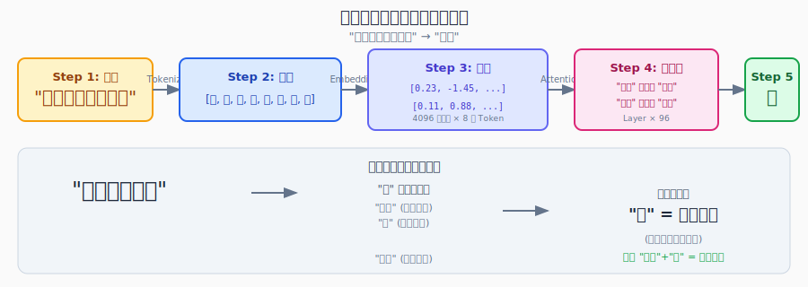

# 一个 Token 的一生

你输入"中国的首都是什么"，LLM 回复"北京"。

这个过程是怎么发生的？



---

## 第一步：把你的话切成小块

计算机不懂文字，只懂数字。

当你输入"中国的首都是什么"：

```
原始输入:  中  国  的  首  都  是  什  么
           ↓  ↓  ↓  ↓  ↓  ↓  ↓  ↓
Token ID:  12  88  34  201  445  23  1024  890
```

每个字被分配一个数字 ID。这就是 **Tokenization（分词）**。

中文分词比英文简单——通常一个字就是一個 Token。英文会把 "running" 切成 "run" + "ning"。

---

## 第二步：每个 Token 变成一串数字

光有 ID 不够，模型需要理解每个字的意思。

于是每个 Token ID 被转换成一个向量（一串数字）：

```
Token "中" (ID=12)
    ↓ Embedding
向量: [0.23, -1.45, 0.89, 0.12, ..., -0.34]
       ↑ 这个向量代表"中"的意思
```

为什么用向量？因为数字可以计算。

```
"中国" - "中" + "美" ≈ "美国"

向量运算:
[中国] - [中] + [美] = [美国]
```

这就是 **Embedding（嵌入）**。

---

## 第三步：让 Token 互相"看"对方

现在每个 Token 都是一个向量。接下来是最关键的一步：**Self-Attention（自注意力）**。

### 实际例子

看这句话：

```
"它的鼻子很灵"
```

"它"指的是谁？"它"可以指猫、狗、或者别的什么。

要理解"它"，模型需要看它周围的词。

**注意力机制让每个 Token 主动去"看"其他 Token，并根据相关性调整权重。**

```
"它" ← 看 → "鼻子"
"它" ← 看 → "灵"
         ↓
相关性高，"它"很可能指某种动物
```

### 数学上怎么算

```
对于每个 Token：
1. 用它的 Query 向量去"问"所有其他 Token
2. 用其他 Token 的 Key 向量来"回答"
3. 用 Relevance（相关度）去加权 Value 向量

Attention = Query · Key^T → Softmax → 加权 Value
```

这就是为什么 Transformer 叫"注意力"——它学会了哪些词应该"注意"哪些词。

---

## 第四步：多层叠加

一层注意力不够。

"中国的首都是什么"这个问题，需要多步推理：

```
Layer 1: "中国" 注意到 "首都"
Layer 2: "首都" 注意到 "什么"（问的是哪个城市）
Layer 3: 综合信息，输出 "北京"
```

典型的 GPT-4 有 96 层。每一层都在做类似的注意力计算，只是提取的特征越来越抽象。

---

## 第五步：从概率中选一个 Token

经过所有层之后，模型输出下一个 Token 的概率分布：

```
下一个 Token 的候选:
北京:  78.3%
上海:  12.1%
广州:   5.6%
深圳:   2.3%
...    ...
```

**Sampling（采样）** 决定选哪个：

| 方法 | 说明 |
|------|------|
| 贪婪 | 永远选概率最高的（"北京"） |
| 温度 | 高温=更随机，低温=更确定 |
| Top-p | 从概率最高的 p% 中选 |

---

## 第六步：一字接一字

选出的 Token 加入输入，继续预测下一个：

```
输入: "中国的首都是"
    ↓ 模型预测
输出: "北"
    
输入: "中国的首都是北"
    ↓ 模型预测
输出: "京"
    
输入: "中国的首都是北京"
    ↓ 模型预测
输出: "<EOS>"（结束）
```

这就是 **Auto-Regressive（自回归）**——每个新 Token 都基于之前所有的 Token。

---

## 完整流程图

```
"中国的首都是什么"
        ↓
  Tokenize: [中, 国, 的, 首, 都, 是, 什, 么]
        ↓
  Embed: [向量1, 向量2, ..., 向量8]
        ↓
  位置编码: 给每个向量加上位置信息
        ↓
  Layer 1: Self-Attention + FFN
        ↓
  Layer 2: Self-Attention + FFN
        ↓
     ...
        ↓
  Layer 96: Self-Attention + FFN
        ↓
  Linear + Softmax: → 概率分布
        ↓
  Sampling: 选 "北"
        ↓
  "北" 加入输入，继续...
```

---

## 为什么 LLM 能"理解"

表面上看，这只是矩阵乘法和概率计算。但关键在于：

1. **Embedding 把语义编码成数字**：相似的词在向量空间里距离近
2. **Attention 让 Token 互相影响**："北京"会因为"中国"而概率变高
3. **层层堆叠实现复杂推理**：单层只能做简单关联，多层能组合出复杂逻辑

模型并没有真正"理解"什么是中国、什么是首都。但它学会了从海量文本中捕捉这些词之间的统计关系。

---

## 延伸阅读

- [[ai-fundamentals/sources/attention-is-all-you-need|Attention Is All You Need]] — Transformer 原始论文
- [[ai-fundamentals/concepts/transformer|Transformer]] — 架构详解
- [[ai-fundamentals/concepts/attention-mechanism|Attention Mechanism]] — 注意力机制深入

