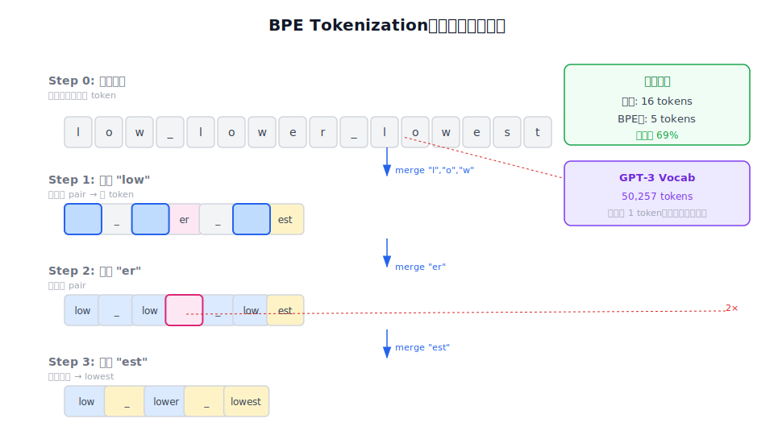
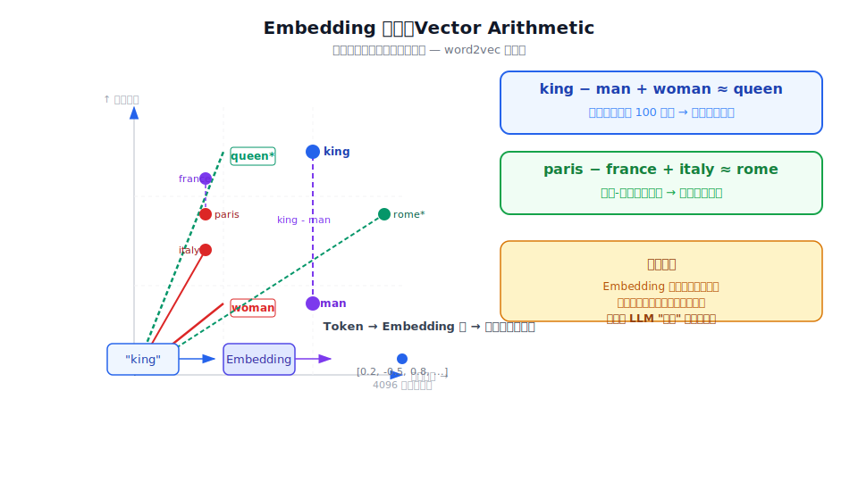
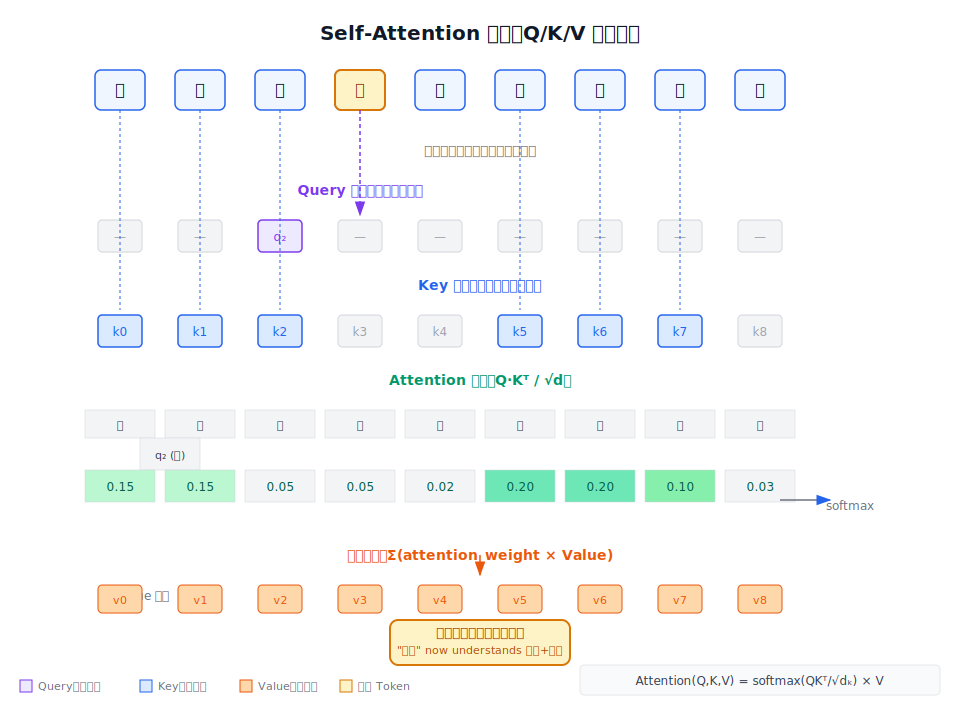
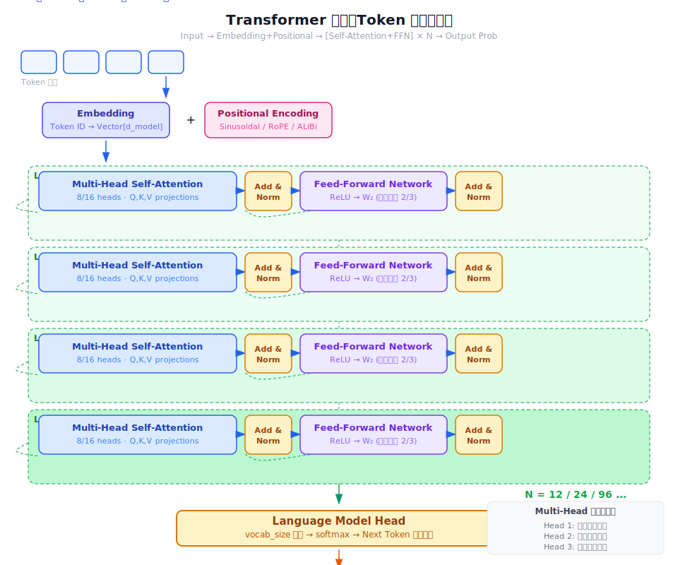

# 一个 Token 的一生

> 用一个故事串起 LLM 的核心原理：从文字到向量，到上下文感知，到概率预测。

## 第一章：诞生 — Tokenization

我叫 Token，是一段文本的一部分。有一天，人类对我说了句话：

> "我想学习深度学习"

这句话进入 LLM 的第一步：Tokenizer。

Tokenizer 用 **BPE（Byte-Pair Encoding）** 算法把我切分成碎片。英文单词 "learning" 可能变成 `learn` + `ing`，这样既不会太长（避免逐字符的低效），也不会因为按整词切分而无法处理罕见词。每个碎片对应一个整数 ID。

中文呢？通常 1 个汉字 ≈ 1-2 个 token。所以这句话大约 10 个 token。

BPE 的训练过程很直接：初始时每个字符是一个 token，然后迭代统计最频繁的相邻 token 对，合并成新 token，直到达到目标 vocab size。GPT-3 的 vocab size 是 50,257。



Token 是 LLM 的原子单位。模型并不"理解"文字，它只认识数字 ID。

---

## 第二章：变成数字 — Embedding

我作为一个整数 ID 被送入 **Embedding 层**，这里发生了一件神奇的事：我被映射成了一个向量。

```
Token ID: 1234
     ↓  Embedding 层
向量: [0.23, -0.47, 0.81, 0.12, ...]  # 可能是 512 维或 4096 维
```

这个向量不是随机的——它编码了我的**语义信息**。相似的词会得到相似的向量。



word2vec 的经典发现：

```
king - man + woman ≈ queen
paris - france + italy ≈ rome
```

这就是 **Vector Arithmetic**——语义关系在向量空间中变成了可加减的几何关系。king 和 queen 的区别（性别维度）在向量空间中，与 man 和 woman 的区别是平行的。

Embedding 把离散的符号变成连续的向量，让语义可计算。LLM 并不真正"理解"词义，但它通过海量文本学会了向量之间的几何关系。

---

## 第三章：知道自己在哪里 — Positional Encoding

我刚获得的向量只包含"我是什么"，不包含"我在哪里"。RNN 能自然地处理顺序，但 Transformer 是并行处理的，所以需要额外告诉我位置信息。

Transformer 原论文用了 **Sinusoidal 位置编码**：用不同频率的正弦波叠加来表示位置。后来出现了更好的方案：**RoPE**（旋转位置编码）和 **ALiBi**（线性偏置），在长上下文场景下表现更佳。

位置编码加到我的向量上，我就同时拥有了"身份"和"位置"。

---

## 第四章：认识所有的朋友 — Self-Attention

现在我进入了 **Transformer 的核心：Multi-Head Self-Attention**。

Attention 的公式：

```python
Attention(Q, K, V) = softmax(QK^T / √d_k) × V
```

三个向量 **Q（Query）**、**K（Key）**、**V（Value）** 由我的 embedding 通过不同权重矩阵投影得到。



以句子"深度学习是机器学习"中的「学习」token 为例：

- **Query**：我在找什么？→ 找与「学习」相关的词
- **Key**：每个词能提供什么？→ 「深度」能提供，「机器」也能提供
- **Value**：每个词的实际内容

Attention 权重衡量的就是：每个位置与「学习」的相关性有多强。「深度」和「机器」与「学习」的相关性较高，「是」的相关性较低。

**Multi-Head** 是什么？每个 Attention Head 学习不同的模式——有的头关注语法关系，有的头关注语义相似性，有的头关注指代关系。8-16 个头并行工作，最后拼接输出。

Self-Attention 让每个 token 都能"看到"整个序列，根据相关性加权融合信息。任意两个 token 之间的距离是 O(1)，而不是 RNN 的 O(n)。

---

## 第五章：穿越 Transformer 层

我不只经过一层 Attention。典型的大模型有 12 层、24 层、甚至 96 层。



每层都经历：

```
Input → Self-Attention → Add & Norm → Feed-Forward → Add & Norm → Output
```

**Feed-Forward Network (FFN)** 是两层线性变换：

```python
FFN(x) = ReLU(x @ W1 + b1) @ W2 + b2
```

FFN 参数量占整个 Transformer 的 **2/3**，它为每个 token 提供非线性变换的能力。

每经过一层，我的向量表示就被更新一次——融合了更多上下文信息。底层的我编码了局部的语法信息；深层的我则编码了更抽象的语义。

---

## 第六章：预测下一个 Token

经过所有 Transformer 层后，我来到了**语言模型头**——一个线性层，将我的向量映射到 vocab size 的维度，输出每个词作为「下一个词」的概率分布。

这就是 **Next Token Prediction**：

```python
loss = -Σ log P(token_i | token_0, ..., token_i-1)
```

模型训练时：正确答案的概率越高，loss 越低，反向传播调整所有参数。

推理时：从概率分布中**采样**或**贪婪选择**下一个 token。采样带来多样性，贪婪选择（argmax）带来确定性。

Scaling Laws 发现：模型越大、数据越多、能力越强。Kaplan 等人找到了幂律关系；Chinchilla 修正说参数量和训练数据量应该等比例 scaling。大约 10B 参数时开始出现涌现能力——In-Context Learning 在 ~10B 出现，Chain-of-Thought 在 ~100B 出现。

LLM 做的事情本质只有一个：预测下一个 token 的概率分布。它通过海量统计学会了"什么样的词最可能出现在这里"。

---

## 第七章：学会说人话 — Alignment（RLHF）

预训练让我学会了语言规律，但预训练的目标是"说得像人话"，而不是"说对话"。我可能：

- 回答得很流畅但答非所问（**幻觉**）
- 产生有害内容（偏见、歧视、暴力）
- 不听指令（**不听话**）

**Alignment（对齐）** 解决了这个问题。InstructGPT 提出的 **RLHF** 三步法：


1. **SFT（监督微调）**：用人工标注的问答对微调，格式对齐
2. **Reward Model**：训练一个奖励模型学习人类偏好——对同一个 prompt，人类标注哪个回答更好
3. **PPO 强化学习**：用奖励模型优化策略，同时用 KL 散度约束防止模型偏离 SFT 太远

后来出现的 **DPO（Direct Preference Optimization）** 绕过了 Reward Model，直接用偏好对优化，更简单，效果相当。

RLHF 让模型从"说得流利"进化到"说得好"。Alignment 本质上是在教模型按人类真正想要的方式执行，而不是按字面意思执行。

---

## 尾声：Token 的视角看 LLM

从我——一个 Token——的视角，LLM 是这样的：

```
文本 → Tokenize → Embed + Positional → [Self-Attention + FFN] × N → 预测下一个 Token
```

整个过程：

1. **Tokenization**：从文字变成 ID
2. **Embedding**：从 ID 变成向量，获得语义表示
3. **Positional Encoding**：获得位置信息
4. **Multi-Head Self-Attention**：与所有其他 token 交互，理解上下文
5. **层层堆叠**：逐渐抽象，从语法到语义
6. **Next Token Prediction**：输出下一个 token 的概率分布
7. **Alignment（训练阶段）**：被人类反馈塑造，学会按意图回答

这就是一个 Token 的一生——从文字到数字，到向量，到上下文感知，到概率预测，最终成为一个能"对话"的 AI。

---

## 相关概念

- [[ai-fundamentals/concepts/tokenization|Tokenization]]
- [[ai-fundamentals/concepts/embedding|Embedding]]
- [[ai-fundamentals/concepts/transformer|Transformer]]
- [[ai-fundamentals/concepts/attention-mechanism|Attention Mechanism]]
- [[ai-fundamentals/concepts/language-model-training|Language Model Training]]
- [[ai-fundamentals/concepts/alignment|Alignment]]

## Sources

- [[ai-fundamentals/sources/the-illustrated-transformer|The Illustrated Transformer]] — Transformer 可视化教程
- [[ai-fundamentals/sources/attention-is-all-you-need|Attention Is All You Need]] — Transformer 原始论文
- [[ai-fundamentals/sources/gpt3-language-models-few-shot|GPT-3]] — Next-token prediction 与 BPE tokenizer
- [[ai-fundamentals/sources/instructgpt|InstructGPT]] — RLHF 与人类反馈对齐
