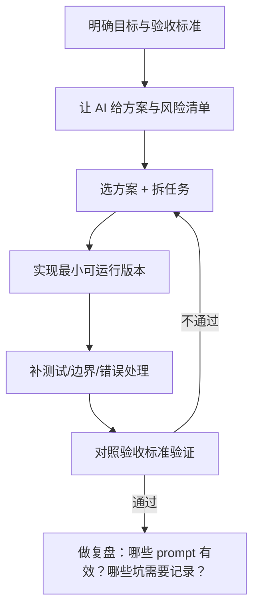

## TL;DR（一句话版）

Vibe Coding 不是“让 AI 写代码”，而是**用 AI 加速你做对需求、做对实现、做对验证**的整套开发闭环：你负责方向与验收，AI 负责高频产出与协助推理。

![[assets/vibe-coding-loop.svg|760]]

> [!summary] 这份笔记能帮你解决什么？
> - 你知道“跟着感觉写”的爽感从哪来，也知道**如何不翻车**
> - 你有一套**可复制**的工作流：需求 → 方案 → 实现 → 验证 → 复盘
> - 你拿得走：Prompt 模板、代码审查清单、踩坑地图、实战例子

---

## 1. Vibe Coding 到底是什么？

可以把它理解成一种“人与 AI 协作写软件”的方式：

- **你**：定义问题、给约束、做取舍、设验收标准、做最终判断
- **AI**：帮你产出候选方案、生成代码、补测试、写文档、做对比、找边界条件

> [!note] “Vibe” 的核心
> 不在于“凭感觉”，而在于**快速迭代 + 快速反馈**：每一步都能验证、能回滚、能继续对齐。

---

## 2. 适合 / 不适合（别拿锤子找钉子）

| 场景 | 适合度 | 为什么 |
|---|---:|---|
| 小功能/脚本/工具 | ✅✅✅ | 目标明确、验证简单、迭代快 |
| 重构/性能优化 | ✅✅ | 需要你掌控风险，AI 适合给候选路径与局部改动 |
| 新项目从 0 到 1 | ✅✅ | AI 适合搭脚手架，但架构决策需要你把关 |
| 安全/金融/合规强约束 | ⚠️ | 必须有严格审计与验证，不能“猜着写” |
| 你自己都不清楚要什么 | ❌ | AI 会把不确定放大：输出看似合理但更难验收 |

> [!tip] 一个简单判断
> **能不能写出清晰的验收标准？** 能 → 适合；不能 → 先把需求搞清楚。

---

## 3. 核心原则（把“爽感”变成“稳定产出”）

### 3.1 先对齐“什么算完成”

把目标写成可检查的东西，比如：

- 输入/输出是什么（接口、参数、文件格式）
- 关键边界（空值、超大数据、异常流）
- 性能/时延/体积约束
- 兼容性（旧数据、旧 API、旧行为）

### 3.2 小步快跑，每一步都可验证

不要一次让 AI 写“全套”，而是拆成几段：

- 先写 **最小可运行版本**
- 再加边界与错误处理
- 再补测试与文档
- 再做重构与性能

### 3.3 让 AI 说清楚“假设”和“风险”

你要主动问：

- 你做了哪些假设？哪些是最可能错的？
- 有哪些替代方案？各自 trade-off？
- 哪些改动可能破坏现有行为？

### 3.4 永远保留“回滚按钮”

- 频繁提交（或至少频繁保存 diff）
- 不确定就先加日志/开关/保护分支
- 对外行为改动要有兼容策略

---

## 4. 标准工作流（建议直接照抄）

![[assets/prompt-card.svg|760]]



> [!important] 关键点
> 这不是“线性流程”，而是**可循环的闭环**。不通过就回到拆任务，而不是继续堆功能。

---

## 5. Prompt 模板（可直接复制粘贴）

### 5.1 通用模板（最常用）

```text
你是资深软件工程师/代码审查者。

## 目标
<一句话描述你要做什么>

## 背景
<系统/模块背景，已有行为，为什么要改>

## 约束（必须遵守）
- <语言/框架/版本>
- <性能/安全/兼容性要求>
- <不允许做的事>

## 输入
<粘贴相关代码/接口定义/日志/错误信息>

## 输出格式
1) 方案（至少 2 个）+ trade-off
2) 推荐方案
3) 具体改动点（按文件/函数列出）
4) 测试计划（如何验证，不要空话）
```

### 5.2 “让 AI 帮你拆任务”的模板

```text
把目标拆成 5~10 个最小步骤，每一步都要：
1) 可独立验证
2) 说明改动风险
3) 给出验证方式（命令/测试/观察点）
```

### 5.3 “让 AI 做代码审查”的模板

```text
请按以下维度审查这段改动：
正确性 / 边界条件 / 可维护性 / 性能 / 安全 / 可测试性。

输出：
- 必须改（Blocking）
- 建议改（Non-blocking）
- 你最担心的 3 个风险点
```

---

## 6. 实战例子（从 0 到可交付）

下面用三个常见任务演示“怎么跟 AI 配合”。

### 6.1 例子 A：写一个小脚本（最适合练手）

**目标**：把一个目录里的 Markdown 文件标题提取出来，生成一个目录 `TOC.md`。

你可以这样下指令（要点：输入输出、边界、验收）：

```text
目标：扫描 ./notes 下所有 .md 文件，提取第一行以 # 开头的标题，
按文件路径排序，生成 TOC.md。

约束：
- 忽略没有标题的文件
- 标题里如果有 `|` 需要转义

输出：
- 给出 Python 脚本
- 给出如何运行
- 给出一个最小样例输入与对应输出
```

你验收时重点看：
- 是否稳定处理无标题文件
- 是否排序一致
- 输出格式是否满足你阅读习惯

### 6.2 例子 B：修一个 bug（AI 很擅长“找可能性”）

**你的动作顺序**：

1. 先给 AI：错误堆栈 + 复现步骤 + 期望行为
2. 让 AI：列出 3~5 个可能原因（按概率排序）
3. 你选择最可能的路径，让它给最小 patch
4. 你补：回归测试 + 边界用例

> [!tip] 技巧
> 让 AI 先“猜原因”，再“最小改动”，而不是直接一把梭全改了。

### 6.3 例子 C：重构（人要控方向，AI 做局部）

重构时建议用“护栏”：

- 先写/补齐测试（或至少补一组回归用例）
- 把改动拆成 3~6 个小 PR（每个 PR 只做一件事）
- 让 AI 每一步都输出“行为变化清单”

---

## 7. 常见坑（以及怎么避）

### 7.1 坑：AI 写得很像，但不一定对

**典型症状**：代码能跑，但细节错（边界、并发、时序、兼容）。

**解法**：
- 强制验收：测试、日志、对照用例
- 让 AI 写“失败用例列表”：它会暴露假设

### 7.2 坑：上下文污染（越聊越偏）

**解法**：
- 每个阶段都写一个短“状态摘要”：当前目标/已知事实/下一步
- 关键约束每次都重复贴一遍（尤其是“不允许做什么”）

### 7.3 坑：一次性需求过大

**解法**：拆小步，先跑通，再补齐。

---

## 8. 清单（把质量变成习惯）

### 8.1 提交前清单

- [ ] 目标和验收标准写清楚了
- [ ] 有最小可运行版本（能跑/能构建/能通过基础用例）
- [ ] 关键边界被覆盖（空值、异常、极端输入）
- [ ] 有回归验证手段（测试/脚本/日志观察点）
- [ ] 不确定的地方有注释/文档/后续 TODO

### 8.2 让 AI 帮你做“复盘”的问题

- 本次最有效的 prompt 是什么？为什么有效？
- AI 最容易误解的点是什么？下次怎么提前声明？
- 哪个步骤最该先补测试/护栏？

---

## 9. 练习题（建议一周内做完）

1. 让 AI 帮你写一个 CLI 工具：支持 `--help`、参数校验、错误码
2. 找一个你过去写过的模块，让 AI 给重构方案（至少 2 个）并写出风险清单
3. 给 AI 一段有 bug 的代码，让它先写“可能原因列表”，你再让它逐个验证

---

## 10. 参考与延伸

- 建议你在这里补充自己常用的 Prompt、常踩的坑、团队约束等（越具体越值钱）

